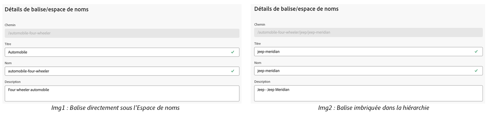
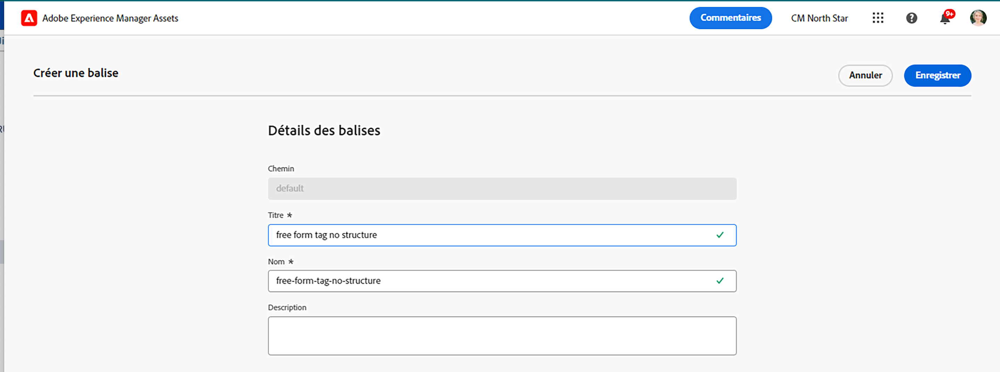
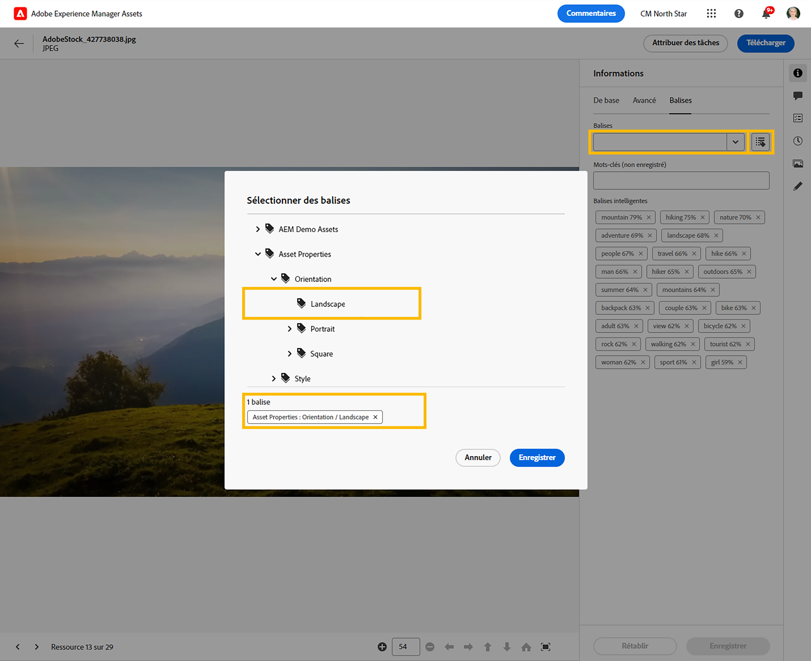

# Gérer les balises dans la vue Assets {#view-assets-and-details}

>[!CONTEXTUALHELP]
>id="assets_taxonomy_management"
>title="Gérer les balises"
>abstract="Les balises permettent de classer les ressources pour une navigation et une recherche plus efficaces. Les administrateurs et administratrices peuvent utiliser la structure de balisage hiérarchique, qui facilite l’application des métadonnées pertinentes, la classification des ressources, la prise en charge de la recherche, la réutilisation des balises, l’amélioration de la visibilité, etc."

Les balises permettent de classer les ressources pour une navigation et une recherche plus efficaces. Le balisage permet de propager la taxonomie appropriée à d’autres utilisateurs et utilisatrices et workflows.

Les listes plates de vocabulaires contrôlés peuvent devenir ingérables au fil du temps. Les administrateurs et administratrices peuvent utiliser la structure de balisage hiérarchique, qui facilite l’application des métadonnées pertinentes, la classification des ressources, la prise en charge de la recherche, la réutilisation des balises, l’amélioration de la visibilité, etc.

Vous pouvez créer un espace de noms au niveau racine et créer une structure hiérarchique de sous-balises dans l’espace de noms. Par exemple, vous pouvez créer un espace de noms `Activities` au niveau racine et placer les balises `Cycling`, `Hiking` et `Running` dans l’espace de noms. Vous pouvez placer d’autres sous-balises `Clothing` et `Shoes` dans `Running`.

Le balisage offre de nombreux avantages :

* Le balisage permet aux auteurs et aux autrices d’organiser facilement des ressources dissemblables par le biais d’une taxonomie commune. Les auteurs et autrices peuvent rapidement rechercher et organiser des ressources par des balises communes.

* Les balises hiérarchiques sont extrêmement flexibles et constituent un excellent moyen d’organiser les termes de manière logique. Grâce aux espaces de noms, balises et sous-balises, des systèmes taxonomiques complets peuvent être représentés.

* Les balises peuvent évoluer au fil du temps à mesure qu’un vocabulaire organisationnel change.

* Les balises gérées dans la vue Admin restent synchronisées avec les balises gérées dans la vue Assets, ce qui garantit la gouvernance et l’intégrité des métadonnées.

Pour pouvoir appliquer des balises à des ressources, vous devez d’abord créer un espace de noms, puis créer et ajouter des balises. Vous pouvez également créer des balises et les ajouter à un espace de noms existant. Toutes les balises que vous créez au niveau racine sont automatiquement ajoutées à l’espace de noms des balises standard. Vous pouvez ensuite ajouter le champ Balises au formulaire de métadonnées afin qu’il s’affiche sur la page Détails de la ressource. Après avoir configuré ces paramètres, vous pouvez commencer à appliquer des balises aux ressources.

>[!NOTE]
>
>Vous ne devez ajouter le champ Balises au formulaire de métadonnées que si vous n’utilisez pas le formulaire de métadonnées par défaut.

D’autres fonctionnalités non mentionnées dans cet article, dont la fusion, le changement de nom, la localisation et la publication de balises, sont disponibles dans la vue Admin.

## Créer un espace de noms {#creating-a-namespace}

Un espace de noms est un conteneur de balises qui ne peut exister qu’au niveau racine. Vous pouvez commencer à configurer la structure hiérarchique des balises en définissant d’abord un nom logique pour l’espace de noms. Si vous n’ajoutez pas de balise aux espaces de noms existants, la balise passe automatiquement aux balises standard.

Pour créer un espace de noms, procédez comme suit :

1. Accédez à `Taxonomy Management` sous `Settings` pour afficher la liste des espaces de noms existants. Vous pouvez également afficher la date de dernière modification, l’utilisateur ou l’utilisatrice qui a modifié l’espace de noms ou les balises qui se trouvent sous celui-ci, ainsi que le nombre de fois où la balise est utilisée dans une ressource.
1. Cliquez sur `Create Namespace`.
1. Ajoutez les éléments `Title`, `Name` et `Description` pour l’espace de noms. L’entrée que vous spécifiez dans la variable `Title` s’affiche en haut de la hiérarchie. Par exemple, sur l’image suivante, **Activités** fait référence au titre de l’espace de noms.

   

   <!--
    >[!NOTE]
    >
    >You can use `Name` as a primary key if you are using any other metadata management tool is the source of truth for taxonomy values, you can use the name as a primary key.
    >
    -->

1. Cliquez sur `Save`.

## Ajouter des balises à un espace de noms {#adding-tags-to-namespace}

Pour ajouter des balises à un espace de noms, procédez comme suit :

1. Accédez à `Taxonomy Management`.
1. Sélectionnez l’espace de noms et cliquez sur `Create` pour créer la balise au niveau supérieur sous l’espace de noms. Si vous devez créer une sous-balise sous une balise qui existe dans un espace de noms, sélectionnez la balise, puis cliquez sur `Create`.
   

   Dans cet exemple, l’image à gauche représente la balise directement sous l’espace de noms `automobile-four-wheeler` affiché dans le champ `Path`. L’image à droite est un exemple de sous-balises ajoutées dans une balise. En effet, il y a plus de noms de balise, `jeep` et `jeep-meridian`, affichés dans le champ `Path` en plus de l’espace de noms.
1. Indiquez le titre, le nom et la description de la balise, puis cliquez sur `Save`.

   >[!NOTE]
   >
   >* Les champs `Title` et `Name` sont obligatoires, tandis que le champ `Description` est facultatif.
   >* Par défaut, l’outil copie le texte saisi dans le champ Titre, supprime les espaces vides ou les caractères spéciaux (. &amp; / \ : * ? [ ] | &quot; %) et le stocke en tant que nom.
   >* Vous pouvez mettre à jour le champ `Title` plus tard, mais le champ `Name` est en lecture seule.

## Ajouter des balises aux balises standard {#adding-tags-to-standard-tags}

Les balises non structurées ou qui n’ont pas de hiérarchie sont stockées dans l’espace de noms `Standard Tags`. De plus, lorsque vous souhaitez ajouter des termes descriptifs supplémentaires sans affecter la taxonomie régie, vous pouvez stocker cette valeur sous `Standard Tags`. Vous pouvez déplacer ces valeurs dans des espaces de noms structurés au fil du temps. De plus, vous pouvez utiliser l’espace de noms `Standard Tags` comme entrée de formulaire libre pour les mots-clés.

Pour créer une balise standard, cliquez sur `Create Tag` au niveau racine. Indiquez le titre, le nom et la description, puis cliquez sur `Save`.

>[!NOTE]
>
>Si vous supprimez l’espace de noms `Standard Tags` à l’aide de la vue Admin, les balises créées au niveau racine ne s’affichent pas dans la liste des balises disponibles.

## Déplacement des balises {#moving-tags}

Si vous stockez vos balises sous une hiérarchie incorrecte ou si votre taxonomie change au fil du temps, vous pouvez déplacer les balises sélectionnées pour préserver l’intégrité des données. Les conditions suivantes doivent être prises en compte lors du déplacement des balises :

* Les balises ne peuvent se déplacer que sous les espaces de noms existants ou dans une hiérarchie de balises existante.
* Les balises ne peuvent pas être déplacées vers la racine pour devenir un espace de noms.
* Le déplacement d’une balise parent déplace également toutes les balises enfants stockées dans la hiérarchie.

Effectuez les étapes suivantes pour déplacer des balises d’un emplacement à un autre :

1. Sélectionnez la balise ou la hiérarchie complète des balises sous l’espace de noms approprié, puis cliquez sur `Move`.
1. Dans la boîte de dialogue Déplacer, sélectionnez la nouvelle balise de destination ou le nouvel espace de noms à l’aide de la section `Select Tag`.
1. Cliquez sur `Save`. La balise s’affiche à son nouvel emplacement.

## Modification des balises {#editing-tags}

Pour modifier le titre de la balise, sélectionnez cette dernière, puis cliquez sur `Edit`. Indiquez le nouveau titre, puis cliquez sur `Save`.

>[!NOTE]
>
>* Le `Name` d’une balise ne peut pas être mis à jour. Le chemin d’accès racine d’une balise est également basé sur le nom de la balise. Le chemin d’accès reste le même, même si vous mettez à jour le champ `Title`.
>* D’autres opérations telles que la fusion, la localisation et la publication, sont disponibles dans la vue Admin.

## Suppression des balises {#deleting-tags}

Vous pouvez supprimer plusieurs espaces de noms ou balises simultanément. L’opération de suppression ne peut pas être annulée.

Pour supprimer des balises, procédez comme suit :

1. Sélectionnez l’espace de noms ou la balise et cliquez sur `Delete`.
1. Cliquez sur `Confirm`.

>[!NOTE]
>
>* La suppression de la balise parente ou de l’espace de noms parent supprime également les sous-balises stockées dans la hiérarchie. Si vous devez supprimer ou mettre à jour l’espace de noms parent, il est recommandé de [déplacer vos balises](#moving-tags) vers la nouvelle destination avant de supprimer la hiérarchie parente.
>* La suppression d’une balise supprime également toutes ses références des ressources.
>* Vous ne pouvez pas supprimer les balises standard qui existent au niveau racine.

## Ajout du composant Balises au formulaire de métadonnées {#adding-tags-to-metadata-form}

Le composant Balises est ajouté automatiquement au formulaire de métadonnées `default`. Vous pouvez concevoir un [formulaire de métadonnées](https://experienceleague.adobe.com/docs/experience-manager-assets-essentials/help/metadata.html?lang=fr#metadata-forms) soit en utilisant un modèle, soit à partir de zéro. Si vous n’utilisez pas de modèle de formulaire de métadonnées existant, vous pouvez modifier votre formulaire de métadonnées et ajouter le composant Balises. Le mappage des propriétés de métadonnées est renseigné automatiquement et ne peut pas être modifié pour le moment. Les personnes utilisant la vue Admin peuvent mettre à jour le mappage pour stocker les valeurs de balise à l’aide d’espaces de noms personnalisés et n’exposer que les sous-ensembles de hiérarchies à l’aide des chemins d’accès racine.

Regardez cette vidéo rapide pour découvrir comment ajouter le composant Balises à votre formulaire de métadonnées :

>[!VIDEO](https://video.tv.adobe.com/v/3420452)

### Ajout de balises aux ressources {#adding-tags-to-assets}

1. Accédez à la page Détails de la ressource, puis à la section `Tags` du formulaire de métadonnées.
1. Sélectionnez l’icône du sélecteur de balises située en regard du champ Balises ou commencez à saisir un nom de balise pour afficher les résultats suggérés.

   

1. Sélectionnez une ou plusieurs balises. La sous-balise est sélectionnée automatiquement avec la balise ou l’espace de noms parent.
Les balises modifiées dans la vue Ressources sont également appliquées dans la vue Admin.

## Limites {#limitations}

Les fonctionnalités de taxonomie avancée suivantes ne sont actuellement pas disponibles dans la vue Ressources et ne sont accessibles que via la vue Admin :

* **Localisation :** toute localisation doit se produire dans la vue Admin.
* **Chemin d’accès racine :** les chemins d’accès racine ne peuvent pas être configurés. Tous les espaces de noms stockés dans la Gestion de la taxonomie sont exposés sur la propriété Balises dans la vue Ressources.
* **Balises standard :** les balises standard appliquées dans la vue Admin sont visibles dans la vue Ressources. Vous ne pouvez pas ajouter de nouvelles balises standard dans la vue Ressources de la page Détails de la ressource. Les valeurs existantes qui sont stockées dans des balises standard sont appliquées à la page Détails des ressources.
* **Espaces de noms personnalisés :** les balises ne peuvent pas être mappées à des espaces de noms personnalisés.
* **Affichage des références :** les personnes administratrices peuvent voir l’utilisation des balises dans la vue Ressources. Cela fait référence à toutes les ressources qui utilisent activement une balise. Toutefois, les personnes administratrices ne peuvent pas voir les ressources individuelles à l’aide de la balise dans les références.

<!--
*   Overview
*   Benefits
*   Prerequisites and Permissions
*   Configuration
*   Managing Tags
    *   Creating a Namespace
    *   Adding Tags to a Namespace
    *   Adding Tags to Standard Tags
    *   Moving Tags
    *   Editing Tags
    *   Deleting Tags
*   Applying Tags
    *   Adding Tags to the Metadata form
    *   Adding Tags to Assets
*   Limitations
-->
