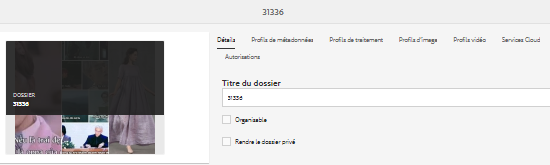
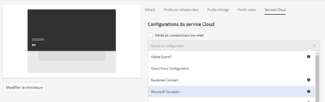

# Multilingual assets {#multilingual-assets}

Les ressources multilingues sont des ressources comportant des fichiers binaires, des métadonnées et des balises dans plusieurs langues. En règle générale, les fichiers binaires, les métadonnées et les balises d’une ressource existent dans une langue, et sont ensuite traduits dans d’autres langues pour être utilisés dans des projets multilingues. Adobe Experience Manager (AEM) Assets vous permet d’automatiser les processus de traduction des ressources (y compris les fichiers binaires, les métadonnées et les balises) pour générer des ressources dans d’autres langues à utiliser dans des projets multilingues.

Pour automatiser les processus de traduction, vous intégrez des fournisseurs de services de traduction à AEM et créez des projets pour traduire les ressources dans plusieurs langues. AEM prend en charge les processus de traduction humaine et automatique.

Traduction humaine : les ressources traduites sont renvoyées et importées dans AEM. Lorsque votre fournisseur de traduction est intégré à AEM, les ressources sont envoyées automatiquement entre AEM et le fournisseur de traduction.

Traduction automatique : le service de traduction automatique traduit instantanément les métadonnées et les balises des ressources.

<!--
We have multiple articles around translation of assets. For now, dumping all content in this article to remove others and create only 1 master article.

https://docs.adobe.com/content/help/en/experience-manager-65/assets/managing/translation-projects.html
https://docs.adobe.com/content/help/en/experience-manager-65/assets/managing/preparing-assets-for-translation.html
[Apply translation cloud services to folders](https://docs.adobe.com/content/help/en/experience-manager-65/assets/managing/transition-cloud-services.html)

One of these articles is a copy of [Preparing Content for Translation](https://docs.adobe.com/content/help/en/experience-manager-65/administering/introduction/tc-prep.html

-->

<!-- 
Translating assets includes the following:

1. [Connecting AEM with the translation service provider](/help/sites-administering/tc-tic.md#connecting-to-a-translation-service-provider)
1. [Creating translation integration framework configurations](/help/sites-administering/tc-tic.md)
1. [Preparing assets for translation](prepare-assets-for-translation.md)
1. [Applying translation cloud services to folders](transition-cloud-services.md)
1. [Create translation projects](translation-projects.md)

If your translation service provider does not provide a connector to integrate with AEM, use an [alternative process](/help/sites-administering/tc-manage.md#exporting-a-translation-job).

Also see, [Creating translation projects for content fragments](creating-translation-projects-for-content-fragments.md).

-->

## Préparation des fichiers pour la traduction {#prepare-assets-for-translation}

Les ressources multilingues sont des ressources comportant des fichiers binaires, des métadonnées et des balises dans plusieurs langues. En règle générale, les fichiers binaires, les métadonnées et les balises d’une ressource existent dans une langue, et sont ensuite traduits dans d’autres langues pour être utilisés dans des projets multilingues.

Dans Adobe Experience Manager (AEM) Assets, les ressources multilingues se trouvent dans des dossiers, chaque dossier contenant les ressources dans une langue différente.

Chaque dossier de langue est appelé une copie de langue. Le dossier racine d’une copie de langue, nommé racine de langue, identifie la langue du contenu de la copie de langue. For example, `/content/dam/it` is the Italian language root for the Italian language copy. Language copies must use a [correctly-configured language root](#create-a-language-root) so that the correct language is targeted when translations of source assets are performed.

La copie de langue pour laquelle vous ajoutez initialement des ressources est le gabarit de langue. Le gabarit de langue est la source qui est traduite dans d’autres langues. Un exemple de hiérarchie de dossiers comprend plusieurs racines de langage :

```
/content
&nbsp; &nbsp; /- dam
&nbsp; &nbsp; &nbsp; |- en
&nbsp; &nbsp; &nbsp; |- fr
&nbsp; &nbsp; &nbsp; |- de
&nbsp; &nbsp; &nbsp; |- es
&nbsp; &nbsp; &nbsp; |- it
&nbsp; &nbsp; &nbsp; |- ja
&nbsp; &nbsp; &nbsp; |- zh
```

Procédez comme suit pour préparer la traduction de vos ressources :

1. Créez la racine de langue de votre gabarit de langue. Par exemple, la racine de langue de la copie de langue de l’anglais dans l’exemple de hiérarchie de dossiers est */content/dam/en*. Ensure that the language root is correctly configured according to the information in [Create a language root](#create-a-language-root).

1. Ajoutez des ressources à votre gabarit de langue.
1. Créez la racine de langue de chaque langue cible pour laquelle vous avez besoin d’une copie de langue.

### Création d’une racine de langue {#create-a-language-root}

Pour créer la racine de langue, créez un dossier, puis utilisez le code de langue ISO comme valeur de la propriété Nom. Après avoir créé la racine de langue, vous pouvez créer une copie de langue à n’importe quel niveau dans la racine de langue.

For example, the root page of the Italian language copy of the sample hierarchy has `it` as the Name property. La propriété Nom est utilisée comme nom du nœud de ressource dans le référentiel et détermine donc le chemin d’accès des ressources. (*&lt;serveur>:&lt;port>/assets.html/content/dam/it/*)

1. Dans la console Ressources, cliquez/appuyez sur **[!UICONTROL Créer]** et choisissez **[!UICONTROL Dossier]** dans le menu.
1. In the Name field type the country code in the format of `<language-code>`.
1. Cliquez ou appuyez sur **[!UICONTROL Créer]**. La racine de langue est créée dans la console Ressources. 

### Afficher les racines de langue {#view-language-roots}

L’IU optimisée pour les écrans tactiles propose un panneau Références qui affiche une liste des racines de langue créées dans AEM Assets.

1. Dans la console Ressources, choisissez le gabarit de langue pour lequel vous souhaitez créer des copies de langue.
1. Appuyez ou cliquez sur l’icône de navigation globale et sélectionnez **[!UICONTROL Références]** pour ouvrir le panneau Références.
1. Dans le panneau Références, cliquez ou appuyez sur **[!UICONTROL Copies de langue]**. Le panneau Copies de langue affiche les copies de langue des ressources.

### Créer un projet de traduction {#create-a-new-translation-project}

Si vous utilisez cette option, les ressources à traduire sont copiées dans la racine de la langue vers laquelle vous souhaitez effectuer la traduction. En fonction des options que vous sélectionnez, un projet de traduction est créé pour les ressources dans la console Projets. En fonction des paramètres, le projet de traduction peut être démarré manuellement ou s’exécuter automatiquement dès sa création.

1. Dans l’interface utilisateur d’Assets, sélectionnez le dossier source pour lequel vous souhaitez créer une copie de langue.
1. Ouvrez le panneau **[!UICONTROL Références]** et cliquez/appuyez sur **[!UICONTROL Copies de langue]** sous **[!UICONTROL Copies]**.
1. Click/tap **[!UICONTROL Create &amp; Translate]** at the bottom.
1. Dans la liste **[!UICONTROL Langues cibles]**, choisissez la ou les langues pour lesquelles vous souhaitez créer une structure de dossiers.
1. Dans la liste **[!UICONTROL Projet]**, choisissez **[!UICONTROL Créer un projet de traduction]**.
1. Dans le champ **[!UICONTROL Titre du projet]**, saisissez un titre pour le projet.
1. Cliquez/appuyez sur **[!UICONTROL Créer]**. Les ressources du dossier source sont copiées vers les dossiers cibles pour les paramètres régionaux que vous avez sélectionnés à l’étape 4.
1. Pour accéder au dossier, sélectionnez la copie de langue, puis cliquez sur **[!UICONTROL Afficher dans Assets]**.
1. Accédez à la console Projets. Le dossier de traduction est copié dans la console Projets.
1. Ouvrez le dossier pour afficher le projet de traduction.
1. Cliquez/appuyez sur le projet pour ouvrir la page de détails.
1. Pour afficher l’état de la tâche de traduction, cliquez sur les points de suspension en bas de la mosaïque **[!UICONTROL Tâche de traduction.]**<!-- For more details around job statuses, see [Monitoring the Status of a Translation Job](/help/sites-administering/tc-manage.md#monitoring-the-status-of-a-translation-job). -->
1. Dans l’interface utilisateur Ressources, ouvrez la page Propriétés de chacun des fichiers traduits pour afficher les métadonnées traduites.

>[!NOTE]
>
>Cette fonctionnalité est disponible à la fois pour les ressources et les dossiers. Lorsqu’un fichier est sélectionné au lieu d’un dossier, l’intégralité de la hiérarchie des dossiers jusqu’à la racine de la langue est copiée pour créer une copie de langue pour le fichier.

### Add to an existing translation project {#add-to-existing-translation-project}

Si vous utilisez cette option, le processus de traduction s’exécute pour les ressources que vous ajoutez au dossier source après l’exécution d’un précédent processus de traduction. Seules les nouvelles ressources ajoutées sont copiées dans le dossier cible contenant les ressources précédemment traduites. Aucun projet de traduction n’est créé dans ce cas.

1. Dans l’interface utilisateur d’Assets, accédez au dossier source qui contient des ressources non traduites.
1. Select an asset you want to translate, and open the **[!UICONTROL Reference pane]**. The **[!UICONTROL Language Copies]** section displays the number of translation copies that are currently available.
1. Click/tap **[!UICONTROL Language Copies]** under **[!UICONTROL Copies]**. Une liste des copies de traduction disponibles s’affiche.
1. Click/tap **[!UICONTROL Create &amp; Translate]** at the bottom.
1. Dans la liste **[!UICONTROL Langues cibles]**, choisissez la ou les langues pour lesquelles vous souhaitez créer une structure de dossiers.
1. Dans la liste **[!UICONTROL Projet]**, sélectionnez **[!UICONTROL Ajouter à un projet de traduction existant]** afin d’exécuter le processus de traduction sur le dossier.
   >[!NOTE]
   >
   >Si vous sélectionnez l’option **[!UICONTROL Ajouter à un projet de traduction existant]**, votre projet de traduction est ajouté à un projet préexistant uniquement si les paramètres du projet correspondent exactement à ceux du projet préexistant. Dans le cas contraire, un nouveau projet est créé.
1. Dans la liste **[!UICONTROL Projet de traduction existant]**, choisissez un projet auquel ajouter la ressource à traduire.
1. Cliquez/appuyez sur **[!UICONTROL Créer]**. Les ressources à traduire sont ajoutées au dossier cible. Le dossier mis à jour est répertorié sous la section **[!UICONTROL Copies de langue]**.
1. Accédez à la console Projets, puis ouvrez le projet de traduction existant auquel vous avez ajouté des ressources.
1. Cliquez/appuyez sur le projet de traduction pour afficher la page de détails du projet.
1. Click/tap the ellipsis at the bottom of the **Translation Job** tile to view the assets in the translation workflow. La liste des tâches de traduction contient également des entrées pour les balises et les métadonnées des ressources. Ces entrées indiquent que les métadonnées et les balises des ressources sont également traduites.

   >[!NOTE]
   >
   >* Si vous supprimez l’entrée des étiquettes ou des métadonnées, aucune balise ou métadonnée n’est traduite pour l’ensemble des ressources.
   >* Si vous utilisez la traduction automatique, les binaires des ressources ne sont pas traduits.
   >* Si la ressource que vous ajoutez à la tâche de traduction contient des sous-ressources, sélectionnez-les et supprimez-les pour que la traduction se déroule sans problème.


1. To start the translation for the assets, click/tap the arrow on the **[!UICONTROL Translation Job]** tile and select **[!UICONTROL Start]** from the list. Un message indique le début de la tâche de traduction.
1. Pour afficher l’état de la tâche de traduction, cliquez/appuyez sur les points de suspension en bas de la mosaïque **[!UICONTROL Tâche de traduction.]**<!-- For more details, see [Monitoring the Status of a Translation Job](/help/sites-administering/tc-manage.md#monitoring-the-status-of-a-translation-job). -->
1. Une fois la traduction terminée, l’état devient Prêt pour la révision. Accédez à l’interface utilisateur d’Assets et ouvrez la page Propriétés de chacune des ressources traduites afin d’afficher les métadonnées traduites.

### Màj des copies de langue {#update-language-copies}

Exécutez ce processus pour traduire tout autre jeu de ressources et l’inclure dans une copie de langue pour un paramètre régional spécifique. Dans ce cas, les ressources traduites sont ajoutées au dossier cible qui contient des ressources précédemment traduites. Selon les options choisies, un projet de traduction est créé ou un projet de traduction existant est mis à jour avec les nouvelles ressources. Le processus Màj des copies de langue comprend les options suivantes :

* Créer un projet de traduction
* Ajouter à un projet de traduction existant

### Ajouter à un projet de traduction existant {#add-to-existing-translation-project-1}

Si vous utilisez cette option, l’ensemble de ressources est ajouté à un projet de traduction existant afin de mettre à jour la copie de langue pour les paramètres régionaux que vous sélectionnez.

1. Dans l’interface utilisateur d’Assets, sélectionnez le dossier source auquel vous avez ajouté un dossier de ressources.
1. Open the **[!UICONTROL References pane]**, and click/tap **[!UICONTROL Language Copies]** under **[!UICONTROL Copies]** to display the list of language copies.
1. Select the check box before **[!UICONTROL Language Copies]**, which selects all language copies. Désélectionnez les autres copies à l’exception des copies de langue correspondant aux paramètres régionaux dans lesquels vous souhaitez traduire.
1. Cliquez/appuyez sur **[!UICONTROL Màj des copies de langue]** en bas de la page.
1. From the **[!UICONTROL Project]** list, choose **[!UICONTROL Add to existing translation project]**.
1. Dans la liste **[!UICONTROL Projet de traduction existant]**, choisissez un projet auquel ajouter la ressource à traduire.
1. Cliquez/appuyez sur **[!UICONTROL Démarrer]**.
1. See steps 9-14 of [Add to existing translation project](#add-to-existing-translation-project) to complete the rest of the procedure.

### Création de copies de langue temporaires {#creating-temporary-language-copies}

Lorsque vous exécutez un processus de traduction pour mettre à jour une copie de langue avec les versions modifiées des ressources d’origine, la copie de langue existante est conservée jusqu’à ce que vous approuviez la ou les ressources traduites. AEM Assets stocke les nouvelles ressources traduites dans un emplacement temporaire et met à jour la copie de langue existante après votre approbation explicite des ressources. Si vous rejetez les ressources, la copie de langue reste inchangée.

1. Click/tap the source root folder under **[!UICONTROL Language Copies]** for which you already created a language copy, and then click/tap **[!UICONTROL Reveal in Assets]** to open the folder in AEM Assets.
1. Dans l’interface utilisateur d’Assets, sélectionnez une ressource que vous avez déjà traduite et cliquez/appuyez sur l’icône **[!UICONTROL Modifier]** dans la barre d’outils pour ouvrir la ressource en mode d’édition.
1. Modifiez la ressource et enregistrez les modifications.
1. Perform steps 2-14 of the [Add to existing translation project](#add-to-existing-translation-project) procedure to update the language copy.
1. Click/tap the ellipsis at the bottom of the **[!UICONTROL Translation Job]** tile. Dans la liste des ressources sur la page **[!UICONTROL Tâche de traduction]**, vous pouvez voir l’emplacement temporaire dans lequel la version traduite de la ressource est stockée.
1. Cochez la case en regard de **[!UICONTROL Titre]**.
1. From the toolbar, click/tap **[!UICONTROL Accept Translation]** and then click/tap **[!UICONTROL Accept]** in the dialog to overwrite the translated asset in the target folder with the translated version of the edited asset.

   >[!NOTE]
   >
   >Pour permettre au processus de traduction de mettre à jour la ou les ressources de destination, acceptez à la fois la ressource et les métadonnées.

   Click/tap **[!UICONTROL Reject Translation]** to retain the originally translated version of the asset in the target locale root and reject the edited version.

1. Accédez à la console Ressources et ouvrez la page Propriétés de chacune des ressources traduites afin d’afficher les métadonnées traduites.

For tips on translating metadata for assets efficiently, see [5 Steps to efficiently translate metadata](https://blogs.adobe.com/experiencedelivers/experience-management/translate_aemassets_metadata/).

## Création de projets de traduction {#creating-translation-projects}

Pour créer une copie de langue, déclenchez l’un des processus de copie de langue disponibles sous le rail Références dans l’interface utilisateur d’Assets :

**Créer et traduire**

Dans ce processus, les ressources à traduire sont copiées dans la racine de la langue vers laquelle vous souhaitez effectuer la traduction. En outre, en fonction des options que vous sélectionnez, un projet de traduction est créé pour les ressources dans la console Projets. En fonction des paramètres, vous pouvez démarrer le projet de traduction manuellement ou autoriser son exécution automatique dès sa création.

**Màj des copies de langue**

Vous exécutez ce processus afin de traduire un groupe de ressources supplémentaire et de l’intégrer à une copie de langue pour des paramètres régionaux spécifiques. Dans ce cas, les ressources traduites sont ajoutées au dossier cible qui contient des ressources précédemment traduites.

>[!NOTE]
>
>Les binaires des ressources ne sont traduits que si le fournisseur du service de traduction prend en charge la traduction de binaires.

>[!NOTE]
>
>Si vous lancez un processus de traduction pour des fichiers complexes, tels que des fichiers PDF et des fichiers Adobe InDesign, leurs sous-ressources ou rendus (le cas échéant) ne sont pas envoyés pour traduction.

### Processus Créer et traduire {#create-and-translate-workflow}

Vous utilisez le processus de création et de traduction pour générer des copies de langue pour une langue particulière pour la première fois. Le processus offre les options suivantes :

* Créer uniquement la structure
* Créer un projet de traduction
* Ajouter à un projet de traduction existant

### Créer uniquement la structure {#create-structure-only}

Use the **Create structure only** option to create a target folder hierarchy within the target language root to match the hierarchy of the source folder within the source language root. Dans ce cas, les ressources source sont copiées dans le dossier de destination. Cependant, aucun projet de traduction n’est généré.

1. Dans l’interface utilisateur d’Assets, sélectionnez le dossier source pour lequel vous souhaitez créer une structure au niveau de la racine de la langue cible.
1. Ouvrez le panneau **[!UICONTROL Références]** et cliquez/appuyez sur **[!UICONTROL Copies de langue]** sous **[!UICONTROL Copies]**.
1. Click/tap **[!UICONTROL Create &amp; Translate]** at the bottom.
1. Dans la liste **[!UICONTROL Langues cibles]**, choisissez la langue pour laquelle vous souhaitez créer une structure de dossiers.
1. Dans la liste **[!UICONTROL Projet]**, sélectionnez **[!UICONTROL Créer uniquement la structure]**.
1. Cliquez/appuyez sur **[!UICONTROL Créer]**. The new structure for the target language is listed under **[!UICONTROL Language Copies]**.
1. Cliquez/appuyez sur la structure dans la liste, puis cliquez/appuyez sur **[!UICONTROL Afficher dans Assets]** pour accéder à la structure de dossiers au niveau de la langue cible.

## Apply translation cloud services to folders {#applying-translation-cloud-services-to-folders}

Adobe Experience Manager (AEM) vous offre des services de traduction basés sur le cloud du fournisseur de traduction de votre choix afin de vous assurer que vos ressources sont traduites en fonction de vos besoins.

Vous pouvez appliquer le service cloud de traduction directement à votre dossier de ressources afin qu’elles puissent être utilisées au cours des processus de traduction.

### Application des services de traduction {#applying-the-translation-services}

L’application de services cloud directement à votre dossier de ressources élimine le besoin de configurer des services de traduction lorsque vous créez ou mettez à jour les processus de traduction.

1. Dans l’interface utilisateur Ressources, sélectionnez le dossier auquel vous souhaitez appliquer les services de traduction.
1. Dans la barre d’outils, cliquez ou appuyez sur l’icône **[!UICONTROL Propriétés]** pour afficher la page **[!UICONTROL Propriétés du dossier]**.

   

1. Accédez à l’onglet **[!UICONTROL Services cloud]**.
1. Dans la liste Configurations du service Cloud, sélectionnez un fournisseur de traduction. Par exemple, si vous souhaitez utiliser les services de traduction de Microsoft, choisissez **[!UICONTROL Traducteur Microsoft]**.

   

1. Sélectionnez le connecteur pour le fournisseur de traduction.

   

1. Depuis la barre d’outils, cliquez ou appuyez sur **[!UICONTROL Enregistrer]**, puis sur **[!UICONTROL OK]** pour fermer la boîte de dialogue. Le service de traduction est appliqué au dossier.

### Application d’un connecteur de traduction personnalisé {#applying-custom-translation-connector}

Si vous souhaitez appliquer un connecteur personnalisé pour les services de traduction que vous souhaitez utiliser dans les processus. Pour appliquer un connecteur personnalisé, installez d’abord le connecteur depuis le gestionnaire de modules. Configurez ensuite le connecteur depuis la console des Services cloud. Une fois le connecteur configuré, il est disponible dans la liste des connecteurs de l’onglet Services cloud décrits dans la section [Application des services de traduction](#applying-the-translation-services). Une fois que vous avez appliqué le connecteur personnalisé et exécuté des processus de traduction, la mosaïque **[!UICONTROL Résumé de traduction]** du projet de traduction affiche les détails du connecteur dans les sections **[!UICONTROL Fournisseur]** et **[!UICONTROL Méthode]**.

1. Installez le connecteur depuis le gestionnaire de modules.
1. Cliquez/appuyez sur le logo AEM et accédez à **[!UICONTROL Outils > Déploiement > Services cloud]**.
1. Locate the connector you installed under **[!UICONTROL Third Party Services]** in the **[!UICONTROL Cloud Services]** page.

   

1. Cliquez ou appuyez sur le lien **[!UICONTROL Configurer maintenant]** pour ouvrir la boîte de dialogue **[!UICONTROL Créer une configuration]**.

   

1. Spécifiez un titre et un nom pour le connecteur, puis cliquez ou appuyez sur **[!UICONTROL Créer]**. The custom connector is available in the list of connectors in the **[!UICONTROL Cloud Services]** tab described in step 5 of [Applying the translation services](#applying-the-translation-services).
1. Exécutez tout processus de traduction décrit dans la création de projets de traduction après avoir appliqué le connecteur personnalisé. Verify the details of the connector in the **[!UICONTROL Translation Summary]** tile of the translation project in the **[!UICONTROL Projects]** console.

   
