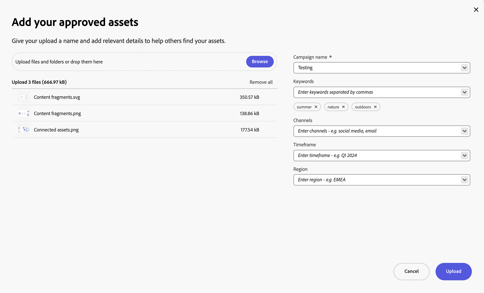

# Charger des ressources approuvées pour la marque dans le hub de contenus {#upload-brand-approved-assets-content-hub}

>[!CONTEXTUALHELP]
>id="upload_assets_content_hub"
>title="Charger des ressources approuvées pour la marque dans le hub de contenus"
>abstract="Ajoutez des ressources approuvées au hub de contenus à partir du système de fichiers local ou importez des ressources à partir de OneDrive ou de sources de données Dropbox. Toutes les ressources s’affichent au niveau supérieur dans le hub de contenus, quelle que soit la structure de dossiers, pour améliorer les fonctionnalités de recherche."

[Les utilisateurs de Content Hub autorisés à ajouter des ressources](/help/assets/deploy-content-hub.md#onboard-content-hub-users-add-assets) peuvent ajouter des ressources à Content Hub à partir du système de fichiers local ou importer des ressources à partir de sources de données OneDrive ou Dropbox. Toutes les ressources s’affichent au niveau supérieur dans Content Hub, quelle que soit la structure de dossiers disponible sur votre système de fichiers local ou les sources de données OneDrive et Dropbox afin d’améliorer les fonctionnalités de recherche.

Les ressources marquées comme `Approved` dans Assets as a Cloud Service sont automatiquement disponibles dans Content Hub. Pour plus d’informations, voir [Approbation de ressources pour Content Hub](/help/assets/approve-assets-content-hub.md).

Pour améliorer davantage la recherche de ressources, Content Hub vous permet d’effectuer les opérations suivantes :

* Définissez les détails clés relatifs à votre chargement de ressources, tels que le nom de la campagne, les mots-clés, les canaux, etc.

* Générez automatiquement d’autres propriétés pour chaque ressource lors d’un chargement réussi, telles que la taille du fichier, le format, la résolution et d’autres propriétés.

* Utilisez l’intelligence artificielle fournie par l’[Adobe AI](https://business.adobe.com/ai/adobe-genai.html) pour appliquer automatiquement les balises pertinentes à toutes les ressources que vous avez chargées. Ces balises, bien nommées Balises intelligentes, augmentent la vitesse du contenu de vos projets en vous aidant à trouver rapidement les ressources appropriées.

Veillez à ne charger que vos [&#x200B; ressources approuvées par la marque dans Content Hub](/help/assets/approve-assets.md).

## Conditions préalables {#prerequisites-add-assets}

[Les utilisateurs de Content Hub autorisés à ajouter des ressources](/help/assets/deploy-content-hub.md#onboard-content-hub-users-add-assets) peuvent charger des ressources vers Content Hub.

## Ajout de ressources à Content Hub à partir du système de fichiers local {#add-assets-local-file-system}

Pour ajouter des ressources à Content Hub, procédez comme suit :

1. Cliquez sur **[!UICONTROL Ajouter Assets]** pour afficher la boîte de dialogue **[!UICONTROL Ajouter vos ressources approuvées]** qui vous permet de créer un chargement.

1. Dans la section **[!UICONTROL Faire glisser des fichiers ou des dossiers ici]** disponible dans le volet de droite, vous pouvez faire glisser les ressources depuis le système de fichiers local ou cliquer sur **[!UICONTROL Parcourir]** pour sélectionner manuellement les fichiers ou les dossiers disponibles sur le système de fichiers local. Cette liste des fichiers qui font partie de votre chargement est disponible sous forme de liste.

   Vous pouvez également prévisualiser les images sélectionnées à l’aide des miniatures et cliquer sur l’icône X pour supprimer une image particulière de la liste. L’icône X ne s’affiche que lorsque vous placez le pointeur de la souris sur le nom ou la taille de l’image. Vous pouvez également cliquer sur **[!UICONTROL Supprimer tout]** pour supprimer tous les éléments de votre liste de chargement.

   Pour terminer le processus de chargement et activer le bouton **[!UICONTROL Charger]**, vous devez regrouper vos ressources sous un nom de campagne.

   

1. Définissez le nom de votre chargement à l’aide du champ **[!UICONTROL Nom de la campagne]**. Vous pouvez utiliser un nom existant ou en créer un nouveau. Le Content Hub vous offre davantage d’options au fur et à mesure que vous saisissez le nom. <!--You can define multiple Campaign names for your upload. While you are typing a name, either click anywhere else within the dialog box or press the `,` (Comma) key to register the name.-->

   Adobe recommande, en règle générale, de spécifier des valeurs dans le reste des champs afin de créer une expérience de recherche améliorée pour les ressources que vous avez chargées.

1. De même, définissez des valeurs pour les champs **[!UICONTROL Mots-clés]**, **[!UICONTROL Canaux]**, **[!UICONTROL Période]** et **[!UICONTROL Région]**. Le balisage et le regroupement des ressources par mots-clés, canaux et emplacement permet à toutes les personnes qui utilisent le contenu approuvé de votre entreprise de trouver ces ressources et de les organiser.

1. Cliquez sur **[!UICONTROL Charger]** pour charger des ressources dans le Content Hub. [!UICONTROL Consulter les détails] une boîte de confirmation s’affiche. Cliquez sur [!UICONTROL Continuer].

1. Assets démarre le chargement. Cliquez sur [!UICONTROL Nouveau chargement] pour redémarrer la procédure de chargement. Cliquez sur [!UICONTROL Terminé] pour terminer le chargement.

Les administrateurs peuvent également configurer les champs obligatoires et facultatifs qui s’affichent lors du chargement de ressources, tels que le nom de la campagne, les mots-clés, les canaux, etc. Pour plus d’informations, voir [Configuration de l’interface utilisateur de Content Hub](configure-content-hub-ui-options.md#configure-upload-options-content-hub).

## Gestion des ressources chargées à l’aide de Content Hub {#manage-assets-uploaded-using-content-hub}

[Les utilisateurs de Content Hub autorisés à ajouter des ressources](/help/assets/deploy-content-hub.md#onboard-content-hub-users-add-assets) peuvent [ajouter des ressources à Content Hub](/help/assets/upload-brand-approved-assets.md) à partir du système de fichiers local ou importer des ressources à partir de sources de données OneDrive ou Dropbox. Toutes les ressources s’affichent au niveau supérieur dans Content Hub, quelle que soit la structure de dossiers disponible sur votre système de fichiers local ou les sources de données OneDrive et Dropbox afin d’améliorer les fonctionnalités de recherche.

L’affichage des ressources chargées à l’aide de Content Hub dépend de l’activation ou non [du bouton Validation automatique](/help/assets/configure-content-hub-ui-options.md#configure-import-options-content-hub) :

* Si le bouton **[!UICONTROL Approbation automatique]** est activé, les ressources que vous chargez à l’aide de Content Hub sont automatiquement disponibles.

* Si le bouton **[!UICONTROL Approbation automatique]** est désactivé, les ressources que vous chargez à l’aide de Content Hub ne s’affichent pas automatiquement. Les ressources sont disponibles dans le dossier `hydrated-assets` de votre environnement Assets as a Cloud Service. Accédez au dossier et [modifiez en masse](#bulk-approve-assets-content-hub) le statut de ces ressources sur `Approved` pour que ces ressources s’affichent dans Content Hub.

