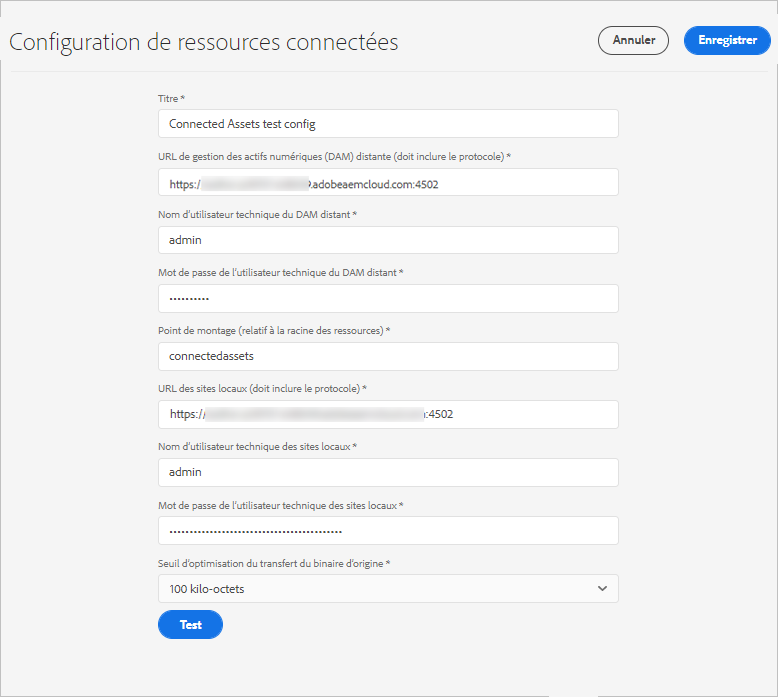
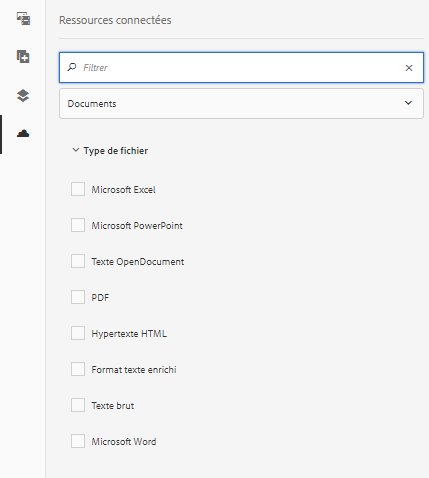
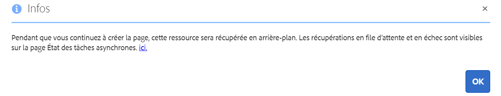

# Utilisation des ressources connectées pour partager des ressources DAM dans AEM Sites {#use-connected-assets-to-share-dam-assets-in-aem-sites}

Dans les grandes entreprises, l’infrastructure requise pour créer des sites web peut être distribuée. Il arrive que les fonctionnalités et les ressources numériques de création de sites web permettant de créer ces sites web se trouvent dans différents déploiements. Il est possible de répartir géographiquement les déploiements existants qui sont nécessaires pour travailler en tandem ou les acquisitions menant à une infrastructure hétérogène que le parent  vouloir utiliser ensemble.

AEM Sites offre des fonctionnalités pour créer des pages web. AEM Assets est le système de gestion des actifs numériques (DAM) qui fournit les ressources requises pour les sites web. AEM prend désormais en charge le cas d’utilisation ci-dessus en intégrant AEM Sites et AEM Assets.

## Présentation de la fonction Ressources partagées {#overview-of-connected-assets}

Lors de la publication des pages dans l’Éditeur, les auteurs peuvent facilement rechercher, parcourir et intégrer les ressources d’un autre déploiement AEM Assets. Pour créer un administrateur AEM, intégrez de manière unique un déploiement local AEM Sites à un autre déploiement (distant) AEM Assets.

Pour les auteurs de sites, les ressources distantes sont disponibles en tant que ressources locales en lecture seule. Cette fonctionnalité permet de rechercher et d’utiliser aisément plusieurs ressources distantes à la fois. Envisagez de migrer en vrac de nombreuses ressources distantes pour les rendre disponibles sur le déploiement local en une seule fois.

### Conditions préalables et déploiements pris en charge {#prerequisites}

Avant d’utiliser ou de configurer cette fonctionnalité, vérifiez les points suivants :

* utilisateurs faisant partie de groupes d’utilisateurs appropriés sur chaque déploiement.
* Pour les types de déploiement d’Adobe Experience Manager, l’un des critères pris en charge est satisfait.

   |  | AEM Sites as a Cloud Service | Sites AEM 6.5 sur AMS | Sites AEM 6.5 sur site |
   |---|---|---|---|
   | **AEM Assets as a Cloud Service** | Pris en charge | Pris en charge | Pris en charge |
   | **Ressources AEM 6.5 sur AMS** | Pris en charge | Pris en charge | Pris en charge |
   | **Ressources AEM 6.5 sur site** | pas de prise en charge | pas de prise en charge | pas de prise en charge |

### Formats de fichiers pris en charge {#mimetypes}

Les auteurs peuvent rechercher des images et les types de suivants dans l’Outil de recherche de contenu et utiliser les ressources recherchées dans l’éditeur de page. Documents can be added to the `Download` component and images can be added to the `Image` component. Authors can also add the remote assets in any custom AEM component that extends the default `Download` or `Image` components. Les  de formats pris en charge sont les suivants :

* **Formats** d’image : Les formats d’image pris en charge par le composant  Image sont pris en charge. Les images de médias dynamiques ne sont pas prises en charge.
* **Formats** de  : Voir [Formats](file-format-support.md#doc-formats)de pris en charge par les ressources connectées.

### Utilisateurs et groupes concernés {#users-and-groups-involved}

Les différents rôles impliqués pour configurer et utiliser la fonctionnalité et leurs groupes d’utilisateurs correspondants sont décrits ci-dessous. L’étendue locale est utilisée dans les cas pratiques où une page web a été créée par un auteur. La portée distante est utilisée pour le déploiement DAM hébergeant les ressources requises. L’auteur Sites récupère ces ressources distantes.

| Rôle | Portée | Groupe d’utilisateurs | Nom d’utilisateur dans la présentation | Condition requise |
|----------------------------------|--------|------------------------------------------------------------------------------|--------------------------|--------------------------------------------------------------------------------------------------------------------------------------------------------------------------------------------------------------------------------------------------------------|
| Administrateur des sites AEM | Local | Administrateur AEM | `admin` | Configurez AEM, ainsi que l’intégration au déploiement Assets distant. |
| Utilisateur DAM | Local | Création | `ksaner` | Used to view and duplicate the fetched assets at `/content/DAM/connectedassets/`. |
| Auteur AEM Sites | Local | Auteur (avec les droits d’accès en lecture sur l’instance DAM distante et l’accès en tant qu’auteur sur les l’instance Sites locale) | `ksaner` | Les utilisateurs finaux sont des auteurs Sites qui utilisent cette intégration pour améliorer leur vélocité de contenu. Les auteurs recherchent et parcourent des ressources dans un système de gestion des actifs numériques distant à l’aide de l’outil de recherche de contenu et des images requises dans les pages Web locales. The credentials of `ksaner` DAM user are used. |
| Administrateur AEM Assets | distant | Administrateur AEM | `admin` sur AEM distant | Configurez le partage des ressources cross-origin (CORS). |
| Utilisateur DAM | distant | Création | `ksaner` sur AEM distant | Rôle auteur sur le déploiement AEM distant. Recherchez et parcourez les ressources dans la fonction Ressources connectées à l’aide de l’outil de recherche de contenu. |
| Distributeur DAM (utilisateur technique) | Distant | Créateurs de modules et auteurs de sites | `ksaner` sur AEM distant | Cet utilisateur présent sur le déploiement distant permet au serveur AEM local (et non le rôle d’auteur Sites) de récupérer les ressources distantes au nom de l’auteur Sites. Ce rôle n’est pas identique aux deux rôles `ksaner` ci-dessus et appartient à un groupe d’utilisateurs différent.  |

## Configurez une connexion entre les déploiements Sites et Assets.{#configure-a-connection-between-sites-and-assets-deployments}

Un administrateur AEM peut créer cette intégration. Une fois créées, les autorisations requises pour l’utiliser sont établies par le biais des groupes d’utilisateurs définis sur les déploiements Sites et DAM.

Pour configurer la connectivité des ressources connectées et des sites locaux, procédez comme suit :

1. Accédez à un déploiement AEM Sites existante ou créez-en un à l’aide de la commande suivante :

   1. Dans le dossier du fichier JAR, exécutez la commande ci-dessous sur un terminal pour créer chaque serveur AEM.
      `java -XX:MaxPermSize=768m -Xmx4096m -jar <quickstart jar filepath> -r samplecontent -p 4502 -nofork -gui -nointeractive &`

   1. Après quelques minutes, le serveur AEM démarre correctement. Considérez ce déploiement AEM Sites comme l’ordinateur local pour la création de page web ; à l’adresse `https://[local_sites]:4502`.

1. Vérifiez que les utilisateurs et les rôles avec l’étendue locale existent sur les déploiements AEM Sites et AEM Assets sur AMS. Create a technical user on Assets deployment and add to the user group mentioned in [users and groups involved](/help/assets/use-assets-across-connected-assets-instances.md#users-and-groups-involved).

1. Access the local AEM Sites deployment at `https://[local_sites]:4502`. Cliquez sur **[!UICONTROL Outils]** > **[!UICONTROL Ressources]** > **[!UICONTROL Configuration de ressources connectées]** et fournissez les valeurs suivantes :

   1. L’emplacement des ressources AEM est `https://[assets_servername_ams]:[port]`.
   1. Identifiants d’un distributeur DAM (utilisateur technique).
   1. Dans le champ **[!UICONTROL Point de montage]**, entrez le chemin AEM local où AEM récupère les ressources. For example, `remoteassets` folder.

   1. Adjust the values of **[!UICONTROL Original Binary transfer optimization Threshold]** depending on your network. Un rendu de ressource dont la taille est supérieure à ce seuil est transféré de façon asynchrone. 
   1. Sélectionnez **[!UICONTROL Banque de données partagée avec les ressources connectées]** si vous utilisez une banque de données pour stocker vos ressources et qu’elle constitue le support de stockage commun aux deux déploiements AEM. Dans ce cas, la limite de seuil n’a pas d’importance puisque les fichiers binaires réels résident sur la banque de données et ne sont pas transférés.
   

   *Figure : Configuration standard pour les ressources connectées*

1. Lorsque les ressources sont déjà traitées et que les rendus sont extraits, désactivez les lanceurs de workflow. Réglez les configurations du lanceur sur le déploiement local (AEM Sites) pour exclure le dossier `connectedassets`, où les ressources distantes sont récupérées.

   1. Sur le déploiement AEM Sites, cliquez sur **[!UICONTROL Outils]** > **[!UICONTROL Workflow]** > **[!UICONTROL Lanceurs]**.

   1. Recherchez les lanceurs avec les workflows comme **[!UICONTROL ressources de mise à jour de gestion des actifs numériques]** et **[!UICONTROL écriture différée des métadonnées]**.

   1. Sélectionnez le lanceur de worflow puis cliquez sur **[!UICONTROL Propriétés]** dans la barre d’actions.

   1. Dans l’assistant de propriétés, modifiez les champs **[!UICONTROL Chemin]** en fonction des mappages suivants pour mettre à jours leurs expressions régulières afin d’exclure le point de montage **[!UICONTROL connectedassets]**.
   | Avant | Après |
   |---|---|
   | `/content/dam(/((?!/subassets).)*/)renditions/original` | `/content/dam(/((?!/subassets)(?!connectedassets).)*/)renditions/original` |
   | `/content/dam(/.*/)renditions/original` | `/content/dam(/((?!connectedassets).)*/)renditions/original` |
   | `/content/dam(/.*)/jcr:content/metadata` | `/content/dam(/((?!connectedassets).)*/)jcr:content/metadata` |

   >[!NOTE]
   >
   >Tous les rendus disponibles sur le déploiement distant d’AEM sont récupérés lorsque les auteurs récupèrent un fichier. Si vous souhaitez créer d’autres rendus d’une ressource récupérée, ignorez cette étape de configuration. Le workflow de mise à jour des ressources de la gestion des actifs numériques est déclenché et crée d’autres rendus. Ces rendus sont disponibles uniquement sur le déploiement Sites local, et non sur le déploiement DAM distant.

1. Ajoutez l’instance AEM Sites comme l’une des **[!UICONTROL Origines autorisées]** sur la configuration CORS AEM Assets distante.

   1. Connectez-vous à l’aide des identifiants administrateurs. Recherche Cross-Origin. Accédez à **[!UICONTROL Outils]** > **[!UICONTROL Opérations]** > **[!UICONTROL Console Web]**.

   1. To create a CORS configuration for AEM Sites instance, click  icon next to **[!UICONTROL Adobe Granite Cross-Origin Resource Sharing Policy]**.

   1. Dans le champ **[!UICONTROL Origines autorisées]**, entrez l’URL de l’instance Sites locale, c’est-à-dire `https://[local_sites]:[port]` Enregistrez la configuration.

## Utilisation des ressources distants {#use-remote-assets}

Les auteurs de site web utilisent l’outil de recherche de contenu pour se connecter à l’instance DAM. Les auteurs peuvent parcourir, rechercher et faire glisser les ressources distantes dans un composant. Pour vous authentifier sur le système DAM distant, conservez les identifiants de l’utilisateur DAM fournis par votre administrateur.

Les auteurs peuvent utiliser les ressources disponibles à la fois sur les instances DAM locale et distante, dans une page web unique. Utilisez l’outil de recherche de contenu pour basculer entre la recherche sur l’instance DAM locale ou sur l’instance DAM distante.

Seules les balises des ressources distantes sont récupérées qui ont une balise correspondante exacte (avec la même hiérarchie de taxonomie) disponible sur l’instance Sites locale. Toutes les autres balises sont ignorées. Les auteurs peuvent rechercher des ressources distantes à l’aide de toutes les balises présentes dans le déploiement AEM distant, car AEM  une recherche de texte intégral  une recherche de texte intégral.

### Présentation de l’utilisation {#walk-through-of-usage}

Utilisez la configuration ci-dessus pour découvrir l’expérience de création et comprendre les principes de la fonctionnalité. Utilisez les documents ou les images de votre choix sur le déploiement DAM distant.

1. Accédez à l’IU Assets sur le déploiement distant via **[!UICONTROL Ressources]** > **[!UICONTROL Fichiers]** dans l’espace de travail AEM. Vous pouvez également y accéder `https://[assets_servername_ams]:[port]/assets.html/content/dam` dans un navigateur. Téléchargez les ressources de votre choix.
1. Sur l’instance Sites, dans l’activateur de profil situé dans le coin supérieur droit, cliquez sur **[!UICONTROL Emprunter l’identité de]**. Indiquez `ksaner` comme nom d’utilisateur, sélectionnez l’option fournie, puis cliquez sur **[!UICONTROL OK]**.
1. Ouvrez une page du site web We.Retail via **[!UICONTROL Sites]** > **[!UICONTROL We.Retail]** > **[!UICONTROL fr]** > **[!UICONTROL fr]**. Modifiez la page. Vous pouvez également accéder `https://[aem_server]:[port]/editor.html/content/we-retail/us/en/men.html` dans un navigateur pour modifier une page.

   Cliquez sur **[!UICONTROL Activer/désactiver le panneau]** latéral dans le coin supérieur gauche de la page.

1. Open the Assets tab and click **[!UICONTROL Log in to Connected Assets]**.
1. Provide the credentials -- `ksaner` as user name and `password` as password. Cet utilisateur dispose d’autorisations de création sur les deux déploiements AEM.
1. Recherchez la ressource que vous avez ajoutée dans DAM. Les ressources distantes s’affichent dans le panneau de gauche. Filtrez les images ou les documents, puis les types de documents pris en charge. Faites glisser les images sur un `Image` composant et  sur un `Download` composant.

   Les ressources récupérées sont en lecture seule sur le déploiement AEM Sites local. Vous pouvez toujours utiliser les options des composants AEM Sites pour modifier la ressource récupérée. La modification par composants est non destructive.

   

   *Figure : Options de filtrage des types de  de et des images lors de la recherche de ressources sur DAM distant*

1. Un auteur de site est informé de la récupération asynchrone d&#39;une ressource et de l’échec d’une tâche de récupération. Les auteurs peuvent consulter les informations détaillées sur la récupération des tâches et des erreurs dans l’[interface utilisateur](/help/assets/asynchronous-jobs.md) des tâches asynchrones pendant, voire après la création.

   

   *Figure : Notification concernant la récupération asynchrone des ressources survenant en arrière-plan.*

1. AEM affiche la liste complète des ressources utilisées sur une page lorsqu’elle est publiée. Veillez à bien récupérer les fichiers distants au moment de la publication. Pour vérifier l’état de chaque ressource récupérée, reportez-vous à l’interface utilisateur des tâches asynchrones.

   >[!NOTE]
   >
   >Cette page est publiée même en cas de non-récupération d’une ou plusieurs ressources distantes. Le composant utilisant la ressource distante est publié vide. La zone de notification AEM affiche la notification des erreurs qui apparaissent sur la page des tâches asynchrones.

>[!CAUTION]
>
>Une fois utilisées dans n’importe quelle page web, les ressources distantes récupérées sont consultables et exploitables par toute personne disposant des droits d’accès au dossier local où les ressources récupérées sont stockées (`connectedassets` dans la présentation ci-dessus). The assets are also searchable and visible in the local repository via [!UICONTROL Content Finder].

Les ressources récupérées peuvent être utilisées comme n’importe quel autre ressource locale, à la différence que les métadonnées associées ne peuvent pas être modifiées.

## Restrictions {#limitations}

**Autorisations et gestions des ressources**

* Les ressources locales ne sont pas synchronisées avec les ressources d’origine sur le déploiement distant. Tout retrait, modification ou suppression d’autorisation sur le déploiement DAM n’est pas propagé en aval.
* Les ressources locales sont des copies en lecture seule. Les composants AEM effectuent des modifications non destructives des ressources. Aucune autre modification n’est autorisée.
* Les ressources récupérées localement sont disponibles à des fins d’écriture uniquement. Les workflows de mise à jour de ressources ne peuvent pas être appliqués et les métadonnées ne peuvent pas être modifiées.
* Seules les images et les formats de répertoriés sont pris en charge. Les fichiers de médias dynamiques, les fragments de contenu et les fragments d’expérience ne sont pas pris en charge.
* Les schémas de métadonnées ne sont pas récupérés.
* Tous les auteurs Sites disposent de droits d’accès en lecture sur les copies récupérées, même s’ils n’en n’ont pas sur le déploiement DAM distant.
* Il n’existe aucune prise en charge API pour personnaliser l’intégration.
* Cette fonctionnalité permet de rechercher et d’utiliser aisément des ressources distantes. Pour rendre de nombreuses ressources distantes disponibles sur le déploiement local en une fois, envisagez de migrer les ressources.
* Il n’est pas possible d’utiliser une ressource distante comme miniature pour une page Web dans l’onglet [!UICONTROL Miniature] des Propriétés [!UICONTROL de la] page en cliquant sur [!UICONTROL Sélectionner l’image].

**Configuration et licence**

* Le déploiement d’AEM Assets sur AMS est pris en charge.
* AEM Sites peut se connecter à un seul référentiel AEM Assets à la fois.
* Une licence AEM Assets s’exécutant en tant que référentiel distant.
* Une ou plusieurs licences d’AEM Sites s’exécutant comme un déploiement de création local.

**Utilisation**

* Seule la fonctionnalité prise en charge consiste à rechercher des ressources distantes et à faire glisser les ressources distantes sur la page locale pour créer du contenu.
* L’opération de récupération échoue après 5 secondes. Les auteurs peuvent rencontrer des problèmes lors de la récupération des ressources, par exemple en cas de problèmes de réseau. Authors can re-attempt by dragging the remote asset from [!UICONTROL Content Finder] to [!UICONTROL Page Editor].
* Simple edits that are non-destructive and the edit supported via the AEM `Image` component, can be done on fetched assets. Les ressources sont en lecture seule.

## Résolution des problèmes {#troubleshoot}

Pour résoudre les problèmes liés aux scénarios d’erreur courants, procédez comme suit :

* Si vous ne pouvez pas rechercher des fichiers distants à partir de l’outil de recherche de contenu, vérifiez à nouveau que les rôles et autorisations requis sont bien appliqués.
* Une ressource récupérée sur un DAM distant risque de ne pas être publiée sur une page Web pour les raisons suivantes : il n&#39;existe pas à distance, au même titre que les autorisations appropriées pour la récupérer ; une erreur réseau s’est produite. Assurez-vous que le fichier n’est pas supprimé du DAM distant ou que les autorisations ne sont pas modifiées ; veiller à ce que les conditions préalables appropriées soient remplies; recommencez à ajouter le fichier à la page et republiez. Recherchez dans la [liste des tâches asynchrones](/help/assets/asynchronous-jobs.md) les erreurs de récupération de ressources.
