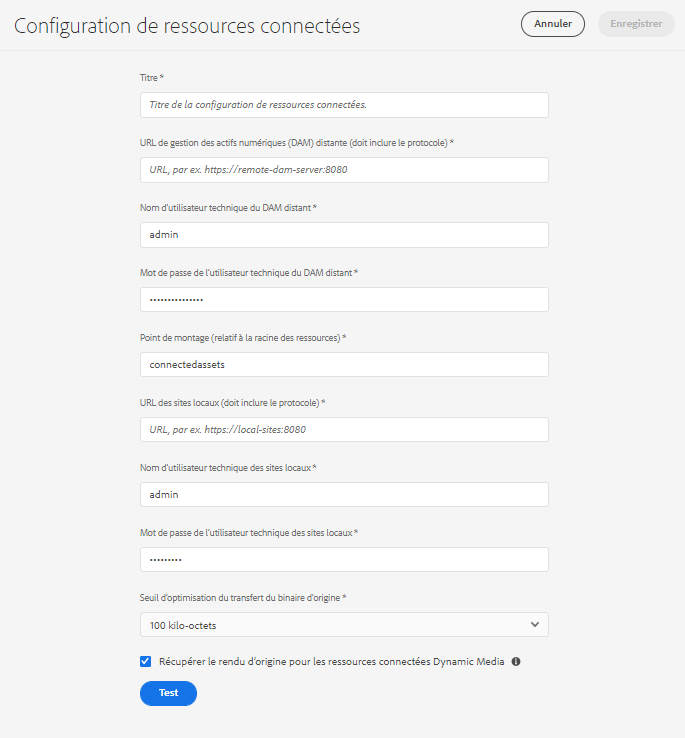

# Utilisation des ressources connectées pour partager des ressources DAM dans [!DNL Experience Manager Sites] {#use-connected-assets-to-share-dam-assets-in-aem-sites}

Dans les grandes entreprises, l’infrastructure requise pour créer des sites web peut être distribuée. Il arrive que les fonctionnalités et les ressources numériques de création de sites web permettant de créer ces sites web se trouvent dans différents déploiements. Cette situation peut être motivée par la répartition géographique des déploiements existants, nécessaire pour travailler en tandem. Elle peut être aussi due à l’acquisition d’infrastructures hétérogènes que la société mère souhaite utiliser conjointement.

Les utilisateurs peuvent créer des pages web dans [!DNL Experience Manager Sites]. [!DNL Experience Manager Assets] est le système de gestion des ressources numériques (DAM) qui fournit les ressources nécessaires pour les sites web. [!DNL Experience Manager] prend désormais en charge le cas d’utilisation ci-dessus en intégrant [!DNL Sites] et [!DNL Assets].

## Présentation de la fonction Ressources connectées {#overview-of-connected-assets}

Lors de la publication des pages dans l’[!UICONTROL Éditeur], les auteurs peuvent facilement rechercher, parcourir et intégrer les ressources d’un autre déploiement [!DNL Assets]. Les administrateurs créent une intégration unique d’un déploiement de [!DNL Sites] avec un déploiement différent (distant) de [!DNL Assets].

Pour les auteurs [!DNL Sites], les ressources distantes sont disponibles en tant que ressources locales, en lecture seule. Cette fonctionnalité permet de rechercher et d’utiliser aisément plusieurs ressources distantes à la fois. Envisagez de migrer en masse de nombreuses ressources distantes pour les rendre disponibles sur le déploiement local [!DNL Sites] en une seule fois.

### Conditions préalables et déploiements pris en charge {#prerequisites}

Avant d’utiliser ou de configurer cette fonctionnalité, vérifiez les points suivants :

* Les utilisateurs font partie de groupes d’utilisateurs appropriés sur chaque déploiement.
* Pour les types de déploiements [!DNL Adobe Experience Manager], l’un des critères pris en charge est satisfait. Pour plus d’informations sur [!DNL Experience Manager] version 6.5, voir [Fonctionnalité Ressources connectées dans Experience Manager 6.5 Assets](https://docs.adobe.com/content/help/fr-FR/experience-manager-65/assets/using/use-assets-across-connected-assets-instances.html).

   |  | [!DNL Sites] as a Cloud Service | [!DNL Experience Manager] 6.5 [!DNL Sites] sur AMS | [!DNL Experience Manager] 6.5 [!DNL Sites] on-premise |
   |---|---|---|---|
   | **[!DNL Experience Manager Assets]as a Cloud Service ** | Pris en charge | Pris en charge | Pris en charge |
   | **[!DNL Experience Manager]6.5[!DNL Assets]sur AMS ** | Pris en charge | Pris en charge | Pris en charge |
   | **[!DNL Experience Manager]6.5[!DNL Assets]on-premise ** | pas de prise en charge | pas de prise en charge | pas de prise en charge |

### Formats de fichiers pris en charge {#mimetypes}

Les auteurs peuvent rechercher des images et les types de documents suivants dans l’outil de recherche de contenu et utiliser les ressources recherchées dans l’éditeur de page. Vous pouvez ajouter des documents au composant `Download` ou des images au composant `Image`. Les auteurs peuvent également ajouter les ressources distantes d’un composant [!DNL Experience Manager] personnalisé qui étend les composants par défaut `Download` ou `Image`. Les formats pris en charge sont les suivants :

* **Formats d’image** : les formats pris en charge par le composant [Image](https://docs.adobe.com/content/help/fr-FR/experience-manager-core-components/using/components/image.html). Les images [!DNL Dynamic Media] ne sont pas prises en charge.
* **Formats de document** : Voir [Formats de document de ressources connectées pris en charge](file-format-support.md#document-formats).

### Utilisateurs et groupes concernés {#users-and-groups-involved}

Les différents rôles impliqués pour configurer et utiliser la fonctionnalité et leurs groupes d’utilisateurs correspondants sont décrits ci-dessous. La portée locale est utilisée dans le cas où un auteur crée une page web. La portée distante est utilisée pour le déploiement DAM qui héberge les ressources requises. L’auteur [!DNL Sites] récupère ces ressources distantes.

| Rôle | Portée | Groupe d’utilisateurs | Nom d’utilisateur de la présentation | Condition requise |
|----------------------------------|--------|------------------------------------------------------------------------------|--------------------------|--------------------------------------------------------------------------------------------------------------------------------------------------------------------------------------------------------------------------------------------------------------|
| Administrateur [!DNL Sites] | Local | [!DNL Experience Manager] `administrators` | `admin` | Configurez [!DNL Experience Manager], ainsi que l’intégration au déploiement [!DNL Assets] distant. |
| Utilisateur DAM | Local | `Authors` | `ksaner` | Utilisé pour afficher et dupliquer les ressources récupérées au niveau de `/content/DAM/connectedassets/`. |
| Auteur [!DNL Sites] | Local | `Authors` (avec les droits d’accès en lecture sur l’instance DAM distante et l’accès en tant qu’auteur sur l’instance [!DNL Sites] locale) | `ksaner` | Les utilisateurs finaux sont des auteurs [!DNL Sites] qui utilisent cette intégration pour améliorer leur vélocité de contenu. Les auteurs recherchent et parcourent les ressources dans des fichiers DAM distants à l’aide de l’[!UICONTROL outil de recherche de contenu] et utilisent les images requises dans les pages web locales. Les identifiants de l’utilisateur DAM `ksaner` sont utilisés. |
| Administrateur [!DNL Assets] | Distant | [!DNL Experience Manager] `administrators` | `admin` sur [!DNL Experience Manager] distant | Configurez le partage des ressources cross-origin (CORS). |
| Utilisateur DAM | Distant | `Authors` | `ksaner` sur [!DNL Experience Manager] distant | Rôle d’auteur sur le déploiement [!DNL Experience Manager] distant. Recherchez et parcourez les ressources dans la fonction Ressources connectées à l’aide de l’[!UICONTROL outil de recherche de contenu]. |
| Distributeur DAM (utilisateur technique) | Distant | [!DNL Sites] `Authors` | `ksaner` sur [!DNL Experience Manager] distant | Cet utilisateur présent sur le déploiement distant est utilisé par le serveur local [!DNL Experience Manager] (et non le rôle d’auteur [!DNL Sites]) pour récupérer les ressources distantes, au nom de l’auteur [!DNL Sites]. Ce rôle n’est pas identique aux deux rôles `ksaner` ci-dessus et appartient à un groupe d’utilisateurs différent.  |

## Configurez une connexion entre les déploiements [!DNL Sites] et [!DNL Assets] {#configure-a-connection-between-sites-and-assets-deployments}

Un administrateur [!DNL Experience Manager] peut créer cette intégration. Une fois créées, les autorisations requises pour l’utiliser sont établies par le biais des groupes d’utilisateurs définis sur les déploiements [!DNL Sites] et DAM.

Pour configurer la connectivité des ressources connectées et des [!DNL Sites] locaux, procédez comme suit :

1. Accédez à un déploiement [!DNL Sites] existant ou créez-en un à l’aide de la commande suivante :

   1. Dans le dossier du fichier JAR, exécutez la commande ci-dessous sur un terminal pour créer chaque serveur [!DNL Experience Manager].
      `java -XX:MaxPermSize=768m -Xmx4096m -jar <quickstart jar filepath> -r samplecontent -p 4502 -nofork -gui -nointeractive &`

   1. Au bout de quelques minutes, le serveur [!DNL Experience Manager] démarre. Considérez ce déploiement [!DNL Sites] comme l’ordinateur local pour la création de pages web, par exemple à l’adresse `https://[local_sites]:4502`.

1. Vérifiez que les utilisateurs et les rôles avec la portée locale existent pour le déploiement [!DNL Sites] ainsi que pour le déploiement [!DNL Assets] sur AMS. Créez un utilisateur technique sur le déploiement [!DNL Assets] et ajoutez-le au groupe d’utilisateurs mentionné dans les [Utilisateurs et groupes concernés](/help/assets/use-assets-across-connected-assets-instances.md#users-and-groups-involved).

1. Accédez au déploiement [!DNL Sites] local à l’adresse `https://[local_sites]:4502`. Cliquez sur **[!UICONTROL Outils]** > **[!UICONTROL Ressources]** > **[!UICONTROL Configuration de ressources connectées]** et fournissez les valeurs suivantes :

   1. L’emplacement de [!DNL Assets] est `https://[assets_servername_ams]:[port]`.
   1. Identifiants d’un distributeur DAM (utilisateur technique).
   1. Dans le champ **[!UICONTROL Point de montage]**, entrez le chemin local [!DNL Experience Manager] où [!DNL Experience Manager] récupère les ressources. Par exemple, le dossier `remoteassets`.

   1. Ajustez les valeurs du **[!UICONTROL Seuil d’optimisation du transfert du binaire d’origine]** en fonction de votre réseau. Un rendu de ressource dont la taille est supérieure à ce seuil est transféré de façon asynchrone. 
   1. Sélectionnez **[!UICONTROL Banque de données partagée avec les ressources connectées]** si vous utilisez une banque de données pour stocker vos ressources et qu’elle constitue le support de stockage commun aux deux déploiements. Dans ce cas, la limite de seuil n’a pas d’importance, car les fichiers binaires de ressources se trouvent dans le magasin de données et ne sont pas transférés.
      

      *Figure : exemple de configuration standard pour les ressources connectées.*

1. Lorsque les ressources sont déjà traitées et que les rendus sont récupérés, désactivez les lanceurs de workflow. Réglez les configurations du lanceur sur le déploiement local ([!DNL Sites]) pour exclure le dossier `connectedassets` où les ressources distantes sont récupérées.

   1. Sur le déploiement [!DNL Sites], cliquez sur **[!UICONTROL Outils]** > **[!UICONTROL Workflow]** > **[!UICONTROL Lanceurs]**.

   1. Recherchez les lanceurs avec les workflows comme **[!UICONTROL Ressources de mise à jour de gestion des actifs numériques]** et **[!UICONTROL Écriture différée des métadonnées de gestion des actifs numériques]**.

   1. Sélectionnez le lanceur de workflow puis cliquez sur **[!UICONTROL Propriétés]** dans la barre d’actions.

   1. Dans l’assistant [!UICONTROL Propriétés], modifiez les champs **[!UICONTROL Chemin]** en fonction des mappages suivants pour mettre à jour leurs expressions régulières afin d’exclure le point de montage **[!UICONTROL connectedassets]**.
   | Avant | Après |
   | ------------------------------------------------------- | -------------------------------------------------------------------------- |
   | `/content/dam(/((?!/subassets).)*/)renditions/original` | `/content/dam(/((?!/subassets)(?!connectedassets).)*/)renditions/original` |
   | `/content/dam(/.*/)renditions/original` | `/content/dam(/((?!connectedassets).)*/)renditions/original` |
   | `/content/dam(/.*)/jcr:content/metadata` | `/content/dam(/((?!connectedassets).)*/)jcr:content/metadata` |

   >[!NOTE]
   >
   >Tous les rendus disponibles sur le déploiement distant sont récupérés lorsque les auteurs obtiennent une ressource. Si vous souhaitez créer d’autres rendus d’une ressource récupérée, ignorez cette étape de configuration. Le workflow [!UICONTROL Ressources de mise à jour de gestion des actifs numériques] est déclenché et crée d’autres rendus. Ces rendus sont disponibles uniquement sur le déploiement [!DNL Sites] local, et non sur le déploiement DAM distant.

1. Ajoutez l’instance [!DNL Sites] comme l’une des **[!UICONTROL Origines autorisées]** sur la configuration [!DNL Assets'] CORS distante.

   1. Connectez-vous à l’aide des informations d’identification d’administrateur. Recherchez `Cross-Origin`. Accédez à **[!UICONTROL Outils]** > **[!UICONTROL Opérations]** > **[!UICONTROL Console web]**.

   1. Pour créer une configuration CORS concernant l’instance[!DNL Sites], cliquez sur l’icône  en regard de **[!UICONTROL Adobe Granite Cross-Origin Resource Sharing Policy]**.

   1. Dans le champ **[!UICONTROL Origines autorisées]**, entrez l’URL de l’instance locale [!DNL Sites], c’est-à-dire `https://[local_sites]:[port]`. Enregistrez la configuration.

## Utilisation des ressources distantes  {#use-remote-assets}

Les auteurs de site web utilisent l’outil de recherche de contenu pour se connecter à l’instance DAM. Les auteurs peuvent parcourir, rechercher et faire glisser les ressources distantes dans un composant. Pour vous authentifier sur le système DAM distant, conservez les identifiants de l’utilisateur DAM fournis par votre administrateur.

Les auteurs peuvent utiliser les ressources disponibles sur les instances DAM locale et distante, dans une page web unique. Utilisez l’outil de recherche de contenu pour basculer entre la recherche sur l’instance DAM locale et sur l’instance DAM distante.

Seules sont récupérées les balises des ressources distantes présentant une balise qui correspond exactement (avec la même hiérarchie de taxonomie), disponible sur l’instance [!DNL Sites] locale. Toutes les autres balises sont ignorées. Les auteurs peuvent rechercher des ressources distantes à l’aide de toutes les balises présentes dans le déploiement [!DNL Experience Manager] distant, car AEM offre une fonctionnalité de recherche de texte intégral.

### Présentation de l’utilisation {#walk-through-of-usage}

Utilisez la configuration ci-dessus pour découvrir l’expérience de création et comprendre les principes de la fonctionnalité. Utilisez les documents ou les images de votre choix sur le déploiement DAM distant.

1. Accédez à l’interface [!DNL Assets] sur le déploiement distant via **[!UICONTROL Ressources]** > **[!UICONTROL Fichiers]** dans l’espace de travail [!DNL Experience Manager]. Vous pouvez également accéder à `https://[assets_servername_ams]:[port]/assets.html/content/dam` dans un navigateur. Chargez les ressources de votre choix.
1. Sur l’instance [!DNL Sites], dans l’activateur de profil situé dans le coin supérieur droit, cliquez sur **[!UICONTROL Emprunter l’identité de]**. Indiquez `ksaner` comme nom d’utilisateur, sélectionnez l’option fournie, puis cliquez sur **[!UICONTROL OK]**.
1. Ouvrez une page du site web We.Retail via **[!UICONTROL Sites]** > **[!UICONTROL We.Retail]** > **[!UICONTROL fr]** > **[!UICONTROL fr]**. Modifiez la page. Vous pouvez également accéder à `https://[aem_server]:[port]/editor.html/content/we-retail/us/en/men.html` dans un navigateur pour modifier une page.

   Cliquez sur **[!UICONTROL Activer/désactiver le panneau latéral]** dans le coin supérieur gauche de la page.

1. Ouvrez l’onglet [!UICONTROL Ressources] et cliquez sur **[!UICONTROL Connexion aux ressources connectées]**.
1. Indiquez les identifiants : `ksaner` comme nom d’utilisateur et `password` comme mot de passe. Cet utilisateur dispose d’autorisations de création sur les deux déploiements [!DNL Experience Manager].
1. Recherchez la ressource que vous avez ajoutée dans DAM. Les ressources distantes s’affichent dans le panneau de gauche. Filtrez les images ou les documents, puis les types de documents pris en charge. Faites glisser les images sur un composant `Image` et les documents sur un composant `Download`.

   Les ressources récupérées sont en lecture seule sur le déploiement local [!DNL Sites]. Vous pouvez toujours utiliser les options des composants [!DNL Sites] pour modifier la ressource récupérée. La modification par composants est non destructive.

   

   *Figure : Options de filtrage des types de documents et des images lors de la recherche de fichiers sur DAM distant.*

1. Un auteur de site est informé de la récupération asynchrone d’une ressource et de l’échec d’une tâche de récupération. Les auteurs peuvent consulter les informations détaillées sur la récupération des tâches et des erreurs dans l’[interface utilisateur](/help/assets/asynchronous-jobs.md) des tâches asynchrones pendant, voire après la création.

   

   *Figure : Notification concernant la récupération asynchrone en arrière-plan des ressources.*

1. [!DNL Experience Manager] affiche la liste complète des ressources utilisées sur une page lorsqu’elle est publiée. Veillez à bien récupérer les fichiers distants au moment de la publication. Pour vérifier l’état de chaque ressource récupérée, reportez-vous à l’interface utilisateur des [tâches asynchrones](/help/assets/asynchronous-jobs.md).

   >[!NOTE]
   >
   >Cette page est publiée même en cas de non-récupération d’une ou plusieurs ressources distantes. Le composant utilisant la ressource distante est publié vide. La zone de notification [!DNL Experience Manager] affiche la notification des erreurs qui apparaissent sur la page des tâches asynchrones.

>[!CAUTION]
>
>Une fois utilisées dans n’importe quelle page web, les ressources distantes récupérées sont consultables et exploitables par toute personne disposant des droits d’accès au dossier local où les ressources récupérées sont stockées (`connectedassets` dans la présentation ci-dessus). Les ressources sont également consultables et visibles dans le référentiel local via l’[!UICONTROL outil de recherche de contenu].

Les ressources récupérées peuvent être utilisées comme n’importe quelle autre ressource locale, à la différence que les métadonnées associées ne peuvent pas être modifiées.

## Restrictions {#limitations}

### Autorisations et gestions des ressources {#permissions-and-managing-assets}

* Les ressources locales ne sont pas synchronisées avec les ressources d’origine sur le déploiement distant. Tout retrait, modification ou suppression d’autorisation sur le déploiement DAM n’est pas propagé en aval.
* Les ressources locales sont des copies en lecture seule. Les composants [!DNL Experience Manager] effectuent des modifications non destructives des ressources. Aucune autre modification n’est autorisée.
* Les ressources récupérées localement sont disponibles à des fins d’écriture uniquement. Les workflows de mise à jour de ressources ne peuvent pas être appliqués et les métadonnées ne peuvent pas être modifiées.
* Seules les images et les formats de document répertoriés sont pris en charge. Les ressources [!DNL Dynamic Media], ainsi que les fragments de contenu et d’expérience, ne sont pas pris en charge.
* Les schémas de métadonnées ne sont pas récupérés.
* Tous les auteurs [!DNL Sites] disposent de droits d’accès en lecture sur les copies récupérées, même s’ils n’en ont pas sur le déploiement DAM distant.
* Il n’existe aucune prise en charge API pour personnaliser l’intégration.
* Cette fonctionnalité permet de rechercher et d’utiliser aisément des ressources distantes. Pour rendre de nombreuses ressources distantes disponibles sur le déploiement local en une fois, envisagez de migrer les ressources.
* Il n’est pas possible d’utiliser une ressource distante comme miniature de page dans l’interface utilisateur [!UICONTROL Propriétés de la page]. Vous pouvez définir une miniature d’une page web dans l’interface utilisateur [!UICONTROL Propriétés de la page] à partir de la [!UICONTROL miniature] en cliquant sur [!UICONTROL Sélectionner l’image].

### Configuration et licences {#setup-licensing}

* Le déploiement de [!DNL Assets] sur [!DNL Adobe Managed Services] est pris en charge.
* [!DNL Sites] peut se connecter à un seul référentiel [!DNL Assets] à la fois.
* Une licence [!DNL Assets] s’exécutant en tant que référentiel distant.
* Une ou plusieurs licences [!DNL Sites] s’exécutant comme un déploiement de création local.

### Utilisation {#usage}

* La seule fonctionnalité prise en charge est la recherche de ressources distantes et le fait de les faire glisser sur la page locale pour créer du contenu.
* L’opération de récupération échoue après 5 secondes. Les auteurs peuvent rencontrer des problèmes lors de la récupération des ressources, par exemple en cas de problèmes de réseau. Les auteurs peuvent effectuer une nouvelle tentative et faire glisser la ressource distante de l’[!UICONTROL outil de recherche de contenu] vers l’[!UICONTROL éditeur de page].
* Les modifications simples non destructives et les modifications prises en charge par le composant `Image` peuvent être effectuées sur les ressources récupérées. Les ressources sont en lecture seule.

## Résolution des problèmes  {#troubleshoot}

Pour résoudre les problèmes liés aux scénarios d’erreur courants, procédez comme suit :

* Si vous ne pouvez pas rechercher des ressources distantes à partir de l’[!UICONTROL outil de recherche de contenu], vérifiez à nouveau que les rôles et autorisations requis sont bien appliqués.
* Une ressource récupérée sur un DAM distant risque de ne pas être publiée sur une page web pour les raisons suivantes : elle n’existe pas à distance, au même titre que les autorisations appropriées pour la récupérer ; une erreur réseau s’est produite. Veillez à ne pas supprimer la ressource du DAM distant, ni à modifier les autorisations. Assurez-vous également que les conditions préalables appropriées sont remplies. Réessayez d’ajouter cette ressource à la page et de la publier de nouveau. Recherchez dans la [liste des tâches asynchrones](/help/assets/asynchronous-jobs.md) les erreurs de récupération de ressources.
