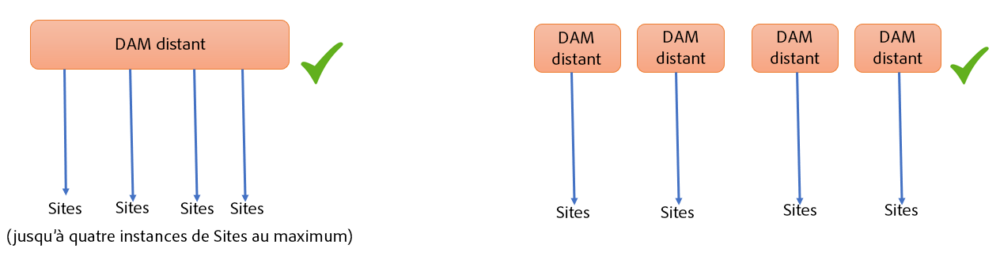
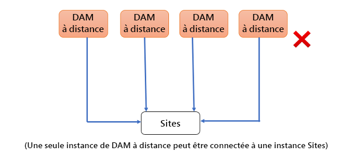

# Utilisation des ressources connectées pour partager des ressources de gestion des ressources numériques dans [!DNL Experience Manager Sites] {#use-connected-assets-to-share-dam-assets-in-aem-sites}

| Version | Lien de l’article |
| -------- | ---------------------------- |
| AEM 6.5 | [Cliquez ici](https://experienceleague.adobe.com/docs/experience-manager-65/assets/using/use-assets-across-connected-assets-instances.html?lang=fr) |
| AEM as a Cloud Service | Cet article |

Dans les grandes entreprises, l’infrastructure requise pour créer des sites web peut être distribuée. Parfois, les fonctionnalités de création de site web et les ressources numériques utilisées pour créer ces sites web peuvent résider dans différents déploiements. Cette situation peut être motivée par la répartition géographique des déploiements existants, nécessaire pour travailler conjointement. Elle peut être aussi due à l’acquisition conduisant à des infrastructures hétérogènes, y compris différentes versions d’[!DNL Experience Manager], que la société mère souhaite utiliser conjointement.

>[!NOTE]
>
>Adobe recommande d’utiliser Dynamic Media avec des fonctionnalités OpenAPI pour connecter AEM Assets as a Cloud Service et AEM Sites. Voir [ Intégration d’AEM Assets distant à AEM Sites](/help/assets/integrate-remote-approved-assets-with-sites.md).

La fonctionnalité Ressources connectées prend en charge le cas d’utilisation ci-dessus en intégrant [!DNL Experience Manager Sites] et [!DNL Experience Manager Assets]. Les utilisateurs peuvent créer dans [!DNL Sites] des pages web qui utilisent les ressources numériques à partir de déploiements [!DNL Assets] distincts.

>[!NOTE]
>
>Configurez les ressources connectées uniquement lorsque vous devez utiliser les ressources disponibles sur un déploiement DAM distant sur un déploiement Sites distinct pour créer des pages web.

## Présentation de la fonction Ressources connectées {#overview-of-connected-assets}

Lors de la modification de pages dans [!UICONTROL l’éditeur de page] en tant que destination de la cible, les auteurs peuvent rechercher, parcourir et incorporer facilement des ressources à partir d’un déploiement [!DNL Assets] différent qui agit comme source de ressources. Les administrateurs créent une intégration unique d’un déploiement de [!DNL Experience Manager] avec la fonctionnalité [!DNL Sites] avec un autre déploiement de [!DNL Experience Manager] avec la fonctionnalité [!DNL Assets]. Vous pouvez également utiliser des images Dynamic Media dans les pages web de votre site par le biais de ressources connectées et utiliser les fonctionnalités de Dynamic Media, telles que le recadrage intelligent et les paramètres d’image prédéfinis.

Pour les auteurs [!DNL Sites], les ressources distantes sont disponibles en tant que ressources locales, en lecture seule. Cette fonctionnalité permet une recherche transparente et un accès aux ressources distantes dans l’éditeur de site. Pour tout autre cas d’utilisation qui peut nécessiter la disponibilité de l’ensemble des ressources sur Sites, envisagez de migrer les ressources en bloc au lieu d’utiliser Connected Assets.

### Conditions préalables et déploiements pris en charge {#prerequisites}

Avant d’utiliser ou de configurer cette fonctionnalité, vérifiez les points suivants :

* Les utilisateurs font partie de groupes d’utilisateurs appropriés sur chaque déploiement.
* Pour les types de déploiements [!DNL Adobe Experience Manager], l’un des critères pris en charge est satisfait. [!DNL Experience Manager] as a Cloud Service [!DNL Assets] fonctionne avec [!DNL Experience Manager] 6.5. Pour plus d’informations sur les opérations de cette fonctionnalité dans [!DNL Experience Manager] 6.5, voir [Ressources connectées dans [!DNL Experience Manager] 6.5 [!DNL Assets]](https://experienceleague.adobe.com/docs/experience-manager-65/assets/using/use-assets-across-connected-assets-instances.html?lang=fr).

  | | [!DNL Sites] as a [!DNL Cloud Service] | [!DNL Experience Manager] 6.5 [!DNL Sites] sur AMS | [!DNL Experience Manager] 6.5 [!DNL Sites] on-premise |
  |---|---|---|---|
  | **[!DNL Experience Manager Assets]as a[!DNL Cloud Service]** | Pris en charge | Pris en charge | Pris en charge |
  | **[!DNL Experience Manager] 6.5 [!DNL Assets] sur AMS** | Pris en charge | Pris en charge | Pris en charge |
  | **[!DNL Experience Manager] 6.5 [!DNL Assets] on-premise** | Non pris en charge. | Non pris en charge. | Non pris en charge. |

### Formats de fichiers pris en charge {#mimetypes}

Les auteurs recherchent des images et les types de documents suivants dans l’outil de recherche de contenu et font glisser les ressources recherchées dans l’éditeur de page. Les documents sont ajoutés au composant `Download` et les images au composant `Image`. Les auteurs peuvent également ajouter les ressources distantes d’un composant [!DNL Experience Manager] personnalisé qui étend les composants par défaut `Download` ou `Image`. Les formats pris en charge sont les suivants :

* **Formats d’image** : les formats pris en charge par le composant [Image.](file-format-support.md#image-formats)
* **Formats de document** : voir les [formats de document pris en charge](file-format-support.md#document-formats).

### Utilisateurs et groupes concernés {#users-and-groups-involved}

Les différents rôles impliqués pour configurer et la fonctionnalité et leurs groupes d’utilisateurs correspondants sont décrits ci-dessous. La portée locale est utilisée dans le cas où un auteur crée une page web. La portée distante est utilisée pour le déploiement DAM qui héberge les ressources requises. L’auteur [!DNL Sites] récupère ces ressources distantes.

| Rôle | Portée | Groupe d’utilisateurs | Descriptions |
|------|--------|-----------|----------|
| Administrateur [!DNL Sites] | Local | [!DNL Experience Manager] `administrators` | Configurez [!DNL Experience Manager], ainsi que l’intégration au déploiement [!DNL Assets] distant. |
| Utilisateur DAM | Local | `Authors` | Utilisé pour afficher et dupliquer les ressources récupérées au niveau de `/content/DAM/connectedassets/`. |
| Auteur [!DNL Sites] | Local | <ul><li>`Authors` (avec les droits d’accès en lecture sur l’instance DAM distante et l’accès en tant qu’auteur sur l’instance [!DNL Sites] locale) </li> <li>`dam-users` sur [!DNL Sites] local</li></ul> | Les utilisateurs finaux sont des auteurs [!DNL Sites] qui utilisent cette intégration pour accélérer leur contenu. Les auteurs peuvent effectuer des recherches et parcourir les ressources dans des fichiers DAM distants à l’aide de l’[!UICONTROL outil de recherche de contenu] et en utilisant les images nécessaires dans les pages web locales. |
| Administrateur [!DNL Assets] | Distant | [!DNL Experience Manager] `administrators` | Configurez le partage des ressources cross-origin (CORS). |
| Utilisateur DAM | Distant | `Authors` | Rôle d’auteur sur le déploiement [!DNL Experience Manager] distant. Recherchez et parcourez les ressources dans la fonction Ressources connectées à l’aide de l’[!UICONTROL outil de recherche de contenu]. |
| Distributeur DAM (utilisateur technique) | Distant | <ul> <li> [!DNL Sites] `Authors`</li> <li> `connectedassets-assets-techaccts` </li> </ul> | Cet utilisateur présent sur le déploiement distant est utilisé par le serveur local [!DNL Experience Manager] (et non le rôle d’auteur [!DNL Sites]) pour récupérer les ressources distantes, au nom de l’auteur [!DNL Sites]. |
| Utilisateur technique de [!DNL Sites] | Local | `connectedassets-sites-techaccts` | Permet au déploiement [!DNL Assets] de rechercher des références à des ressources dans les pages web [!DNL Sites]. |

### Architecture des ressources connectées {#connected-assets-architecture}

Experience Manager vous permet de connecter un déploiement DAM à distance en tant que source à plusieurs déploiements [!DNL Sites] Experience Manager. Toutefois, vous pouvez connecter un déploiement [!DNL Sites] à un seul déploiement DAM à distance.

Évaluez le nombre optimal d’instances Sites à connecter à un déploiement DAM distant. Adobe recommande de connecter progressivement les instances Sites au déploiement et de tester l’absence d’impact sur les performances au niveau de la gestion des actifs numériques distants, car chaque instance Sites connectée contribue au trafic de données sur la gestion des actifs numériques distants.

Les diagrammes suivants illustrent les scénarios pris en charge :

Le diagramme suivant illustre un scénario non pris en charge :

## Configurez une connexion entre les déploiements [!DNL Sites] et [!DNL Assets]  {#configure-a-connection-between-sites-and-assets-deployments}

Un administrateur [!DNL Experience Manager] peut créer cette intégration. Une fois créées, les autorisations requises pour l’utiliser sont établies par le biais de groupes d’utilisateurs. Les groupes d’utilisateurs sont définis sur les déploiements [!DNL Sites] et DAM.

Pour configurer les ressources connectées et la connectivité des [!DNL Sites] locaux, procédez comme suit :

1. Accédez à un déploiement [!DNL Sites] existant. Ce déploiement [!DNL Sites] est utilisé pour la création de pages web, par exemple sur `https://<sites_server_fqdn>:[port]`. Au fur et à mesure de la création de pages lors du déploiement [!DNL Sites], considérons le déploiement [!DNL Sites] comme local du point de vue de la création de pages.

1. Accédez à un déploiement [!DNL Assets] existant. Ce déploiement [!DNL Assets] sert à gérer les ressources numériques, par exemple sur `https://[assets_servername]:port`.

1. Vérifiez que les utilisateurs et les rôles dotés de la portée appropriée existent pour le déploiement [!DNL Sites] ainsi que pour le déploiement [!DNL Assets] sur AMS. Créez un utilisateur technique sur le déploiement [!DNL Assets] et ajoutez-le au groupe d’utilisateurs mentionné dans les [Utilisateurs et groupes concernés](/help/assets/use-assets-across-connected-assets-instances.md#users-and-groups-involved).

1. Accédez au déploiement [!DNL Sites] local à l’adresse `https://[sites_servername]:port`. Cliquez sur **[!UICONTROL Outils]** > **[!UICONTROL Ressources]** > **[!UICONTROL Configuration de ressources connectées]** et fournissez les valeurs suivantes :

   1. le **[!UICONTROL Titre]** de la configuration ;
   1. l’**[!UICONTROL URL de gestion des actifs numériques (DAM) distante]** est l’URL de l’emplacement [!DNL Assets] au format `https://[assets_servername]:[port]`.
   1. Identifiants d’un distributeur DAM (utilisateur technique).
   1. Dans le champ **[!UICONTROL Point de montage]**, entrez le chemin local [!DNL Experience Manager] où [!DNL Experience Manager] récupère les ressources. Par exemple, le dossier `connectedassets`. Les ressources extraites de DAM sont stockées dans ce dossier sur le déploiement [!DNL Sites].
   1. L’**[!UICONTROL URL des sites locaux]** correspond à l’emplacement du déploiement [!DNL Sites]. Le déploiement [!DNL Assets] utilise cette valeur pour conserver les références aux ressources numériques récupérées par ce déploiement [!DNL Sites].
   1. Informations d’identification de l’utilisateur technique [!DNL Sites].
   1. La valeur du champ **[!UICONTROL Seuil d’optimisation du transfert du binaire d’origine]** indique si les ressources d’origine (y compris les rendus) sont transférées de manière synchrone ou non. Il est possible de récupérer facilement les ressources de taille inférieure, tandis que celles de taille relativement importante sont mieux synchronisés de manière asynchrone. La valeur dépend de vos capacités réseau.
   1. Sélectionnez **[!UICONTROL Magasin de données partagé avec les ressources connectées]** si vous utilisez un magasin de données pour stocker vos ressources et qu’il est commun aux deux déploiements. Dans ce cas, la limite de seuil n’a pas d’importance, car les fichiers binaires de ressources sont disponibles dans l’entrepôt de données et ne sont pas transférés.

   

   *Schéma : exemple de configuration standard pour la fonctionnalité de ressources connectées.*

1. Les ressources numériques existantes sur le déploiement [!DNL Assets] sont déjà traitées et les rendus sont générés. Ces rendus sont récupérés à l’aide de cette fonctionnalité, de sorte qu’il n’est pas nécessaire de les générer de nouveau. Désactivez les lanceurs de workflows pour empêcher la régénération des rendus. Modifiez les paramètres du lanceur pour le déploiement ([!DNL Sites]) pour exclure le dossier `connectedassets` (les ressources sont extraites de ce dossier).

   1. Sur le déploiement [!DNL Sites], cliquez sur **[!UICONTROL Outils]** > **[!UICONTROL Workflow]** > **[!UICONTROL Lanceurs]**.

   1. Recherchez les lanceurs avec les workflows comme **[!UICONTROL Ressources de mise à jour de gestion des actifs numériques]** et **[!UICONTROL Écriture différée des métadonnées de gestion des actifs numériques]**.

   1. Sélectionnez le lanceur de workflows, puis cliquez sur **[!UICONTROL Propriétés]** dans la barre d’actions.

   1. Dans l’assistant [!UICONTROL Propriétés], modifiez les champs **[!UICONTROL Chemin]** en fonction des mappages suivants pour mettre à jour leurs expressions régulières afin d’exclure le point de montage **[!UICONTROL connectedassets]**.

   | Avant | Après |
   | ------ | ------------ |
   | `/content/dam(/((?!/subassets).)*/)renditions/original` | `/content/dam(/((?!/subassets)(?!connectedassets).)*/)renditions/original` |
   | `/content/dam(/.*/)renditions/original` | `/content/dam(/((?!connectedassets).)*/)renditions/original` |
   | `/content/dam(/.*)/jcr:content/metadata` | `/content/dam(/((?!connectedassets).)*/)jcr:content/metadata` |

   >[!NOTE]
   >
   >Tous les rendus disponibles sur le déploiement distant sont récupérés lorsque les auteurs obtiennent une ressource. Si vous souhaitez créer d’autres rendus d’une ressource récupérée, ignorez cette étape de configuration. Le workflow [!UICONTROL Ressources de mise à jour de gestion des actifs numériques] est déclenché et crée d’autres rendus. Ces rendus sont disponibles uniquement sur le déploiement [!DNL Sites] local, et non sur le déploiement DAM distant.

1. Ajoutez le déploiement [!DNL Sites] en tant que point d’origine autorisé dans la configuration CORS du déploiement [!DNL Assets]. Pour plus d’informations, consultez [Comprendre le partage des ressources cross-origin (CORS)](https://experienceleague.adobe.com/docs/experience-manager-learn/foundation/security/understand-cross-origin-resource-sharing.html?lang=fr).

1. Configurez la [même prise en charge des cookies de site](/help/security/same-site-cookie-support.md).

Vous pouvez vérifier la connectivité entre les déploiements [!DNL Sites] et le déploiement [!DNL Assets] configurés.

![Test de connexion des ressources connectées configurées [!DNL Sites]](assets/connected-assets-multiple-config.png)
*Figure : Test de connexion des ressources connectées configurées [!DNL Sites].*

<!-- TBD: Check if Launchers are to be disabled on CS instances. Is this option even available to the users on CS? -->

## Utilisation des ressources Dynamic Media {#dynamic-media-assets}

Avec les ressources connectées, vous pouvez utiliser les ressources d’images traitées par [!DNL Dynamic Media] à partir du déploiement DAM distant sur les pages Sites et utiliser les fonctionnalités de Dynamic Media, telles que le recadrage intelligent et les paramètres d’image prédéfinis.

Pour utiliser [!DNL Dynamic Media] avec les ressources connectées :

1. Configurez [!DNL Dynamic Media] sur le déploiement DAM distant avec le mode de synchronisation activé.
1. Configurez [Ressources connectées](#configure-a-connection-between-sites-and-assets-deployments).
1. Configurez [!DNL Dynamic Media] sur l’instance Sites avec le même nom de société que celui configuré sur le DAM distant. Le déploiement Sites doit disposer d’un accès en lecture seule au compte Dynamic Media pour fonctionner avec les ressources connectées. Par conséquent, assurez-vous de désactiver le mode de synchronisation dans la configuration Dynamic Media sur l’instance Sites.

>[!CAUTION]
>
>Avec les ressources connectées et la configuration [!DNL Dynamic Media], vous ne pouvez pas utiliser [!DNL Dynamic Media] pour traiter les ressources locales disponibles dans le déploiement [!DNL Sites].

## Configuration de [!DNL Dynamic Media] {#configure-dynamic-media}

Pour configurer les déploiements [!DNL Dynamic Media] sur [!DNL Assets] et [!DNL Sites] :

1. Créez la configuration de ressources connectées comme décrit ci-dessus, sauf lors de la configuration de la fonctionnalité, sélectionnez l’option **[!UICONTROL Récupérer le rendu d’origine pour les ressources connectées Dynamic Media]**.

1. Configurez [!DNL Dynamic Media] sur les déploiements [!DNL Sites] locaux et [!DNL Assets] distants. Procédez selon les instructions de la section [configuration [!DNL Dynamic Media]](/help/assets/dynamic-media/config-dm.md#configuring-dynamic-media-cloud-services).

   * Utilisez le même nom de société dans toutes les configurations.
   * Sur le déploiement [!DNL Sites] local, dans le [!UICONTROL mode de synchronisation Dynamic Media], sélectionnez **[!UICONTROL Désactivé par défaut]**. Le déploiement [!DNL Sites] nécessite uniquement un accès en lecture seule au compte [!DNL Dynamic Media].
   * Sur le déploiement [!DNL Sites] local, dans l’option **[!UICONTROL Publier les ressources]**, sélectionnez **[!UICONTROL Publication sélective]**. Ne sélectionnez pas **[!UICONTROL Synchroniser tout le contenu]**.
   * Sur le déploiement [!DNL Assets] distant, dans le [!UICONTROL mode de synchronisation Dynamic Media], sélectionnez **[!UICONTROL Activé par défaut]**.

1. Activez la prise en charge [[!DNL Dynamic Media] dans le composant principal d’image](https://experienceleague.adobe.com/docs/experience-manager-core-components/using/components/image.html?lang=fr#dynamic-media). Cette fonctionnalité permet au [composant d’image](https://www.aemcomponents.dev/content/core-components-examples/library/page-authoring/image.html) par défaut d’afficher les images [!DNL Dynamic Media] lorsqu’elles [!DNL Dynamic Media] sont utilisées par les auteurs dans les pages web lors du déploiement local de [!DNL Sites].

## Utilisation des ressources distantes {#use-remote-assets}

Les auteurs de site web utilisent l’outil de recherche de contenu pour se connecter au déploiement DAM. Les auteurs peuvent parcourir, rechercher et faire glisser les ressources distantes dans un composant. Pour vous authentifier dans le DAM distant, conservez les informations d’identification fournies par votre administrateur (le cas échéant) à portée de main.

Les auteurs peuvent utiliser les ressources disponibles sur les déploiements DAM local et distant, dans une page web unique. Utilisez l’outil de recherche de contenu pour basculer entre la recherche sur l’instance DAM locale et sur l’instance DAM distante.

Seules sont récupérées les balises des ressources distantes présentant une balise qui correspond exactement (avec la même hiérarchie de taxonomie), disponible sur le déploiement [!DNL Sites] local. Toutes les autres balises sont ignorées. Les auteurs peuvent rechercher des ressources distantes à l’aide de toutes les balises présentes dans le déploiement [!DNL Experience Manager] distant, car AEM offre une fonctionnalité de recherche de texte intégral.

### Présentation de l’utilisation {#walk-through-of-usage}

Utilisez la configuration ci-dessus pour découvrir l’expérience de création et comprendre les principes de la fonctionnalité. Utilisez les documents ou les images de votre choix sur le déploiement DAM distant.

1. Accédez à l’interface [!DNL Assets] sur le déploiement distant via **[!UICONTROL Ressources]** > **[!UICONTROL Fichiers]** dans l’espace de travail [!DNL Experience Manager]. Vous pouvez également accéder à `https://[assets_servername_ams]:[port]/assets.html/content/dam` dans un navigateur. Chargez les ressources de votre choix.

1. Sur le déploiement [!DNL Sites], dans l’activateur de profil situé dans le coin supérieur droit, cliquez sur **[!UICONTROL Emprunter l’identité de]**. Spécifiez le nom d’utilisateur, sélectionnez l’option fournie, puis cliquez sur **[!UICONTROL OK]**.

1. Ouvrez une page [!DNL Sites] et modifiez la page.

   Cliquez sur **[!UICONTROL Activer/désactiver le panneau latéral]** dans le coin supérieur gauche de la page.

1. Ouvrez l’onglet [!UICONTROL Ressources] (recherche de contenu à distance) et cliquez sur **[!UICONTROL Connexion aux ressources connectées]**.

1. Spécifiez les informations d’identification pour vous connecter aux ressources connectées. Cet utilisateur dispose d’autorisations de création sur les deux déploiements [!DNL Experience Manager].

1. Recherchez la ressource que vous avez ajoutée à la gestion des DAM. Les ressources distantes s’affichent dans le panneau de gauche. Filtrez les images ou les documents, puis filtrez les types de documents pris en charge. Faites glisser les images sur un composant `Image` et les documents sur un composant `Download`.

   Les ressources récupérées sont en lecture seule sur le déploiement local [!DNL Sites]. Vous pouvez toujours utiliser les options des composants [!DNL Sites] pour modifier la ressource récupérée. La modification par composants est non destructive.

   

   *Figure : Options de filtrage des types de documents et des images lors de la recherche de fichiers sur DAM distant.*

1. Un auteur de site est informé de la récupération asynchrone d’une ressource d’origine et de l’échec d’une tâche de récupération. Les auteurs peuvent consulter les informations détaillées sur la récupération des tâches et des erreurs dans l’[interface utilisateur](/help/operations/asynchronous-jobs.md) des tâches asynchrones pendant, voire après la création.

   

   *Figure : Notification concernant la récupération asynchrone en arrière-plan des ressources.*

1. [!DNL Experience Manager] affiche la liste complète des ressources utilisées sur une page lorsqu’elle est publiée. Veillez à bien récupérer les ressources distantes au moment de la publication. Pour vérifier le statut de chaque ressource récupérée, reportez-vous à l’interface utilisateur des [tâches asynchrones](/help/operations/asynchronous-jobs.md).

   >[!NOTE]
   >
   >Cette page est publiée même en cas de récupération partielle d’une ou plusieurs ressources distantes. La zone de notification [!DNL Experience Manager] affiche la notification des erreurs qui apparaissent sur la page des tâches asynchrones.

>[!CAUTION]
>
>Une fois utilisées dans une page Web, les ressources distantes extraites peuvent être recherchées et utilisées par toute personne disposant des autorisations d’accès au dossier local. Les ressources extraites sont stockées dans le dossier local (`connectedassets` dans la procédure pas à pas ci-dessus). Les ressources sont également consultables et visibles dans le référentiel local via l’[!UICONTROL outil de recherche de contenu].

Les ressources récupérées peuvent être utilisées comme n’importe quelle autre ressource locale, à la différence que les métadonnées associées ne peuvent pas être modifiées.

### Vérifier l’utilisation d’une ressource sur plusieurs pages web {#asset-usage-references}

[!DNL Experience Manager] permet aux utilisateurs de DAM de vérifier toutes les références à une ressource. Il permet de comprendre et de gérer l’utilisation d’une ressource pour les [!DNL Sites] à distance et les ressources composées. De nombreux auteurs de pages web sur le déploiement d’[!DNL Experience Manager Sites] peuvent utiliser une ressource sur un DAM distant dans différentes pages web. Pour simplifier la gestion des ressources et ne pas générer de références rompues, il est important que les utilisateurs de DAM vérifient l’utilisation de la ressource sur les pages web locales comme distantes. L’onglet [!UICONTROL Références] de la page [!UICONTROL Propriétés] d’une ressource liste les références locales et distantes de la ressource.

Pour afficher et gérer les références du déploiement [!DNL Assets], procédez comme suit :

1. Sélectionnez une ressource dans la console [!DNL Assets] et cliquez sur **[!UICONTROL Propriétés]** dans la barre d’outils.
1. Cliquez sur l’onglet **[!UICONTROL Références]**. Consultez **[!UICONTROL Références locales]** pour en savoir plus sur l’utilisation de la ressource dans le déploiement [!DNL Assets]. Consultez [!UICONTROL Références distantes] pour en savoir plus sur l’utilisation de la ressource dans le déploiement [!DNL Sites] lorsque la ressource est récupérée à l’aide de la fonctionnalité Ressources connectées.

   

1. Les références des pages [!DNL Sites] indiquent le nombre total de références pour chaque déploiement [!DNL Sites] local. Il peut s’écouler un certain temps avant de trouver toutes les références et d’afficher le nombre total de références.
1. La liste des références est interactive et les utilisateurs et utilisatrices de DAM peuvent cliquer sur une référence pour ouvrir la page de référence. Si les références distantes ne peuvent pas être extraites pour une raison quelconque, une notification s’affiche pour informer l’utilisateur de l’échec de l’extraction.
1. Les utilisateurs peuvent déplacer ou supprimer la ressource. Lors du déplacement ou de la suppression d’une ressource, le nombre total de références de toutes les ressources ou de tous les dossiers sélectionnés s’affiche dans une boîte de dialogue d’avertissement. Lors de la suppression d’une ressource pour laquelle les références ne sont pas encore récupérées, une boîte de dialogue d’avertissement s’affiche.

   

### Gestion des mises à jour des ressources dans DAM à distance {#handling-updates-to-remote-assets}

Après avoir [configuré une connexion](#configure-a-connection-between-sites-and-assets-deployments) entre le DAM à distance et les déploiements Sites, les ressources du DAM à distance sont mises à disposition sur le déploiement Sites. Vous pouvez ensuite effectuer les opérations de mise à jour, de suppression, de renommage et de déplacement sur les ressources ou dossiers DAM à distance. Les mises à jour, avec un certain retard, sont disponibles automatiquement sur le déploiement Sites. En outre, si une ressource sur DAM à distance est utilisée sur une page Experience Manager Sites locale, les mises à jour de la ressource sur DAM à distance sont affichées sur la page Sites.

Lors du déplacement d’une ressource d’un emplacement à un autre, assurez-vous d’[ajuster les références](manage-digital-assets.md) afin que la ressource s’affiche sur la page Sites. Si vous déplacez une ressource vers un emplacement non accessible à partir du déploiement Sites local, la ressource ne s’affiche pas sur le déploiement Sites.

Vous pouvez également mettre à jour les propriétés de métadonnées d’une ressource sur DAM à distance et les modifications sont disponibles sur le déploiement Sites local.

Les auteurs Sites peuvent prévisualiser les mises à jour disponibles sur le déploiement Sites, puis republier les modifications pour les rendre disponibles sur l’instance de publication AEM.

Experience Manager affiche un indicateur visuel d’état `expired` sur les ressources dans l’outil de recherche de contenu des ressources à distance pour empêcher les auteurs de sites d’utiliser la ressource sur une page Sites. Si vous utilisez une ressource avec un statut `expired` sur une page Sites, la ressource ne s’affiche pas sur l’instance de publication Experience Manager.

## Questions fréquemment posées {#frequently-asked-questions}

+++**Devez-vous configurer les ressources disponibles si vous avez besoin d’utiliser les ressources disponibles sur votre déploiement [!DNL Sites] ?**

Dans ce cas, il n’est pas nécessaire de configurer les ressources connectées. Vous pouvez utiliser les ressources disponibles dans le déploiement [!DNL Sites].

+++

+++**À quel moment faut-il configurer la fonctionnalité Ressources connectées ?**

Configurez la fonction Ressources connectées uniquement lorsque vous devez utiliser les ressources disponibles sur un déploiement DAM distant sur un déploiement [!DNL Sites].

+++

+++**Pouvez-vous connecter plusieurs déploiements [!DNL Sites] vers un déploiement DAM distant après la configuration des ressources connectées ?**

Oui, vous pouvez connecter plusieurs déploiements [!DNL Sites] sur un déploiement DAM distant après la configuration des ressources connectées. Pour plus d’informations, consultez l’[Architecture des ressources connectées](#connected-assets-architecture).

+++

+++**Combien de déploiements DAM distants pouvez-vous vous connecter à un déploiement [!DNL Sites] après la configuration des ressources connectées ?**

Vous pouvez connecter un déploiement DAM distant à un déploiement [!DNL Sites] après la configuration des ressources connectées. Pour plus d’informations, consultez [Architecture des ressources connectées](#connected-assets-architecture).

+++

+++**Pouvez-vous utiliser des ressources Dynamic Media à partir de votre déploiement [!DNL Sites] après la configuration des ressources connectées ?**

Après avoir configuré les ressources connectées, les ressources [!DNL Dynamic Media] sont disponibles sur le déploiement [!DNL Sites] en mode lecture seule. Par conséquent, vous ne pouvez pas utiliser [!DNL Dynamic Media] pour traiter des ressources sur le déploiement [!DNL Sites]. Pour plus d’informations, consultez [Configurer une connexion entre les déploiements Sites et Dynamic Media](#dynamic-media-assets).

+++

+++**Pouvez-vous utiliser des ressources de type Image et Format de document provenant du déploiement DAM distant sur le déploiement [!DNL Sites] après la configuration des ressources connectées ?**

Oui, vous pouvez utiliser des ressources de type Image et Format de document provenant du déploiement DAM distant sur le déploiement [!DNL Sites] après la configuration des ressources connectées.

+++

+++**Pouvez-vous utiliser des fragments de contenu et des ressources vidéo provenant du déploiement DAM distant sur le déploiement [!DNL Sites] après la configuration des ressources connectées ?**

Non, vous ne pouvez pas utiliser de fragments de contenu et de ressources vidéo provenant du déploiement DAM distant sur le déploiement [!DNL Sites] après la configuration des ressources connectées.

+++

+++**Pouvez-vous utiliser des ressources Dynamic Media provenant du déploiement DAM distant sur le déploiement [!DNL Sites] après la configuration des ressources connectées ?**

Oui, vous pouvez configurer et utiliser des ressources Images de Dynamic Media provenant du déploiement DAM distant sur le déploiement [!DNL Sites] après la configuration des ressources connectées. Pour plus d’informations, consultez [Configurer une connexion entre les déploiements Sites et Dynamic Media](#dynamic-media-assets).

+++

+++**Après la configuration des ressources connectées, pouvez-vous effectuer les opérations suivantes : mettre à jour, supprimer, renommer et déplacer des opérations sur les ressources ou dossiers du DAM distant ?**

Oui, après la configuration des ressources connectées, vous pouvez effectuer les opérations de mise à jour, de suppression, de renommage et de déplacement sur les ressources ou dossiers du DAM distant. Les mises à jour, avec un certain retard, sont disponibles automatiquement sur le déploiement Sites. Pour plus d’informations, consultez [Gestion des mises à jour des ressources dans DAM distant](#handling-updates-to-remote-assets).

+++

+++**Après la configuration des ressources connectées, pouvez-vous ajouter ou modifier des ressources sur votre déploiement [!DNL Sites] et les rendre disponibles sur le déploiement DAM distant ?**

Vous pouvez ajouter des ressources au déploiement [!DNL Sites]. Toutefois, ces ressources ne peuvent pas être mises à la disposition du déploiement DAM distant.

+++

## Restrictions et bonnes pratiques {#tip-and-limitations}

* Pour obtenir des informations sur l’utilisation des ressources, configurez la fonctionnalité [Assets Insight](/help/assets/assets-insights.md) sur l’instance [!DNL Sites].
* L’utilisation de l’explorateur de chemins d’accès dans les composants de création n’est pas prise en charge dans les ressources connectées.

* Vous ne pouvez pas faire glisser la ressource distante vers la [boîte de dialogue de configuration du composant d’image](https://experienceleague.adobe.com/docs/experience-manager-core-components/using/wcm-components/image.html?lang=fr#configure-dialog). Vous pouvez toutefois la faire glisser directement sur le composant d’image de la page Sites sans cliquer sur **[!UICONTROL Configurer]**.

### Autorisations et gestion des ressources {#permissions-and-managing-assets}

* Les ressources locales sont des copies en lecture seule. Les composants [!DNL Experience Manager] effectuent des modifications non destructives des ressources. Aucune autre modification n’est autorisée.
* Les ressources récupérées localement sont disponibles à des fins de création uniquement. Les workflows de mise à jour des ressources ne peuvent pas être appliqués et les métadonnées ne peuvent pas être modifiées.
* Lors de l’utilisation de [!DNL Dynamic Media] dans les pages [!DNL Sites], la ressource d’origine n’est pas récupérée et stockée sur le déploiement local. Le nœud `dam:Asset`, les métadonnées et les rendus générés par le déploiement [!DNL Assets] sont tous récupérés sur le déploiement [!DNL Sites].
* Seules les images et les formats de document répertoriés sont pris en charge. [!DNL Content Fragments] et [!DNL Experience Fragments] ne sont pas pris en charge.
* [!DNL Experience Manager] ne récupère pas les schémas de métadonnées. Il n’est donc pas possible d’afficher toutes les métadonnées extraites. Si le schéma est mis à jour séparément sur le déploiement [!DNL Sites], toutes les propriétés de métadonnées sont affichées.
* Tous les auteurs [!DNL Sites] disposent de droits d’accès en lecture sur les copies récupérées, même s’ils n’en ont pas sur le déploiement DAM distant.
* Aucune prise en charge d’API pour personnaliser l’intégration.
* Cette fonctionnalité permet de rechercher et d’utiliser aisément des ressources distantes. Pour rendre de nombreuses ressources distantes disponibles sur le déploiement local en une fois, envisagez de migrer les ressources.
* Il n’est pas possible d’utiliser une ressource distante comme miniature de page dans l’interface utilisateur [!UICONTROL Propriétés de la page]. Vous pouvez définir une miniature d’une page web dans l’interface utilisateur [!UICONTROL Propriétés de la page] à partir de la [!UICONTROL miniature] en cliquant sur [!UICONTROL Sélectionner l’image].

### Configuration et licences {#setup-licensing}

* Le déploiement de [!DNL Assets] sur [!DNL Adobe Managed Services] est pris en charge.
* [!DNL Sites] peut se connecter à un seul déploiement [!DNL Assets] à la fois.
* Une licence [!DNL Assets] s’exécutant en tant que référentiel distant est obligatoire.
* Une ou plusieurs licences [!DNL Sites] s’exécutant comme un déploiement de création local est obligatoire.

### Utilisation {#usage}

* Les utilisateurs peuvent rechercher des ressources distantes et les faire glisser sur la page locale lors de la création. Aucune autre fonctionnalité n’est prise en charge.
* L’opération de récupération expire au bout de 5 secondes. Les auteurs et autrices peuvent rencontrer des problèmes lors de la récupération des ressources, par exemple en cas de problèmes réseau. Les auteurs peuvent effectuer une nouvelle tentative et faire glisser la ressource distante de l’[!UICONTROL outil de recherche de contenu] vers l’[!UICONTROL éditeur de page].
* Les modifications simples non destructives et les modifications prises en charge par le composant `Image` peuvent être effectuées sur les ressources récupérées. Les ressources sont en lecture seule.
* La seule méthode pour récupérer à nouveau la ressource consiste à la faire glisser sur une page. Il n’existe aucune prise en charge d’API ni aucune autre méthode pour récupérer à nouveau une ressource afin de la mettre à jour.
* Si des ressources sont désaffectées de la gestion des ressources numériques (DAM), elles continuent d’être utilisées sur les pages [!DNL Sites].
* Les entrées de référence distantes d’une ressource sont extraites de manière asynchrone. Les références et le nombre total ne sont pas évalués en temps réel et peuvent présenter des différences si un auteur [!DNL Sites] utilise la ressource en même temps que l’utilisateur de DAM consulte la référence. Les utilisateurs de DAM peuvent actualiser la page et réessayer quelques minutes plus tard pour obtenir le nombre total.

## Résolution des problèmes {#troubleshoot}

Pour résoudre les erreurs courantes, procédez comme suit :

* Si vous ne pouvez pas rechercher des ressources distantes à partir de l’[!UICONTROL outil de recherche de contenu], vérifiez que les rôles et autorisations requis sont bien appliqués.

* Une ressource récupérée à partir du DAM distant peut ne pas être publiée sur une page web pour une ou plusieurs raisons, notamment du fait de son absence sur le serveur distant, de l’absence d’autorisations appropriées pour la récupérer ou d’une défaillance du réseau. Assurez-vous que la ressource n’est pas supprimée du DAM distant. Assurez-vous que les autorisations appropriées sont en place et que les conditions préalables sont remplies. Essayez de rajouter la ressource à la page et de la republier. Recherchez dans la [liste des tâches asynchrones](/help/operations/asynchronous-jobs.md) les erreurs de récupération de ressources.

* Si vous ne parvenez pas à accéder au déploiement DAM distant à partir du déploiement [!DNL Sites] local, assurez-vous que les cookies intersites sont autorisés et que [la même prise en charge des cookies de site](/help/security/same-site-cookie-support.md) est configurée. Si les cookies intersites sont bloqués, les déploiements de [!DNL Experience Manager] peuvent ne pas s’authentifier. Par exemple, [!DNL Google Chrome] en mode Incognito peut bloquer les cookies tiers. Pour autoriser les cookies dans le navigateur [!DNL Chrome], cliquez sur l’icône en forme d’œil dans la barre d’adresse, accédez à **Le site ne fonctionne pas** > **Bloqué**, sélectionnez l’URL de la gestion des actifs numériques (DAM) distante et autorisez le cookie de jeton de connexion. Vous pouvez également consulter la section concernant la [méthode pour activer les cookies tiers](https://support.google.com/chrome/answer/95647).

  

* Si les références distantes ne sont pas récupérées et génèrent un message d’erreur, vérifiez si le déploiement de [!DNL Sites] est disponible et recherchez les problèmes de connectivité réseau. Réessayez ultérieurement pour vérifier si l’erreur est toujours générée. Le déploiement [!DNL Assets] tente à deux reprises d’établir une connexion avec le déploiement [!DNL Sites], puis signale un échec.

  

**Voir également**

* [Traduire les ressources](translate-assets.md)
* [API HTTP Assets](mac-api-assets.md)
* [Formats de fichiers pris en charge par Assets](file-format-support.md)
* [Rechercher des ressources](search-assets.md)
* [Rapports de ressources](asset-reports.md)
* [Schémas de métadonnées](metadata-schemas.md)
* [Télécharger des ressources](download-assets-from-aem.md)
* [Gestion des métadonnées](manage-metadata.md)
* [Facettes de recherche](search-facets.md)
* [Gérer les collections](manage-collections.md)
* [Import des métadonnées en bloc](metadata-import-export.md)
* [Publier des ressources sur AEM et Dynamic Media](/help/assets/publish-assets-to-aem-and-dm.md)
