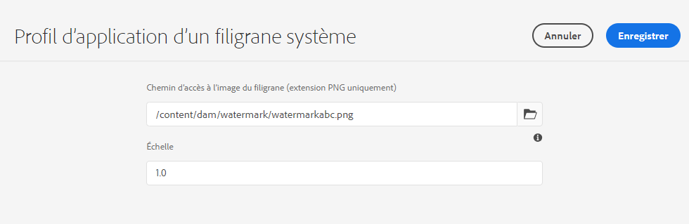

# Mise en filigrane de vos ressources {#watermark-assets}

| [Bonnes pratiques de recherche](/help/assets/search-best-practices.md) | [ Bonnes pratiques en matière de métadonnées](/help/assets/metadata-best-practices.md) | [Hub de contenus](/help/assets/product-overview.md) | [Dynamic Media avec fonctionnalités OpenAPI](/help/assets/dynamic-media-open-apis-overview.md) | [Documentation destinée aux développeurs AEM Assets](https://developer.adobe.com/experience-cloud/experience-manager-apis/) |
| ------------- | --------------------------- |---------|----|-----|

| Version | Lien de l’article |
| -------- | ---------------------------- |
| AEM 6.5 | [Cliquez ici](https://experienceleague.adobe.com/docs/experience-manager-65/assets/administer/watermarking.html?lang=fr) |
| AEM as a Cloud Service | Cet article |

[!DNL Adobe Experience Manager Assets] permet d’ajouter un filigrane numérique aux images et aux vidéos. [!DNL Assets] prend en charge l’application d’une image en tant que filigrane pour d’autres fichiers image. Les filigranes peuvent aider les utilisateurs à vérifier l’authenticité et le copyright des ressources. Un filigrane peut également être utilisé pour indiquer le statut d’un document, tel que confidentiel, brouillon, validité, etc.

Pour configurer [!DNL Experience Manager] de façon à appliquer un filigrane à des ressources :

1. Un fichier PNG est appliqué comme filigrane. Chargez ce fichier dans votre référentiel DAM.

1. Accédez à **[!UICONTROL Outils > Ressources > Configurations des ressources]**.

1. Cliquez sur **[!UICONTROL Profil d’application d’un filigrane système]**.

1. Dans la [!UICONTROL page Profil d’application d’un filigrane système], spécifiez le chemin d’accès à l’image chargé dans votre référentiel DAM à l’étape 1.

1. Spécifiez l’échelle du filigrane, comprise entre 0,0 et 1,0, par rapport à la largeur de rendu, dans le champ **[!UICONTROL Échelle]**.

1. Cliquez sur **[!UICONTROL Enregistrer]**.

   

   >[!NOTE]
   >
   >Si vous avez configuré le profil de filigrane système à l’aide du fichier de configuration `com.adobe.cq.assetcompute.impl.profile.WatermarkingProfileServiceImpl.cfg.json` (configuration OSGi), vous pouvez continuer à l’utiliser, mais Adobe recommande d’utiliser la nouvelle méthode.

1. [Créez un profil de traitement](/help/assets/asset-microservices-configure-and-use.md#create-custom-profile) pour utiliser les microservices de ressources afin d’appliquer le filigrane.

   

   Assurez-vous que vous activez le bouton (bascule) **[!UICONTROL Filigrane]** lors de la création du profil de traitement.

1. [Appliquez les profils de traitement à un dossier](/help/assets/asset-microservices-configure-and-use.md#use-profiles) pour créer des ressources en filigrane.

## Conseils et restrictions {#tips-limitations-bestpractices}

* Vous pouvez utiliser une configuration unique pour mettre toutes vos ressources en filigrane. Une seule image est utilisée pour la mise en filigrane et sa largeur est fixe.
* Vous pouvez placer le filigrane au centre sans mosaïque.
* Les filigranes à base de texte ne sont pas pris en charge.

**Voir également**

* [Traduire les ressources](translate-assets.md)
* [API HTTP Assets](mac-api-assets.md)
* [Formats de fichiers pris en charge par Assets](file-format-support.md)
* [Rechercher des ressources](search-assets.md)
* [Ressources connectées](use-assets-across-connected-assets-instances.md)
* [Rapports de ressources](asset-reports.md)
* [Schémas de métadonnées](metadata-schemas.md)
* [Télécharger des ressources](download-assets-from-aem.md)
* [Gestion des métadonnées](manage-metadata.md)
* [Facettes de recherche](search-facets.md)
* [Gérer les collections](manage-collections.md)
* [Import des métadonnées en bloc](metadata-import-export.md)
* [Publier des ressources sur AEM et Dynamic Media](/help/assets/publish-assets-to-aem-and-dm.md)

>[!MORELIKETHIS]
>
>* [Aperçu sur les microservices de ressources](/help/assets/asset-microservices-overview.md).
>* [Utilisation des microservices de ressources avec des profils de traitement](/help/assets/asset-microservices-configure-and-use.md).
