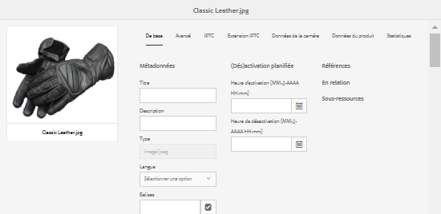
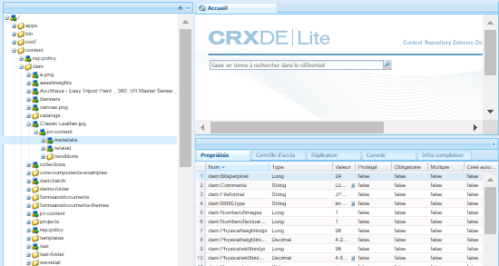
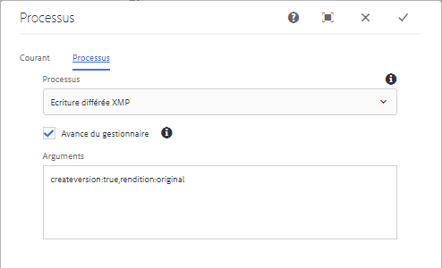

# Métadonnées XMP {#xmp-metadata}

XMP (« Extensible Metadata Platform », plate-forme de métadonnées extensible) est la norme de métadonnées utilisée par AEM Assets pour toute la gestion des métadonnées. XMP fournit un format standard pour la création, le traitement et l’échange de métadonnées pour toute une variété d’applications.

En plus d’un codage de métadonnées universel qui peut être incorporé dans tous les formats de fichier, XMP fournit un [modèle de contenu](#xmp-core-concepts) riche et est [pris en charge par Adobe](#advantages-of-xmp) et d’autres sociétés. Ainsi, les utilisateurs XMP, en association avec AEM Assets, disposent d’une plate-forme puissante sur laquelle s’appuyer.

## Présentation et écosystème XMP {#xmp-ecosystem}

AEM Assets prend en charge la norme des métadonnées XMP en mode natif. XMP est une norme destinée au traitement et au stockage de métadonnées normalisées et propriétaires dans les ressources numériques. La norme XMP est conçue pour être la norme commune permettant à plusieurs applications de fonctionner efficacement avec les métadonnées.

Les professionnels de la production, par exemple, utilisent la prise en charge du format XMP intégré au sein des applications d’Adobe pour communiquer les informations entre divers formats de fichier. Le référentiel AEM Assets extrait les métadonnées XMP et les utilise pour gérer le cycle de vie du contenu. Il offre également la possibilité de créer des workflows d’automatisation.

XMP normalise la façon dont les métadonnées sont définies, créées et traitées en fournissant un modèle de données, un modèle de stockage et des schémas. Tous ces concepts sont abordés dans cette section.

Toutes les métadonnées héritées d’EXIF, d’ID3 ou de Microsoft Office sont automatiquement converties au format XMP, qui peut être étendu pour prendre en charge le schéma de métadonnées spécifiques au client comme les catalogues de produits.

Dans la norme XMP, les métadonnées sont constituées d’un ensemble de propriétés. Ces propriétés sont toujours associées à une entité spécifique appelée ressource ; c’est-à-dire qu’elles portent sur celle-ci. Dans le cas de XMP, il s’agit toujours de la ressource (ou actif).

XMP définit un modèle de [métadonnées](https://fr.wikipedia.org/wiki/Métadonnée) exploitable avec n’importe quel ensemble défini d’éléments de métadonnées. XMP définit également des [schémas](https://en.wikipedia.org/wiki/XML_schema) spécifiques pour des propriétés de base utiles pour consigner l’historique d’une ressource lorsqu’elle passe par diverses étapes de traitement, de la photographie, en passant par la [numérisation](https://fr.wikipedia.org/wiki/Scanner_(informatique)) ou la création en tant que texte, à travers des étapes de retouche photo (comme le [recadrage](https://fr.wikipedia.org/wiki/Recadrage_(image)) ou l’ajustement de couleur), pour former une image finale. XMP permet à chaque programme ou appareil d’ajouter ses propres informations à une ressource numérique. Ces informations peuvent être ensuite conservées dans le fichier numérique final.

XMP est le plus souvent sérialisé et stocké à l’aide d’un sous-ensemble du [Resource Description Framework](https://fr.wikipedia.org/wiki/Resource_Description_Framework) (RDF) [W3C](https://fr.wikipedia.org/wiki/World_Wide_Web_Consortium), qui est à son tour exprimé en langage [XML](https://fr.wikipedia.org/wiki/Extensible_Markup_Language).

### Avantages du mode XMP   {#advantages-of-xmp}

La norme XMP présente les avantages suivants par rapport aux autres normes de codage et schémas :

* Les métadonnées basées sur la norme XMP sont très puissantes et précises.
* La norme XMP permet de définir plusieurs valeurs pour une propriété.
* XMP dispose d’un encodage normalisé, ce qui vous permet d’échanger facilement des métadonnées.
* Le format XMP est extensible. Vous pouvez ajouter d’autres informations à vos ressources.

La norme XMP a été conçue pour être extensible, ce qui vous permet d’ajouter des types de métadonnées personnalisés dans les données XMP. En revanche, ce n’est pas le cas d’EXIF qui présente une liste des propriétés qui ne peut pas être étendue.

>[!NOTE]
>
>En règle générale, XMP ne permet pas l’incorporation des types de données binaires. Pour gérer des données binaires dans XMP, comme des images miniatures, celles-ci doivent être codées dans un format XML tel que `Base64`.

### Notions fondamentales relatives à XMP {#xmp-core-concepts}

**Espaces de noms et schémas**

Un schéma XMP est un ensemble de noms de propriétés défini dans un espace de noms XML commun qui comprend
le type des données et des informations descriptives. Un schéma XMP est identifié par l’URI de l’espace de noms XML. L’utilisation des espaces de noms permet d’empêcher tout conflit entre les propriétés dans différents schémas qui portent le même nom, mais ont un sens différent.

Par exemple, la propriété **Créateur** de deux schémas conçus indépendamment peut signifier la personne ayant créé la ressource ou l’application l’ayant créée (Adobe Photoshop, par exemple).

**Propriétés et valeurs XMP**

XMP peut inclure des propriétés de l’un ou de plusieurs des schémas. Par exemple, un sous-ensemble classique utilisé par de nombreuses applications Adobe peut comprendre les éléments suivants :

* Schéma Dublin Core : `dc:title`, `dc:creator`, `dc:subject`, `dc:format`, `dc:rights`
* Schéma de base XMP : `xmp:CreateDate`, `xmp:CreatorTool`, `xmp:ModifyDate`, `xmp:metadataDate`
* Schéma de gestion des droits XMP : `xmpRights:WebStatement`, `xmpRights:Marked`
* Schéma de gestion des médias XMP : `xmpMM:DocumentID`

**Variantes linguistiques**

XMP vous offre la possibilité d’ajouter une propriété `xml:lang` aux propriétés de texte pour spécifier la langue du texte.

## Écriture différée XMP sur les rendus {#xmp-writeback-to-renditions}

La fonction Écriture différée XMP d’Adobe Experience Manager (AEM) Assets réplique les modifications des métadonnées de la ressource sur les rendus de la ressource.

Lorsque vous modifiez les métadonnées d’une ressource à partir d’AEM Assets ou lors du chargement de la ressource, les modifications sont initialement stockées au sein du nœud de ressource dans CRXDE.

La fonction Écriture différée XMP propage les modifications apportées aux métadonnées à l’ensemble des rendus de la ressource ou uniquement à certains d’entre eux.

Supposons que vous remplaciez la propriété [!UICONTROL Titre] d’une ressource intitulée `Classic Leather` par `Nylon`.

Dans ce cas, AEM Assets enregistre les modifications apportées à la propriété **[!UICONTROL Titre]** dans le paramètre `dc:title` des métadonnées stockées dans la hiérarchie de la ressource.

Toutefois, AEM Assets ne propage pas automatiquement les modifications apportées aux métadonnées aux rendus d’une ressource.

La fonction Écriture différée XMP permet de propager les modifications de métadonnées à l’ensemble des rendus de la ressource ou uniquement à certains d’entre eux. Toutefois, les modifications ne sont pas stockées sous le nœud de métadonnées dans la hiérarchie de la ressource. Au lieu de cela, cette fonction incorpore les modifications dans les fichiers binaires pour les rendus.

### Activation de l’écriture différée XMP {#enable-xmp-writeback}

<!-- asgupta, Engg: Need attention here to update the configuration manager changes.
-->

Pour activer la propagation des modifications apportées aux métadonnées aux rendus de la ressource lors de leur chargement, modifiez la configuration **[!UICONTROL Créateur de rendus de gestion des actifs numériques Adobe CQ]** dans Configuration Manager.

1. Pour ouvrir Configuration Manager, accédez à `https://[aem_server]:[port]/system/console/configMgr`.
1. Ouvrez la configuration **[!UICONTROL Créateur de rendus de gestion des actifs numériques Adobe CQ]**.
1. Sélectionnez l’option **[!UICONTROL Propager XMP]**, puis enregistrez les modifications.

### Activation de l’écriture différée XMP pour des rendus spécifiques {#enable-xmp-writeback-for-specific-renditions}

Pour laisser la fonction Écriture différée XMP propager les modifications de métadonnées à des rendus spécifiques, spécifiez ces rendus à l’étape [!UICONTROL Écriture différée XMP] du workflow Écriture différée des métadonnées de gestion des actifs numériques. Par défaut, cette étape est configurée avec le rendu d’origine.

Pour que la fonction Écriture différée XMP propage les métadonnées aux miniatures de rendu 140.100.png et 319.319.png, procédez comme suit :

1. Appuyez/cliquez sur le logo AEM, puis accédez à **[!UICONTROL Outils]** > **[!UICONTROL Workflow]** > **[!UICONTROL Modèles]**.
1. Sur la page Modèles, ouvrez le modèle de workflow **[!UICONTROL Écriture différée des métadonnées de gestion des actifs numériques]**.
1. Sur la page de propriétés **[!UICONTROL Écriture différée des métadonnées de gestion des actifs numériques]**, ouvrez l’étape **[!UICONTROL Processus d’écriture différée XMP]**.
1. Dans la boîte de dialogue **[!UICONTROL Propriétés des étapes]**, appuyez/cliquez sur l’onglet **[!UICONTROL Processus]**.
1. Dans la zone **[!UICONTROL Arguments]**, ajoutez `rendition:cq5dam.thumbnail.140.100.png,rendition:cq5dam.thumbnail.319.319.png`, puis appuyez/cliquez sur **[!UICONTROL OK]**.

   

1. Enregistrez les modifications.
1. Afin de régénérer les rendus Pyramid TIFF pour les images Dynamic Media avec les nouveaux attributs, ajoutez l’étape **[!UICONTROL Ressources d’image-processus de média dynamique]** au workflow Écriture différée des métadonnées de gestion des actifs numériques. Les rendus PTIFF sont uniquement créés et stockés localement, dans une implémentation Dynamic Media hybride.

1. Enregistrez le workflow.

Les modifications apportées aux métadonnées sont propagées aux rendus thumbnail.140.100.png et thumbnail.319.319.png de la ressource uniquement.

<!--
>[!NOTE]
>
>For XMP writeback issues in 64 bit Linux, see [How to enable XMP write-back on 64-bit RedHat Linux](https://helpx.adobe.com/experience-manager/kb/enable-xmp-write-back-64-bit-redhat.html).
>
>For more information about supported platforms, see [XMP metadata write-back prerequisites](/help/sites-deploying/technical-requirements.md#requirements-for-aem-assets-xmp-metadata-write-back).
-->

### Filtrage des métadonnées XMP {#filtering-xmp-metadata}

AEM Assets prend en charge le filtrage par liste noire et par liste blanche de propriétés/nœuds pour les métadonnées XMP qui sont lues à partir de binaires de ressources et stockées dans JCR quand les ressources sont assimilées.

Le filtrage par liste noire vous permet d’importer toutes les propriétés des métadonnées XMP, à l’exception des propriétés spécifiées pour l’exclusion. Cependant, pour les types de ressources tels que les fichiers INDD comportant un très grand nombre de métadonnées XMP (par exemple 1 000 nœuds avec 10 000 propriétés), les noms des nœuds à filtrer ne sont pas toujours connus à l’avance. Si le filtrage par liste noire permet l’importation d’un grand nombre de ressources avec de nombreuses métadonnées XMP, l’instance/cluster AEM peut rencontrer des problèmes de stabilité, par exemple des files d’attente d’observation bloquées.

Le filtrage par liste blanche des métadonnées XMP résout le problème en vous permettant de définir les propriétés XMP à importer. De cette façon, les autres propriétés XMP ou les propriétés XMP inconnues sont ignorées. Vous pouvez ajouter certaines de ces propriétés au filtre par liste noire à des fins de compatibilité descendante.

>[!NOTE]
>
>Le filtrage fonctionne uniquement pour les propriétés dérivées des sources XMP dans les binaires des ressources. Pour les propriétés dérivées de sources autres que XMP, comme les formats EXIF et IPTC, le filtrage ne fonctionne pas. Par exemple, la date de création de la ressource est stockée dans la propriété appelée `CreateDate` dans EXIF TIFF. AEM stocke cette valeur dans le champ de métadonnées appelé `exif:DateTimeOriginal`. Comme la source est autre que XMP, le filtrage ne fonctionne pas sur cette propriété.

1. Pour ouvrir Configuration Manager, accédez à `https://[aem_server]:[port]/system/console/configMgr`.
1. Ouvrez la configuration **[!UICONTROL Filtre XMP de gestion des actifs numériques Adobe CQ]**.
1. Pour appliquer un filtrage par liste blanche, sélectionnez **[!UICONTROL Appliquer la liste blanche aux propriétés XMP]**, puis spécifiez les propriétés à importer dans la zone **[!UICONTROL Noms XML sur liste blanche pour le filtrage XMP]**.

1. Pour filtrer les propriétés XMP sur liste noire après avoir appliqué le filtrage par liste blanche, spécifiez-les dans la zone **[!UICONTROL Noms XML sur liste noire pour le filtrage XMP]**.

   >[!NOTE]
   >
   >L’option **[!UICONTROL Appliquer la liste noire aux propriétés XMP]** est sélectionnée par défaut. Autrement dit, le filtrage par liste noire est activé par défaut. Pour désactiver le filtrage par liste noire, désélectionnez l’option **[!UICONTROL Appliquer la liste noire aux propriétés XMP]**.

1. Enregistrez les modifications.

>[!MORELIKETHIS]
>
>* [Spécification XMP par Adobe](https://www.adobe.com/devnet/xmp.html)