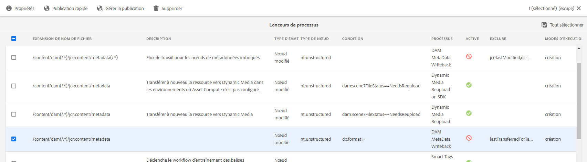

# Métadonnées XMP {#xmp-metadata}

<table>
    <tr>
        <td>
            <i>Nouveau</i> <a href="/help/assets/dynamic-media/dm-prime-ultimate.md"><b>Dynamic Media Prime et Ultimate</b></a>
        </td>
        <td>
            <i>Nouveau</i> <a href="/help/assets/assets-ultimate-overview.md"><b>AEM Assets Ultimate</b></a>
        </td>
        <td>
            <i>Nouvelle</i> <a href="/help/assets/integrate-aem-assets-edge-delivery-services.md"><b>Intégration d’AEM Assets à Edge Delivery Services</b></a>
        </td>
        <td>
            <i>Nouveau</i> <a href="/help/assets/aem-assets-view-ui-extensibility.md"><b>Extensibilité de l’interface utilisateur</b></a>
        </td>
          <td>
            <i>Nouveau</i> <a href="/help/assets/dynamic-media/enable-dynamic-media-prime-and-ultimate.md"><b>Activation de Dynamic Media Prime et Ultimate</b></a>
        </td>
    </tr>
    <tr>
        <td>
            <a href="/help/assets/search-best-practices.md"><b>Bonnes pratiques de recherche</b></a>
        </td>
        <td>
            <a href="/help/assets/metadata-best-practices.md"><b>Bonnes pratiques relatives aux métadonnées</b></a>
        </td>
        <td>
            <a href="/help/assets/product-overview.md"><b>Hub de contenus</b></a>
        </td>
        <td>
            <a href="/help/assets/dynamic-media-open-apis-overview.md"><b>Fonctionnalités Dynamic Media avec OpenAPI</b></a>
        </td>
        <td>
            <a href="https://developer.adobe.com/experience-cloud/experience-manager-apis/"><b>Documentation de développement pour AEM Assets</b></a>
        </td>
    </tr>
</table>

| Version | Lien de l’article |
| -------- | ---------------------------- |
| AEM 6.5 | [Cliquez ici](https://experienceleague.adobe.com/docs/experience-manager-65/assets/administer/xmp-writeback.html?lang=fr) |
| AEM as a Cloud Service | Cet article |

XMP (Extensible Metadata Platform) est la norme de métadonnées utilisée par Experience Manager Assets pour la gestion des métadonnées. XMP offre un format standard pour la création, le traitement et l’échange de métadonnées pour une multitude d’applications.

En plus d’un codage de métadonnées universel qui peut être incorporé dans tous les formats de fichier, XMP fournit un [modèle de contenu](#xmp-core-concepts) riche et est [pris en charge par Adobe](#advantages-of-xmp) et d’autres sociétés. Ainsi, les utilisateurs XMP, en association avec, disposent d’une plateforme puissante sur laquelle s’appuyer.[!DNL Assets]

## Présentation et écosystème XMP {#xmp-ecosystem}

[!DNL Assets] prend en charge la norme des métadonnées XMP en mode natif. XMP est une norme destinée au traitement et au stockage de métadonnées normalisées et propriétaires dans les ressources numériques. La norme XMP est conçue pour être la norme commune permettant à plusieurs applications de fonctionner efficacement avec les métadonnées.

Les spécialistes de la production, par exemple, utilisent la prise en charge XMP intégrée dans les applications d’Adobe pour transmettre des informations sur plusieurs formats de fichiers. Le référentiel [!DNL Assets] extrait les métadonnées XMP et les utilise pour gérer le cycle de vie du contenu et offre la possibilité de créer des workflows d’automatisation.

XMP normalise la façon dont les métadonnées sont définies, créées et traitées en fournissant un modèle de données, un modèle de stockage et des schémas. Tous ces concepts sont abordés dans cette section.

Toutes les métadonnées héritées d’EXIF, d’ID3 ou de Microsoft Office sont automatiquement converties au format XMP, qui peut être étendu pour prendre en charge le schéma de métadonnées spécifiques au client comme les catalogues de produits.

Dans la norme XMP, les métadonnées sont constituées d’un ensemble de propriétés. Ces propriétés sont toujours associées à une entité particulière appelée ressource ; c’est-à-dire qu’elles portent sur celle-ci. Dans le cas de XMP, il s’agit toujours de la ressource.

XMP définit un modèle de [métadonnées](https://fr.wikipedia.org/wiki/Métadonnée) qui peut être utilisé avec n’importe quel ensemble défini d’éléments de métadonnées. XMP définit également des [schémas](https://en.wikipedia.org/wiki/XML_schema) particuliers pour les propriétés de base utiles pour enregistrer l’historique d’une ressource lorsqu’elle passe par plusieurs étapes de traitement, depuis la photographie, la [numérisation](https://fr.wikipedia.org/wiki/Scanner_(informatique)) ou la création au format texte, en passant par les étapes de retouche photo ([recadrage](https://fr.wikipedia.org/wiki/Recadrage_(image)) ou réglage des couleurs, par exemple), pour l’assembler dans une image finale. XMP permet à chaque programme logiciel ou appareil d’ajouter en cours de route ses propres informations à une ressource numérique, qui peut ensuite être conservée dans le fichier numérique final.

XMP est le plus souvent sérialisé et stocké à l’aide d’un sous-ensemble du [W3C](https://fr.wikipedia.org/wiki/World_Wide_Web_Consortium) [Resource Description Framework](https://fr.wikipedia.org/wiki/Resource_Description_Framework) (RDF), exprimé à son tour en format [XML](https://fr.wikipedia.org/wiki/Extensible_Markup_Language).

### Avantages de la norme XMP {#advantages-of-xmp}

La norme XMP présente les avantages suivants par rapport aux autres normes de codage et schémas :

* Les métadonnées basées sur la norme XMP sont très puissantes et précises.
* La norme XMP permet de définir plusieurs valeurs pour une propriété.
* XMP dispose d’un encodage normalisé, ce qui vous permet d’échanger facilement des métadonnées.
* Le format XMP est extensible. Vous pouvez ajouter d’autres informations à vos ressources.

La norme XMP a été conçue pour être extensible, ce qui vous permet d’ajouter des types de métadonnées personnalisés dans les données XMP. En revanche, ce n’est pas le cas d’EXIF qui présente une liste des propriétés qui ne peut pas être étendue.

>[!NOTE]
>
>XMP ne permet généralement pas l’incorporation des types de données binaires. Pour transporter des données binaires dans XMP, par exemple des images miniatures, elles doivent être codées dans un format compatible avec XML tel que `Base64`.

### Notions fondamentales relatives à XMP {#xmp-core-concepts}

**Espaces de noms et schémas**

Un schéma XMP est un ensemble de noms de propriétés défini dans un espace de noms XML commun qui comprend
le type des données et des informations descriptives. Un schéma XMP est identifié par l’URI de l’espace de noms XML. L’utilisation des espaces de noms permet d’empêcher tout conflit entre les propriétés dans différents schémas qui portent le même nom, mais ont un sens différent.

Par exemple, la propriété **Créateur** de deux schémas conçus indépendamment peut signifier la personne ayant créé la ressource ou l’application l’ayant créée (Adobe Photoshop, par exemple).

**Propriétés et valeurs XMP**

XMP peut inclure des propriétés de l’un ou de plusieurs des schémas. Par exemple, un sous-ensemble classique utilisé par de nombreuses applications Adobe peut comprendre les éléments suivants :

* Schéma Dublin Core : `dc:title`, `dc:creator`, `dc:subject`, `dc:format`, `dc:rights`
* Schéma de base XMP : `xmp:CreateDate`, `xmp:CreatorTool`, `xmp:ModifyDate`, `xmp:metadataDate`
* Schéma de gestion des droits XMP : `xmpRights:WebStatement`, `xmpRights:Marked`
* Schéma de gestion des médias XMP : `xmpMM:DocumentID`

**Variantes linguistiques**

XMP vous offre la possibilité d’ajouter une propriété `xml:lang` aux propriétés de texte pour spécifier la langue du texte.

## Écriture différée XMP sur les rendus {#xmp-writeback-to-renditions}

Cette fonction d’écriture différée XMP dans [!DNL Adobe Experience Manager Assets] reproduit les modifications de métadonnées apportées aux rendus de la ressource d’origine.
Lorsque vous modifiez les métadonnées d’une ressource à partir d’[!DNL Assets] ou lors du chargement de la ressource, les modifications sont initialement stockées dans le nœud des métadonnées de la hiérarchie des ressources. La fonction Écriture différée permet de propager les modifications de métadonnées à l’ensemble des rendus de la ressource ou uniquement à certains d’entre eux. La fonction réécrit uniquement les propriétés de métadonnées qui utilisent l’espace de noms `jcr`, c’est-à-dire qu’une propriété nommée `dc:title` est réécrite, mais qu’une propriété nommée `mytitle` ne l’est pas.

Par exemple, supposons que vous remplaciez la propriété [!UICONTROL Titre] d’une ressource intitulée `Classic Leather` par `Nylon`.

Dans ce cas, [!DNL Assets] enregistre les modifications apportées à la propriété **[!UICONTROL Titre]** dans le paramètre `dc:title` des métadonnées stockées dans la hiérarchie de la ressource.

>[!IMPORTANT]
>
>La fonction d’écriture différée n’est pas activée par défaut dans [!DNL Assets]. Voir à ce propos la section [activer l’écriture différée des métadonnées](#enable-xmp-writeback). MSM pour les ressources numériques ne fonctionne pas avec l’écriture différée des métadonnées activée. Lors de l’écriture différée, l’héritage est interrompu.

### Activer l’écriture différée XMP {#enable-xmp-writeback}

Le workflow d’[!UICONTROL écriture différée des métadonnées DAM] permet d’effectuer l’écriture différée des métadonnées d’une ressource. Pour activer l’écriture différée, procédez selon l’une des trois méthodes suivantes :

* Utilisez des lanceurs.
* Démarrez manuellement le workflow `DAM MetaData Writeback`.
* Configurez le workflow pour qu’il fasse partie du post-traitement.

Pour utiliser les lanceurs, procédez comme suit :

1. En tant qu’administrateur, accédez à **[!UICONTROL Outils]** > **[!UICONTROL Workflow]** > **[!UICONTROL Lanceurs]**.
1. Sélectionnez le [!UICONTROL lanceur] pour lequel la colonne **[!UICONTROL Workflow]** affiche **[!UICONTROL Écriture différée des métadonnées de gestion des actifs numériques (DAM)]**. Cliquez sur **[!UICONTROL Propriétés]** dans la barre d’outils.

   

1. Sélectionnez **[!UICONTROL Activer]** dans la page **[!UICONTROL Propriétés du lanceur]**. Cliquez sur **[!UICONTROL Enregistrer et fermer]**.

Pour appliquer manuellement une seule fois ce workflow à une ressource, appliquez le workflow [!UICONTROL Écriture différée des métadonnées de gestion des actifs numériques (DAM)] à l’aide du rail de gauche.

Pour appliquer le workflow à toutes les ressources téléchargées, ajoutez le workflow à un profil de post-traitement.

<!-- Commenting for now. Need to document how to enable metadata writeback. See CQDOC-17254.

### Enable XMP writeback {#enable-xmp-writeback}

To enable the metadata changes to be propagated to the renditions of the asset when uploading it, modify the **[!UICONTROL Adobe CQ DAM Rendition Maker]** configuration in Configuration Manager.

1. To open Configuration Manager, access `https://[aem_server]:[port]/system/console/configMgr`.
1. Open the **[!UICONTROL Adobe CQ DAM Rendition Maker]** configuration.
1. Select the **[!UICONTROL Propagate XMP]** option, and then save the changes.

### Enable XMP write-back for specific renditions {#enable-xmp-writeback-for-specific-renditions}

To let the XMP write-back feature propagate metadata changes to select renditions, specify these renditions to the [!UICONTROL XMP Writeback Process] workflow step of DAM Metadata WriteBack workflow. By default, this step is configured with the original rendition.

For the XMP write-back feature to propagate metadata to the rendition thumbnails 140.100.png and 319.319.png, perform these steps.

1. Select the Experience Manager logo, and then navigate to **[!UICONTROL Tools]** &gt; **[!UICONTROL Workflow]** &gt; **[!UICONTROL Models]**.
1. From the Models page, open the **[!UICONTROL DAM Metadata Writeback]** workflow model.
1. In the **[!UICONTROL DAM Metadata Writeback]** properties page, open the **[!UICONTROL XMP Writeback Process]** step.
1. In the **[!UICONTROL Step Properties]** dialog box, select the **[!UICONTROL Process]** tab.
1. In the **[!UICONTROL Arguments]** box, add `rendition:cq5dam.thumbnail.140.100.png,rendition:cq5dam.thumbnail.319.319.png`, and then select **[!UICONTROL OK]**.

   

1. Save the changes.
1. To regenerate the Pyramid TIFF (PTIFF) renditions for Dynamic Media images with the new attributes, add the **[!UICONTROL Dynamic Media Process Image Assets]** step to the DAM Metadata write-back workflow. PTIFF renditions are only created and stored locally in a Dynamic Media Hybrid implementation.

1. Save the workflow.

The metadata changes are propagated to the renditions renditions thumbnail.140.100.png and thumbnail.319.319.png of the asset, and not the others.
-->

**Voir également**

* [Traduire les ressources](translate-assets.md)
* [API HTTP Assets](mac-api-assets.md)
* [Formats de fichiers pris en charge par Assets](file-format-support.md)
* [Rechercher des ressources](search-assets.md)
* [Ressources connectées](use-assets-across-connected-assets-instances.md)
* [Rapports de ressources](asset-reports.md)
* [Schémas de métadonnées](metadata-schemas.md)
* [Télécharger des ressources](download-assets-from-aem.md)
* [Gestion des métadonnées](manage-metadata.md)
* [Facettes de recherche](search-facets.md)
* [Gérer les collections](manage-collections.md)
* [Import des métadonnées en bloc](metadata-import-export.md)
* [Publier des ressources sur AEM et Dynamic Media](/help/assets/publish-assets-to-aem-and-dm.md)
