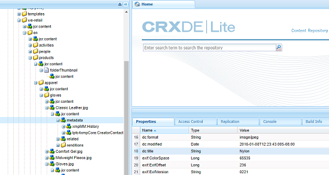

# XMP metadata {#xmp-metadata}

XMP (« Extensible Metadata Platform », plate-forme de métadonnées extensible) est la norme de métadonnées utilisée par AEM Assets pour toute la gestion des métadonnées. XMP fournit un format standard pour la création, le traitement et l’échange de métadonnées pour toute une variété d’applications.

Aside from offering universal metadata encoding that can be embedded into all file formats, XMP provides a rich [content model](#xmp-core-concepts) and is [supported by Adobe](#advantages-of-xmp) and other companies, so that users of XMP in combination with AEM Assets have a powerful platform to build upon.

## Présentation et écosystème XMP {#xmp-ecosystem}

AEM Assets prend en charge de manière native la norme de métadonnées XMP. XMP est une norme de traitement et de stockage des métadonnées propriétaires et normalisées dans les ressources numériques. XMP est conçu pour être la norme commune qui permet à plusieurs applications de fonctionner efficacement avec les métadonnées.

Les professionnels de la production, par exemple, utilisent la prise en charge du format XMP intégré au sein des applications d’Adobe pour communiquer les informations entre divers formats de fichier. Le référentiel AEM Assets extrait les métadonnées XMP et les utilise pour gérer le cycle de vie du contenu. Il offre également la possibilité de créer des processus d’automatisation.

XMP normalise la façon dont les métadonnées sont définies, créées et traitées en fournissant un modèle de données, un modèle de stockage et des schémas. Tous ces concepts sont abordés dans cette section.

Toutes les métadonnées héritées de EXIF, ID3 ou Microsoft Office sont automatiquement converties au format XMP, qui peut être étendu pour prendre en charge le schéma de métadonnées spécifiques au client comme les catalogues de produits.

Les métadonnées dans XMP sont composées d’un ensemble de propriétés. Ces propriétés sont toujours associées à une entité spécifique appelée ressource ; c&#39;est-à-dire que les propriétés sont &quot;à propos&quot; de la ressource. Dans le cas de XMP, la ressource est toujours la ressource.

XMP définit un modèle de [métadonnées](https://en.wikipedia.org/wiki/Metadata) exploitable avec n’importe quel ensemble défini d’éléments de métadonnées. XMP définit également des [schémas](https://en.wikipedia.org/wiki/XML_schema) spécifiques pour des propriétés de base utiles pour consigner l’historique d’une ressource lorsqu’elle passe par diverses étapes de traitement, de la photographie, en passant par la [numérisation](https://en.wikipedia.org/wiki/Image_scanner) ou la création en tant que texte, à travers des étapes de retouche photo (comme le [cadrage](https://en.wikipedia.org/wiki/Cropping_%28image%29) ou l’ajustement de couleur), pour former une image finale. XMP permet à chaque programme ou appareil d’ajouter ses propres informations à une ressource numérique. Ces informations peuvent être ensuite conservées dans le fichier numérique final.

XMP est le plus souvent sérialisé et stocké à l’aide d’un sous-ensemble du [Resource Description Framework](https://en.wikipedia.org/wiki/Resource_Description_Framework) (RDF) [W3C](https://en.wikipedia.org/wiki/World_Wide_Web_Consortium), qui est à son tour exprimé en langage [XML](https://en.wikipedia.org/wiki/XML).

### Avantages du mode XMP {#advantages-of-xmp}

La norme XMP présente les avantages suivants par rapport aux autres normes de codage et schémas :

* Les métadonnées basées sur la norme XMP sont très puissantes et précises.
* La norme XMP permet de posséder plusieurs valeurs pour une propriété.
* XMP possède un encodage normalisé, ce qui vous permet d’échanger facilement des métadonnées.
* XMP est extensible. Vous pouvez ajouter des informations supplémentaires à vos ressources.

La norme XMP a été conçue pour être extensible, ce qui vous permet d’ajouter des types de métadonnées personnalisés dans les données XMP. En revanche, ce n’est pas le cas d’EXIF qui présente une liste des propriétés qui ne peut pas être étendue.

>[!NOTE]
>
>En règle générale, XMP ne permet pas l’incorporation des types de données binaires. Pour gérer des données binaires dans XMP, comme des images miniatures, celles-ci doivent être codées dans un format XML tel que `Base64`.

### XMP core concepts {#xmp-core-concepts}

**Espaces de noms et schémas**

Un schéma XMP est un ensemble de noms de propriétés défini dans un espace de noms XML commun qui comprend le type des données et des informations descriptives. Un schéma XMP est identifié par l’URI de l’espace de noms XML. L’utilisation des espaces de noms permet d’empêcher tout conflit entre les propriétés dans différents schémas qui portent le même nom, mais ont un sens différent.

Par exemple, la propriété **Créateur** de deux schémas conçus indépendamment peut signifier la personne ayant créé la ressource ou l’application l’ayant créée (Adobe Photoshop, par exemple).

**Propriétés et valeurs XMP**

XMP peut inclure des propriétés de l’un ou de plusieurs des schémas. Par exemple, un sous-ensemble classique utilisé par de nombreuses applications Adobe peut comprendre les éléments suivants :

* Schéma Dublin Core : `dc:title`, `dc:creator`, `dc:subject`, `dc:format`, `dc:rights`
* Schéma de base XMP : `xmp:CreateDate`, `xmp:CreatorTool`, `xmp:ModifyDate`, `xmp:metadataDate`
* Schéma de gestion des droits XMP : `xmpRights:WebStatement`, `xmpRights:Marked`
* XMP media management schema: `xmpMM:DocumentID`

**Alternatives linguistiques**

XMP vous offre la possibilité d’ajouter une propriété `xml:lang` aux propriétés de texte pour spécifier la langue du texte.

## Écriture différée XMP sur les rendus {#xmp-writeback-to-renditions}

Cette fonction d’écriture différée XMP dans les ressources d’Adobe Experience Manager (AEM) permet de répliquer les modifications apportées aux métadonnées des fichiers dans les rendus de la ressource.

Lorsque vous modifiez les métadonnées d’un fichier dans AEM Assets ou lors du transfert du fichier, les modifications sont initialement stockées dans le noeud de ressource dans CRXDE.

La fonction d’écriture différée XMP propage les modifications de métadonnées à tous les rendus ou à des rendus spécifiques du fichier.

Consider a scenario where you modify the [!UICONTROL Title] property of the asset titled `Classic Leather` to `Nylon`.

Dans ce cas, AEM Assets enregistre les modifications apportées à la propriété **[!UICONTROL Titre]** dans le paramètre `dc:title` des métadonnées stockées dans la hiérarchie de la ressource.

Toutefois, AEM Assets ne propage pas automatiquement les modifications apportées aux métadonnées aux rendus d’une ressource.

La fonction d’écriture différée XMP vous permet de propager les modifications de métadonnées à tous les rendus ou à des rendus spécifiques du fichier. Toutefois, les modifications ne sont pas stockées sous le nœud de métadonnées dans la hiérarchie de la ressource. Au lieu de cela, cette fonction incorpore les modifications dans les fichiers binaires pour les rendus.

### Activation de l’écriture différée XMP {#enable-xmp-writeback}

<!-- asgupta, Engg: Need attention here to update the configuration manager changes.
-->

Pour activer la propagation des modifications apportées aux métadonnées aux rendus de la ressource lors de leur chargement, modifiez la configuration **[!UICONTROL Créateur de rendus de gestion des actifs numériques Adobe CQ]** dans le gestionnaire de configuration.

1. Pour ouvrir Configuration Manager, accédez à `https://[aem_server]:[port]/system/console/configMgr`.
1. Open the **[!UICONTROL Adobe CQ DAM Rendition Maker]** configuration.
1. Sélectionnez l’option **[!UICONTROL Propager XMP]**, puis enregistrez les modifications.

### Activation de l’écriture différée XMP pour des rendus spécifiques {#enable-xmp-writeback-for-specific-renditions}

To let the XMP write-back feature propagate metadata changes to select renditions, specify these renditions to the [!UICONTROL XMP Writeback Process] workflow step of DAM Metadata WriteBack workflow. Par défaut, cette étape est configurée avec le rendu d’origine.

Pour que la fonction d’écriture différée XMP propage les métadonnées aux vignettes de rendu 140.100.png et 319.319.png, procédez comme suit.

1. Tap/click the AEM logo, and then navigate to **[!UICONTROL Tools]** > **[!UICONTROL Workflow]** > **[!UICONTROL Models]**.
1. From the Models page, open the **[!UICONTROL DAM Metadata Writeback]** workflow model.
1. In the **[!UICONTROL DAM Metadata Writeback]** properties page, open the **[!UICONTROL XMP Writeback Process]** step.
1. In the **[!UICONTROL Step Properties]** dialog box, tap/click the **[!UICONTROL Process]** tab.
1. Dans la zone **[!UICONTROL Arguments]** , ajoutez `rendition:cq5dam.thumbnail.140.100.png,rendition:cq5dam.thumbnail.319.319.png`, puis appuyez/cliquez sur **[!UICONTROL OK]**.

   

1. Enregistrez les modifications.
1. To regenerate the Pyramid TIFF (PTIFF) renditions for Dynamic Media images with the new attributes, add the **[!UICONTROL Dynamic Media Process Image Assets]** step to the DAM Metadata write-back workflow. Les rendus PTIFF sont uniquement créés et stockés localement, dans une implémentation Dynamic Media hybride.

1. Enregistrez le workflow.

Les modifications de métadonnées sont propagées aux rendus thumbnail.140.100.png et thumbnail.319.319.png de la ressource, et non aux autres.

<!--
>[!NOTE]
>
>For XMP writeback issues in 64 bit Linux, see [How to enable XMP write-back on 64-bit RedHat Linux](https://helpx.adobe.com/experience-manager/kb/enable-xmp-write-back-64-bit-redhat.html).
>
>For more information about supported platforms, see [XMP metadata write-back prerequisites](/help/sites-deploying/technical-requirements.md#requirements-for-aem-assets-xmp-metadata-write-back).
-->

### Filtrage des métadonnées XMP {#filtering-xmp-metadata}

AEM Assets prend en charge le filtrage des propriétés/noeuds des listes noires et blanches pour les métadonnées XMP lues à partir des fichiers binaires et stockées dans le JCR lorsque des fichiers sont assimilés.

Le filtrage par liste noire vous permet d’importer toutes les propriétés des métadonnées XMP, à l’exception des propriétés spécifiées pour l’exclusion. Cependant, pour les types de ressources tels que les fichiers INDD comportant un très grand nombre de métadonnées XMP (par exemple 1 000 nœuds avec 10 000 propriétés), les noms des nœuds à filtrer ne sont pas toujours connus à l’avance. Si le filtrage par liste noire permet l’importation d’un grand nombre de ressources avec de nombreuses métadonnées XMP, l’instance/cluster AEM peut rencontrer des problèmes de stabilité, par exemple des files d’attente d’observation bloquées.

Le filtrage par liste blanche des métadonnées XMP résout le problème en vous permettant de définir les propriétés XMP à importer. De cette façon, les autres propriétés XMP ou les propriétés XMP inconnues sont ignorées. Vous pouvez ajouter certaines de ces propriétés au filtre par liste noire à des fins de compatibilité descendante.

>[!NOTE]
>
>Le filtrage fonctionne uniquement pour les propriétés dérivées des sources XMP dans les binaires des ressources. Pour les propriétés dérivées de sources autres que XMP, comme les formats EXIF et IPTC, le filtrage ne fonctionne pas. Par exemple, la date de création de la ressource est stockée dans la propriété appelée `CreateDate` dans EXIF TIFF. AEM stocke cette valeur dans le champ de métadonnées appelé `exif:DateTimeOriginal`. Comme la source est autre que XMP, le filtrage ne fonctionne pas sur cette propriété.

1. Pour ouvrir Configuration Manager, accédez à `https://[aem_server]:[port]/system/console/configMgr`.
1. Open the **[!UICONTROL Adobe CQ DAM XmpFilter]** configuration.
1. To apply whitelist filtering, select **[!UICONTROL Apply Whitelist to XMP Properties]**, and specify the properties to be imported in the **[!UICONTROL Whitelisted XML Names for XMP filtering]** box.

1. To filter out blacklisted XMP properties after applying whitelist filtering, specify them in the **[!UICONTROL Blacklisted XML Names for XMP filtering]** box.

   >[!NOTE]
   >
   >L’option **[!UICONTROL Appliquer la liste noire aux propriétés XMP]** est sélectionnée par défaut. Autrement dit, le filtrage par liste noire est activé par défaut. To disable blacklist filtering, unselect the **[!UICONTROL Apply Blacklist to XMP Properties]** option.

1. Enregistrez les modifications.

>[!MORELIKETHIS]
>
>* [Spécification XMP par Adobe](https://www.adobe.com/devnet/xmp.html)