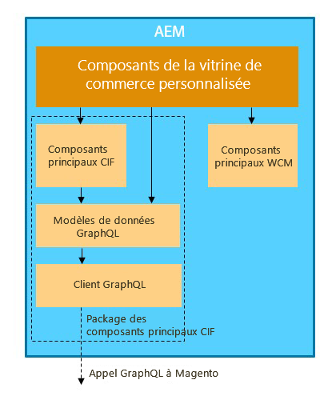

# AEM and Magento Integration using Commerce Integration Framework {#aem-magento-framework}

aem et Magento sont intégrés de manière transparente à l&#39;aide du cadre d&#39;intégration commerciale (CIF). CIF permet à AEM d’accéder à une instance de Magento et de communiquer avec le Magento via GraphQL. Il permet également aux auteurs AEM d’utiliser les sélecteurs de produits et de Catégories et la console de produits pour parcourir les données de produit et de catégorie récupérées à la demande du Magento. En outre, le FIC offre une vitrine prête à l&#39;emploi qui peut accélérer les projets commerciaux.

## Présentation de l&#39;architecture {#overview}

L&#39;architecture générale est la suivante :

CIF s’appuie sur la prise en charge de GraphQL. Le principal canal de communication entre l’AEM et le Magento est l’API  MagentoGraphQL. Il existe différentes manières de configurer la communication entre AEM en tant que Cloud Service et Magento. Pour plus d’informations, reportez-vous à la page [Prise en main](../getting-started.md) de la page.

CIF prend en charge les schémas de communication côté serveur et côté client.
Les appels d’API côté serveur sont implémentés à l’aide du client  GraphQL générique intégré, en combinaison avec un [ensemble de modèles](https://github.com/adobe/commerce-cif-magento-graphql) de données générés pour le schéma GraphQL Magento. De plus, toute requête ou mutation GraphQL au format GQL peut être utilisée.

Pour les composants côté client, qui sont créés à l&#39;aide de [React](https://reactjs.org/), le client  Apollo est utilisé.

## aem CIF Core Component Architecture {#cif-core-components}

[aem Composants](https://github.com/adobe/aem-core-cif-components) de base du FIC suivent des modèles de conception et des pratiques exemplaires très similaires à ceux des Composants [de base de la](https://github.com/adobe/aem-core-wcm-components)WCM.

La logique métier et la communication d&#39;arrière-plan avec le Magento pour l&#39;AEM CIF Core Components sont mises en oeuvre dans les modèles Sling. Au cas où il serait nécessaire de personnaliser cette logique pour répondre aux exigences spécifiques du projet, le modèle de délégation pour les modèles Sling peut être utilisé.

>[!TIP]
>
>La page [Personnalisation des composants](../customizing/customize-cif-components.md) principaux AEM CIF contient un exemple détaillé et des bonnes pratiques sur la personnalisation des composants principaux de CIF.

Dans les projets, AEM composants principaux CIF et les composants de projet personnalisés peuvent facilement récupérer le client configuré pour un magasin de Magento associé à une page AEM via la configuration Sling Context-ware.
