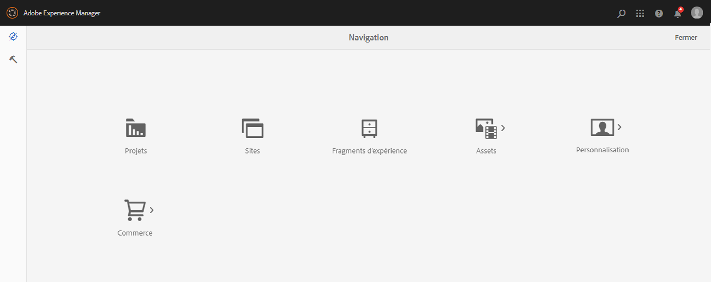
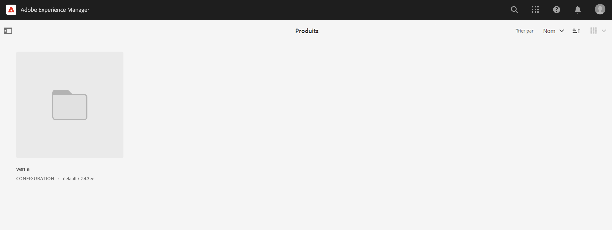
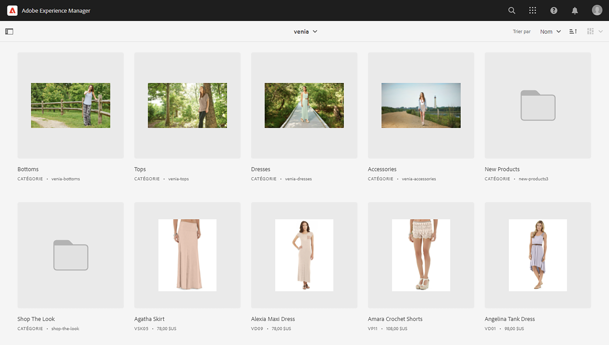
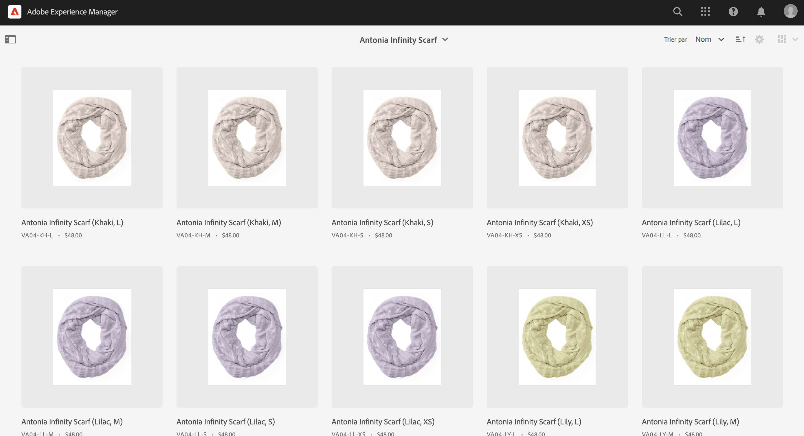
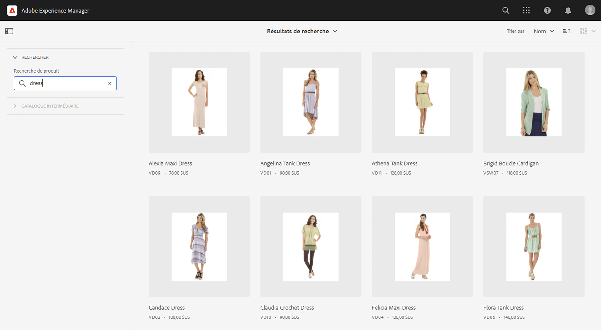
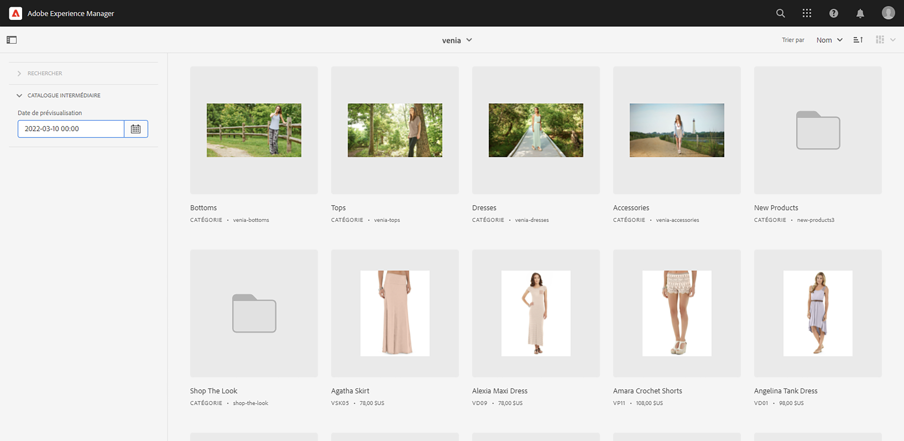
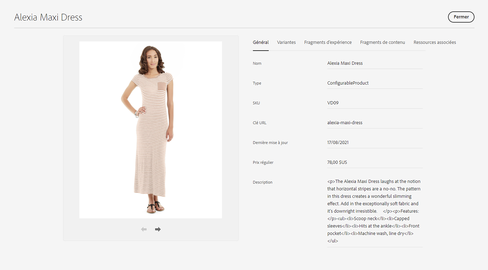
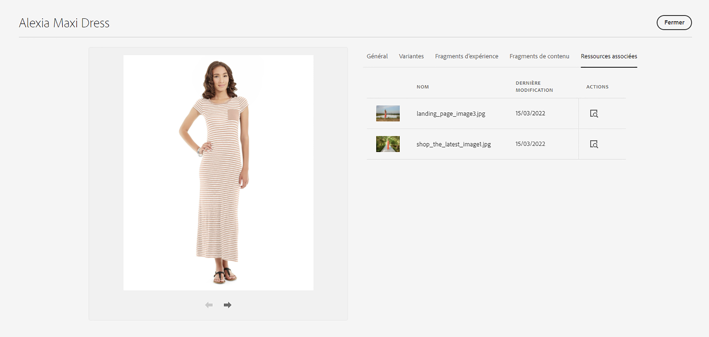

# Product Cockpit {#product-cockpit}

## Présentation {#overview}

Le Product Cockpit fournit une vue d’ensemble unifiée des catalogues de produits liés et du contenu associé. Tous les contenus associés comportent des liens pour y accéder rapidement à partir du cockpit.

Les données des produits intermédiaires incluent toute mutation future telle que de nouvelles catégories, de nouveaux produits ou des propriétés mises à jour.

>[!NOTE]
>
>Le terme catalogue de produits est interchangeable avec le commerce, la vue de magasin et des expressions similaires.

## Configuration {#configuration}

Les catalogues de produits doivent être configurés dans AEM. Voir [configuration du magasin et des catalogues](https://experienceleague.adobe.com/docs/experience-manager-cloud-service/content-and-commerce/storefront/getting-started.html?#catalog) pour plus d’informations.

L’activation des fonctionnalités de catalogue intermédiaire nécessite une authentification. Voir [Prise en main](https://experienceleague.adobe.com/docs/experience-manager-cloud-service/content-and-commerce/storefront/getting-started.html) pour plus d’informations.

>[!NOTE]
>
>Les fonctionnalités de catalogue intermédiaire ne sont disponibles qu’avec Adobe Commerce et les connecteurs tiers qui prennent en charge l’authentification par jeton.

## Ouverture du cockpit du produit {#opening-product-cockpit}

Le moyen le plus simple d’accéder au Cockpit de produit est d’utiliser le menu &quot;Commerce&quot; dans AEM menu principal. Il est également possible d’utiliser l’omni-recherche (pour rechercher Commerce) ou l’ouverture `https://<yourAEMInstance>/commerce.html`.

## Navigation dans les catalogues de produits {#browsing-product-catalogs}

Le Product Cockpit est organisé de manière hiérarchique selon la structure du catalogue de produits. Le premier niveau affiche le niveau racine du catalogue de tous les catalogues de produits configurés, y compris les métadonnées du serveur principal Commerce.

Cliquez sur une catégorie pour charger les enfants de la catégorie sur laquelle l’utilisateur a cliqué.

Si vous cliquez sur un produit, les variations de produit sont chargées.

>[!NOTE]
>
>Les données du catalogue de produits dans AEM sont des données récupérées en temps réel via le point de terminaison de commerce configuré. Aucune donnée de catalogue de produits n’est stockée dans AEM.

## Recherche de catalogues de produits {#searching-product-catalog}

Une recherche en texte intégral sur le catalogue de produits complet est fournie dans l’onglet Filtre de gauche pour rechercher rapidement des produits.

## Navigation dans le catalogue de produits intermédiaires {#staged-product-catalogs}

Par défaut, le cockpit du produit affiche les données du catalogue de produits en direct. L’utilisation du &quot;CATALOGUE STAGÉ&quot; dans l’onglet Filtre de gauche charge le catalogue de produits pour toute date sélectionnée.

## Propriétés du catalogue de produits {#catalog-properties}

Cliquez sur l’icône des propriétés d’un produit ou d’une catégorie pour ouvrir l’affichage des propriétés de l’objet sélectionné. Les propriétés d’ouverture d’une variante de produit sont égales à l’ouverture des propriétés principales du produit.

### Onglets Commerce {#tabs}

Les onglets généraux et de variantes affichent des propriétés commerciales prédéfinies provenant du serveur principal Commerce. Ces données (y compris (variantes) est en lecture seule dans AEM, car le système d’enregistrement est le serveur principal du commerce. L&#39;onglet Variante n&#39;apparaît que pour les produits avec des variantes et affiche une liste de toutes les variantes.

### AEM Onglets Contenu {#content-tabs}

Ces onglets, regroupés par type de contenu AEM (Fragments d’expérience, Fragments de contenu, Ressources associées), affichent AEM contenu associé à l’objet de commerce. L’action &quot;Afficher les détails&quot; ouvre un nouvel onglet du navigateur avec le contenu sélectionné.

