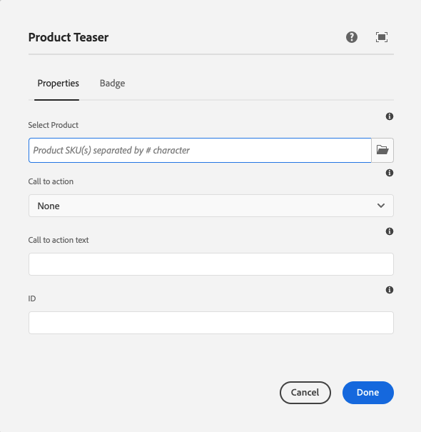
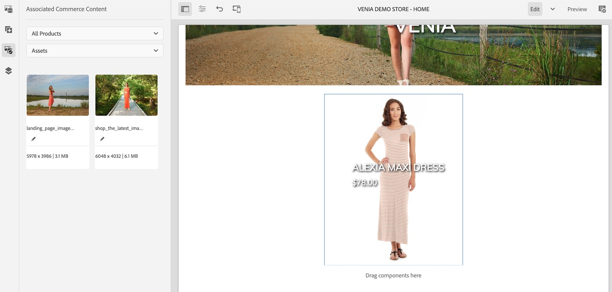
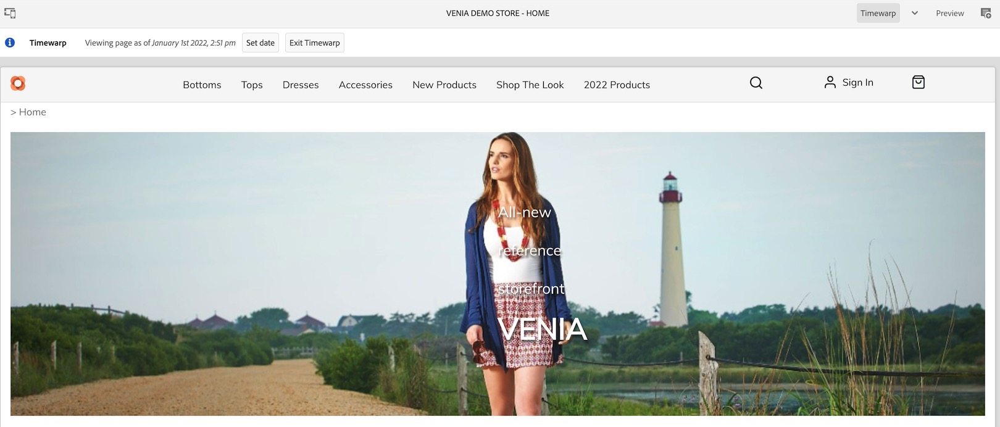
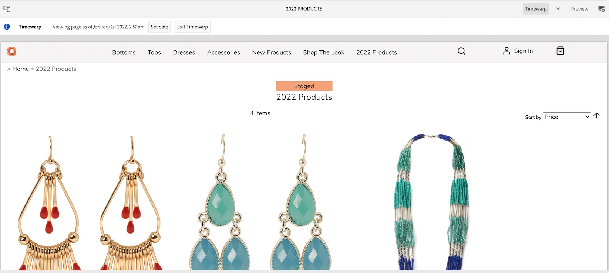

# Création d’expériences commerciales {#authoring-commerce-experiences}

## Vue d’ensemble {#overview}

Le module complémentaire CIF étend la création d’AEM avec des fonctionnalités spécifiques au commerce. Cela permet aux auteurs de créer et de gérer efficacement des expériences liées au commerce en accédant aux données et au contenu des produits sans quitter le contexte.

## Sélecteurs {#pickers}

Les sélecteurs de produits et de catégories sont des boîtes de dialogue modales de l’interface utilisateur qui offrent un moyen pratique aux auteurs d’AEM de rechercher et de sélectionner des produits ou des catégories, le cas échéant. Les composants principaux, l’association de contenu et les modèles de produit sont les zones typiques avec des configurations nécessitant des données de catalogue de produits. Les sélecteurs prennent en charge diverses options de configuration, telles que la sélection multiple, la sélection par variation et la présélection de valeurs.

### Sélecteur de produits {#product-picker}

Ce sélecteur permet de parcourir la structure du catalogue ou la recherche en texte intégral pour trouver le produit. Les produits avec variation offrent une icône de dossier dans la colonne « Type ». Cliquez sur l’icône de dossier pour ouvrir les variantes du produit sélectionné.

Cliquer sur la catégorie parent ramène l’auteur au niveau du produit.

#### Exemple de teaser de produit {#example-product-teaser}

La boîte de dialogue de configuration de ce composant nécessite un produit. CIF utilise le SKU comme identifiant de produit. Les auteurs et autrices peuvent saisir le SKU manuellement ou cliquer sur l’icône de dossier pour ouvrir le sélecteur de produit. Après avoir sélectionné et fermé le sélecteur, la boîte de dialogue du composant affiche le nom du produit sélectionné.

### Sélecteur de catégories {#category-picker}

Ce sélecteur permet de parcourir la structure du catalogue pour trouver la catégorie.

#### Exemple de carrousel de catégorie {#example-carousel}

La boîte de dialogue de configuration de ce composant nécessite 1 : n catégories. CIF utilise l’UID/ID comme identifiant de catégorie. Les auteurs et autrices peuvent saisir l’UID manuellement ou cliquer sur l’icône de dossier pour ouvrir le sélecteur de catégorie. Après avoir sélectionné et fermé le sélecteur, la boîte de dialogue du composant affiche le nom de la catégorie sélectionnée.

## Éditeur de page {#page-editor}

L’éditeur de page d’AEM est doté de fonctionnalités permettant d’accéder aux données de produit en temps réel et au contenu de produit associé.

### Accès aux données du produit {#access-product-data}

L’onglet « Ressources » du panneau latéral de l’éditeur permet d’accéder aux données du produit en sélectionnant le type « Produits ». Les données sont récupérées en direct à partir du point d’entrée de commerce configuré. Le filtre permet d’effectuer une recherche en texte intégral sur le point d’entrée de commerce pour trouver des produits spécifiques.

À l’instar des ressources, les produits peuvent être ajoutés à une page (ce qui crée un composant de teaser de produit par défaut) ou aux composants (actuellement pris en charge sont le teaser de produit et le carrousel de produit).

### Ajout de liens dans des champs de texte à l’aide de l’éditeur de texte enrichi {#rte}

Les pages de catalogue de produits CIF sont des pages virtuelles rendues à la volée. Par conséquent, il n’est pas possible d’incorporer des liens hypertexte comme pour les pages d’AEM standard. CIF ajoute une nouvelle action « Liens de commerce » à l’éditeur de texte enrichi. Cette action fonctionne exactement comme l’action « Lien hypertexte » standard, mais permet aux auteurs de sélectionner un produit ou une catégorie à l’aide des sélecteurs.

>[!NOTE]
>
> Si la catégorie et le produit sont sélectionnés, le produit est pris.

Cela crée un espace réservé pour un lien qui est remplacé par un lien réel lors du rendu de la page.

### Accès au contenu des produits associés {#associated-content}

Si l’éditeur reconnaît 1 :n produits sur une page, le panneau latéral affiche automatiquement l’onglet « Contenu Commerce associé ». Cet onglet permet aux auteurs d’accéder rapidement au contenu AEM qui a été balisé avec le produit (voir [enrichir les données de produit avec le contenu AEM associé](/help/commerce-cloud/cif-storefront/authoring/enrich-product-associated-content.md) pour plus d’informations). Cet onglet propose des listes déroulantes pour filtrer les types de contenu et les produits spécifiques si plusieurs produits se trouvent sur la page. L’utilisation du contenu fonctionne de manière identique à l’utilisation du contenu de l’onglet « Ressources ».

### Prévisualiser les données de produit en cours d’évaluation {#staged-data}

Le mode Timewarp de l’éditeur permet aux auteurs de prévisualiser et de parcourir une expérience AEM avec des données de catalogue de produits en cours d’évaluation en fonction de la date Timewarp.

Les composants affichent un indicateur visuel si la date utilisée est en cours d’évaluation.

## Omnisearch {#omnisearch}

L’utilisation d’Omnisearch est un moyen facile pour les utilisateurs de trouver le contenu AEM et des données de catalogue de produits à l’aide de la recherche en texte intégral. Omnisearch exécute une recherche en texte intégral dans AEM et le serveur principal Commerce pour trouver les objets du catalogue de produits dans le serveur principal Commerce et le contenu AEM. Les résultats AEM incluent également le contenu balisé avec des données de produit/catégorie.

Le résultat est regroupé par type.

>[!NOTE]
>
> La recherche en texte intégral dans Omnisearch ne prend pas en charge les fragments de contenu associés. Utilisez le SKU ou l’UID pour rechercher les fragments de contenu associés.
