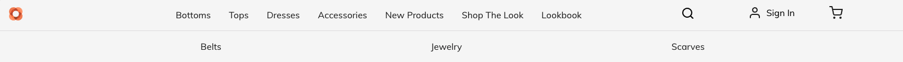

# Gérer les pages et les modèles de catalogue de produits {#product-catalog}

Découvrez comment gérer les pages et les modèles de catalogue de produits.

## Un peu d’histoire… {#story-so-far}

Dans le document précédent du parcours de création de contenu AEM et Commerce, [Prise en main des bases de création d’AEM CIF](/help/commerce-cloud/cif-storefront/commerce-journeys/aem-commerce-content-author/getting-started.md) vous avez appris les principes de base de la création CIF.

Cet article développe ces principes fondamentaux.

## Objectif {#objective}

Ce document vous aide à comprendre comment gérer les pages et les modèles de catalogue de produits. Après avoir lu ce document, vous devriez :

* comprendre les concepts des modèles de catalogue;
* comprendre comment fonctionnent les modèles génériques
* avoir créé un modèle individuel ;

## Le concept de base {#basic-concept}

Venia storefront est fourni avec une expérience de catalogue de produits typique avec des pages de navigation, d’entrée, de catégorie (PLP) et de détails de produit (PDP).

Les pages de catalogue sont créées dynamiquement à l’aide d’un modèle de catalogue AEM CIF et de données de produit en temps réel qui sont récupérées au point d’entrée Commerce, le cas échéant. Chaque catalogue comporte un modèle générique pour les pages de produits et de catégories.

Le composant Navigation affiche le contenu et les pages de catalogue. Il est possible d’afficher la page de destination du catalogue ou les catégories de premier niveau dans la navigation. Placer le pointeur de la souris sur une catégorie affiche les catégories de deuxième niveau sur une deuxième ligne.

Cliquez sur une catégorie pour ouvrir la page de catégorie (ou la page de liste de produits).

Cliquez sur un produit pour ouvrir la page des détails du produit.

## Les modèles {#templates}

### Modèles génériques {#generic}

Le modèle de catalogue Venia générique utilise le composant principal Liste de produits. Ce composant affiche l’image de catégorie, le cas échéant, et les produits de la catégorie.

Le modèle de produit Venia générique utilise le composant principal Détails du produit. Ce composant affiche des informations sur les produits pour divers types de produits et l’action Ajout au panier.

### Modifier les modèles {#edit-templates}

Les modèles peuvent être modifiés en ouvrant directement la page du modèle ou en passant en mode d’édition lors de la navigation sur une page du catalogue de produits. Gardez à l’esprit que la modification de la page modifie le modèle et pas seulement la page spécifique du produit/de la catégorie.

### Modèles spécifiques à une catégorie ou à un produit {#specific}

CIF prend en charge plusieurs modèles en quelques clics seulement. Pour créer un autre modèle, sélectionnez le modèle générique dans la catégorie correspondante et créez une page à l’aide de l’action **Créer**.

Sélectionnez le modèle de produit ou de catégorie correspondant.

Saisissez le titre et créez la page.

Notez que vous disposez désormais d’un modèle spécifique sous le modèle générique.

Ouvrez le modèle. Il ressemble trait pour trait au modèle de catégorie générique.

Ajoutez une image en haut de la page.

Vous pouvez prévisualiser le modèle avec n’importe quelle catégorie/produit. Ouvrez **Informations sur la page** puis sélectionnez **Afficher avec la catégorie/le produit**. Sélectionnez le produit/la catégorie dans le sélecteur pour obtenir un aperçu de ce produit/cette catégorie. Sélectionnez la catégorie **Shop The Look** pour obtenir un aperçu du modèle mis à jour.

Vous devez maintenant affecter ce modèle à la catégorie spécifique. Ouvrez les propriétés dans le menu **Informations sur la page** et passez à l’onglet commerce. Cliquez sur l’icône de dossier pour sélectionner la catégorie **Shop The Look** dans le sélecteur de catégorie. Il est possible d’affecter plusieurs catégories à un modèle et d’inclure également des sous-catégories en activant la case à cocher.

Revenez à la page d’accueil principale et cliquez sur la catégorie **Shop The Look** pour afficher le modèle spécifique. Toutes les autres catégories utilisent toujours le modèle générique.

Le même workflow peut être appliqué pour créer des modèles de produit individuels.

## Prochaines étapes {#what-is-next}

Maintenant que vous avez terminé cette partie du parcours, vous devriez :

* comprendre les concepts des modèles de catalogue;
* comprendre comment fonctionnent les modèles génériques
* avoir créé un modèle individuel ;

Tirez parti de ces connaissances et poursuivez votre parcours en consultant le document [Gérer les expériences de catalogue de produits étape par étape](/help/commerce-cloud/cif-storefront/commerce-journeys/aem-commerce-content-author/staged-catalog.md) où vous apprendrez à utiliser des données de produit intermédiaires et des lancements AEM.

## Ressources supplémentaires {#additional-resources}

Bien qu’il soit recommandé de passer à la partie suivante du parcours en examinant le document [Gérer l’expérience de catalogue de produits par étapes](/help/commerce-cloud/cif-storefront/commerce-journeys/aem-commerce-content-author/staged-catalog.md) vous trouverez ci-après quelques ressources facultatives supplémentaires pour approfondir un certain nombre de concepts mentionnés dans ce document, mais non obligatoires pour poursuivre sur le parcours découplé :

* [Créer plusieurs pages de catégories et de produits](/help/commerce-cloud/cif-storefront/authoring/multi-template-usage.md)
* [Guide de migration d’Experience Manager Cloud Service](/help/commerce-cloud/cif-storefront/migration.md) - Comment migrer vers le module complémentaire CIF (Commerce Integration Framework) d’AEM à partir d’une ancienne version.
