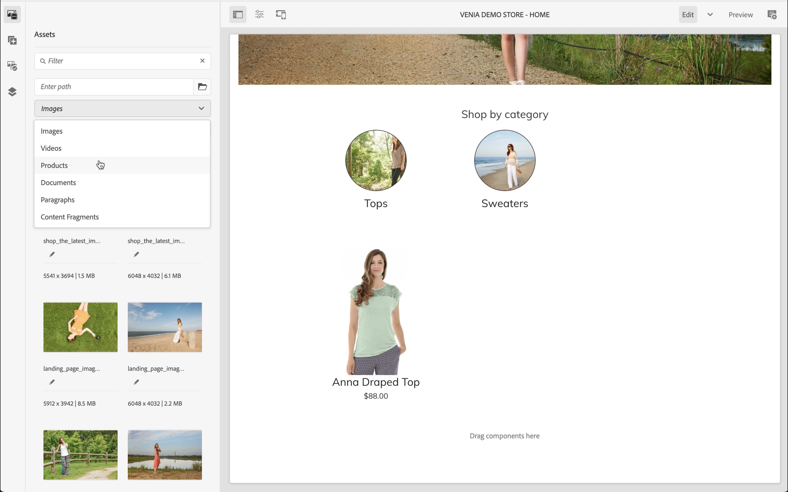
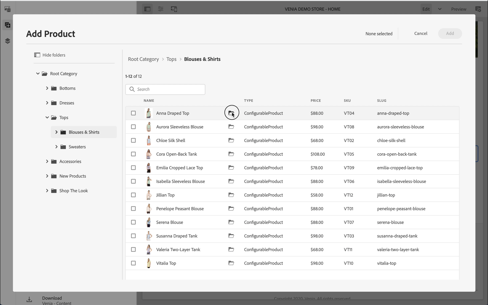
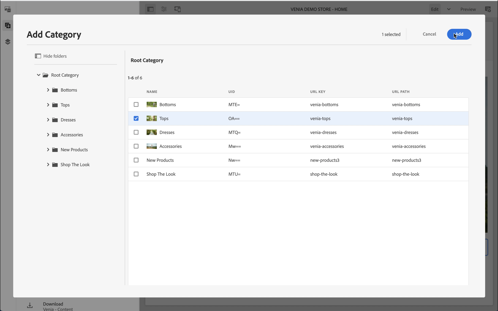

# Prise en main de la création de contenu à lʼaide de CIF pour AEM {#getting-started}

Découvrez la création de CIF dans Adobe Experience Manager (AEM).

## Un peu d’histoire... {#story-so-far}

Dans le document précédent de ce parcours de contenu et de Commerce AEM, [En savoir plus sur le contenu AEM et Commerce](/help/commerce-cloud/cif-storefront/introduction.md), vous avez appris la théorie et les concepts de base de CMS découplé, ainsi que du contenu AEM et de Commerce.

Cet article développe ces principes fondamentaux.

## Objectif {#objective}

Ce document vous aide à comprendre comment utiliser lʼextension CIF pour la création de contenu et de commerce spécifique. Après avoir lu ce document, vous devriez :

* Comprendre les concepts de création CIF à l’aide de l’éditeur de page dans AEM
* Être en mesure dʼaccéder aux données du catalogue de produits dans AEM à l’aide des sélecteurs de produits et de catégories.
* Comment accéder aux données Content and Commerce à l’aide du cockpit du produit et d’AEM Omnisearch

## Création CIF dans l’éditeur de page d’AEM {#cif-authoring}

CIF étend l’éditeur de page d’AEM avec des fonctionnalités permettant d’accéder aux données de produit en temps réel sans quitter le contexte :

Ouvrez le panneau latéral et sélectionnez « Produits » dans la liste déroulante.

Vous pouvez parcourir le catalogue de produits ou utiliser le champ de recherche en texte intégral pour rechercher des produits.

Les produits peuvent être déposés sur des composants qui prennent en charge le dépôt de produits (par exemple, le teaser du produit, le carrousel des produits) directement sur la page, ce qui crée automatiquement un composant teaser du produit.

## Sélecteurs de produits et de catégories {#pickers}

Si des données produit et de catégorie sont requises dans les composants commerciaux ou les boîtes de dialogue du back-office dʼAEM, les créateurs de contenu AEM peuvent utiliser des sélecteurs, qui sont des éléments de l’interface utilisateur permettant de rechercher et de sélectionner facilement les données du catalogue de produits.

### Sélecteur de produits {#product-picker}

Cliquez sur l’icône de dossier pour ouvrir l’interface utilisateur modale de sélection (par exemple, le teaser de produit).

Les produits peuvent être trouvés en parcourant la structure du catalogue sur la gauche ou en effectuant une recherche. La recherche en texte intégral respecte la catégorie sélectionnée et limite les résultats de la recherche à cette catégorie.

Les produits comportant des variations sont signalés par une icône de dossier sur laquelle vous pouvez cliquer pour afficher toutes les variations.

### Sélecteur de catégories {#category-picker}

Son fonctionnement est similaire à un sélecteur de produits. Cliquez sur l’icône de dossier pour ouvrir l’interface utilisateur modale de sélection (carrousel des catégories, par exemple).

Parcourez la structure du catalogue sur la gauche et sélectionnez la catégorie.

## Console du produit {#cockpit}

Le cockpit de produits est un emplacement central pour accéder rapidement au catalogue de produits avec tout son contenu enrichi. Dans l’un des modules suivants, vous apprendrez à enrichir les données de produit avec du contenu. Pour l’instant, concentrons-nous sur l’accès aux données produit.

Dans le menu principal, cliquez sur Commerce pour afficher la liste de tous les catalogues de produits associés.

Affiche une liste de tous les catalogues de produits connectés.

Le catalogue de produits affiche par défaut toutes les catégories de premier niveau avec tous les produits. Cliquez sur une catégorie pour ouvrir cette catégorie avec tous les produits et sous-catégories associés, y compris leurs produits.

Vous pouvez ouvrir les propriétés du produit en cliquant sur l’icône de propriété. L’icône s’affiche en pointant sur une mosaïque de produit.

Toutes les propriétés du produit sont en lecture seule, car les données sont chargées en temps réel depuis le serveur principal connecté. La modification des propriétés du produit doit être effectuée dans le système principal, qui est le système d’enregistrement. L’onglet **Variantes** n’apparaît que si le produit comporte des variations. Cliquez sur l’onglet pour afficher toutes les variations avec leurs attributs.

Les onglets restants affichent tout le contenu AEM associé au produit. Ces onglets sont abordés dans l’un des modules suivants.

## AEM Omnisearch {#omnisearch}

L’utilisation d&#39;Omnisearch est un moyen facile de trouver du contenu AEM à l’aide de la recherche de texte intégral. CIF étend Omnisearch à la recherche de texte intégral de catalogues de produits avec son contenu AEM associé.

Omnisearch exécute une recherche en texte intégral dans le serveur principal du commerce pour trouver tous les produits associés. Le résultat est répertorié sous **Afficher tous les produits**. Omnisearch recherche également du contenu associé au produit recherché dans AEM. Les résultats sont répertoriés sous les catégories AEM respectives. Dans cet exemple, un fragment de contenu est lié au produit.

## Prochaines étapes {#what-is-next}

Maintenant que vous avez terminé cette partie du parcours, vous devriez :

* Comprendre les concepts de création CIF à l’aide de l’éditeur de page
* Comment accéder au catalogue de produits dans AEM à l’aide des sélecteurs de produits et de catégories
* Comment accéder aux données Content and Commerce à l’aide du cockpit du produit et d’AEM Omnisearch

Tirez parti de ces connaissances et poursuivez votre parcours en consultant le document [Gérer les pages et les modèles de catalogue de produits](/help/commerce-cloud/cif-storefront/commerce-journeys/aem-commerce-content-author/catalog-templates.md) où vous apprendrez à créer et à personnaliser votre première expérience de catalogue de produits.

## Ressources supplémentaires {#additional-resources}

Bien qu’il soit recommandé de passer à la partie suivante du parcours - [ Gérer les pages et les modèles de catalogue de produits ](/help/commerce-cloud/cif-storefront/commerce-journeys/aem-commerce-content-author/catalog-templates.md) - vous trouverez ci-après quelques ressources facultatives pour approfondir un certain nombre de concepts mentionnés ici. Toutefois, ces ressources facultatives ne sont pas nécessaires pour continuer sur le parcours.

* [Configuration des magasins et des catalogues](/help/commerce-cloud/cif-storefront/getting-started.md#catalog)
