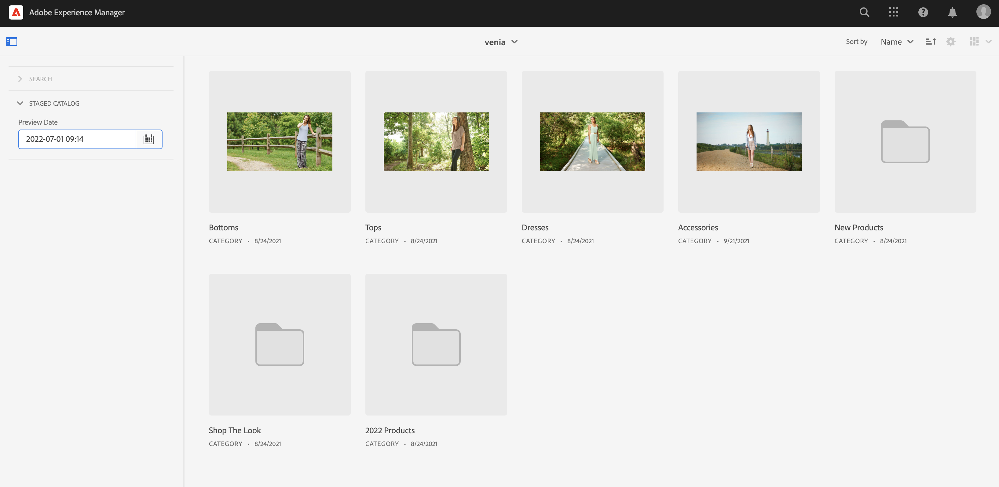

# Création d’expériences de catalogue de produits par étapes {#building-experiences}

Découvrez comment gérer les expériences de catalogue de produits par étapes.

## Un peu d’histoire…  {#story-so-far}

Dans le document précédent du parcours Content and Commerce d’AEM, [Gérer les pages et les modèles de catalogue de produits](/help/commerce-cloud/cif-storefront/commerce-journeys/aem-commerce-content-author/catalog-templates.md) vous avez appris à gérer et à créer des expériences de catalogue de produits à partir de modèles.

Cet article développe ces principes fondamentaux.

## Objectif {#objective}

Ce document vous aide à comprendre comment gérer l’expérience du catalogue de produits en fonction de données de produits échelonnées et de lancements AEM. Souvent, les auteurs doivent préparer en parallèle un lancement de produit à venir (comme une nouvelle collection de vêtements). Pour ce faire, ils doivent avoir accès à des données de produits échelonnées (qui ne sont pas encore en ligne) et être en mesure de préparer le contenu. Ce nouveau contenu sera mis en ligne lors du lancement du produit.

>[!NOTE]
>
>Cette fonctionnalité est disponible uniquement avec Adobe Commerce ou Cloud Edition et les connecteurs tiers qui prennent en charge l’authentification par jeton. Consultez [Prise en main](/help/commerce-cloud/cif-storefront/getting-started.md) pour plus d’informations.

Tout d’abord, voyons comment les auteurs peuvent accéder aux données des produits échelonnées avec le CIF.

## Utilisation des données de produits échelonnées {#staged-product-data}

L&#39;une des façons d&#39;accéder aux données des produits échelonnées est d&#39;utiliser le cockpit des produits. Ouvrez le catalogue de produits en cliquant sur l’icône Commerce dans le menu principal d’AEM. Vous aurez ainsi accès aux données de produits en temps réel. Ouvrez l’onglet Filtre à gauche et déployez **STAGED CATALOG**. Grâce aux données d’aperçu, vous pouvez désormais accéder aux données de produit échelonnées pour n&#39;importe quand. Les données échelonnées incluent les nouvelles catégories, les nouveaux produits ou les champs mis à jour comme le prix.

Un aperçu d’un point de vente digital avec des données échelonnées est possible à l’aide de la vue distorsion du temps. Ouvrez l’éditeur et basculez en mode distorsion du temps. Sélectionnez une date ultérieure. Notez les informations en haut de l’éditeur indiquant que vous affichez la page pour une certaine date.

Vous pouvez désormais parcourir le catalogue avec les données échelonnées. Si vous ouvrez une catégorie ou une page produit échelonnée, l’éditeur affiche un indicateur visuel.

>[!NOTE]
>
>Omnisearch n’a pas de contexte et ne renvoie donc que les données du catalogue de produits en direct.

## AEM Launches {#launches}

Les lancements d’AEM vous permettent de créer du contenu pour des données de produits structurées. Si vous ne connaissez pas les lancements, suivez le lien de la documentation sous la section [ Ressources supplémentaires .](#additional-resources) La date de lancement est ensuite utilisée pour accéder aux données de produits échelonnées.

Notez que les sélecteurs respectent la date de lancement avec l’indicateur échelonné sur le côté droit.

## Prochaines étapes {#what-is-next}

Maintenant que vous avez terminé cette partie du parcours, vous devriez :

* comprendre les concepts de catalogue de produits structurés et de contenu avec des lancements
* être en mesure d’accéder aux données du catalogue de produits structurés par le biais du cockpit du produit et l’éditeur

Vous êtes maintenant prêt à gérer les expériences produit [.](/help/commerce-cloud/cif-storefront/commerce-journeys/aem-commerce-content-author/product-experience-management.md) Cependant, AEM Content and Commerce disposent de nombreuses options supplémentaires. Consultez certaines des ressources supplémentaires disponibles dans la [Section Ressources supplémentaires](#additional-resources) pour en savoir plus sur les fonctionnalités rencontrées dans ce parcours.

## Ressources supplémentaires {#additional-resources}

* [Console du produit](/help/commerce-cloud/cif-storefront/authoring/product-cockpit.md)
* [Prise en main](/help/commerce-cloud/cif-storefront/getting-started.md)
* [Lancements](/help/sites-cloud/authoring/launches/overview.md)
