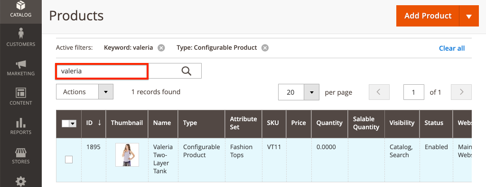

# Personnalisation des composants principaux AEM CIF {#customize-cif-components}

Le [projet CIF Venia](https://github.com/adobe/aem-cif-guides-venia) est une base de code de référence pour l’utilisation des [composants principaux CIF.](https://github.com/adobe/aem-core-cif-components) Dans ce tutoriel, vous allez étendre davantage le composant [Teaser de produit](https://github.com/adobe/aem-core-cif-components/tree/master/ui.apps/src/main/content/jcr_root/apps/core/cif/components/commerce/productteaser/v1/productteaser) pour afficher un attribut personnalisé d’Adobe Commerce. Vous en apprenez davantage sur l’intégration de GraphQL entre AEM et Adobe Commerce, et sur les hooks d’extension fournis par les composants principaux CIF.

>[!TIP]
>
> Utilisez l’[archétype de projet AEM](https://github.com/adobe/aem-project-archetype) pour démarrer votre propre implémentation commerciale.

## Ce que vous allez créer

La marque Venia a récemment commencé à fabriquer des produits à l’aide de matériaux durables et l’entreprise aimerait faire apparaître un badge **Écologique** dans son teaser de produit. Un nouvel attribut personnalisé sera créé dans Adobe Commerce pour indiquer si un produit utilise le matériau **Écologique**. Cet attribut personnalisé sera ensuite ajouté dans le cadre de la requête GraphQL et affiché sur le teaser des produits spécifiés.


## Conditions préalables {#prerequisites}

Un environnement de développement local est nécessaire pour suivre ce tutoriel. Cet environnement inclut une instance AEM en cours d’exécution configurée et connectée à une instance Adobe Commerce. Examinez les exigences et les étapes de [configuration d’un développement local avec AEM as a Cloud Service SDK).](/help/commerce-cloud/cif-storefront/develop.md) Pour suivre entièrement le tutoriel, vous avez besoin de l’autorisation d’ajouter des [attributs à un produit](https://docs.magento.com/user-guide/catalog/product-attributes-add.html) dans Adobe Commerce.

Vous avez également besoin d’un IDE GraphQL tel que [GraphiQL](https://github.com/graphql/graphiql) ou d’une extension de navigateur pour exécuter les exemples de code et les tutoriels. Si vous installez une extension de navigateur, assurez-vous que celle-ci peut de définir des en-têtes de requête. Dans Google Chrome, _Altair GraphQL Client_ est une extension pouvant réaliser cette tâche.

## Clonage du projet Venia {#clone-venia-project}

Clonez le projet [Venia](https://github.com/adobe/aem-cif-guides-venia), puis remplacez les styles par défaut.

>[!NOTE]
>
> **N’hésitez pas à utiliser un projet existant** (basé sur l’archétype de projet AEM avec CIF inclus) et à ignorer cette section.

1. Exécutez la commande git suivante afin de pouvoir cloner le projet :

   ```shell
   $ git clone git@github.com:adobe/aem-cif-guides-venia.git
   ```

1. Créez et déployez le projet sur une instance locale d’AEM :

   ```shell
   $ cd aem-cif-guides-venia/
   $ mvn clean install -PautoInstallSinglePackage,cloud
   ```

1. Ajoutez les configurations OSGi nécessaires pour connecter votre instance AEM à une instance Adobe Commerce ou ajoutez les configurations au projet créé.

1. À ce stade, vous devriez disposer d’une version fonctionnelle d’un storefront connecté à une instance Adobe Commerce. Accédez à la page `US` > `Home` sur : [http://localhost:4502/editor.html/content/venia/us/en.html](http://localhost:4502/editor.html/content/venia/us/en.html).

   Vous devriez voir que le storefront utilise actuellement le thème Venia. En développant le menu principal du storefront, vous devriez voir différentes catégories indiquant que la connexion à Adobe Commerce fonctionne.

   

## Création du teaser de produit {#author-product-teaser}

Le composant teaser Produit va être étendu tout au long de ce tutoriel. Dans un premier temps, ajoutez une nouvelle instance du teaser de produit à la page d’accueil pour comprendre les fonctionnalités de base.

1. Accédez à la **Page d’accueil** du site : [http://localhost:4502/editor.html/content/acme/us/en.html](http://localhost:4502/editor.html/content/acme/us/en.html)

1. Insérez un nouveau composant **Teaser de produit** dans le conteneur de disposition principal de la page.

   

1. Développez le panneau latéral (s’il n’est pas déjà activé) et faites basculer la liste déroulante de recherche de ressources sur **Produits**. Cette liste devrait afficher une liste de produits disponibles à partir d’une instance Adobe Commerce connectée. Sélectionnez un produit puis **faites-le glisser et déposez-le** sur le composant **Teaser de produit** de la page.

   

   >[!NOTE]
   >
   > Sachez que vous pouvez également configurer le produit affiché en configurant le composant à l’aide de la boîte de dialogue (en cliquant sur l’icône de _clé à molette_).

1. Vous devriez maintenant voir un produit affiché par le teaser de produit. Le nom du produit et son prix sont des attributs par défaut qui sont affichés.

   

## Ajout d’un attribut personnalisé dans Adobe Commerce {#add-custom-attribute}

Les produits et les données de produit affichés dans AEM sont stockés dans Adobe Commerce. Ajoutez ensuite un attribut pour **Écologique** dans le cadre de l’attribut de produit défini avec l’interface utilisateur d’Adobe Commerce.

>[!TIP]
>
> Vous disposez déjà d’un attribut **Oui/Non** personnalisé dans votre jeu d’attributs de produit ? N’hésitez pas à l’utiliser et à ignorer cette section.

1. Connectez-vous à votre instance Adobe Commerce.
1. Accédez à **Catalog** > **Products**.
1. Mettez à jour le filtre de recherche pour pouvoir rechercher le **Configurable product** (Produit configurable) utilisé lors de son ajout au composant Teaser dans l’exercice précédent. Ouvrez le produit en mode édition.

   

1. Dans le mode Produits, cliquez sur **Add Attribute** (Ajouter un attribut) > **Create New Attribute** (Créer un attribut).
1. Remplissez le formulaire **New Attribute** (Nouvel attribut) avec les valeurs suivantes (conservez les paramètres par défaut des autres valeurs).

   | Jeu de champs | Libellé du champ | Valeur |
   | ----------------------------- | ------------------ | ---------------- |
   | Propriétés d’attribut | Attribute Label | **Écologique** |
   | Propriétés d’attribut | Catalog Input Type | **Oui/Non** |
   | Propriétés d’attribut avancées | Attribute Code | **eco_friendly** |

   

   Lorsque vous avez terminé, cliquez sur **Save Attribute** (Enregistrer l’attribut).

1. Faites défiler la page jusqu’au bas du produit et développez l’en-tête **Attributes**. Le nouveau champ **Écologique** devrait apparaître. Redéfinissez le bouton bascule sur **Yes**.

   

   Cliquez sur **Save** pour enregistrer les modifications apportées au produit.

   >[!TIP]
   >
   > Pour plus d’informations sur la gestion des [attributs de produit), consultez le guide d’utilisation d’Adobe Commerce.](https://docs.magento.com/user-guide/catalog/attribute-best-practices.html)

1. Accédez à **System** > **Tools** > **Cache Management**. Comme une mise à jour a été apportée au schéma de données, vous devez invalider certains types de cache dans Adobe Commerce.
1. Cochez la case **Configuration** et envoyez le type de cache pour **Actualiser**.

   

   >[!TIP]
   >
   > Pour plus d’informations sur la [&#x200B; gestion du cache, consultez le guide de l’utilisateur d’Adobe Commerce.](https://docs.magento.com/user-guide/system/cache-management.html)

## Utilisation d’un IDE GraphQL pour vérifier l’attribut {#use-graphql-ide}

Avant de passer au code AEM, il est utile d’explorer l’[Aperçu GraphQL](https://devdocs.magento.com/guides/v2.4/graphql/) à l’aide d’un IDE GraphQL. L’intégration d’Adobe Commerce avec AEM s’effectue principalement par le biais d’une série de requêtes GraphQL. Comprendre et modifier les requêtes GraphQL est l’un des principaux moyens d’étendre les composants principaux CIF.

Ensuite, utilisez un IDE GraphQL pour vérifier que l’attribut `eco_friendly` a été ajouté au jeu d’attributs du produit. Les captures d’écran de ce tutoriel utilisent l’extension _Altair GraphQL Client_ Google Chrome.

1. Ouvrez l’IDE GraphQL et entrez l’URL `http://<commerce-server>/graphql` dans la barre d’URL de votre IDE ou extension.
1. Ajoutez la [requête de produit](https://devdocs.magento.com/guides/v2.4/graphql/queries/products.html) suivante, `YOUR_SKU` correspondant au **SKU** du produit utilisé dans l’exercice précédent :

   ```json
     {
       products(
       filter: { sku: { eq: "YOUR_SKU" } }
       ) {
           items {
           name
           sku
           eco_friendly
           }
       }
   }
   ```

1. Exécutez la requête ; vous devriez obtenir une réponse semblable à la suivante :

   ```json
   {
     "data": {
       "products": {
         "items": [
           {
             "name": "Valeria Two-Layer Tank",
             "sku": "VT11",
             "eco_friendly": 1
           }
         ]
       }
     }
   }
   ```

   

   La valeur **Oui** est égale au nombre entier **1**. Cette valeur est utile lorsque vous écrivez la requête GraphQL dans Java™.

   >[!TIP]
   >
   > Pour plus d’informations, voir [Adobe Commerce GraphQL.](https://devdocs.magento.com/guides/v2.4/graphql/index.html)

## Mettre à jour le modèle Sling du teaser de produit {#updating-sling-model-product-teaser}

Vous allez ensuite étendre la logique commerciale du teaser de produit en mettant en œuvre un modèle Sling. Les [modèles Sling](https://sling.apache.org/documentation/bundles/models.html) sont des POJO (Plain Old Java™ Objects) pilotés par des annotations qui implémentent la logique commerciale nécessaire au composant. Ils sont utilisés avec les scripts HTL dans le cadre du composant. Suivez le [motif de délégation des modèles Sling](https://github.com/adobe/aem-core-wcm-components/wiki/Delegation-Pattern-for-Sling-Models) afin de pouvoir étendre des parties du modèle de teaser de produit existant.

Les modèles Sling sont implémentés sous forme de code Java™ et se trouvent dans le module **core** du projet généré.

Utilisez l’[IDE de votre choix](https://experienceleague.adobe.com/docs/experience-manager-learn/cloud-service/local-development-environment-set-up/development-tools.html?lang=fr#set-up-the-development-ide) pour importer le projet Venia. Les captures d’écran utilisées proviennent de l’[IDE Visual Studio Code](https://experienceleague.adobe.com/docs/experience-manager-learn/cloud-service/local-development-environment-set-up/development-tools.html?lang=fr#microsoft-visual-studio-code).

1. Dans votre IDE, naviguez jusqu’au module **core** vers : `core/src/main/java/com/venia/core/models/commerce/MyProductTeaser.java`.

   

   `MyProductTeaser.java` est une interface Java™ qui étend l’interface [ProductTeaser](https://github.com/adobe/aem-core-cif-components/blob/master/bundles/core/src/main/java/com/adobe/cq/commerce/core/components/models/productteaser/ProductTeaser.java) CIF.

   Une nouvelle méthode nommée `isShowBadge()` a déjà été ajoutée pour afficher un badge si le produit est considéré comme « Nouveau ».

1. Ajoutez `isEcoFriendly()` à l’interface :

   ```java
   @ProviderType
   public interface MyProductTeaser extends ProductTeaser {
       // Extend the existing interface with the additional properties which you
       // want to expose to the HTL template.
       public Boolean isShowBadge();
   
       public Boolean isEcoFriendly();
   }
   ```

   Il s’agit d’une nouvelle méthode pour encapsuler la logique afin d’indiquer si l’attribut `eco_friendly` du produit est défini sur **Oui** ou sur **Non**.

1. Ensuite, inspectez `MyProductTeaserImpl.java` à l’emplacement `core/src/main/java/com/venia/core/models/commerce/MyProductTeaserImpl.java`.

   Le [motif de délégation des modèles Sling](https://github.com/adobe/aem-core-wcm-components/wiki/Delegation-Pattern-for-Sling-Models) permet à `MyProductTeaserImpl` de référencer le modèle `ProductTeaser` via la propriété `sling:resourceSuperType` :

   ```java
   @Self
   @Via(type = ResourceSuperType.class)
   private ProductTeaser productTeaser;
   ```

   Pour les méthodes que vous ne souhaitez pas remplacer ou modifier, vous pouvez renvoyer la valeur que le `ProductTeaser` renvoie. Par exemple :

   ```java
   @Override
   public String getImage() {
       return productTeaser.getImage();
   }
   ```

   Cette méthode minimise la quantité de code Java™ qu’une mise en œuvre doit écrire.

1. L’un des points d’extension supplémentaires fournis par les composants principaux AEM CIF est le point `AbstractProductRetriever`, qui permet d’accéder à des attributs de produits spécifiques. Inspectez la méthode `initModel()` :

   ```java
   import javax.annotation.PostConstruct;
   ...
   @Model(adaptables = SlingHttpServletRequest.class, adapters = MyProductTeaser.class, resourceType = MyProductTeaserImpl.RESOURCE_TYPE)
   public class MyProductTeaserImpl implements MyProductTeaser {
       ...
       private AbstractProductRetriever productRetriever;
   
       /* add this method to initialize the productRetriever */
       @PostConstruct
       public void initModel() {
           productRetriever = productTeaser.getProductRetriever();
   
           if (productRetriever != null) {
               productRetriever.extendProductQueryWith(p -> p.createdAt());
           }
   
       }
   ...
   ```

   L’annotation `@PostConstruct` garantit que cette méthode est appelée dès que le modèle Sling est initialisé.

   Notez que la requête GraphQL du produit a déjà été étendue à l’aide de la méthode `extendProductQueryWith` pour récupérer l’attribut `created_at` supplémentaire. Cet attribut est ensuite utilisé dans le cadre de la méthode `isShowBadge()`.

1. Mettez la requête GraphQL à jour pour inclure l’attribut `eco_friendly` dans la requête partielle :

   ```java
   //MyProductTeaserImpl.java
   
   private static final String ECO_FRIENDLY_ATTRIBUTE = "eco_friendly";
   
   @PostConstruct
   public void initModel() {
       productRetriever = productTeaser.getProductRetriever();
   
       if (productRetriever != null) {
           productRetriever.extendProductQueryWith(p -> p
               .createdAt()
               .addCustomSimpleField(ECO_FRIENDLY_ATTRIBUTE)
           );
       }
   }
   ```

   Ajouter à la méthode `extendProductQueryWith` est un moyen performant de s’assurer que d’autres attributs de produit sont disponibles pour le reste du modèle. Cela permet également de réduire le nombre de requêtes exécutées.

   Dans le code ci-dessus, `addCustomSimpleField` est utilisé pour récupérer l’attribut `eco_friendly`. Cet attribut illustre la manière d’exécuter une requête pour des attributs personnalisés faisant partie du schéma Adobe Commerce.

   >[!NOTE]
   >
   > La méthode `createdAt()` a été implémentée dans le cadre de l’interface [Product).](https://github.com/adobe/commerce-cif-magento-graphql/blob/master/src/main/java/com/adobe/cq/commerce/magento/graphql/ProductInterface.java) La plupart des attributs de schéma courants ont été implémentés. N’utilisez donc le `addCustomSimpleField` que pour les attributs réellement personnalisés.

1. Ajoutez un logger afin de pouvoir déboguer le code Java™ :

   ```java
   import org.slf4j.Logger;
   import org.slf4j.LoggerFactory;
   ...
   @Model(adaptables = SlingHttpServletRequest.class, adapters = MyProductTeaser.class, resourceType = MyProductTeaserImpl.RESOURCE_TYPE)
   public class MyProductTeaserImpl implements MyProductTeaser {
   
   private static final Logger LOGGER = LoggerFactory.getLogger(MyProductTeaserImpl.class);
   ```

1. Implémentez ensuite la méthode `isEcoFriendly()` :

   ```java
   @Override
   public Boolean isEcoFriendly() {
   
       Integer ecoFriendlyValue;
       try {
           ecoFriendlyValue = productRetriever.fetchProduct().getAsInteger(ECO_FRIENDLY_ATTRIBUTE);
           if(ecoFriendlyValue != null && ecoFriendlyValue.equals(Integer.valueOf(1))) {
               LOGGER.info("*** Product is Eco Friendly**");
               return true;
           }
       } catch (SchemaViolationError e) {
           LOGGER.error("Error retrieving eco friendly attribute");
       }
       LOGGER.info("*** Product is not Eco Friendly**");
       return false;
   }
   ```

   Dans la méthode ci-dessus, `productRetriever` est utilisé pour récupérer le produit et la méthode `getAsInteger()` est utilisée pour obtenir la valeur de l’attribut `eco_friendly`. Selon les requêtes GraphQL que vous avez exécutées précédemment, vous savez que la valeur attendue lorsque l’attribut `eco_friendly` est défini sur **Oui** est égale au nombre entier **1**.

   Maintenant que le modèle Sling a été mis à jour, le balisage de composant doit être mis à jour pour afficher un indicateur **Écologique** basé sur le modèle Sling.

## Personnalisation du balisage du teaser de produit {#customize-markup-product-teaser}

Une extension courante des composants AEM consiste à modifier le balisage généré par le composant. Pour effectuer cette modification, il faut remplacer le [script HTL](https://experienceleague.adobe.com/docs/experience-manager-htl/using/overview.html?lang=fr) utilisé par le composant afin d’effectuer le rendu de son balisage. HTL (HTML Template Language) est un langage de modèle léger que les composants AEM utilisent pour générer dynamiquement des balises en fonction du contenu créé, ce qui permet de réutiliser les composants. Le teaser de produit, par exemple, peut être réutilisé plusieurs fois pour afficher différents produits.

Dans ce cas, vous devez générer une bannière au-dessus du teaser pour indiquer que le produit est « écologique » en fonction d’un attribut personnalisé. Le modèle de conception permettant de [personnaliser le balisage](https://experienceleague.adobe.com/docs/experience-manager-core-components/using/developing/customizing.html?lang=fr#customizing-the-markup) d’un composant est standard pour tous les composants AEM, et pas uniquement les composants principaux CIF d’AEM.

>[!NOTE]
>
> Si vous personnalisez un composant à l’aide des sélecteurs de catégorie et de produit CIF tels que ce teaser de produit ou le composant de page CIF, veillez à inclure la bibliothèque cliente `cif.shell.picker` requise pour les boîtes de dialogue du composant. Voir [Utilisation du sélecteur de produits et de catégories CIF](use-cif-pickers.md) pour plus d’informations.

1. Dans l’IDE, accédez au module `ui.apps` et développez-le, puis développez la hiérarchie de dossiers comme suit : `ui.apps/src/main/content/jcr_root/apps/venia/components/commerce/productteaser` et inspectez le fichier `.content.xml`.

   

   ```xml
   <?xml version="1.0" encoding="UTF-8"?>
   <jcr:root xmlns:sling="http://sling.apache.org/jcr/sling/1.0" xmlns:cq="http://www.day.com/jcr/cq/1.0" xmlns:jcr="http://www.jcp.org/jcr/1.0"
       jcr:description="Product Teaser Component"
       jcr:primaryType="cq:Component"
       jcr:title="Product Teaser"
       sling:resourceSuperType="core/cif/components/commerce/productteaser/v1/productteaser"
       componentGroup="Venia - Commerce"/>
   ```

   La définition de composant ci-dessus correspond au composant Teaser de produit de votre projet. Notez la propriété `sling:resourceSuperType="core/cif/components/commerce/productteaser/v1/productteaser"`. Cette propriété est un exemple de création d’un [composant proxy](https://experienceleague.adobe.com/docs/experience-manager-core-components/using/get-started/using.html?lang=fr#create-proxy-components). Au lieu de copier et de coller tous les scripts HTL du composant Teaser de produit à partir des composants principaux CIF d’AEM, vous pouvez utiliser `sling:resourceSuperType` pour hériter de toutes les fonctionnalités.

1. Ouvrez le fichier `productteaser.html`. Ce fichier est une copie du fichier `productteaser.html` du teaser de produit [CIF.](https://github.com/adobe/aem-core-cif-components/blob/master/ui.apps/src/main/content/jcr_root/apps/core/cif/components/commerce/productteaser/v1/productteaser/productteaser.html)

   ```html
   <!--/* productteaser.html */-->
   <sly
     data-sly-use.product="com.venia.core.models.commerce.MyProductTeaser"
     data-sly-use.templates="core/wcm/components/commons/v1/templates.html"
     data-sly-use.actionsTpl="actions.html"
     data-sly-test.isConfigured="${properties.selection}"
     data-sly-test.hasProduct="${product.url}"
   ></sly>
   ```

   Notez que le modèle Sling de `MyProductTeaser` est utilisé et affecté à la variable `product`.

1. Modifiez `productteaser.html` pour pouvoir appeler la méthode `isEcoFriendly` mise en œuvre dans l’exercice précédent :

   ```html
   ...
   <div
     data-sly-test="${isConfigured && hasProduct}"
     class="item__root"
     data-cmp-is="productteaser"
     data-virtual="${product.virtualProduct}"
   >
     <div data-sly-test="${product.showBadge}" class="item__badge">
       <span>${properties.text || 'New'}</span>
     </div>
     <!--/* Insert call to Eco Friendly here */-->
     <div data-sly-test="${product.ecoFriendly}" class="item__eco">
       <span>Eco Friendly</span>
     </div>
     ...
   </div>
   ```

   Lors de l’appel d’une méthode de modèle Sling dans HTL, les parties `get` et `is` de la méthode sont ignorées et la première lettre est une minuscule. `isShowBadge()` devient donc `.showBadge`, et `isEcoFriendly` devient `.ecoFriendly`. La valeur booléenne renvoyée par `.isEcoFriendly()` détermine si `<span>Eco Friendly</span>` est affiché.

   Vous trouverez plus d’informations sur `data-sly-test` et d’autres instructions de bloc HTL dans [The HTL Specification.](https://experienceleague.adobe.com/docs/experience-manager-htl/content/specification.html?lang=fr)

1. Enregistrez les modifications et déployez les mises à jour dans AEM à l’aide de vos compétences Maven, à partir d’un terminal de ligne de commande :

   ```shell
   $ cd aem-cif-guides-venia/
   $ mvn clean install -PautoInstallSinglePackage,cloud
   ```

1. Ouvrez une nouvelle fenêtre de navigateur et accédez à AEM et à la **console OSGi** > **Statut** > **Modèles Sling** : [http://localhost:4502/system/console/status-slingmodels](http://localhost:4502/system/console/status-slingmodels).

1. Recherchez `MyProductTeaserImpl` ; une ligne semblable à la suivante devrait apparaître :

   ```plain
   com.venia.core.models.commerce.MyProductTeaserImpl - venia/components/commerce/productteaser
   ```

   Cette ligne indique que le modèle Sling est correctement déployé et mappé sur le composant approprié.

1. Actualisez la page d’accueil **Venia** à l’adresse [http://localhost:4502/editor.html/content/venia/us/en.html](http://localhost:4502/editor.html/content/venia/us/en.html) où le teaser de produit a été ajouté.

   

   Si l’attribut `eco_friendly` du produit est défini sur **Oui**, le texte « Écologique » devrait s’afficher sur la page. Essayez de passer à d’autres produits pour observer le changement de comportement.

1. Ouvrez ensuite le fichier `error.log` d’AEM pour voir les instructions de journal ajoutées. Le fichier `error.log` se trouve dans `<AEM SDK Install Location>/crx-quickstart/logs/error.log`.

   Dans les journaux AEM, recherchez les instructions de journal ajoutées dans le modèle Sling :

   ```plain
   2020-08-28 12:57:03.114 INFO [com.venia.core.models.commerce.MyProductTeaserImpl] *** Product is Eco Friendly**
   ...
   2020-08-28 13:01:00.271 INFO [com.venia.core.models.commerce.MyProductTeaserImpl] *** Product is not Eco Friendly**
   ...
   ```

   >[!CAUTION]
   >
   > Vous pouvez également voir des piles d’appels si l’attribut `eco_friendly` ne fait pas partie du jeu d’attributs du produit utilisé dans le teaser.

## Ajout de styles au badge Écologique {#add-styles}

À ce stade, la logique indiquant à quel moment afficher le badge **Écologique** fonctionne, mais le texte brut pourrait profiter de certains styles. Ajoutez ensuite une icône et des styles au module `ui.frontend` pour terminer l’implémentation.

1. Téléchargez le fichier [eco_friendly.svg](../assets/customize-cif-components/eco_friendly.svg). Ce fichier est utilisé comme badge **Écologique**.
1. Revenez à l’IDE et accédez au dossier `ui.frontend`.
1. Ajoutez le fichier `eco_friendly.svg` dans le dossier `ui.frontend/src/main/resources/images` :

   

1. Ouvrez le fichier `productteaser.scss` dans `ui.frontend/src/main/styles/commerce/_productteaser.scss`.
1. Ajoutez les règles Sass suivantes dans la classe `.productteaser` :

   ```scss
   .productteaser {
       ...
       .item__eco {
           width: 60px;
           height: 60px;
           left: 0px;
           overflow: hidden;
           position: absolute;
           padding: 5px;
   
       span {
           display: block;
           position: absolute;
           width: 45px;
           height: 45px;
           text-indent: -9999px;
           background: no-repeat center center url('../resources/images/eco_friendly.svg');
           }
       }
   ...
   }
   ```

   >[!NOTE]
   >
   > Voir [Affectation d’un style aux composants principaux CIF](./style-cif-component.md) pour en savoir plus sur les workflows front-end.

1. Enregistrez les modifications et déployez les mises à jour dans AEM à l’aide de vos compétences Maven, à partir d’un terminal de ligne de commande :

   ```shell
   $ cd aem-cif-guides-venia/
   $ mvn clean install -PautoInstallSinglePackage,cloud
   ```

1. Actualisez la page d’accueil **Venia** à l’adresse [http://localhost:4502/editor.html/content/venia/us/en.html](http://localhost:4502/editor.html/content/venia/us/en.html) où le teaser de produit a été ajouté.

   

## Félicitations {#congratulations}

Vous venez de personnaliser votre premier composant AEM CIF ! Vous pouvez [télécharger les fichiers de solution ici.](../assets/customize-cif-components/customize-cif-component-SOLUTION_FILES.zip)

## Défi bonus {#bonus-challenge}

Examinez la fonctionnalité du badge **Nouveau** qui a déjà été mis en œuvre dans le teaser de produit. Essayez d’ajouter une case à cocher supplémentaire afin que les auteurs et autrices puissent déterminer à quel moment le badge **Écologique** doit s’afficher. Mettez à jour la boîte de dialogue du composant à `ui.apps/src/main/content/jcr_root/apps/venia/components/commerce/productteaser/_cq_dialog/.content.xml`.


## Ressources supplémentaires {#additional-resources}

- [Archétype AEM](https://experienceleague.adobe.com/docs/experience-manager-core-components/using/developing/archetype/overview.html?lang=fr)
- [Composants principaux AEM CIF](https://github.com/adobe/aem-core-cif-components)
- [Personnalisation des composants principaux](https://experienceleague.adobe.com/docs/experience-manager-core-components/using/developing/customizing.html?lang=fr)
- [Prise en main d’AEM Sites](https://experienceleague.adobe.com/docs/experience-manager-learn/getting-started-wknd-tutorial-develop/overview.html?lang=fr)
- [Utilisation du sélecteur de produits et de catégories CIF](use-cif-pickers.md)
