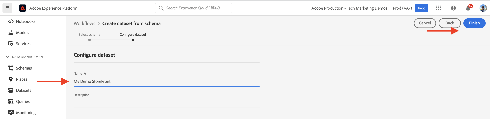

# Composants principaux AEM-CIF et intégration à Adobe Experience Platform {#aem-cif-aep-integration}

Les composants principaux [Commerce Integration Framework (CIF)](https://github.com/adobe/aem-core-cif-components) fournissent une intégration transparente à [Adobe Experience Platform](https://experienceleague.adobe.com/docs/experience-platform/landing/platform-overview.html), ce qui permet de transférer les événements de storefront et leurs données à partir d’interactions côté client, telles que l’__ajout au panier__.

Le projet de [Composants principaux AEM CIF](https://github.com/adobe/aem-core-cif-components) fournit une bibliothèque JavaScript appelée [Connecteur Adobe Experience Platform pour Adobe Commerce](https://github.com/adobe/aem-core-cif-components/tree/master/extensions/experience-platform-connector) afin de collecter des données d’événement à partir de votre storefront Commerce. Ces données d’événement sont envoyées à Experience Platform, où elles sont utilisées dans d’autres produits Adobe Experience Cloud, tels qu’Adobe Analytics et Adobe Target, pour créer un profil à 360 degrés couvrant un parcours client. En connectant les données de Commerce à d’autres produits dans Adobe Experience Cloud, vous pouvez exécuter des tâches comme analyser le comportement des utilisateurs et utilisatrices sur votre site, effectuer un AB Testing et créer des campagnes personnalisées.

En savoir plus sur la suite de technologies de [Collecte de données Experience Platform](https://experienceleague.adobe.com/docs/experience-platform/collection/home.html?lang=fr), qui vous permet de collecter des données d’expérience client à partir de sources côté client.

## Envoer des données d’événement `addToCart` vers Experience Platform {#send-addtocart-to-aep}

Les étapes suivantes indiquent comment envoyer les données d’événement `addToCart` des pages produits générées par AEM vers Experience Platform à l’aide du connecteur Experience Platform - CIF. L’extension de navigateur Adobe Experience Platform Debugger vous permet de tester et de passer en revue les données envoyées.


## Prérequis {#prerequisites}

Utilisez un environnement de développement local pour effectuer cette démonstration. Cela inclut une instance AEM en cours d’exécution configurée et connectée à une instance Adobe Commerce. Examinez les exigences et les étapes de [configuration du développement local avec AEM as a Cloud Service SDK.](/help/commerce-cloud/cif-storefront/develop.md)

Vous devez également accéder à [Adobe Experience Platform](https://experienceleague.adobe.com/docs/experience-platform/landing/platform-ui/ui-guide.html?lang=fr) et disposer des autorisations pour créer le schéma, le jeu de données et les flux de données pour la collecte de données. Pour plus d’informations, voir [Gestion des autorisations.](https://experienceleague.adobe.com/docs/experience-platform/collection/permissions.html?lang=fr)

## Configurer AEM Commerce as a Cloud Service {#aem-setup}

Pour bénéficier d’un environnement local __AEM Commerce as a Cloud Service__ fonctionnel avec le code et la configuration nécessaires, procédez comme suit.

### Configuration locale

Suivez les étapes [Configuration locale](/help/commerce-cloud/cif-storefront/develop.md#local-setup) pour bénéficier d’un environnement AEM Commerce as a Cloud Service fonctionnel.

### Configuration du projet

Suivez les étapes de l’[Archétype de projet AEM](/help/commerce-cloud/cif-storefront/develop.md#project) pour créer un tout nouveau projet AEM Commerce (CIF).

>[!TIP]
>
>Dans l’exemple suivant, le projet AEM Commerce se nomme `My Demo Storefront`. Vous pouvez toutefois choisir votre propre nom de projet.


Créez et déployez le projet AEM Commerce créé sur le SDK AEM local en exécutant la commande suivante à partir du répertoire racine du projet.

```bash
$ mvn clean install -PautoInstallSinglePackage
```

Le site Commerce `My Demo StoreFront` localement déployé avec le code et le contenu par défaut ressemble à ce qui suit :


### Installer des dépendances du connecteur CIF-AEP et de Peregrine

Pour collecter et envoyer les données d’événement à partir des pages de catégorie et de produit de ce site AEM Commerce, installez les packages de `npm` clés dans le module `ui.frontend` du projet AEM Commerce.

Accédez au module `ui.frontend` et installez les packages requis en exécutant les commandes suivantes à partir de la ligne de commande.

```bash
npm i --save lodash.get@^4.4.2 lodash.set@^4.3.2
npm i --save apollo-cache-persist@^0.1.1
npm i --save redux-thunk@~2.3.0
npm i --save @adobe/apollo-link-mutation-queue@~1.1.0
npm i --save @magento/peregrine@~12.5.0
npm i --save @adobe/aem-core-cif-react-components --force
npm i --save-dev @magento/babel-preset-peregrine@~1.2.1
npm i --save @adobe/aem-core-cif-experience-platform-connector --force
```

>[!IMPORTANT]
>
>L’argument `--force` est parfois requis, car [PWA Studio](https://developer.adobe.com/commerce/pwa-studio/) est restrictif avec les dépendances de pairs prises en charge. En règle générale, cela ne doit pas poser de problème.


### Configurer Maven pour utiliser l’argument `--force`

Dans le cadre du processus de création Maven, l’installation de nettoyage npm (à l’aide de `npm ci`) est déclenchée. Cela nécessite également l’argument `--force`.

Accédez au fichier POM racine `pom.xml` du projet et recherchez le bloc d’exécution `<id>npm ci</id>`. Mettez à jour le bloc pour qu’il ressemble à ce qui suit :

```xml
<execution>
    <id>npm ci</id>
    <goals>
    <goal>npm</goal>
    </goals>
    <configuration>
    <arguments>ci --force</arguments>
    </configuration>
</execution>
```

### Modifier le format de configuration Babel

Basculez depuis le format par défaut de fichier de configuration relative au fichier `.babelrc` au format `babel.config.js`. Il s’agit d’un format de configuration à l’échelle du projet qui permet d’appliquer les modules externes et les paramètres prédéfinis au `node_module` avec un meilleur contrôle.

1. Accédez au module `ui.frontend` et supprimer le fichier `.babelrc` existant.

1. Créez un fichier `babel.config.js` qui utilise le paramètre prédéfini `peregrine`.

   ```javascript
   const peregrine = require('@magento/babel-preset-peregrine');
   
   module.exports = (api, opts = {}) => {
       const config = {
           ...peregrine(api, opts),
           sourceType: 'unambiguous'
       } 
   
       config.plugins = config.plugins.filter(plugin => plugin !== 'react-refresh/babel');
   
       return config;
   }
   ```

### Configurer webpack pour l’utilisation de Babel

Pour transférer les fichiers JavaScript à l’aide du chargeur Babel (`babel-loader`) et de webpack, modifiez le fichier `webpack.common.js` .

Accédez au module `ui.frontend` et mettez à jour le fichier `webpack.common.js` afin que la règle suivante puisse être incluse dans la valeur de propriété `module` :

```javascript
{
    test: /\.jsx?$/,
    exclude: /node_modules\/(?!@magento\/)/,
    loader: 'babel-loader'
}
```

### Configurer le client Apollo

Le [client Apollo](https://www.apollographql.com/docs/react/) est utilisé pour gérer les données locales et distantes avec GraphQL. Il stocke également les résultats des requêtes GraphQL dans un cache local, normalisé et en mémoire.

Pour que [`InMemoryCache`](https://www.apollographql.com/docs/react/caching/cache-configuration/) fonctionne efficacement, vous avez besoin d’un fichier `possibleTypes.js`. Pour générer ce fichier, voir [Génération automatique de types possibles](https://www.apollographql.com/docs/react/data/fragments/#generating-possibletypes-automatically).

Voir également la section [Implémentation de référence PWA Studio](https://github.com/magento/pwa-studio/blob/1977f38305ff6c0e2b23a9da7beb0b2f69758bed/packages/pwa-buildpack/lib/Utilities/graphQL.js#L106-L120) et un exemple de fichier [`possibleTypes.js`](../assets/aep-integration/possibleTypes.js).

1. Accédez au module `ui.frontend` et enregistrez le fichier en tant que `./src/main/possibleTypes.js`.

1. Mettez à jour la section `webpack.common.js` du fichier `DefinePlugin` afin de remplacer les variables statiques requises pendant la génération.

   ```javascript
   const { DefinePlugin } = require('webpack');
   const { POSSIBLE_TYPES } = require('./src/main/possibleTypes');
   
   ...
   
   plugins: [
       ...
       new DefinePlugin({
           'process.env.USE_STORE_CODE_IN_URL': false,
           POSSIBLE_TYPES
       })
   ]
   ```

### Initialiser les composants principaux de Peregrine et CIF

Pour initialiser les composants principaux de CIF et Peregrine basés sur React, créez la configuration et les fichiers JavaScript requis.

1. Accédez au module `ui.frontend` et créez le dossier suivant : `src/main/webpack/components/commerce/App`.

1. Créez un fichier `config.js` avec le contenu suivant :

   ```javascript
   // get and parse the CIF store configuration from the <head>
   const storeConfigEl = document.querySelector('meta[name="store-config"]');
   const storeConfig = storeConfigEl ? JSON.parse(storeConfigEl.content) : {};
   
   // the following global variables are needed for some of the peregrine features
   window.STORE_VIEW_CODE = storeConfig.storeView || 'default';
   window.AVAILABLE_STORE_VIEWS = [
       {
           code: window.STORE_VIEW_CODE,
           base_currency_code: 'USD',
           default_display_currency_code: 'USD',
           id: 1,
           locale: 'en',
           secure_base_media_url: '',
           store_name: 'My Demo StoreFront'
       }
   ];
   window.STORE_NAME = window.STORE_VIEW_CODE;
   window.DEFAULT_COUNTRY_CODE = 'en';
   
   export default {
       storeView: window.STORE_VIEW_CODE,
       graphqlEndpoint: storeConfig.graphqlEndpoint,
       // Can be GET or POST. When selecting GET, this applies to cache-able GraphQL query requests only.
       // Mutations will always be executed as POST requests.
       graphqlMethod: storeConfig.graphqlMethod,
       headers: storeConfig.headers,
   
       mountingPoints: {
           // TODO: define the application specific mount points as they may be used by <Portal> and <PortalPlacer>
       },
       pagePaths: {
           // TODO: define the application specific paths/urls as they may be used by the components
           baseUrl: storeConfig.storeRootUrl
       },
       eventsCollector: {
           eventForwarding: {
               acds: true,
               aep: false,
           }
       }
   };
   ```

   >[!IMPORTANT]
   >
   >Bien que vous soyez peut-être déjà familiarisé(e) avec le fichier [`config.js`](https://github.com/adobe/aem-cif-guides-venia/blob/main/ui.frontend/src/main/components/App/config.js) de __AEM Guides - CIF Venia Project__, quelques modifications doivent être apportées à ce fichier. Tout d’abord, passez en revue les commentaires __Tâches__. Ensuite, à l’intérieur de la propriété `eventsCollector`, recherchez l’objet `eventsCollector > aep` et mettez à jour les propriétés `orgId` et `datastreamId` avec les valeurs correctes. [En savoir plus.](#add-aep-values-to-aem)

1. Créez un fichier `App.js` avec le contenu suivant. Ce fichier ressemble à un fichier de point de départ standard de l’application React et contient des crochets React et personnalisés, ainsi que l’utilisation de contexte React pour faciliter l’intégration d’Experience Platform.

   ```javascript
   import config from './config';
   
   import React, { useEffect } from 'react';
   import ReactDOM from 'react-dom';
   import { IntlProvider } from 'react-intl';
   import { BrowserRouter as Router } from 'react-router-dom';
   import { combineReducers, createStore } from 'redux';
   import { Provider as ReduxProvider } from 'react-redux';
   import { createHttpLink, ApolloProvider } from '@apollo/client';
   import { ConfigContextProvider, useCustomUrlEvent, useReferrerEvent, usePageEvent, useDataLayerEvents, useAddToCartEvent } from '@adobe/aem-core-cif-react-components';
   import { EventCollectorContextProvider, useEventCollectorContext } from '@adobe/aem-core-cif-experience-platform-connector';
   import { useAdapter } from '@magento/peregrine/lib/talons/Adapter/useAdapter';
   import { customFetchToShrinkQuery } from '@magento/peregrine/lib/Apollo/links';
   import { BrowserPersistence } from '@magento/peregrine/lib/util';
   import { default as PeregrineContextProvider } from '@magento/peregrine/lib/PeregrineContextProvider';
   import { enhancer, reducers } from '@magento/peregrine/lib/store';
   
   const storage = new BrowserPersistence();
   const store = createStore(combineReducers(reducers), enhancer);
   
   storage.setItem('store_view_code', config.storeView);
   
   const App = () => {
       const [{ sdk: mse }] = useEventCollectorContext();
   
       // trigger page-level events
       useCustomUrlEvent({ mse });
       useReferrerEvent({ mse });
       usePageEvent({ mse });
       // listen for add-to-cart events and enable forwarding to the magento storefront events sdk
       useAddToCartEvent(({ mse }));
       // enable CIF specific event forwarding to the Adobe Client Data Layer
       useDataLayerEvents();
   
       useEffect(() => {
           // implement a proper marketing opt-in, for demo purpose you hard-set the consent cookie
           if (document.cookie.indexOf('mg_dnt') < 0) {
               document.cookie += '; mg_dnt=track';
           }
       }, []);
   
       // TODO: use the App to create Portals and PortalPlaceholders to mount the CIF / Peregrine components to the server side rendered markup
       return <></>;
   };
   
   const AppContext = ({ children }) => {
       const { storeView, graphqlEndpoint, graphqlMethod = 'POST', headers = {}, eventsCollector } = config;
       const { apolloProps } = useAdapter({
           apiUrl: new URL(graphqlEndpoint, window.location.origin).toString(),
           configureLinks: (links, apiBase) =>
               // reconfigure the HTTP link to use the configured graphqlEndpoint, graphqlMethod and storeView header
   
               links.set('HTTP', createHttpLink({
                   fetch: customFetchToShrinkQuery,
                   useGETForQueries: graphqlMethod !== 'POST',
                   uri: apiBase,
                   headers: { ...headers, 'Store': storeView }
               }))
       });
   
       return (
           <ApolloProvider {...apolloProps}>
               <IntlProvider locale='en' messages={{}}>
                   <ConfigContextProvider config={config}>
                       <ReduxProvider store={store}>
                           <PeregrineContextProvider>
                               <EventCollectorContextProvider {...eventsCollector}>
                                   {children}
                               </EventCollectorContextProvider>
                           </PeregrineContextProvider>
                       </ReduxProvider>
                   </ConfigContextProvider>
               </IntlProvider>
           </ApolloProvider>
       );
   };
   
   window.onload = async () => {
       const root = document.createElement('div');
       document.body.appendChild(root);
   
       ReactDOM.render(
           <Router>
               <AppContext>
                   <App />
               </AppContext>
           </Router>,
           root
       );
   };
   ```

   Le `EventCollectorContext` exporte le contexte React qui :

   - charge la bibliothèque commerce-events-sdk et commerce-events-collector,
   - les initialise avec une configuration donnée pour Experience Platform et/ou ACDS,
   - et s’abonne à tous les événements de Peregrine et les transfère au SDK d’événements.

   Vous pouvez consulter les détails d’implémentation de `EventCollectorContext`. Voir [aem-core-cif-components sur GitHub.](https://github.com/adobe/aem-core-cif-components/blob/3d4e44d81fff2f398fd2376d24f7b7019f20b31b/extensions/experience-platform-connector/src/events-collector/EventCollectorContext.js)

### Créez et déployez le projet AEM mis à jour. {#build-and-deploy}

Pour vous assurer que les modifications de configuration, de code et d’installation du package ci-dessus sont correctes, recréez et déployez le projet AEM Commerce mis à jour à l’aide de la commande Maven suivante : `$ mvn clean install -PautoInstallSinglePackage`.

## Configurer Experience Platform {#aep-setup}

Pour recevoir et stocker les données d’événement provenant des pages d’AEM Commerce telles que la catégorie et le produit, effectuez les étapes suivantes :

>[!AVAILABILITY]
>
>Assurez-vous que vous faites partie des __Profils de produit__ corrects sous __Adobe Experience Platform__ et __Collecte de données Adobe Experience Platform__. Si nécessaire, contactez votre administrateur ou administratrice système pour créer, mettre à jour ou attribuer les __Profils de produit__ sous [Admin Console.](https://adminconsole.adobe.com/)

### Créer un schéma avec un groupe de champs Commerce {#create-schema}

Pour définir la structure des données d’événement de Commerce, vous devez créer un schéma de modèle de données d’expérience (XDM). Un schéma est un ensemble de règles qui représente et valide la structure et le format des données.

1. Dans le navigateur, accédez à la page d’accueil du produit __Adobe Experience Platform__. Par exemple, <https://experience.adobe.com/#/@YOUR-ORG-NAME/sname:prod/platform/home>.

1. Recherchez le menu __Schémas__ dans la section de navigation de gauche, cliquez sur le bouton __Créer un schéma__ dans la section supérieure droite, puis sélectionnez __XDM ExperienceEvent__.

   

1. Donnez un nom à votre schéma à l’aide du champ __Propriétés du schéma > Nom d’affichage__ et ajoutez des groupes de champs à l’aide du bouton __Composition > Groupes de champs > Ajouter__.

   

1. Dans la boîte de dialogue __Ajouter des groupes de champs__, recherchez `Commerce`, cochez la case __Détails de Commerce__, puis cliquez sur __Ajouter des groupes de champs__.

   


>[!TIP]
>
>Consultez la section [Principes de base de la composition des schémas](https://experienceleague.adobe.com/docs/experience-platform/xdm/schema/composition.html?lang=fr) pour plus d’informations.

### Créer un jeu de données {#create-dataset}

Pour stocker les données d’événement, vous devez créer un jeu de données conforme à la définition de schéma. Un jeu de données est une structure de stockage et de gestion pour la collecte de données, généralement sous la forme d’un tableau, qui contient un schéma (des colonnes) et des champs (des lignes).

1. Dans le navigateur, accédez à la page d’accueil du produit __Adobe Experience Platform__. Par exemple, <https://experience.adobe.com/#/@YOUR-ORG-NAME/sname:prod/platform/home>.

1. Recherchez le menu __Jeux de données__ dans la section de navigation de gauche, puis cliquez sur le bouton __Créer un jeu de données__ dans la section supérieure droite.

   

1. Sur la nouvelle page, sélectionnez la vignette __Créer un jeu de données à partir d’un schéma__.

   

   Sur la nouvelle page, __recherchez et sélectionnez__ le schéma que vous avez créé à l’étape précédente, puis cliquez sur le bouton __Suivant__.

   

1. Nommez votre jeu de données à l’aide du champ __Configurer le jeu de données > Nom__, puis cliquez sur le bouton __Terminer__.

   

>[!TIP]
>
>Consultez la [Présentation des jeux de données](https://experienceleague.adobe.com/docs/experience-platform/catalog/datasets/overview.html?lang=fr) pour plus d’informations.


### Créer un flux de données {#create-datastream}

Pour créer un flux de données dans Experience Platform, procédez comme suit.

1. Dans le navigateur, accédez à la page d’accueil du produit __Adobe Experience Platform__. Par exemple, <https://experience.adobe.com/#/@YOUR-ORG-NAME/sname:prod/platform/home>.

1. Recherchez le menu __Flux de données__ dans la section de navigation de gauche, puis cliquez sur le bouton __Nouveau flux de données__ dans la section supérieure droite.

   

1. Nommez votre flux de données à l’aide du champ __Nom__ obligatoire. Sous le champ __Schéma d’événement__, sélectionnez le schéma créé et cliquez sur __Enregistrer__.

   

1. Ouvrez le flux de données créé, puis cliquez sur __Ajouter un service__.

   

1. Sous le champ __Service__, sélectionnez l’option __Adobe Experience Platform__. Sous le champ __Jeu de données d’événement__, sélectionnez le nom du jeu de données de l’étape précédente et cliquez sur __Enregistrer__.

   

>[!TIP]
>
>Consultez la [Présentation des flux de données](https://experienceleague.adobe.com/docs/experience-platform/datastreams/overview.html?lang=fr) pour plus d’informations.

## Ajouter de la valeur du flux de données dans la configuration AEM Commerce {#add-aep-values-to-aem}

Une fois que vous avez terminé la configuration d’Experience Platform présentée ci-dessus, `datastreamId` doit apparaître dans le rail de gauche des détails du flux de données et `orgId` dans le coin supérieur droit de la fenêtre modale __Photo de profil > Informations du compte > Informations utilisateur__.


1. Dans le module `ui.frontend` du projet AEM Commerce, mettez à jour le fichier `config.js` et, plus précisément, les propriétés de l’objet `eventsCollector > aep`.

1. Créez et déployez le projet AEM Commerce mis à jour.


## Déclencher l’événement `addToCart` et vérifier la collecte de données {#event-trigger-verify}

Les étapes ci-dessus terminent la configuration d’AEM Commerce et d’Experience Platform. Vous pouvez désormais déclencher un événement `addToCart` et vérifier la collecte de données à l’aide du bouton (bascule) de l’extension Google Chrome _Inspecteur Snowplow_ et du jeu de données __Mesures et graphiques__ dans l’interface utilisateur du produit.

Pour déclencher l’événement, vous pouvez utiliser le service de création ou de publication d’AEM à partir de votre configuration locale. Pour cet exemple, utilisez le service de création d’AEM en vous connectant à votre compte.

1. Sur la page Sites, sélectionnez la page __My Demo StoreFront > us > en__ et cliquez sur __Modifier__ dans la barre d’action supérieure.

1. Dans la barre d’actions supérieure, cliquez sur __Afficher comme publié__, puis cliquez sur n’importe quelle catégorie souhaitée dans la navigation du storefront.

1. Cliquez sur n’importe quelle fiche produit souhaitée dans la __Page produit__, puis sélectionnez __couleur, taille__ pour activer le bouton __Ajouter au panier__.

1. Ouvrez l’extension __Snowplow Inspector__ dans le panneau d’extensions du navigateur et sélectionnez __Experience Platform Wed SDK__ dans le rail de gauche.

1. Revenez à la __Page produit__ et cliquez sur le bouton __Ajouter au panier__. Cela envoie les données à Experience Platform. L’extension __Adobe Experience Platform Debugger__ affiche les détails de l’événement.

   

1. Dans l’interface utilisateur du produit Experience Platform, accédez à __Jeux de données > My Demo StoreFront__ sous l’onglet __Activité du jeu de données__. Si __Mesures et graphiques__ est activé, les statistiques des données d’événement s’affichent.

   

## Détails d’implémentation {#implementation-details}

Le [connecteur Experience Platform CIF](https://github.com/adobe/aem-core-cif-components/tree/master/extensions/experience-platform-connector) repose sur la [connexion de données pour Adobe Commerce](https://commercemarketplace.adobe.com/magento-experience-platform-connector.html), qui fait partie du projet [PWA Studio](https://developer.adobe.com/commerce/pwa-studio/).

Le projet PWA Studio vous permet de créer des storefronts de Progressive Web Application (PWA) alimentés par Adobe Commerce ou Magento Open Source. Le projet contient également une bibliothèque de composants appelée [Peregrin](https://developer.adobe.com/commerce/pwa-studio/api/peregrine/) pour ajouter une logique aux composants visuels. La bibliothèque [Peregrin](https://developer.adobe.com/commerce/pwa-studio/api/peregrine/) fournit également les crochets React personnalisés utilisés par le connecteur CIF Experience Platform [&#128279;](https://github.com/adobe/aem-core-cif-components/tree/master/extensions/experience-platform-connector) pour une intégration transparente à Experience Platform.

## Événements pris en charge {#supported-events}

À ce jour, les événements suivants sont pris en charge :

__Événements Experience XDM :__

1. Ajouter au panier (AEM)
1. Afficher la page (AEM)
1. Afficher le produit (AEM)
1. Requête de recherche envoyée (AEM)
1. Réponse de recherche reçue (AEM)

Quand les [composants Peregrine &#x200B;](https://developer.adobe.com/commerce/pwa-studio/guides/packages/peregrine/) sont réutilisés dans le projet AEM Commerce :

__Événements Experience XDM :__

1. Supprimer du panier
1. Ouvrir le panier
1. Afficher le panier
1. Achat instantané
1. Commencer le passage en caisse
1. Terminer le passage en caisse

__Événements XDM de profil :__

1. Se connecter
1. Créer un compte
1. Modifier le compte

## Ressources supplémentaires {#additional-resources}

Pour plus d’informations, consultez les ressources suivantes :

- [PWA Studio](https://developer.adobe.com/commerce/pwa-studio/)
- [[!DNL Data Connection] présentation](https://experienceleague.adobe.com/docs/commerce-merchant-services/data-connection/overview.html)
- [[!DNL Data Connection] Événements](https://experienceleague.adobe.com/docs/commerce-merchant-services/data-connection/event-forwarding/events.html)
- [Vue d’ensemble d’Adobe Experience Platform](https://experienceleague.adobe.com/docs/experience-platform/landing/home.html?lang=fr)
