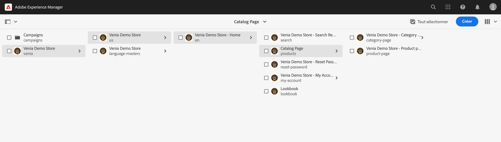
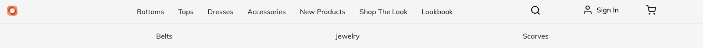
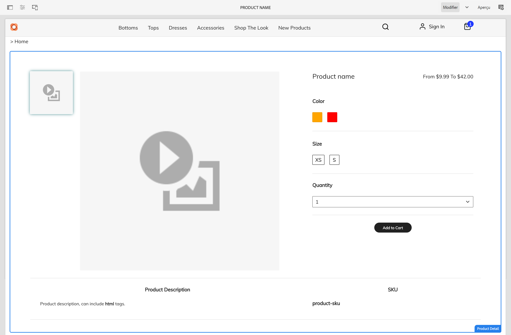
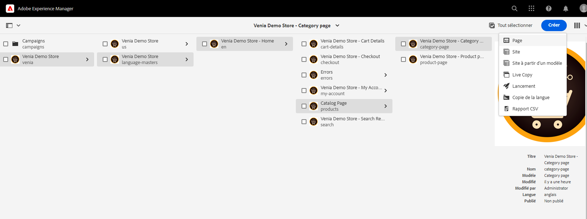
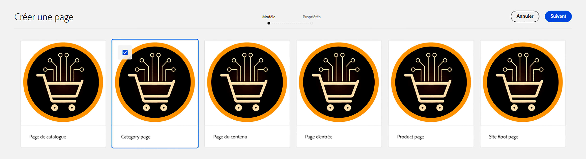
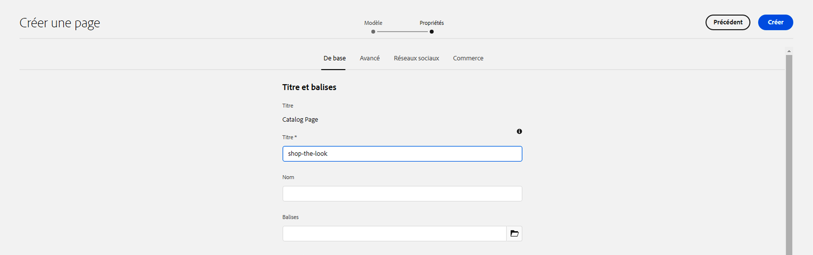
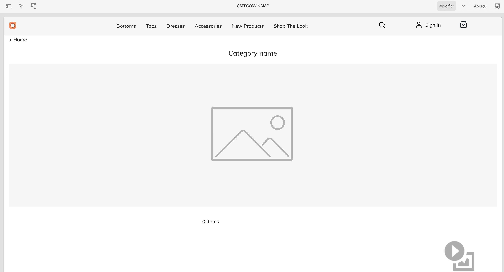
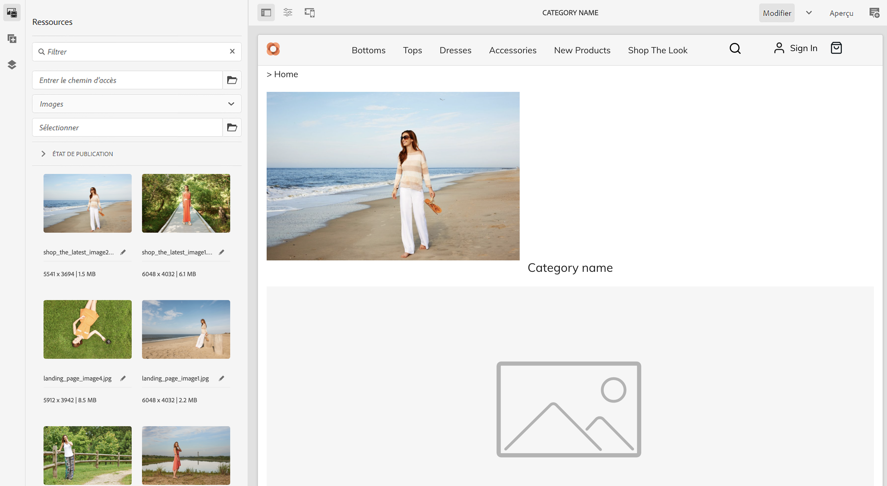
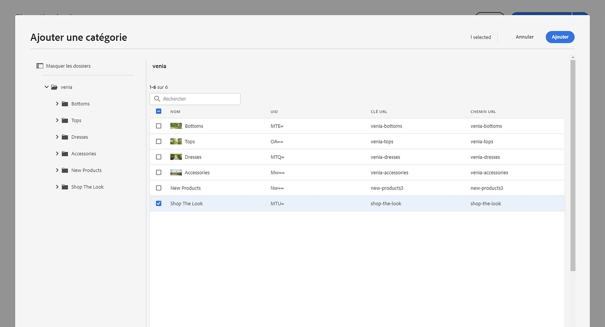
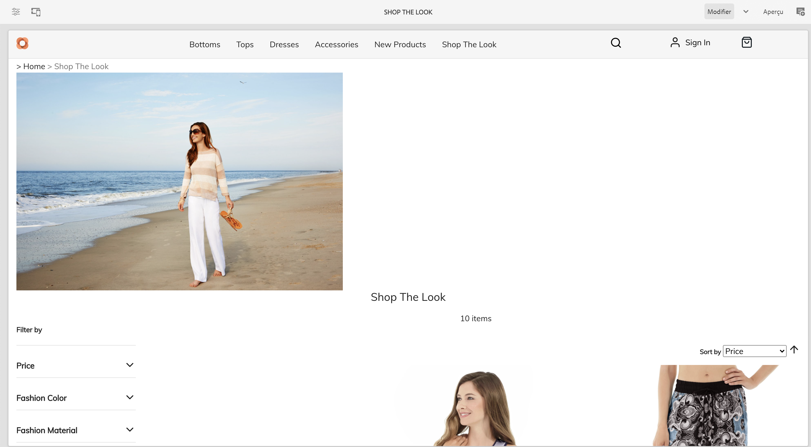

# Gestion des pages et des modèles de catalogue de produits {#product-catalog}

Découvrez comment gérer les pages et les modèles de catalogue de produits.

## Un peu d’histoire...  {#story-so-far}

Dans le document précédent du parcours de création de contenu et de commerce AEM, [Prise en main des bases de création AEM CIF](getting-started.md), vous avez appris les principes de base de la création CIF.

Cet article s&#39;appuie sur ces principes fondamentaux.

## Objectif {#objective}

Ce document vous aide à comprendre comment gérer les pages et les modèles de catalogue de produits. Après l’avoir lu, vous devriez :

* comprendre les concepts des modèles de catalogue ;
* fonctionnement des modèles génériques
* avoir créé un modèle individuel ;

## Le concept de base {#basic-concept}

Venia storefront est fourni avec une expérience de catalogue de produits typique avec des pages de navigation, d’entrée, de catégorie (PLP) et de détails de produit (PDP).

Les pages de catalogue sont créées dynamiquement à l’aide d’un modèle de catalogue CIF AEM et de données de produit en temps réel qui sont récupérées à partir du point de terminaison commercial, le cas échéant. Chaque catalogue comporte un modèle générique pour les pages de produits et de catégories.

Le composant de navigation affiche le contenu et les pages de catalogue. Il est possible d&#39;afficher la landing page du catalogue ou les catégories de premier niveau dans la navigation. Placer le pointeur de la souris sur une catégorie affiche les catégories de deuxième niveau sur une deuxième ligne.

Cliquez sur une catégorie pour ouvrir la page de catégorie (ou la page de liste de produits).

Cliquez sur un produit pour ouvrir la page des détails du produit.

## Les modèles {#templates}

### Modèles génériques {#generic}

Le modèle de catalogue Venia générique utilise le composant principal Liste de produits . Ce composant affiche l’image de catégorie, le cas échéant, et les produits de la catégorie.

Le modèle de produit Venia générique utilise le composant principal Détails du produit. Ce composant affiche des informations sur les produits pour divers types de produits et l’action de panier à ajouter.

### Modifier les modèles {#edit-templates}

Les modèles peuvent être modifiés en ouvrant directement la page du modèle ou en passant en mode d’édition lors de la navigation sur une page du catalogue de produits. Gardez à l’esprit que la modification de la page modifie le modèle et pas seulement la page spécifique du produit/de la catégorie.

### Modèles spécifiques à une catégorie ou à un produit {#specific}

CIF prend en charge plusieurs modèles en quelques clics seulement. Pour créer un autre modèle, sélectionnez le modèle générique dans la catégorie correspondante et créez une page à l’aide du **Créer** action.

Sélectionnez le produit ou le modèle de catégorie correspondant.

Saisissez le titre et créez la page.

Notez que vous disposez désormais d’un modèle spécifique sous le modèle générique.

Ouvrez le modèle. Il ressemble exactement au modèle de catégorie générique.

Ajoutez toute image en haut de la page.

Le modèle peut être prévisualisé avec n’importe quelle catégorie/produit. Ouvrir **Informations sur la page** puis sélectionnez **Afficher avec catégorie/produit**. Sélectionnez le produit/la catégorie dans le sélecteur pour obtenir un aperçu de ce produit/cette catégorie. Sélectionner **Magasiner le look** catégorie pour obtenir un aperçu du modèle mis à jour.

Nous devons maintenant affecter ce modèle à la catégorie spécifique. Ouvrez les propriétés dans le **Informations sur la page** et passez à l’onglet commerce . Cliquez sur l’icône du dossier pour sélectionner la variable **Magasiner le look** dans le sélecteur de catégorie. Il est possible d’affecter plusieurs catégories à un modèle et d’inclure également des sous-catégories en activant la case à cocher.

Revenez à la page d’accueil principale et cliquez sur **Magasiner le look** catégorie pour afficher le modèle spécifique. Toutes les autres catégories utilisent toujours le modèle générique.

Le même workflow peut être appliqué pour créer des modèles de produit individuels.

## Et après ? {#what-is-next}

Maintenant que vous avez terminé cette partie du parcours, vous devez :

* comprendre les concepts des modèles de catalogue ;
* fonctionnement des modèles génériques
* avoir créé un modèle individuel ;

Tirez parti de ces connaissances et poursuivez votre parcours en consultant le document. [Gestion des expériences de catalogue de produits étape par étape](staged-catalog.md), où vous apprendrez à utiliser des données de produit intermédiaires et des lancements AEM.

## Ressources supplémentaires {#additional-resources}

Bien qu’il soit recommandé de passer à la partie suivante du parcours en consultant le document [Gestion des expériences de catalogue de produits étape par étape](staged-catalog.md), voici quelques autres ressources facultatives qui approfondissent certains concepts mentionnés dans ce document, mais qui ne sont pas nécessaires pour continuer sur le parcours sans interface :

* [Création de plusieurs pages de catégories et de produits](/help/commerce-cloud/authoring/multi-template-usage.md)
* [Guide de migration du Experience Manager Cloud Service](/help/commerce-cloud/migration.md) - Comment migrer vers le module complémentaire CIF (Commerce Integration Framework) d’AEM à partir d’une ancienne version
