# Prise en main de la création de contenu à lʼaide de CIF pour AEM {#getting-started}

Découvrez la création de contenu à lʼaide de CIF pour AEM.

## Un peu d’histoire… {#story-so-far}

Dans le document précédent sur les fonctionnalités dʼAEM Content and Commerce, [En savoir plus sur AEM Content and Commerce](/help/commerce-cloud/introduction.md), vous avez appris les principes de base relatifs à un CMS sans interface et vous devriez maintenant comprendre les concepts de base régissant AEM Content and Commerce.

Cet article développe ces principes fondamentaux.

## Objectif {#objective}

Ce document vous aide à comprendre comment utiliser lʼextension CIF pour la création de contenu et de commerce spécifique. Après avoir lu ce document, vous devriez :

* Comprendre les concepts de création CIF à l’aide d’Universal Editor
* Être en mesure dʼaccéder aux données du catalogue de produits dans AEM à l’aide des sélecteurs de produits et de catégories.
* Comment accéder aux données Content and Commerce à l’aide du cockpit du produit et d’AEM Omnisearch

## Création de contenu à lʼaide de CIF dans l’éditeur universel {#cif-authoring}

Lʼextension CIF ajoute des fonctionnalités à lʼéditeur universel, lui permettant d’accéder aux données produit en temps réel, sans quitter le contexte :

Ouvrez le panneau latéral et sélectionnez « Produits » dans la liste déroulante.
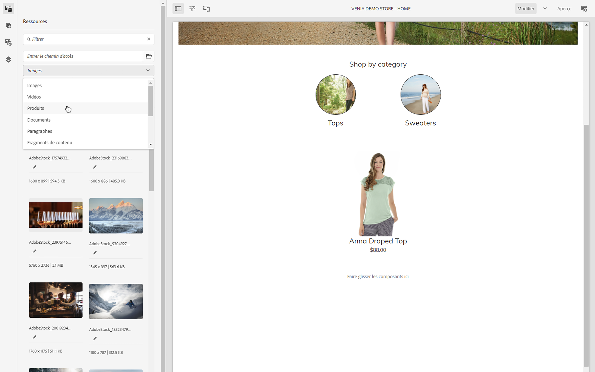

Vous pouvez parcourir le catalogue de produits ou utiliser le champ de recherche en texte intégral pour rechercher des produits.
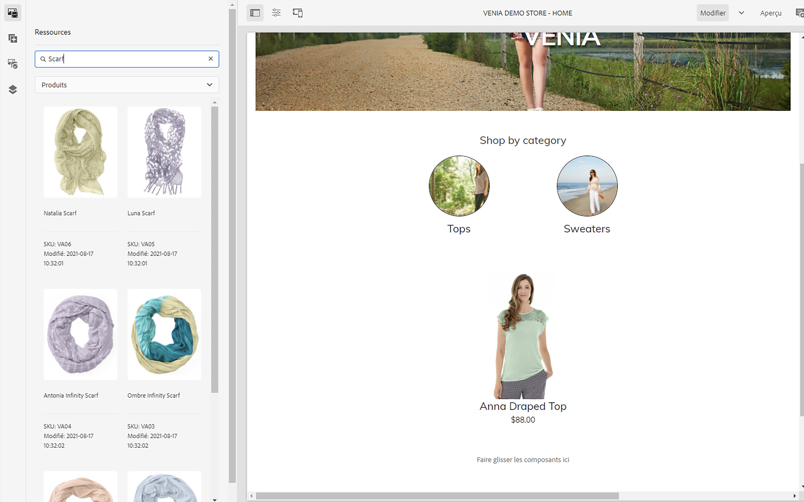

Les produits peuvent être déposés sur des composants qui prennent en charge le dépôt de produits (par exemple, le teaser du produit, le carrousel des produits) directement sur la page, ce qui crée automatiquement un composant teaser du produit.

## Sélecteurs de produits et de catégories {#pickers}

Si des données produit et de catégorie sont requises dans les composants commerciaux ou les boîtes de dialogue du back-office dʼAEM, les créateurs de contenu AEM peuvent utiliser des sélecteurs, qui sont des éléments de l’interface utilisateur permettant de rechercher et de sélectionner facilement les données du catalogue de produits.

### Sélecteur de produits

Cliquez sur l’icône de dossier pour ouvrir l’interface utilisateur modale de sélection (par exemple, le teaser de produit).
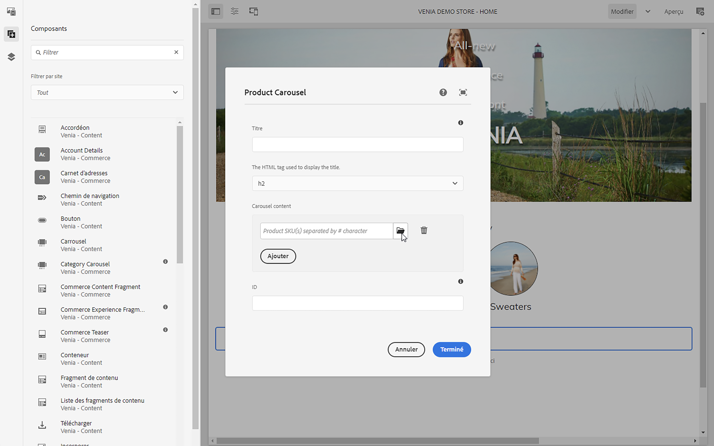

Les produits peuvent être trouvés en parcourant la structure du catalogue sur la gauche ou en effectuant une recherche. La recherche en texte intégral respecte la catégorie sélectionnée et limite les résultats de la recherche à cette catégorie.
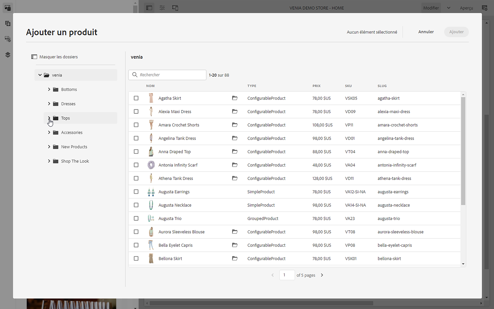

Les produits comportant des variantes sont marqués dʼune icône de dossier sur laquelle vous pouvez cliquer pour afficher toutes les variantes.
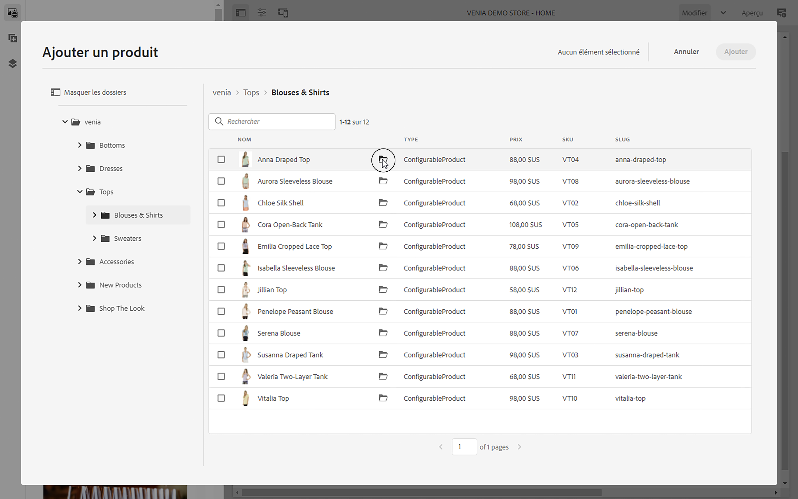
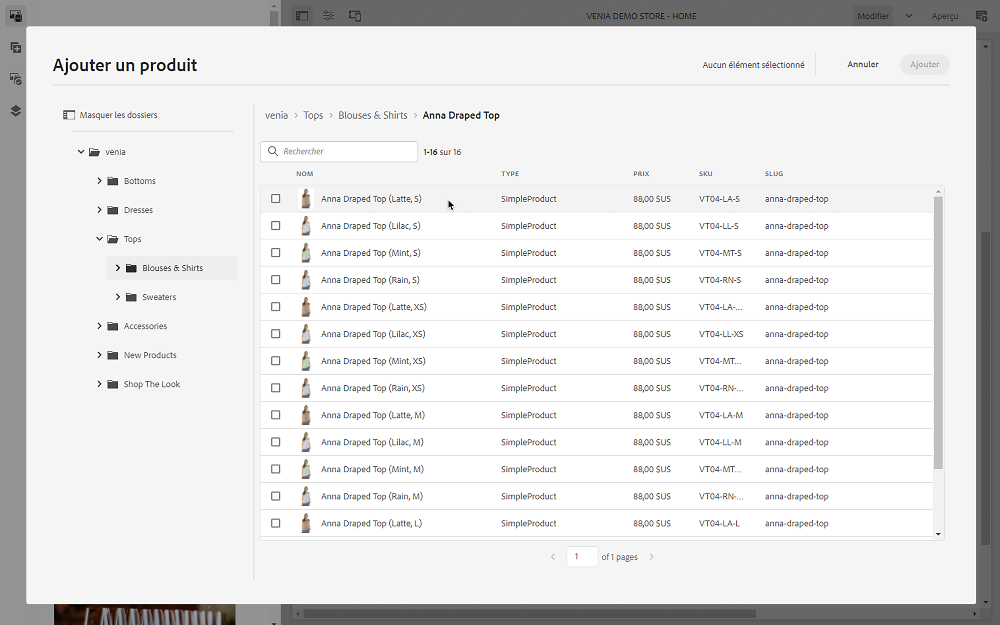

### Sélecteur de catégories

Son fonctionnement est similaire à un sélecteur de produits. Cliquez sur l’icône de dossier pour ouvrir l’interface utilisateur modale de sélection (carrousel des catégories, par exemple)
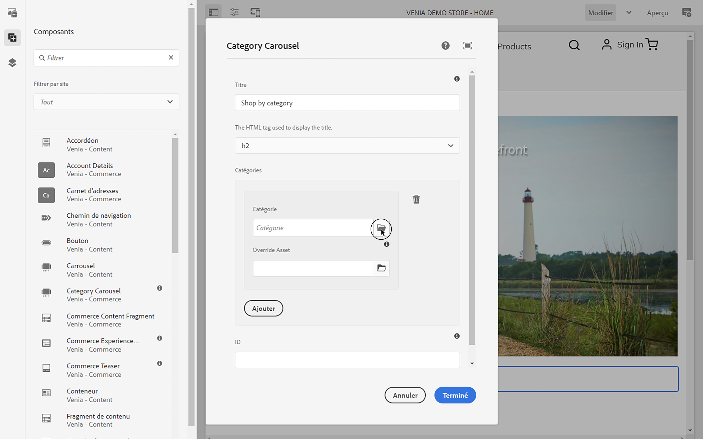

Parcourez la structure du catalogue sur la gauche et sélectionnez la catégorie.
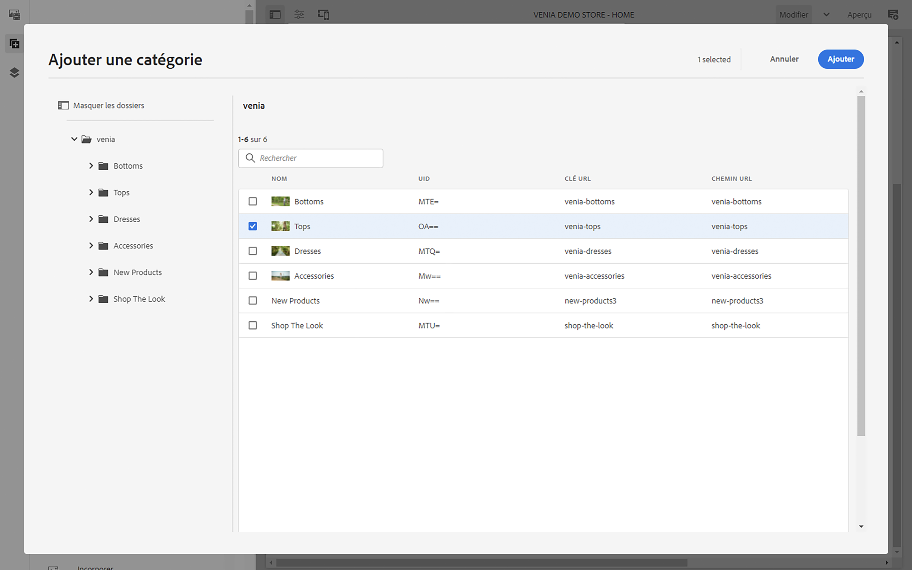

## Console du produit {#cockpit}

La console produit est un lieu central permettant dʼaccéder rapidement au catalogue de produits et à son contenu enrichi. Dans l’un des modules suivants, vous apprendrez à enrichir les données produit avec du contenu. Pour l’instant, concentrons-nous sur l’accès aux données produit.

Dans le menu principal, cliquez sur Commerce pour afficher la liste de tous les catalogues de produits associés.
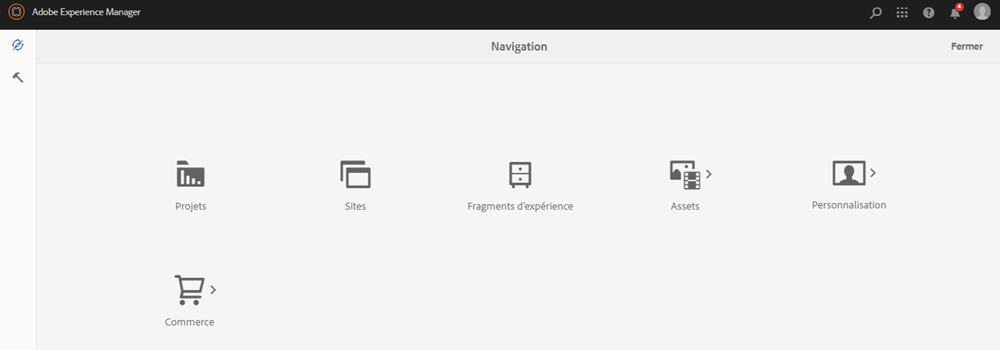

Une liste de tous les catalogues de produits connectés sʼaffiche.
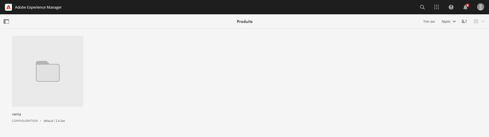

Le catalogue de produits affiche par défaut toutes les catégories de premier niveau avec tous les produits. Cliquez sur une catégorie pour afficher celle-ci avec tous les produits associés et les sous-catégories, y compris leurs produits.
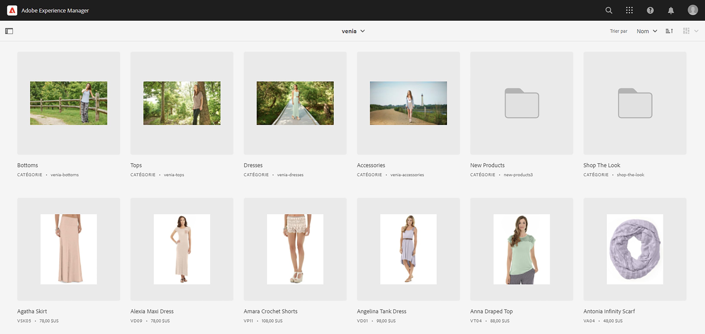

Vous pouvez ouvrir les propriétés du produit en cliquant sur l’icône de propriété. L’icône s’affiche en survolant une vignette de produit.
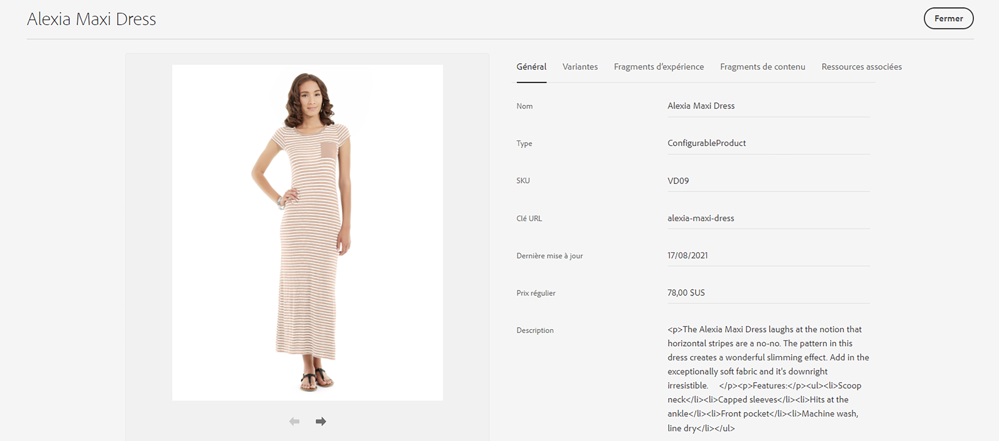

Toutes les propriétés du produit sont en lecture seule, car les données sont chargées en temps réel depuis le serveur principal connecté. La modification des propriétés du produit doit être effectuée dans le système principal, qui est le système d’enregistrement. Lʼonglet **Variantes** ne s’affiche que si le produit comporte des variantes. Cliquez sur l’onglet pour afficher toutes les variations avec leurs attributs.
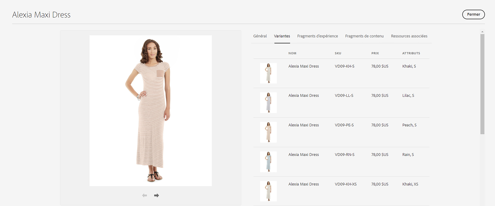

Les onglets restants affichent tout le contenu AEM associé au produit. Ces onglets seront discutés dans l’un des modules suivants.

## AEM Omnisearch {#omnisearch}

L’utilisation d&#39;Omnisearch est un moyen facile de trouver du contenu AEM à l’aide de la recherche de texte intégral. CIF étend Omnisearch à la recherche de texte intégral de catalogues de produits avec son contenu AEM associé.
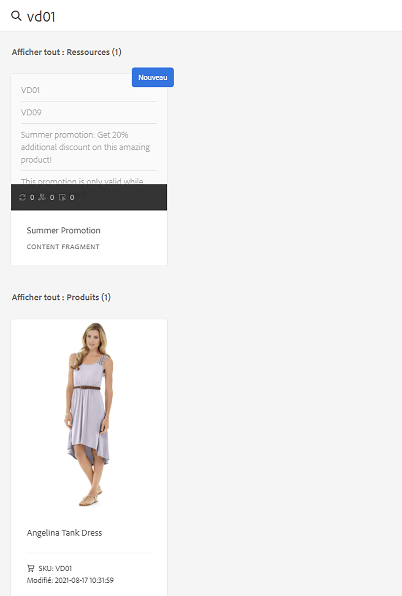

Omnisearch exécute une recherche de texte intégral dans le serveur principal du commerce pour trouver tous les produits associés. Le résultat est répertorié sous **Afficher tous les produits**. Omnisearch recherche également le contenu AEM associé au produit recherché. Les résultats sont répertoriés sous les catégories AEM respectives. Dans cet exemple, un fragment de contenu est lié au produit.

## Prochaines étapes {#what-is-next}

Maintenant que vous avez terminé cette partie du parcours, vous devriez :

* Comprendre les concepts de création CIF à l’aide d’Universal Editor
* Comment accéder au catalogue de produits dans AEM à l’aide des sélecteurs de produits et de catégories
* Comment accéder aux données Content and Commerce à l’aide du cockpit du produit et d’AEM Omnisearch

Tirez parti de ces connaissances et poursuivez votre parcours en consultant le document [Gérer les pages et les modèles de catalogue de produits](catalog-templates.md), où vous apprendrez à créer et à personnaliser votre première expérience de catalogue de produits.

## Ressources supplémentaires {#additional-resources}

Bien qu’il soit recommandé de passer à la partie suivante du parcours en examinant le document [Gérer les pages et les modèles de catalogues de produits](catalog-templates.md), vous trouverez ci-après quelques ressources facultatives supplémentaires pour approfondir un certain nombre de concepts mentionnés dans ce document, mais non obligatoires pour poursuivre le parcours.

* [Configuration des magasins et des catalogues](/help/commerce-cloud/getting-started.md#catalog)
