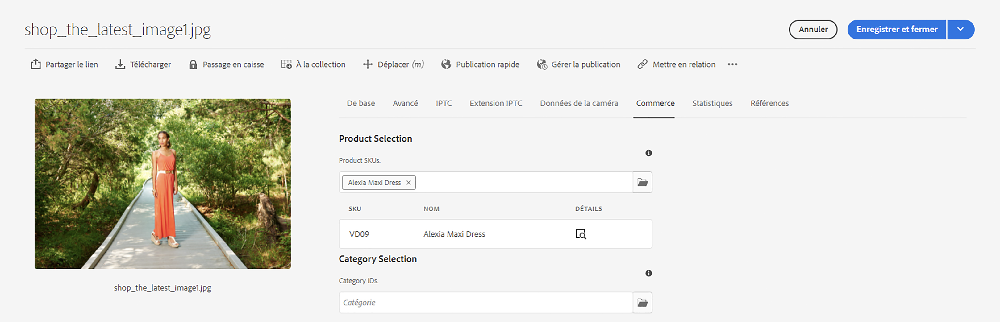
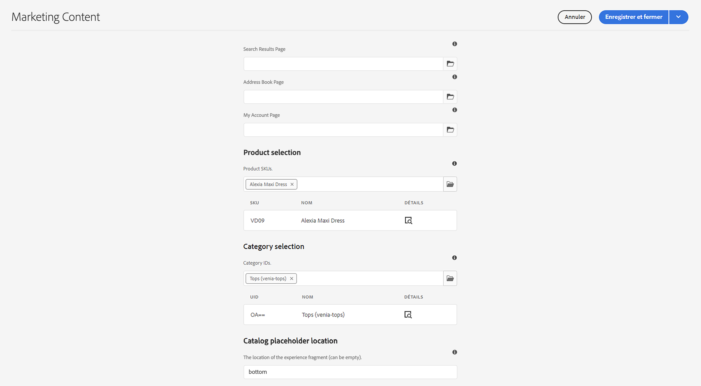
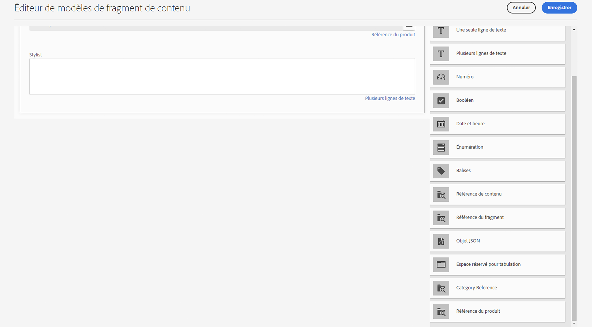
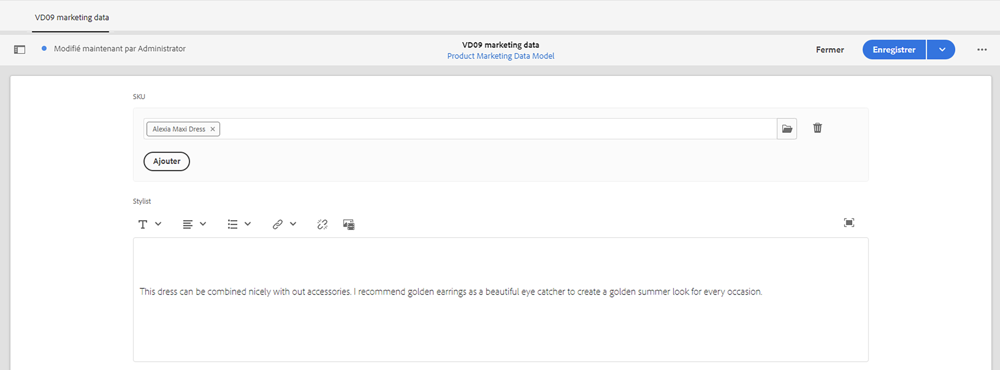
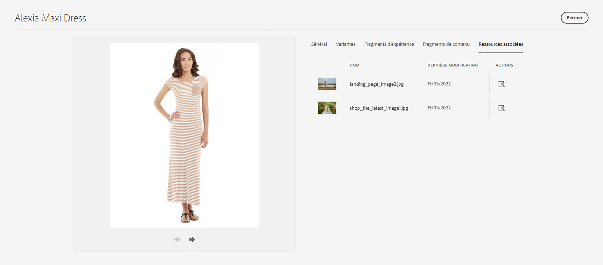
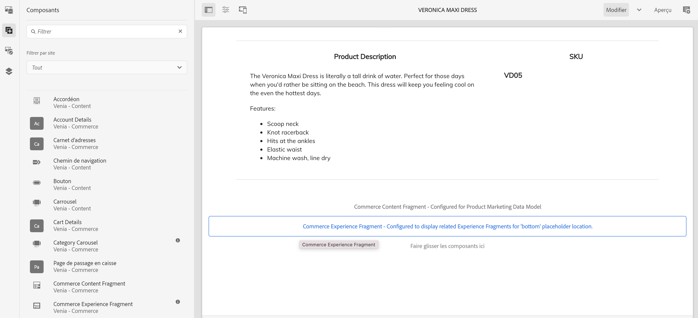
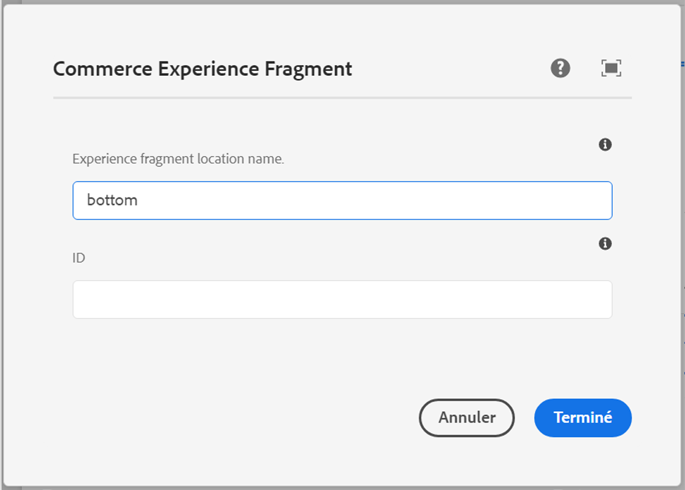
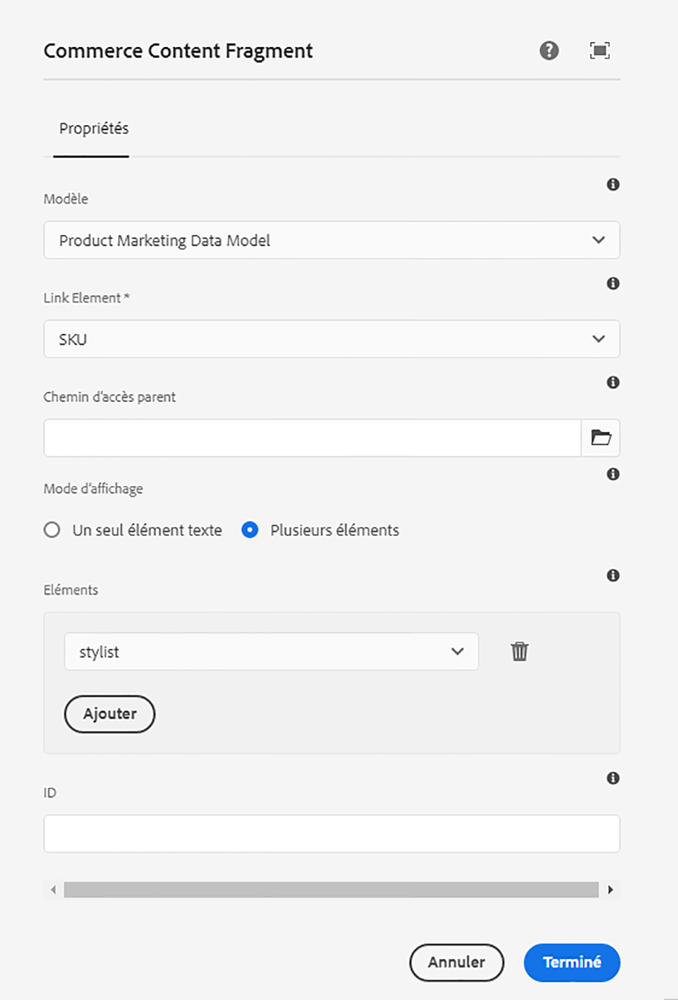
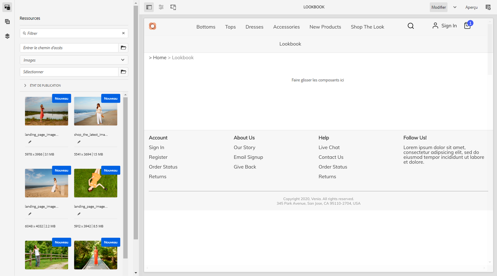
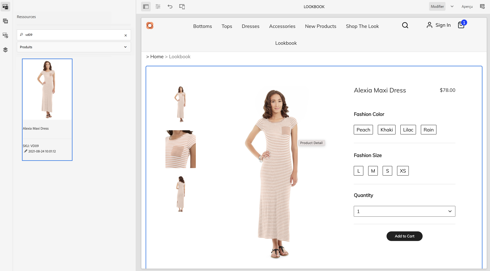

# Création d’expériences produit {#building-experiences}

Découvrez comment gérer les expériences produit.

## Un peu d’histoire… {#story-so-far}

Dans le document précédent du parcours de contenu et de commerce Adobe Experience Manager (AEM), [Gestion des expériences de catalogue de produits étape par étape](staged-catalog.md), vous avez appris à gérer des expériences de catalogue de produits intermédiaires.

## Objectif {#objective}

Ce document vous aide à comprendre comment créer des données et expériences produit.

## Gestion de lʼexpérience produit {#management}

La gestion de l’expérience produit est la discipline chargée dʼagrémenter les données produit (détenues par une PIM ou une solution de commerce) avec du contenu marketing dans AEM. Ces données produit enrichies de contenu peuvent ensuite être utilisées sur différents canaux pour créer une expérience dʼachat immersive.

Dans AEM, vous pouvez créer différents types de contenu et les lier au catalogue de produits. Le contenu associé peut être facilement découvert et utilisé, ce qui se traduit par une productivité élevée.

### Assets {#assets}

À un haut niveau, il existe deux types de ressources liées aux produits : produit et marketing. Les ressources de produit sont gérées par des commerçants et se concentrent sur l’affichage du produit (principalement devant un arrière-plan neutre). Les ressources sont gérées dans la solution de commerce ou dans AEM Assets (avec une intégration dʼAssets à la solution de commerce/PIM).

Les ressources marketing sont liées à la promotion et à l’utilisation du produit qui appartient au marketing. Il peut sʼagir, par exemple, de la présentation de plusieurs produits (« acheter le look »), dans un contexte spécifique (« collection dʼautomne pour lʼextérieur ») ou de fichiers PDF pratiques. CIF offre un moyen facile de lier n’importe quelle ressource AEM à un objet de catalogue de produits.

Ouvrez les propriétés de la ressource et accédez à lʼonglet **Commerce**. Cet onglet permet de gérer l&#39;association avec les produits. Le tableau situé sous le sélecteur fournit des informations supplémentaires sur les objets liés (visibles uniquement en cas de sélection). Cliquez sur l’icône de détails pour obtenir une vue complète du cockpit du produit. Pour associer un nouvel objet, cliquez sur l’icône de sélecteur de produits (icône de dossier), sélectionnez un objet et fermez le sélecteur.

### Fragments d’expérience {#experience-fragments}

Les fragments d’expérience sont un excellent moyen de créer du contenu de produit réutilisable ou individuel à grande échelle. L’association fonctionne de la même manière qu’une ressource. Ouvrez les propriétés et accédez à lʼonglet **Commerce**. Cet onglet permet de gérer l&#39;association avec les produits et les catégories. Les tableaux situés sous les sélecteurs fournissent des informations supplémentaires sur les objets liés (visibles uniquement en cas de sélection). Cliquez sur l’icône de détails pour obtenir une vue complète du cockpit du produit. Pour associer un nouvel objet, cliquez sur l’icône de sélecteur de produits (icône de dossier), sélectionnez un objet et fermez le sélecteur.

### Fragments de contenu {#content-fragments}

Les fragments de contenu constituent le meilleur type de contenu pour tout contenu structuré. Utilisez-les pour compléter les données produits externes par des données marketing supplémentaires ou pour créer du contenu sans interface utilisateur. L’association d’un fragment de contenu à un objet de catalogue de produits se fait par le biais des types de référence de produit ou de catégorie dans l’éditeur de modèle de fragment de contenu. Il suffit de faire glisser et de déposer le bon type de référence dans le modèle, puis de configurer le champ. Ces types prennent en charge la sélection unique ou multiple.

Si vous créez un fragment de contenu basé sur ce modèle, ces types de référence vous permettent de sélectionner facilement l’objet approprié à l’aide du sélecteur correspondant.

### Console du produit {#product-cockpit}

L’un des modules précédents vous a présenté le cockpit du produit (ou la console). La console constitue un moyen facile non seulement de parcourir le catalogue de produits, mais aussi de voir tout le contenu AEM associé en un seul endroit. Accédez à la console du produit et ouvrez les propriétés d’un produit auquel est associé un contenu. Accédez à l’onglet correspondant pour afficher le contenu associé.

Cliquez sur l’icône d’action pour ouvrir ce contenu dans un nouvel onglet du navigateur.

## Enrichissement de pages individuelles de produits et de catégories {#enrich}

Dans les modules précédents, vous avez appris à utiliser plusieurs modèles de catalogue de produits. Les modèles multiples sont un excellent moyen de créer des modèles différents, mais ils ne sont souvent pas nécessaires. Souvent, le même modèle peut être utilisé avec des espaces réservés pour le contenu individuel. CIF prend en charge les espaces réservés pour les fragments de contenu et les fragments d’expérience.

Commençons par l’espace réservé du fragment d’expérience. Ouvrez un modèle de produit dans l’éditeur d’AEM. Glissez-déposez le composant **Fragment d’expérience de commerce** sur le modèle, puis ouvrez la boîte de dialogue de configuration.

Ouvrez la boîte de dialogue du composant et saisissez un nom pour cet espace réservé. Un nom d’espace réservé est requis et vous permet d’ajouter autant d’espaces réservés que nécessaire.

Ouvrez le fragment d’expérience que vous avez associé à un produit à l’étape précédente. Ouvrez les propriétés et accédez à l’onglet Commerce. Saisissez le même nom d’espace réservé sous le **Emplacement de l’espace réservé du catalogue**.

Maintenant, glissez-déposez le composant **Fragment de contenu de commerce** sur le modèle et ouvrez la boîte de dialogue de configuration.

Cette boîte de dialogue réutilise la boîte de dialogue Fragment de contenu des composants principaux. Pour plus d’informations, voir Ressources supplémentaires. La seule différence est la propriété **Élément Link** qui configure le champ d’identifiant (SKU du produit ou UID de la catégorie) dans le modèle de fragment de contenu.

Prévisualisez maintenant une page de produit qui est associée à un fragment de contenu et/ou un fragment d’expérience. Lorsque AEM effectue le rendu d’une page, il effectue une recherche pour chaque espace réservé en fonction du type (Contenu ou Fragment d’expérience), de l’identifiant et du nom de l’espace réservé des fragments d’expérience. AEM utilise un résolveur d’URL pour obtenir l’identifiant (SKU pour les produits, UID pour les catégories). Si une expérience ou un fragment de contenu est renvoyé, il est rendu à l’emplacement de l’espace réservé, sinon l’espace réservé est ignoré.

## Rendre le contenu Shoppable {#making-shoppable}

Il est également possible de rendre une page d’AEM standard Shoppable en ajoutant des composants commerciaux. Créez une page de contenu dans AEM et ouvrez la page vide dans l’éditeur.

Tout d’abord, glissez-déposez un composant Détails du produit sur la page. Passez ensuite à la barre latérale Ressources, passez à Produits et sélectionnez un produit. Glissez-déposez ce produit sur le composant de produit. Cela affiche un composant de produit standard sur une page de contenu.

Si vous avez créé du contenu associé pour ce produit, basculez dans la barre latérale Ressources sur **Contenu commercial associé**. Cet onglet vous montre tout le contenu AEM associé à ce produit. Cela vous permet désormais d’embellir rapidement les pages avec tout contenu associé.

## Fin du parcours ? {#end-of-journey}

Félicitations ! Vous avez terminé le parcours du développeur d’AEM Content and Commerce ! Vous devez maintenant :

* comprendre comment associer n’importe quel contenu AEM à des objets de catalogue de produits ;
* utiliser des espaces réservés pour enrichir individuellement les pages de produits et de catégories ;
* savoir comment rendre le contenu Shoppable et utiliser l’onglet de contenu associé ;

Vous êtes maintenant prêt à gérer les expériences de produits à l’aide d’AEM Content and Commerce. Toutefois, AEM Content and Commerce disposent de nombreuses options supplémentaires. Extrayez certaines des ressources supplémentaires disponibles dans le [Section Ressources supplémentaires](#additional-resources) où vous pouvez en savoir plus sur les fonctionnalités que vous avez vues dans ce parcours.

## Ressources supplémentaires {#additional-resources}

* [Création d’expériences commerciales](/help/commerce-cloud/authoring/authoring-commerce-experiences.md)
* [Console du produit](/help/commerce-cloud/authoring/product-cockpit.md)
* [Composant de fragment de contenu](https://experienceleague.adobe.com/docs/experience-manager-core-components/using/wcm-components/content-fragment-component.html?lang=fr)
