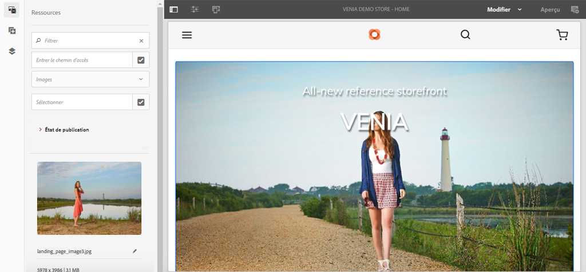
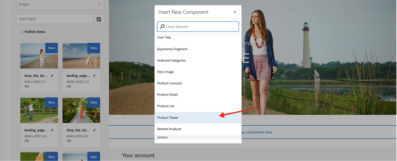
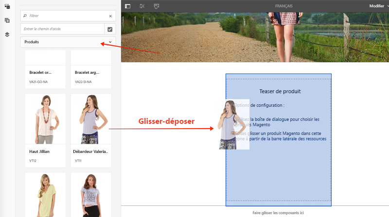
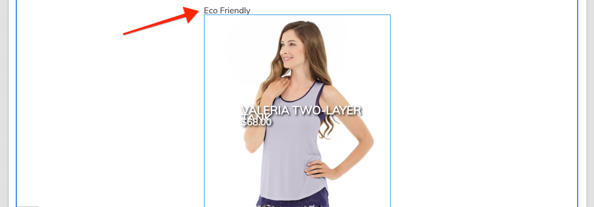

# Personnalisation des composants principaux CIF AEM {#customize-cif-components}

Le projet [](https://github.com/adobe/aem-cif-guides-venia) CIF Venia est une base de code de référence pour l&#39;utilisation des composants [principaux](https://github.com/adobe/aem-core-cif-components)CIF. Dans ce didacticiel, vous allez étendre davantage le composant [Product Teaser](https://github.com/adobe/aem-core-cif-components/tree/master/ui.apps/src/main/content/jcr_root/apps/core/cif/components/commerce/productteaser/v1/productteaser) pour afficher un attribut personnalisé du Magento. Vous en apprendrez davantage sur l&#39;intégration de GraphQL entre AEM et Magento et les crochets d&#39;extension fournis par les composants principaux du FIC.

>[!TIP]
>
> Utilisez l&#39;archétype [du projet](https://github.com/adobe/aem-project-archetype) AEM lors du démarrage de votre propre implémentation commerciale.

## Ce que vous allez construire

La marque Venia a récemment commencé à fabriquer certains produits à l&#39;aide de matériaux durables et l&#39;entreprise aimerait présenter un badge **écologique** dans le cadre du produit Teaser. Un nouvel attribut personnalisé sera créé en Magento pour indiquer si un produit utilise le matériau **écologique** . Cet attribut personnalisé sera ensuite ajouté dans le cadre de la requête GraphQL et affiché sur le produit Teaser pour les produits spécifiés.


## Conditions préalables {#prerequisites}

Un environnement de développement local est nécessaire pour compléter ce tutoriel. Cela inclut une instance en cours d’exécution d’AEM qui est configurée et connectée à une instance de Magento. Examinez les exigences et les étapes de la [configuration d’un développement local avec AEM comme SDK](../develop.md)Cloud Service. Pour suivre complètement le didacticiel, vous aurez besoin d&#39;autorisations pour ajouter des [attributs à un produit](https://docs.magento.com/user-guide/catalog/product-attributes-add.html) en Magento.

Vous aurez également besoin d&#39;un IDE GraphQL tel que [GraphiQL](https://github.com/graphql/graphiql) ou d&#39;une extension de navigateur pour exécuter les exemples de code et les didacticiels. Si vous installez une extension de navigateur, assurez-vous qu’elle permet de définir des en-têtes de requête. Sur Google Chrome, [Altair GraphQL Client](https://chrome.google.com/webstore/detail/altair-graphql-client/flnheeellpciglgpaodhkhmapeljopja) est une extension qui peut faire le travail.

## Cloner le projet Venia {#clone-venia-project}

Nous clonerons le projet [](https://github.com/adobe/aem-cif-guides-venia) Venia, puis nous remplacerons les styles par défaut.

>[!NOTE]
>
> **N&#39;hésitez pas à utiliser un projet** existant (basé sur l&#39;archétype de projet AEM avec CIF inclus) et ignorez cette section.

1. Exécutez la commande git suivante pour cloner le projet :

   ```shell
   $ git clone git@github.com:adobe/aem-cif-guides-venia.git
   ```

1. Créez et déployez le projet sur une instance locale d’AEM :

   ```shell
   $ cd aem-cif-guides-venia/
   $ mvn clean install -PautoInstallPackage,cloud
   ```

1. ajoutez les configurations OSGi nécessaires pour connecter votre instance AEM à une instance de Magento ou ajoutez les configurations au projet nouvellement créé.

1. A ce stade, vous devez disposer d&#39;une version fonctionnelle d&#39;une vitrine connectée à une instance de Magento. Accédez à la page `US` > `Home` à l’adresse suivante : [http://localhost:4502/editor.html/content/venia/us/en.html](http://localhost:4502/editor.html/content/venia/us/en.html).

   Vous devriez voir que la vitrine utilise actuellement le thème Venia. En développant le menu principal de la vitrine, vous devriez voir différentes catégories, indiquant que le Magento de connexion fonctionne.

   

## Auteur du produit Teaser {#author-product-teaser}

Le composant Teaser du produit sera étendu tout au long de ce tutoriel. Dans un premier temps, ajoutez une nouvelle instance de Product Teaser à la Page d&#39;accueil pour comprendre la fonctionnalité de base.

1. Accédez à la **Page d&#39;accueil** du site : [http://localhost:4502/editor.html/content/acme/us/en.html](http://localhost:4502/editor.html/content/acme/us/en.html)

2. Insérez un nouveau composant **Produit Teaser** dans le conteneur de mise en page principal de la page.

   

3. Développez le panneau latéral (s’il n’est pas déjà activé) et basculez la liste déroulante de recherche de ressources sur **Produits**. Ceci devrait afficher une liste de produits disponibles à partir d’une instance de Magento connectée. Sélectionnez un produit et **faites-le glisser** sur le composant **Produit Teaser** de la page.

   

   >[!NOTE]
   >
   > Remarque : vous pouvez également configurer le produit affiché en configurant le composant à l’aide de la boîte de dialogue (en cliquant sur l’icône de *clé à molette* ).

4. Vous devriez maintenant voir un produit affiché par le Teaser de produit. Le nom du produit et le prix du produit sont des attributs par défaut affichés.

   

## ajouter un attribut personnalisé dans le Magento {#add-custom-attribute}

Les produits et les données de produit affichées dans AEM sont stockés dans le Magento. Ajoutez ensuite un nouvel attribut pour **Eco Friendly** dans l’attribut de produit défini à l’aide de l’interface utilisateur du Magento.

>[!TIP]
>
> Avez-vous déjà un attribut **Oui/Non** personnalisé dans votre jeu d&#39;attributs de produit ? N’hésitez pas à l’utiliser et à ignorer cette section.

1. Connectez-vous à votre instance de Magento.
1. Accédez à **Catalogue** > **Produits**.
1. Mettez à jour le filtre de recherche pour trouver le produit **** configurable utilisé lors de son ajout au composant Teaser dans l’exercice précédent. Ouvrez le produit en mode d’édition.

   

1. Dans la vue de produits, cliquez sur **Ajouter attribut** > **Créer un attribut**.
1. Remplissez le formulaire **Nouvel attribut** avec les valeurs suivantes (laissez les paramètres par défaut pour les autres valeurs).

   | Jeu de champs | Libellé du champ | Valeur |
   |-----------|-------------|---------|
   | Propriétés d’attribut | Étiquette d&#39;attribut | **Éco convivial** |
   | Propriétés d’attribut | Type d’entrée du catalogue | **Oui/Non** |
   | Propriétés d’attribut avancées | Code d’attribut | **eco_friendly** |

   

   Click **Save Attribute** when finished.

1. Faites défiler la page jusqu’au bas du produit et développez l’en-tête **Attributs** . Vous devriez voir le nouveau champ **écologique** . Bascule sur **Oui**.

   

   **Enregistrez** les modifications apportées au produit.

   >[!TIP]
   >
   > Pour plus d’informations sur la gestion des attributs [de produit, consultez le guide](https://docs.magento.com/user-guide/catalog/attribute-best-practices.html)d’utilisation du Magento.

1. Accédez à **System** > **Tools** > **Cache Management**. Comme une mise à jour a été effectuée sur le schéma de données, nous devons invalider certains types de cache dans le Magento.
1. Cochez la case en regard de **Configuration** et envoyez le type de cache pour **Actualiser.**

   

   >[!TIP]
   >
   > Pour plus d’informations sur la gestion du [cache, consultez le guide](https://docs.magento.com/user-guide/system/cache-management.html)d’utilisation du Magento.

## Utiliser un IDE GraphQL pour vérifier l&#39;attribut {#use-graphql-ide}

Avant de passer au code AEM, il est utile d&#39;explorer GraphQL [](https://devdocs.magento.com/guides/v2.4/graphql/) Magento à l&#39;aide d&#39;un IDE GraphQL. L&#39;intégration du Magento avec l&#39;AEM se fait principalement par le biais d&#39;une série de requêtes GraphQL. Comprendre et modifier les requêtes GraphQL est l&#39;un des principaux moyens d&#39;étendre les composants de base CIF.

Ensuite, utilisez un IDE GraphQL pour vérifier que l&#39; `eco_friendly` attribut a été ajouté au jeu d&#39;attributs du produit. Les captures d&#39;écran de ce didacticiel utilisent le client [Altair GraphQL](https://chrome.google.com/webstore/detail/altair-graphql-client/flnheeellpciglgpaodhkhmapeljopja).

1. Ouvrez l&#39;IDE GraphQL et entrez l&#39;URL `http://<magento-server>/graphql` dans la barre d&#39;URL de votre IDE ou extension.
2. ajoutez la requête [de](https://devdocs.magento.com/guides/v2.4/graphql/queries/products.html) produits suivante où `YOUR_SKU` correspond au SKU **** du produit utilisé lors de l’exercice précédent :

   ```json
     {
       products(
       filter: { sku: { eq: "YOUR_SKU" } }
       ) {
           items {
           name
           sku
           eco_friendly
           }
       }
   }
   ```

3. Exécutez la requête et obtenez une réponse comme celle-ci :

   ```json
   {
   "data": {
       "products": {
           "items": [
               {
               "name": "Valeria Two-Layer Tank",
               "sku": "VT11",
               "eco_friendly": 1
               }
           ]
           }
       }
   }
   ```

   

   Notez que la valeur de **Yes** est un entier de **1**. Cela sera utile lorsque nous écrirons la requête GraphQL dans Java.

   >[!TIP]
   >
   > Une documentation plus détaillée sur [Magento GraphQL est disponible ici](https://devdocs.magento.com/guides/v2.4/graphql/index.html).

## Mettre à jour le modèle Sling pour le produit Teaser {#updating-sling-model-product-teaser}

Ensuite, nous étendrons la logique métier de Product Teaser en implémentant un modèle Sling. [Les modèles](https://sling.apache.org/documentation/bundles/models.html)Sling sont des &quot;POJO&quot; pilotés par les annotations (objets Java standard) qui implémentent toute logique métier nécessaire au composant. Les modèles Sling sont utilisés conjointement avec les scripts HTL dans le cadre du composant. Nous suivrons le modèle de [délégation pour les modèles](https://github.com/adobe/aem-core-wcm-components/wiki/Delegation-Pattern-for-Sling-Models) Sling afin que nous puissions simplement étendre certaines parties du modèle existant de Teaser produit.

Les modèles Sling sont implémentés en tant que Java et se trouvent dans le module **principal** du projet généré.

Utilisez [l&#39;IDE de votre choix](https://docs.adobe.com/content/help/en/experience-manager-learn/cloud-service/local-development-environment-set-up/development-tools.html#set-up-the-development-ide) pour importer le projet Venia. Les captures d&#39;écran utilisées proviennent de l&#39;IDE [](https://docs.adobe.com/content/help/en/experience-manager-learn/cloud-service/local-development-environment-set-up/development-tools.html#microsoft-visual-studio-code)Visual Studio Code.

1. Dans votre IDE, naviguez sous le module **principal** pour : `core/src/main/java/com/venia/core/models/commerce/MyProductTeaser.java`.

   

   `MyProductTeaser.java` est une interface Java qui étend l’interface CIF [ProductTeaser](https://github.com/adobe/aem-core-cif-components/blob/master/bundles/core/src/main/java/com/adobe/cq/commerce/core/components/models/productteaser/ProductTeaser.java) .

   Une nouvelle méthode a déjà été ajoutée pour afficher un badge si le produit est considéré comme &quot;nouveau&quot; `isShowBadge()` .

1. ajoutez une nouvelle méthode `isEcoFriendly()` à l’interface :

   ```java
   @ProviderType
   public interface MyProductTeaser extends ProductTeaser {
       // Extend the existing interface with the additional properties which you
       // want to expose to the HTL template.
       public Boolean isShowBadge();
   
       public Boolean isEcoFriendly();
   }
   ```

   Il s&#39;agit d&#39;une nouvelle méthode que nous allons introduire pour encapsuler la logique afin d&#39;indiquer si l&#39;attribut `eco_friendly` du produit est défini sur **Oui** ou **Non**.

1. Ensuite, inspectez le `MyProductTeaserImpl.java` à `core/src/main/java/com/venia/core/models/commerce/MyProductTeaserImpl.java`.

   Le modèle de [délégation pour les modèles](https://github.com/adobe/aem-core-wcm-components/wiki/Delegation-Pattern-for-Sling-Models) Sling permet `MyProductTeaserImpl` de référencer le modèle `ProductTeaser` via la propriété `sling:resourceSuperType` :

   ```java
   @Self
   @Via(type = ResourceSuperType.class)
   private ProductTeaser productTeaser;
   ```

   Pour toutes les méthodes que nous ne voulons pas remplacer ou modifier, nous pouvons simplement renvoyer la valeur `ProductTeaser` renvoyée. Par exemple :

   ```java
   @Override
   public String getImage() {
       return productTeaser.getImage();
   }
   ```

   Cela réduit la quantité de code Java qu’une implémentation doit écrire.

1. L&#39;un des points d&#39;extension supplémentaires fournis par AEM CIF Core Components est celui `AbstractProductRetriever` qui permet d&#39;accéder à des attributs de produits spécifiques. inspect à la `initModel()` méthode :

   ```java
   import javax.annotation.PostConstruct;
   ...
   @Model(adaptables = SlingHttpServletRequest.class, adapters = MyProductTeaser.class, resourceType = MyProductTeaserImpl.RESOURCE_TYPE)
   public class MyProductTeaserImpl implements MyProductTeaser {
       ...
       private AbstractProductRetriever productRetriever;
   
       /* add this method to intialize the proudctRetriever */
       @PostConstruct
       public void initModel() {
           productRetriever = productTeaser.getProductRetriever();
   
           if (productRetriever != null) {
               productRetriever.extendProductQueryWith(p -> p.createdAt());
           }
   
       }
   ...
   ```

   L’ `@PostConstruct` annotation garantit que cette méthode est appelée dès que le modèle Sling est initialisé.

   Notez que la requête GraphQL du produit a déjà été étendue à l&#39;aide de la `extendProductQueryWith` méthode pour récupérer l&#39;attribut supplémentaire `created_at` . Cet attribut est ensuite utilisé dans le cadre de la `isShowBadge()` méthode.

1. Mettez à jour la requête GraphQL pour inclure l’ `eco_friendly` attribut dans la requête partielle :

   ```java
   //MyProductTeaserImpl.java
   
   private static final String ECO_FRIENDLY_ATTRIBUTE = "eco_friendly";
   
   @PostConstruct
   public void initModel() {
       productRetriever = productTeaser.getProductRetriever();
   
       if (productRetriever != null) {
           productRetriever.extendProductQueryWith(p ->
                productRetriever.extendProductQueryWith(p -> p
                   .createdAt()
                   .addCustomSimpleField(ECO_FRIENDLY_ATTRIBUTE)
               );
           );
       }
   }
   ```

   ajouter à la `extendProductQueryWith` méthode est un moyen puissant de s&#39;assurer que d&#39;autres attributs de produit sont disponibles pour le reste du modèle. Elle permet également de réduire le nombre de requêtes exécutées.

   Dans le code ci-dessus, les`addCustomSimpleField` est utilisé pour récupérer l’ `eco_friendly` attribut. Ceci illustre comment vous pouvez requête pour les attributs personnalisés qui font partie du schéma du Magento.

   >[!NOTE]
   >
   > La `createdAt()` méthode a en fait été implémentée dans le cadre de l&#39;interface [](https://github.com/adobe/commerce-cif-magento-graphql/blob/master/src/main/java/com/adobe/cq/commerce/magento/graphql/ProductInterface.java)du produit. La plupart des attributs de schéma les plus courants ont été implémentés, utilisez donc uniquement la `addCustomSimpleField` pour les attributs réellement personnalisés.

1. ajoutez une journalisation pour aider à déboguer le code Java :

   ```java
   import org.slf4j.Logger;
   import org.slf4j.LoggerFactory;
   ...
   @Model(adaptables = SlingHttpServletRequest.class, adapters = MyProductTeaser.class, resourceType = MyProductTeaserImpl.RESOURCE_TYPE)
   public class MyProductTeaserImpl implements MyProductTeaser {
   
   private static final Logger LOGGER = LoggerFactory.getLogger(MyProductTeaserImpl.class);
   ```

1. Ensuite, implémentez la `isEcoFriendly()` méthode :

   ```java
   @Override
   public Boolean isEcoFriendly() {
   
       Integer ecoFriendlyValue;
       try {
           ecoFriendlyValue = productRetriever.fetchProduct().getAsInteger(ECO_FRIENDLY_ATTRIBUTE);
           if(ecoFriendlyValue != null && ecoFriendlyValue.equals(Integer.valueOf(1))) {
               LOGGER.info("*** Product is Eco Friendly**");
               return true;
           }
       } catch (SchemaViolationError e) {
           LOGGER.error("Error retrieving eco friendly attribute");
       }
       LOGGER.info("*** Product is not Eco Friendly**");
       return false;
   }
   ```

   Dans la méthode ci-dessus, `productRetriever` est utilisé pour récupérer le produit et la `getAsInteger()` méthode est utilisée pour obtenir la valeur de l&#39; `eco_friendly` attribut. Selon les requêtes GraphQL que nous avons exécutées précédemment, nous savons que la valeur attendue lorsque l’ `eco_friendly` attribut est défini sur &quot;**Yes**&quot; est en fait un entier de **1**.

   Maintenant que le modèle Sling a été mis à jour, l’annotation de composant doit être mise à jour pour afficher un indicateur d’ **éco-compatible** basé sur le modèle Sling.

## Personnalisation de l&#39;annotation du produit Teaser {#customize-markup-product-teaser}

Une extension courante des composants AEM consiste à modifier l’annotation générée par le composant. Pour ce faire, il doit remplacer le script [](https://docs.adobe.com/content/help/fr-FR/experience-manager-htl/using/overview.html) HTL utilisé par le composant pour effectuer le rendu de son balisage. HTML Template Language (HTL) est un langage de modèle léger que AEM composants utilisent pour générer dynamiquement des balises en fonction du contenu créé, ce qui permet de réutiliser les composants. Le produit Teaser, par exemple, peut être réutilisé plusieurs fois pour afficher différents produits.

Dans notre cas, nous voulons rendre une bannière au-dessus du teaser pour indiquer que le produit est &quot;écologique&quot; basé sur un attribut personnalisé. Le modèle de conception permettant de [personnaliser l’annotation](https://docs.adobe.com/content/help/en/experience-manager-core-components/using/developing/customizing.html#customizing-the-markup) d’un composant est en fait standard pour tous les composants AEM, et pas seulement pour les composants CIF Core AEM.

1. Dans l&#39;IDE, naviguez et développez le `ui.apps` module et développez la hiérarchie de dossiers pour : `ui.apps/src/main/content/jcr_root/apps/venia/components/commerce/productteaser` et inspecter le `.content.xml` dossier.

   

   ```xml
   <?xml version="1.0" encoding="UTF-8"?>
   <jcr:root xmlns:sling="http://sling.apache.org/jcr/sling/1.0" xmlns:cq="http://www.day.com/jcr/cq/1.0" xmlns:jcr="http://www.jcp.org/jcr/1.0"
       jcr:description="Product Teaser Component"
       jcr:primaryType="cq:Component"
       jcr:title="Product Teaser"
       sling:resourceSuperType="core/cif/components/commerce/productteaser/v1/productteaser"
       componentGroup="Venia - Commerce"/>
   ```

   Ci-dessus, la définition de composant pour le composant Teaser du produit dans notre projet. Notez la propriété `sling:resourceSuperType="core/cif/components/commerce/productteaser/v1/productteaser"`. Il s&#39;agit d&#39;un exemple de création d&#39;un composant [](https://docs.adobe.com/content/help/en/experience-manager-core-components/using/get-started/using.html#create-proxy-components)Proxy. Au lieu de copier et de coller tous les scripts HTML de Product Teaser à partir des composants principaux CIF AEM, nous pouvons utiliser le `sling:resourceSuperType` pour hériter de toutes les fonctionnalités.

1. Open the file `productteaser.html`. Il s&#39;agit d&#39;une copie du `productteaser.html` fichier du [CIF Product Teaser.](https://github.com/adobe/aem-core-cif-components/blob/master/ui.apps/src/main/content/jcr_root/apps/core/cif/components/commerce/productteaser/v1/productteaser/productteaser.html)

   ```html
   <!--/* productteaser.html */-->
   <sly data-sly-use.product="com.venia.core.models.commerce.MyProductTeaser"
       data-sly-use.templates="core/wcm/components/commons/v1/templates.html"
       data-sly-use.actionsTpl="actions.html"
       data-sly-test.isConfigured="${properties.selection}"
       data-sly-test.hasProduct="${product.url}">
   ```

   Notez que le modèle Sling pour `MyProductTeaser` est utilisé et affecté à la `product` variable.

1. Modifiez `productteaser.html` pour effectuer un appel à la `isEcoFriendly` méthode implémentée lors de l’exercice précédent :

   ```html
   ...
   <div data-sly-test="${isConfigured && hasProduct}" class="item__root" data-cmp-is="productteaser" data-virtual="${product.virtualProduct}">
       <div data-sly-test="${product.showBadge}" class="item__badge">
           <span>${properties.text || 'New'}</span>
       </div>
       <!--/* Insert call to Eco Friendly here */-->
       <div data-sly-test="${product.ecoFriendly}" class="item__eco">
           <span>Eco Friendly</span>
       </div>
   ...
   ```

   Lors de l’appel d’une méthode de modèle Sling dans HTL, la `get` partie et la partie `is` de la méthode sont ignorées et la première lettre est lue. Alors `isShowBadge()` devient `.showBadge` et `isEcoFriendly` devient `.ecoFriendly`. Basé sur la valeur booléenne renvoyée par `.isEcoFriendly()` détermine si la `<span>Eco Friendly</span>` variable est affichée.

   Vous trouverez ici `data-sly-test` plus d&#39;informations sur [les instructions de blocage](https://docs.adobe.com/content/help/en/experience-manager-htl/using/htl/block-statements.html#test)HTL et d&#39;autres.

1. Enregistrez les modifications et déployez les mises à jour pour AEM à l’aide de vos compétences Maven, à partir d’un terminal de ligne de commande :

   ```shell
   $ cd aem-cif-guides-venia/
   $ mvn clean install -PautoInstallPackage,cloud
   ```

1. Ouvrez une nouvelle fenêtre de navigateur et accédez à AEM et à la console **** OSGi > **Status** > **Sling Models**: [http://localhost:4502/system/console/status-slingmodels](http://localhost:4502/system/console/status-slingmodels)

1. Recherchez `MyProductTeaserImpl` et vous devriez voir une ligne comme celle-ci :

   ```plain
   com.venia.core.models.commerce.MyProductTeaserImpl - venia/components/commerce/productteaser
   ```

   Ceci indique que le modèle Sling a été correctement déployé et mappé au composant approprié.

1. Actualisez la Page d&#39;accueil **** Venia à l’adresse [http://localhost:4502/editor.html/content/venia/us/en.html](http://localhost:4502/editor.html/content/venia/us/en.html) où le produit Teaser a été ajouté.

   

   Si l’attribut `eco_friendly` du produit est défini sur **Oui**, le texte &quot;Eco Friendly&quot; doit s’afficher sur la page. Essayez de passer à d&#39;autres produits pour voir le changement de comportement.

1. Ouvrez ensuite l&#39;AEM `error.log` pour voir les instructions du journal que nous avons ajoutées. Le `error.log` est situé à `<AEM SDK Install Location>/crx-quickstart/logs/error.log`.

   Recherchez les journaux d&#39;AEM pour afficher les instructions de journal ajoutées dans le modèle Sling :

   ```plain
   2020-08-28 12:57:03.114 INFO [com.venia.core.models.commerce.MyProductTeaserImpl] *** Product is Eco Friendly**
   ...
   2020-08-28 13:01:00.271 INFO [com.venia.core.models.commerce.MyProductTeaserImpl] *** Product is not Eco Friendly**
   ...
   ```

   >[!CAUTION]
   >
   > Vous pouvez également voir des traces de pile si le produit utilisé dans le teaser n&#39;a pas l&#39; `eco_friendly` attribut dans son jeu d&#39;attributs.

## Styles d’Ajoute pour le badge Eco Friendly {#add-styles}

A ce stade, la logique pour quand afficher le badge **Eco Friendly** fonctionne, mais le texte brut pourrait utiliser certains styles. Ajoutez ensuite une icône et des styles au `ui.frontend` module pour terminer l’implémentation.

1. Téléchargez le fichier [eco_friendly.svg](../assets/customize-cif-components/eco_friendly.svg) . Il sera utilisé comme badge **écologique** .
1. Revenez à l&#39;IDE et accédez au `ui.frontend` dossier.
1. ajoutez le `eco_friendly.svg` fichier dans le `ui.frontend/src/main/resources/images` dossier :

   

1. Open the file `productteaser.scss` at `ui.frontend/src/main/styles/commerce/_productteaser.scss`.
1. ajoutez les règles Sass suivantes dans la `.productteaser` classe :

   ```scss
   .productteaser {
       ...
       .item__eco {
           width: 60px;
           height: 60px;
           left: 0px;
           overflow: hidden;
           position: absolute;
           padding: 5px;
   
       span {
           display: block;
           position: absolute;
           width: 45px;
           height: 45px;
           text-indent: -9999px;
           background: no-repeat center center url('../resources/images/eco_friendly.svg'); 
           }
       }
   ...
   }
   ```

   >[!NOTE]
   >
   > Consultez [Styling CIF Core Components](./style-cif-component.md) pour en savoir plus sur les workflows frontaux.

1. Enregistrez les modifications et déployez les mises à jour pour AEM à l’aide de vos compétences Maven, à partir d’un terminal de ligne de commande :

   ```shell
   $ cd aem-cif-guides-venia/
   $ mvn clean install -PautoInstallPackage,cloud
   ```

1. Actualisez la Page d&#39;accueil **** Venia à l’adresse [http://localhost:4502/editor.html/content/venia/us/en.html](http://localhost:4502/editor.html/content/venia/us/en.html) où le produit Teaser a été ajouté.

   

## Congratulations {#congratulations}

Vous venez de personnaliser votre premier composant AEM CIF ! Téléchargez ici [les fichiers de la solution](../assets/customize-cif-components/customize-cif-component-SOLUTION_FILES.zip)terminée.

## Bonus Challenge {#bonus-challenge}

Examinez les fonctionnalités du **nouveau** badge qui a déjà été mis en oeuvre dans le produit Teaser. Essayez d’ajouter une case supplémentaire pour les auteurs afin de contrôler quand le badge **écologique** doit s’afficher. Vous devez mettre à jour la boîte de dialogue du composant à l&#39;adresse `ui.apps/src/main/content/jcr_root/apps/venia/components/commerce/productteaser/_cq_dialog/.content.xml`.


## Ressources supplémentaires {#additional-resources}

* [Archétype AEM](https://docs.adobe.com/content/help/en/experience-manager-core-components/using/developing/archetype/overview.html)
* [Composants principaux AEM CIF](https://github.com/adobe/aem-core-cif-components)
* [Personnalisation des composants principaux CIF AEM](https://github.com/adobe/aem-core-cif-components/wiki/Customizing-CIF-Core-Components)
* [Personnalisation des composants principaux](https://docs.adobe.com/content/help/en/experience-manager-core-components/using/developing/customizing.html)
* [Prise en main de AEM Sites](https://docs.adobe.com/content/help/en/experience-manager-learn/getting-started-wknd-tutorial-develop/overview.html)