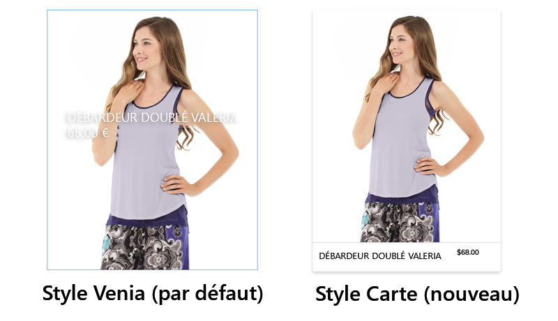
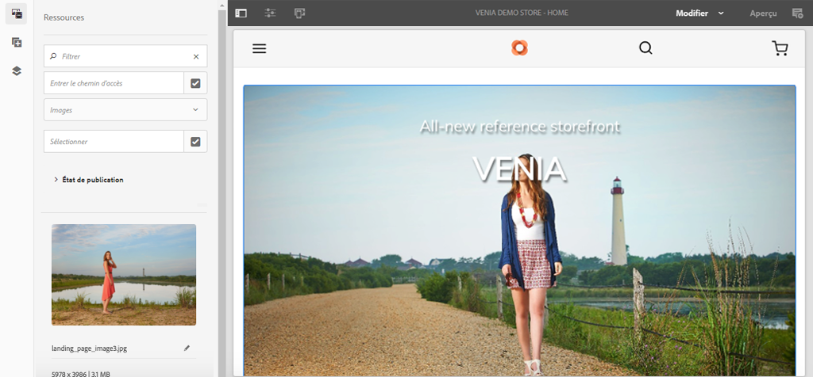
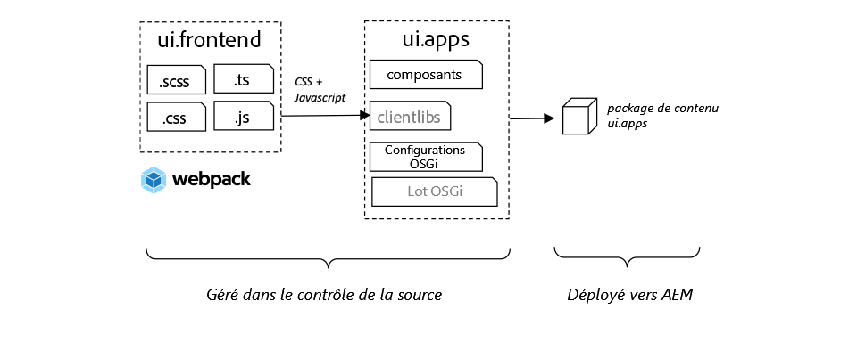
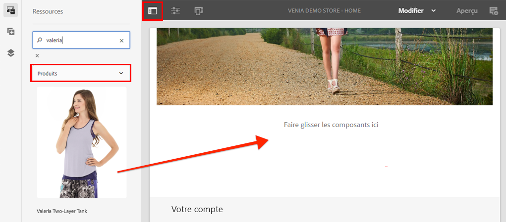
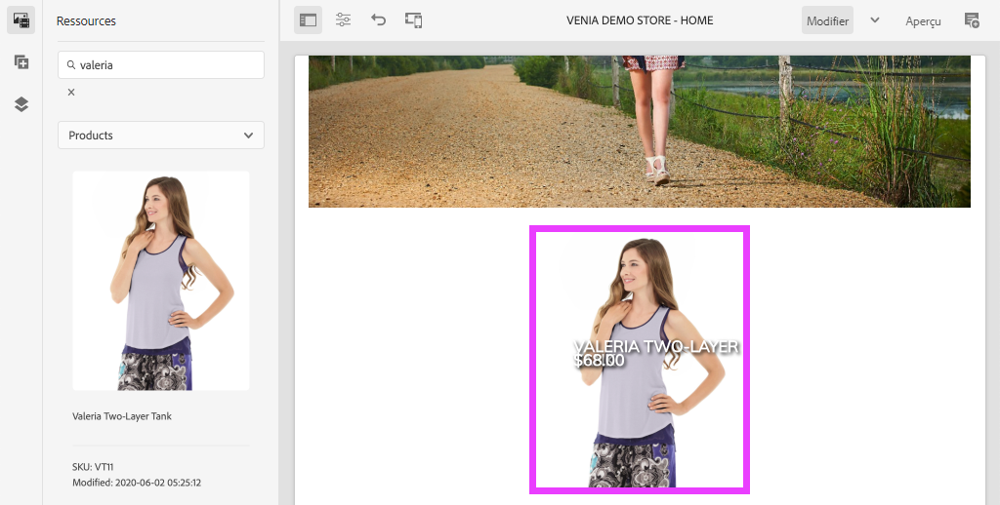
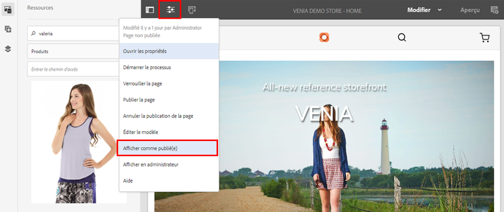
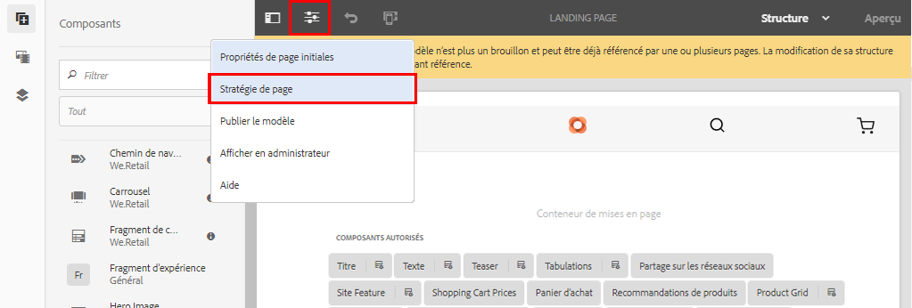
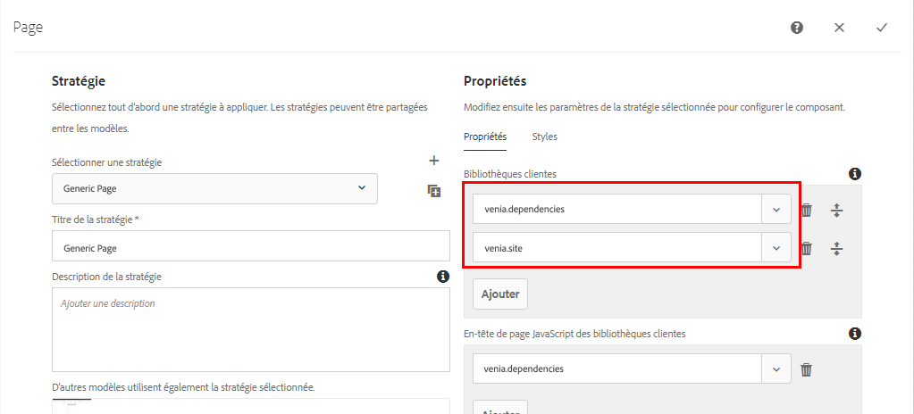
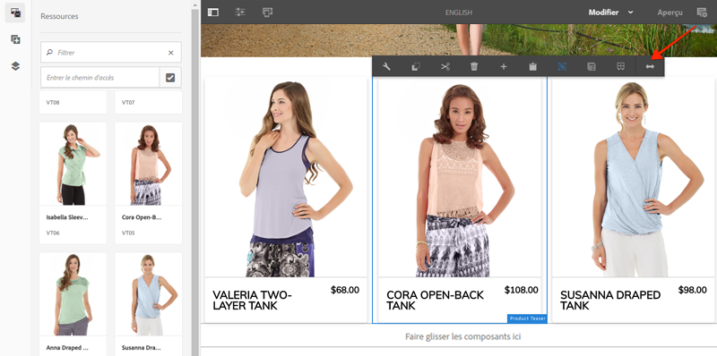
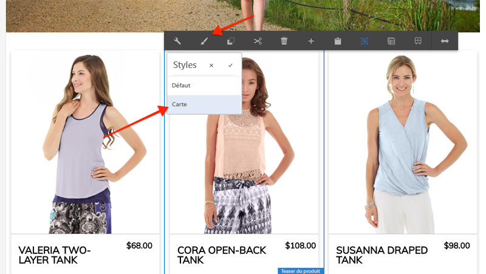

# Donner un style aux composants principaux AEM CIF {#style-aem-cif-core-components}

Le [projet CIF Venia](https://github.com/adobe/aem-cif-guides-venia) est une base de code de référence pour l’utilisation des [composants principaux CIF](https://github.com/adobe/aem-core-cif-components). Dans ce tutoriel, vous allez examiner le projet de référence Venia et découvrir comment le code CSS et JavaScript utilisé par les composants principaux AEM CIF est organisé. Vous allez également créer un style à l’aide du code CSS pour mettre le style par défaut du composant **Teaser de produit** à jour.

>[!TIP]
>
> Utilisez l’[archétype de projet AEM](https://github.com/adobe/aem-project-archetype) pour démarrer votre propre implémentation commerciale.

## Ce que vous allez créer

Dans ce tutoriel, un nouveau style est mis en œuvre pour le composant Teaser de produit ressemblant à une carte. Ce que vous apprenez dans le tutoriel peut être appliqué à d’autres composants principaux CIF.



## Prérequis {#prerequisites}

Un environnement de développement local est nécessaire pour suivre ce tutoriel. Cet environnement inclut une instance AEM en cours d’exécution configurée et connectée à une instance Adobe Commerce. Examinez les exigences et les étapes de la [configuration d’un développement local avec le SDK AEM as a Cloud Service](../develop.md).

## Clonage du projet Venia {#clone-venia-project}

Vous allez cloner le [Projet Venia](https://github.com/adobe/aem-cif-guides-venia), puis remplacer les styles par défaut.

>[!NOTE]
>
> **N’hésitez pas à utiliser un projet existant** (basé sur l’archétype de projet AEM avec CIF inclus) et à ignorer cette section.

1. Exécutez la commande git suivante afin de pouvoir cloner le projet :

   ```shell
   $ git clone git@github.com:adobe/aem-cif-guides-venia.git
   ```

1. Créez et déployez le projet sur une instance locale d’AEM :

   ```shell
   $ cd aem-cif-guides-venia/
   $ mvn clean install -PautoInstallPackage,cloud
   ```

1. Ajoutez les configurations OSGi nécessaires pour connecter votre instance AEM à une instance Adobe Commerce ou ajoutez les configurations au projet créé.

1. À ce stade, vous devriez disposer d’une version fonctionnelle d’un storefront connecté à une instance Adobe Commerce. Accédez à la page `US` > `Home` à l’adresse suivante : [http://localhost:4502/editor.html/content/venia/us/en.html](http://localhost:4502/editor.html/content/venia/us/en.html).

   Vous devriez voir que le storefront utilise actuellement le thème Venia. En développant le menu principal du storefront, vous devriez voir différentes catégories indiquant que la connexion à Adobe Commerce fonctionne.

   

## Bibliothèques client et module ui.frontend {#introduction-to-client-libraries}

Le code CSS et JavaScript responsable du rendu du thème/des styles du storefront est géré dans AEM par une [bibliothèque cliente](/help/implementing/developing/introduction/clientlibs.md) (ou clientlib). Les bibliothèques clientes offrent un mécanisme permettant d’organiser le code CSS et Javascript dans le code d’un projet, puis de le diffuser sur la page.

Des styles spécifiques à la marque peuvent être appliqués aux composants principaux AEM CIF en ajoutant et en remplaçant le code CSS géré par ces bibliothèques clientes. Il est essentiel de comprendre comment les bibliothèques clientes sont structurées et incluses dans la page.

Le module [ui.frontend](https://experienceleague.adobe.com/docs/experience-manager-core-components/using/developing/archetype/uifrontend.html?lang=fr) est un projet [webpack](https://webpack.js.org/) dédié à la gestion de toutes les ressources front-end d’un projet. Ce webpack permet aux développeurs et développeuses front-end d’utiliser un nombre quelconque de langages et de technologies tels que [TypeScript](https://www.typescriptlang.org/), [Sass](https://sass-lang.com/) et bien plus encore.

Le module `ui.frontend` est également un module Maven. Il est intégré au projet plus vaste grâce à l’utilisation d’un module NPM, [aem-clientlib-generator](https://github.com/wcm-io-frontend/aem-clientlib-generator). Au cours d’une génération, `aem-clientlib-generator` copie les fichiers CSS et JavaScript compilés dans une bibliothèque cliente du module`ui.apps`.



*Les fichiers CSS et Javascript compilés sont copiés du module `ui.frontend` vers le module `ui.apps` en tant que bibliothèque cliente lors d’une génération Maven.*

## Mettre le style du teaser à jour {#ui-frontend-module}

Apportez ensuite une légère modification au style du teaser pour voir comment fonctionnent le module `ui.frontend` et les bibliothèques clientes. Utilisez l’[IDE de votre choix](https://experienceleague.adobe.com/docs/experience-manager-learn/cloud-service/local-development-environment-set-up/development-tools.html?lang=fr#set-up-the-development-ide) pour importer le projet Venia. Les captures d’écran utilisées proviennent de l’[IDE Visual Studio Code](https://experienceleague.adobe.com/docs/experience-manager-learn/cloud-service/local-development-environment-set-up/development-tools.html?lang=fr#microsoft-visual-studio-code).

1. Accédez au module **ui.frontend** et développez-le, puis développez la hiérarchie de dossiers comme suit : `ui.frontend/src/main/styles/commerce` :

   

   Notez qu’il existe plusieurs fichiers Sass (`.scss`) sous le dossier. Ces fichiers sont des styles propres à Commerce pour chacun des composants Commerce.

1. Ouvrez le fichier `_productteaser.scss`.

1. Mettez la règle `.item__image` à jour et modifiez la règle de bordure :

   ```scss
   .item__image {
       border: #ea00ff 8px solid; /* <-- modify this rule */
       display: block;
       grid-area: main;
       height: auto;
       opacity: 1;
       transition-duration: 512ms;
       transition-property: opacity, visibility;
       transition-timing-function: ease-out;
       visibility: visible;
       width: 100%;
   }
   ```

   La règle ci-dessus doit ajouter une bordure rose, en gras, au composant Teaser de produit.

1. Ouvrez une nouvelle fenêtre de terminal et accédez au dossier `ui.frontend` :

   ```shell
   $ cd <project-location>/aem-cif-guides-venia/ui.frontend
   ```

1. Exécutez la commande Maven suivante :

   ```shell
   $ mvn clean install
   ...
   [INFO] ------------------------------------------------------------------------
   [INFO] BUILD SUCCESS
   [INFO] ------------------------------------------------------------------------
   [INFO] Total time:  29.497 s
   [INFO] Finished at: 2020-08-25T14:30:44-07:00
   [INFO] ------------------------------------------------------------------------
   ```

   Inspectez la sortie du terminal. Notez que la commande Maven a exécuté plusieurs scripts NPM, y compris `npm run build`. La commande `npm run build` est définie dans le fichier `package.json`. Elle compile le projet webpack et déclenche la génération de la bibliothèque cliente.

1. Inspectez le fichier `ui.frontend/dist/clientlib-site/site.css` :

   

   Le fichier constitue la version compilée et minimisée de tous les fichiers Sass du projet.

   >[!NOTE]
   >
   > Les fichiers de ce type sont ignorés du contrôle source, puisqu’ils doivent être générés pendant la création.

1. Inspectez le fichier `ui.frontend/clientlib.config.js`.

   ```js
   /* clientlib.config.js*/
   ...
   // Config for `aem-clientlib-generator`
   module.exports = {
       context: BUILD_DIR,
       clientLibRoot: CLIENTLIB_DIR,
       libs: [
           {
               ...libsBaseConfig,
               name: 'clientlib-site',
               categories: ['venia.site'],
               dependencies: ['venia.dependencies', 'aem-core-cif-react-components'],
               assets: {
   ...
   ```

   Ce fichier de configuration de [aem-clientlib-generator](https://github.com/wcm-io-frontend/aem-clientlib-generator) détermine où et comment les fichiers CSS et JavaScript compilés se transforment en une bibliothèque cliente AEM.

1. Dans le module `ui.apps`, inspectez le fichier `ui.apps/src/main/content/jcr_root/apps/venia/clientlibs/clientlib-site/css/site.css` :

   

   Ce fichier `site.css` est copié dans le projet `ui.apps`. Il fait désormais partie d’une bibliothèque cliente nommée `clientlib-site` avec une catégorie de `venia.site`. Une fois que le fichier fait partie du module `ui.apps`, il peut être déployé dans AEM.

   >[!NOTE]
   >
   > Les fichiers de ce type sont également ignorés du contrôle source, puisqu’ils doivent être générés pendant la création.

1. Examinez ensuite les autres bibliothèques clientes générées par le projet :

   

   Ces bibliothèques clientes ne sont pas gérées par le module `ui.frontend`. À la place, elles incluent les dépendances CSS et JavaScript fournies par Adobe. La définition de ces bibliothèques clientes figure dans le fichier `.content.xml` sous chaque dossier.

   **clientlib-base** : bibliothèque cliente vide qui incorpore simplement les dépendances nécessaires des [composants principaux AEM](https://experienceleague.adobe.com/docs/experience-manager-core-components/using/introduction.html?lang=fr). La catégorie est `venia.base`.

   **clientlib-cif** : bibliothèque cliente vide qui incorpore simplement les dépendances nécessaires des [composants principaux AEM CIF](https://github.com/adobe/aem-core-cif-components). La catégorie est `venia.cif`.

   **clientlib-grid** : inclut le fichier CSS nécessaire pour activer la fonction de grille réactive d’AEM. Utiliser la grille AEM active le [mode de disposition](/help/sites-cloud/authoring/page-editor/responsive-layout.md) dans l’éditeur AEM et permet aux personnes qui créent du contenu de redimensionner les composants. La catégorie est `venia.grid` et est incorporée dans la bibliothèque `venia.base`.

1. Inspectez les fichiers `customheaderlibs.html` et `customfooterlibs.html` sous `ui.apps/src/main/content/jcr_root/apps/venia/components/page` :

   

   Ces scripts incluent les bibliothèques **venia.base** et **venia.cif** comme partie de toutes les pages.

   >[!NOTE]
   >
   > Seules les bibliothèques de base sont « codées en dur » dans le cadre des scripts de page. La bibliothèque `venia.site` n’est pas incluse dans ces fichiers ; elle est à la place incluse dans le modèle de page pour une plus grande flexibilité. Ce processus est inspecté ultérieurement.

1. Depuis le terminal, créez et déployez tout le projet sur une instance locale d’AEM :

   ```shell
   $ cd aem-cif-guides-venia/
   $ mvn clean install -PautoInstallPackage,cloud
   ```

## Créer un teaser de produit {#author-product-teaser}

Maintenant que les mises à jour du code ont été déployées, ajoutez une instance du composant Teaser de produit à la page d’accueil du site à l’aide des outils de création d’AEM. Cela nous permet de visualiser les styles mis à jour.

1. Ouvrez un nouvel onglet de navigateur et accédez à la **page d’accueil** du site : [http://localhost:4502/editor.html/content/venia/us/en.html](http://localhost:4502/editor.html/content/venia/us/en.html).

1. Développez l’outil de recherche de ressources (rail latéral) en mode **Modifier**. Faites basculer le filtre Ressources sur **Produits**.

   

1. Faites glisser et déposez un nouveau produit sur la page d’accueil du conteneur de mise en page principal :

   

   Le teaser de produit devrait maintenant comporter une bordure rose vif en fonction de la modification de règle CSS créée précédemment.

## Vérifier les bibliothèques clientes sur la page {#verify-client-libraries}

Vérifiez ensuite l’inclusion des bibliothèques clientes sur la page.

1. Accédez à la **page d’accueil** du site : [http://localhost:4502/editor.html/content/venia/us/en.html](http://localhost:4502/editor.html/content/venia/us/en.html)

1. Sélectionnez le menu **Informations sur la page**, puis cliquez sur **Afficher comme publié(e)** :

   

   La page s’ouvre sans aucun code JavaScript AEM de création chargé, lequel apparaîtrait sur le site publié. Notez que le paramètre de requête `?wcmmode=disabled` est ajouté à l’URL. Lors du développement du code CSS et JavaScript, il est recommandé d’utiliser ce paramètre pour simplifier la page sans intervention sur l’environnement de création AEM.

1. Affichez la source de la page ; vous devriez pouvoir constater que plusieurs bibliothèques clientes sont incluses :

   ```html
   <!DOCTYPE html>
   <html lang="en-US">
   <head>
       ...
       <link rel="stylesheet" href="/etc.clientlibs/venia/clientlibs/clientlib-base.min.css" type="text/css">
       <link rel="stylesheet" href="/etc.clientlibs/venia/clientlibs/clientlib-site.min.css" type="text/css">
   </head>
   ...
       <script type="text/javascript" src="/etc.clientlibs/venia/clientlibs/clientlib-site.min.js"></script>
       <script type="text/javascript" src="/etc.clientlibs/core/wcm/components/commons/site/clientlibs/container.min.js"></script>
       <script type="text/javascript" src="/etc.clientlibs/venia/clientlibs/clientlib-base.min.js"></script>
   <script type="text/javascript" src="/etc.clientlibs/core/cif/clientlibs/common.min.js"></script>
   <script type="text/javascript" src="/etc.clientlibs/venia/clientlibs/clientlib-cif.min.js"></script>
   </body>
   </html>
   ```

   Diffusées sur la page, les bibliothèques clientes sont précédées de `/etc.clientlibs` et sont diffusées par le biais d’un [proxy](/help/implementing/developing/introduction/clientlibs.md) afin d’éviter d’exposer un contenu sensible dans `/apps` ou `/libs`.

   Remarquez `venia/clientlibs/clientlib-site.min.css` et `venia/clientlibs/clientlib-site.min.js`. Il s’agit des fichiers CSS et Javascript compilés dérivés du module `ui.frontend`.

## Inclusion de la bibliothèque cliente avec des modèles de page {#client-library-inclusion-pagetemplates}

Il existe plusieurs options pour inclure une bibliothèque côté client. Examinez ensuite comment le projet généré inclut les bibliothèques `clientlib-site` par le biais de [modèles de page](/help/implementing/developing/components/templates.md).

1. Accédez à la **page d’accueil** du site dans l’éditeur AEM : [http://localhost:4502/editor.html/content/venia/us/en.html](http://localhost:4502/editor.html/content/venia/us/en.html).

1. Sélectionnez le menu **Informations sur la page**, puis cliquez sur **Éditer le modèle** :

   

   Le modèle **Page de destination** est ouvert. Il s’agit du modèle sur lequel la page **Accueil** est basée.

   >[!NOTE]
   >
   > Pour afficher tous les modèles disponibles à partir de l’écran Accueil AEM, accédez à **Outils** > **Général** > **Modèles**.

1. Dans le coin supérieur gauche, sélectionnez l’icône **Informations sur la page**, puis cliquez sur **Politique de page**.

   

1. La politique de page s’ouvre pour le modèle de page de destination :

   

   Sur le côté droit figure la liste des **catégories** de bibliothèques clientes qui sont incluses sur toutes les pages qui utilisent ce modèle.

   * `venia.dependencies` – Fournit les bibliothèques de fournisseurs dont `venia.site` dépend.
   * `venia.site` – La catégorie de `clientlib-site` que le module `ui.frontend` génère.

   Notez que d’autres modèles utilisent la même politique, la **Page de contenu**, la **Page de destination**, etc. Cela garantit que les mêmes bibliothèques clientes sont incluses sur toutes les pages.

   Utiliser des politiques de modèle et de page pour gérer l’inclusion des bibliothèques clientes présente l’avantage de permettre de changer la politique par modèle. Par exemple, il se peut que vous gériez deux marques différentes au sein de la même instance AEM. Chaque marque comporte son propre style ou *thème*, mais les bibliothèques et le code de base sont les mêmes. Autre exemple : si vous disposez d’une bibliothèque cliente plus grande que vous ne souhaitez afficher que sur certaines pages, vous pouvez créer une politique de page unique réservée à ce modèle.

## Développement de webpack local {#local-webpack-development}

Dans l’exercice précédent, nous avons apporté une mise à jour à un fichier Sass dans le module `ui.frontend`, puis, après avoir créé Maven, nous avons déployé les modifications dans AEM. Nous allons maintenant nous pencher sur l’utilisation d’un serveur webpack-dev-server pour développer rapidement les styles front-end.

Le serveur webpack-dev-server crée des proxys des images et d’une partie du code CSS/JavaScript provenant de l’instance locale d’AEM, mais permet au développeur de modifier les styles et le code JavaScript dans le module `ui.frontend`.

1. Dans le navigateur, accédez à la **page d’accueil** et à **Afficher comme publié(e)** : [http://localhost:4502/content/venia/us/en.html?wcmmode=disabled](http://localhost:4502/content/venia/us/en.html?wcmmode=disabled).

1. Affichez la source de la page et la **copie** du code HTML brut de la page.

1. Revenez à l’IDE de votre choix sous le module `ui.frontend` et ouvrez le fichier : `ui.frontend/src/main/static/index.html`

   

1. Remplacez le contenu de `index.html` et **collez** le code HTML copié à l’étape précédente.

1. Recherchez les inclusions `clientlib-site.min.css` et `clientlib-site.min.js`, puis **supprimez**-les.

   ```html
   <head>
       <!-- remove this link -->
       <link rel="stylesheet" href="/etc.clientlibs/venia/clientlibs/clientlib-base.min.css" type="text/css">
       ...
   </head>
   <body>
       ...
        <!-- remove this link -->
       <script type="text/javascript" src="/etc.clientlibs/venia/clientlibs/clientlib-site.min.js"></script>
   </body>
   ```

   Ces inclusions sont supprimées, car elles représentent la version compilée du code CSS et JavaScript généré par le module `ui.frontend`. Laissez les autres bibliothèques clientes telles qu’elles sont traitées par proxy à partir de l’instance AEM en cours d’exécution.

1. Ouvrez une nouvelle fenêtre de terminal et accédez au dossier `ui.frontend`. Exécutez la commande `npm start` :

   ```shell
   $ cd ui.frontend
   $ npm start
   ```

   Cette commande démarre le serveur webpack-dev-server sur [http://localhost:8080/](http://localhost:8080/)

   >[!CAUTION]
   >
   > Si vous obtenez une erreur liée à Sass, arrêtez le serveur, exécutez la commande `npm rebuild node-sass` et répétez les étapes ci-dessus. Cette erreur peut se produire si vous disposez d’une version de `npm` et de `node` différentes de celles spécifiées dans le projet `aem-cif-guides-venia/pom.xml`.

1. Accédez au dossier [http://localhost:8080/](http://localhost:8080/) dans un nouvel onglet avec le même navigateur qu’une instance d’AEM connectée. Vous devriez voir la page d’accueil Venia via le serveur webpack-dev-server :

   

   Laissez le serveur webpack-dev-server en cours d’exécution. Il sera utilisé dans le prochain exercice.

## Mettre en œuvre le style de carte pour le teaser de produit {#update-css-product-teaser}

Modifiez ensuite les fichiers Sass dans le module `ui.frontend` afin de mettre en œuvre un style de type carte pour le teaser de produit. Le serveur webpack-dev-server est utilisé pour afficher rapidement les changements.

Revenez à l’IDE et au projet généré.

1. Dans le module **ui.frontend**, rouvrez le fichier `_productteaser.scss` à l’emplacement `ui.frontend/src/main/styles/commerce/_productteaser.scss`.

1. Apportez les modifications suivantes à la bordure du teaser de produit :

   ```diff
       .item__image {
   -       border: #ea00ff 8px solid;
   +       border-bottom: 1px solid #c0c0c0;
           display: block;
           grid-area: main;
           height: auto;
           opacity: 1;
           transition-duration: 512ms;
           transition-property: opacity, visibility;
           transition-timing-function: ease-out;
           visibility: visible;
           width: 100%;
       }
   ```

   Enregistrez les modifications ; le serveur webpack-dev-server devrait automatiquement s’actualiser avec les nouveaux styles.

1. Ajoutez une ombre portée et ajoutez des coins arrondis au teaser de produit.

   ```scss
    .item__root {
        position: relative;
        box-shadow: 0 4px 8px 0 rgba(0,0,0,0.2);
        transition: 0.3s;
        border-radius: 5px;
        float: left;
        margin-left: 12px;
        margin-right: 12px;
   }
   
   .item__root:hover {
      box-shadow: 0 8px 16px 0 rgba(0,0,0,0.2);
   }
   ```

1. Mettez à jour le nom du produit devant s’afficher au bas du teaser et modifiez la couleur du texte.

   ```css
   .item__name {
       color: #000;
       display: block;
       float: left;
       font-size: 22px;
       font-weight: 900;
       line-height: 1em;
       padding: 0.75em;
       text-transform: uppercase;
       width: 75%;
   }
   ```

1. Mettez à jour le prix du produit devant également s’afficher au bas du teaser et modifiez la couleur du texte.

   ```css
   .price {
       color: #000;
       display: block;
       float: left;
       font-size: 18px;
       font-weight: 900;
       padding: 0.75em;
       padding-bottom: 2em;
       width: 25%;
   
       ...
   ```

1. Mettez la requête multimédia à jour en bas, de sorte à empiler le nom et le prix dans des écrans d’une taille inférieure à **992 px**.

   ```css
   @media (max-width: 992px) {
       .productteaser .item__name {
           font-size: 18px;
           width: 100%;
       }
       .productteaser .item__price {
           font-size: 14px;
           width: 100%;
       }
   }
   ```

   Le style de carte devrait maintenant se refléter sur le serveur webpack-dev-server :

   

   Toutefois, les modifications n’ont pas encore été déployées dans AEM. Vous pouvez [télécharger le fichier de solution ici](../assets/style-cif-component/_productteaser.scss).

1. Déployez les mises à jour dans AEM à l’aide de vos compétences Maven, à partir d’un terminal de ligne de commande :

   ```shell
   $ cd aem-cif-guides-venia/
   $ mvn clean install -PautoInstallPackage,cloud
   ```

   >[!NOTE]
   >Il existe d’autres [outils et programmes d’installation IDE](https://experienceleague.adobe.com/docs/experience-manager-learn/foundation/development/set-up-a-local-aem-development-environment.html?lang=fr#set-up-an-integrated-development-environment) pouvant synchroniser les fichiers de projet directement dans une instance d’AEM locale sans avoir à créer une version Maven entière.

## Afficher le teaser de produit mis à jour. {#view-updated-product-teaser}

Une fois le code du projet déployé dans AEM, les modifications apportées au teaser de produit devraient être visibles.

1. Revenez à votre navigateur et actualisez la page d’accueil : [http://localhost:4502/editor.html/content/venia/us/en.html](http://localhost:4502/editor.html/content/venia/us/en.html). Vous devriez constater que les styles de teaser de produit mis à jour ont été appliqués.

   

1. Expérimentez en ajoutant d’autres teasers de produit. Utilisez le mode Disposition pour modifier la largeur et le décalage des composants afin d’afficher plusieurs teasers sur une même ligne.

   

## Résolution des problèmes {#troubleshooting}

Vous pouvez vérifier dans [CRXDE-Lite](http://localhost:4502/crx/de/index.jsp) que le fichier CSS mis à jour a été déployé : [http://localhost:4502/crx/de/index.jsp#/apps/venia/clientlibs/clientlib-site/css/site.css](http://localhost:4502/crx/de/index.jsp#/apps/venia/clientlibs/clientlib-site/css/site.css)

Lors du déploiement de nouveaux fichiers CSS et/ou JavaScript, il est également important de s’assurer que le navigateur ne diffuse pas de fichiers obsolètes. Vous pouvez éliminer ce problème potentiel en vidant la mémoire cache du navigateur ou en lançant une nouvelle session du navigateur.

AEM tente également de mettre en cache les bibliothèques clientes pour des raisons de performances. Il arrive qu’à la suite d’un déploiement de code les fichiers plus anciens soient diffusés. Vous pouvez invalider manuellement le cache de la bibliothèque cliente d’AEM à l’aide de l’outil [Reconstruire les bibliothèques clientes](http://localhost:4502/libs/granite/ui/content/dumplibs.rebuild.html). *La méthode d’invalidation du cache est conseillée si vous pensez qu’AEM a mis en cache une ancienne version d’une bibliothèque cliente. La reconstruction des bibliothèques est inefficace et prend du temps.*

## Félicitations {#congratulations}

Vous avez terminé de mettre en forme votre premier composant principal AEM CIF et avez utilisé un serveur de développement webpack !

## Défi bonus {#bonus-challenge}

Utilisez le [système de style AEM](/help/sites-cloud/authoring/page-editor/style-system.md) pour créer deux styles pouvant être activés/désactivés par une personne créant du contenu. Le document [Développement avec le système de style](https://experienceleague.adobe.com/docs/experience-manager-learn/getting-started-wknd-tutorial-develop/project-archetype/style-system.html?lang=fr) comprend des étapes détaillées et des informations sur la façon d’y parvenir.



## Ressources supplémentaires {#additional-resources}

* [Archétype de projet AEM](https://github.com/adobe/aem-project-archetype)
* [Composants principaux AEM CIF](https://github.com/adobe/aem-core-cif-components)
* [Configuration d’un environnement de développement AEM local](https://experienceleague.adobe.com/docs/experience-manager-learn/cloud-service/local-development-environment-set-up/overview.html?lang=fr)
* [Bibliothèques côté client](/help/implementing/developing/introduction/clientlibs.md)
* [Prise en main d’AEM Sites](https://experienceleague.adobe.com/docs/experience-manager-learn/getting-started-wknd-tutorial-develop/overview.html?lang=fr)
* [Développement avec le système de style](https://experienceleague.adobe.com/docs/experience-manager-learn/getting-started-wknd-tutorial-develop/project-archetype/style-system.html?lang=fr)
