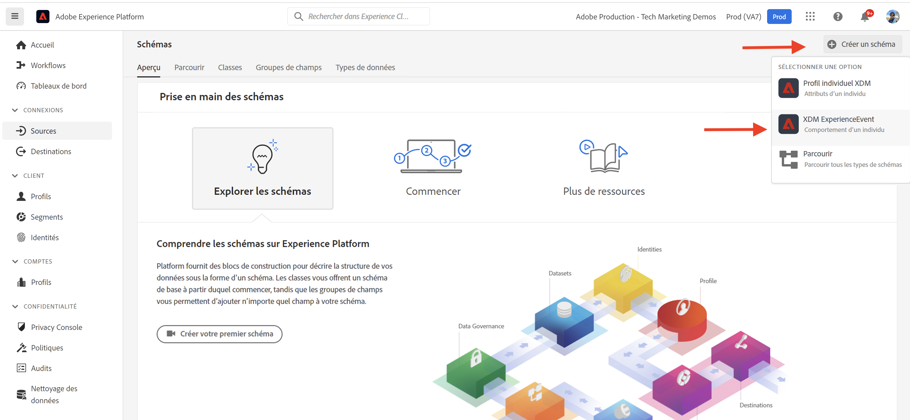
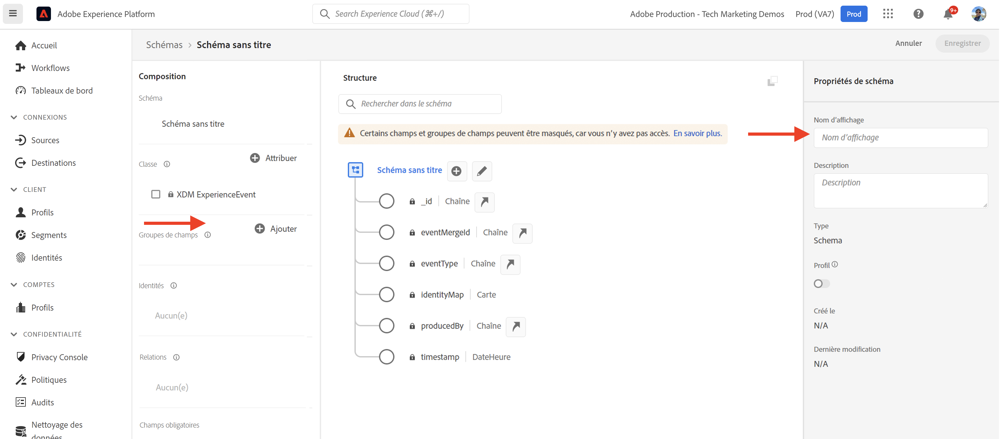
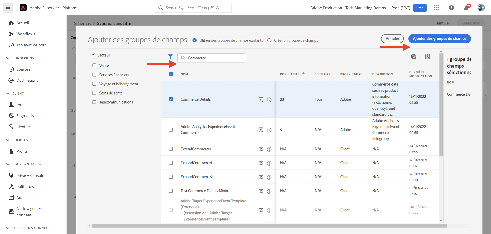
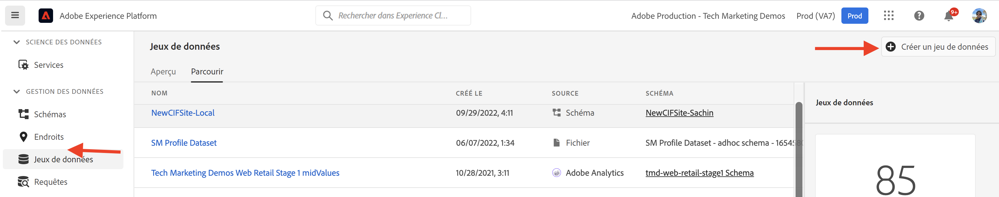
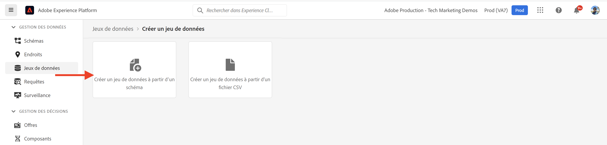
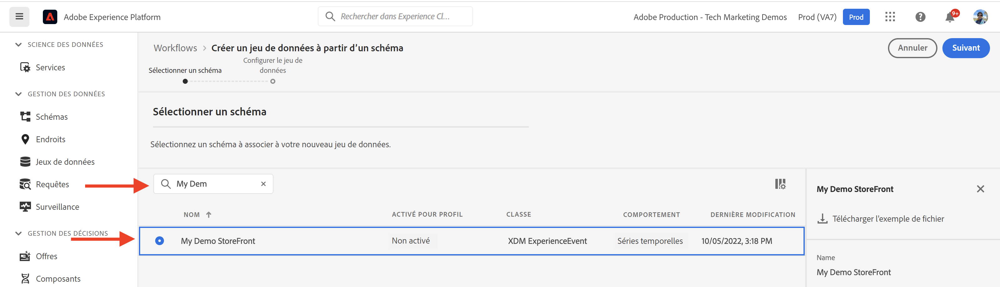
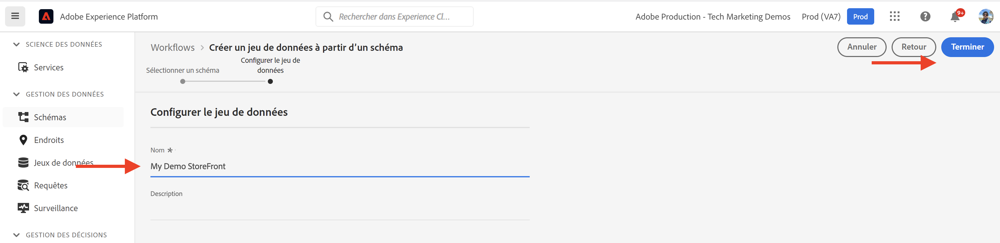
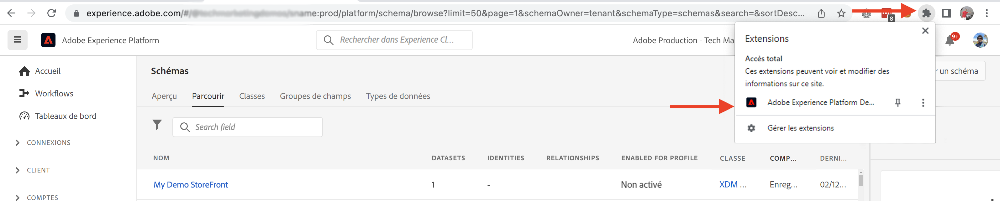

# Composants principaux AEM-CIF et intégration Adobe Experience Platform {#aem-cif-aep-integration}

Le [Commerce Integration Framework (CIF)](https://github.com/adobe/aem-core-cif-components) les composants principaux fournissent une intégration transparente avec [Adobe Experience Platform](https://experienceleague.adobe.com/docs/experience-platform/landing/platform-overview.html?lang=en) pour transférer les événements storefront et leurs données d’interactions côté client, telles que __ajouter au panier__.

Le [AEM Composants principaux CIF](https://github.com/adobe/aem-core-cif-components) Le projet fournit une bibliothèque JavaScript appelée [Connecteur Adobe Experience Platform pour Adobe Commerce](https://github.com/adobe/aem-core-cif-components/tree/master/extensions/experience-platform-connector) pour collecter des données d’événement à partir de votre vitrine Commerce. Ces données d’événement sont envoyées à l’Experience Platform où elles sont utilisées dans d’autres produits Adobe Experience Cloud, tels qu’Adobe Analytics et Adobe Target, pour créer un profil à 360 degrés couvrant un parcours client. En connectant les données Commerce à d’autres produits dans Adobe Experience Cloud, vous pouvez exécuter des tâches telles que l’analyse du comportement des utilisateurs sur votre site, effectuer des tests AB et créer des campagnes personnalisées.

En savoir plus sur les [Collecte de données Experience Platform](https://experienceleague.adobe.com/docs/experience-platform/collection/home.html) suite de technologies qui vous permettent de collecter des données d’expérience client à partir de sources côté client.

## Envoyer `addToCart` données d’événement à l’Experience Platform {#send-addtocart-to-aep}

Les étapes suivantes indiquent comment envoyer la variable `addToCart` données d’événement des pages de produit générées par AEM vers l’Experience Platform à l’aide de CIF - Experience Platform Connector. En utilisant l’extension de navigateur du débogueur Adobe Experience Platform, vous pouvez tester et réviser les données envoyées.


## Prérequis {#prerequisites}

Vous devez utiliser un environnement de développement local pour terminer cette démonstration. Cela inclut une instance AEM en cours d’exécution configurée et connectée à une instance Adobe Commerce. Examinez les exigences et les étapes de la [configuration d’un développement local avec le SDK AEM as Cloud Service](../develop.md).

Vous devez également accéder à [Adobe Experience Platform](https://experienceleague.adobe.com/docs/experience-platform/landing/platform-ui/ui-guide.html) et les autorisations pour créer le schéma, le jeu de données et les jeux de données pour la collecte de données. Pour plus d’informations, voir [Gestion des autorisations](https://experienceleague.adobe.com/docs/experience-platform/collection/permissions.html).

## Configuration d’AEM Commerce as a Cloud Service {#aem-setup}

Pour qu’une __AEM Commerce as a Cloud Service__ environnement local avec le code et la configuration nécessaires, procédez comme suit.

### Configuration locale

Suivez la [Configuration locale](https://experienceleague.adobe.com/docs/experience-manager-cloud-service/content/content-and-commerce/storefront/developing/develop.html?#local-setup) Cette section décrit les étapes à suivre pour disposer d’un environnement Commerce as a Cloud Service AEM opérationnel.

### Configuration du projet

Suivez la [AEM Archétype de projet](https://experienceleague.adobe.com/docs/experience-manager-cloud-service/content/content-and-commerce/storefront/developing/develop.html?#project) Cette section décrit les étapes à suivre pour créer un projet AEM Commerce (CIF).

>[!TIP]
>
>Dans l’exemple suivant, le projet AEM Commerce est nommé : `My Demo Storefront`, vous pouvez toutefois choisir votre propre nom de projet.


Créez et déployez le nouveau projet AEM Commerce vers le SDK AEM local en exécutant la commande suivante à partir du répertoire racine du projet.

```bash
$ mvn clean install -PautoInstallSinglePackage
```

Déploiement local `My Demo StoreFront` site de commerce avec le code et le contenu par défaut ressemble à ce qui suit :


### Installation des dépendances du connecteur Peregrine et CIF-AEP

Pour collecter et envoyer les données d’événement à partir des pages de catégorie et de produit de ce site AEM Commerce, vous devez installer la clé `npm` dans la variable `ui.frontend` du projet Commerce AEM.

Accédez au `ui.frontend` et installez les packages requis en exécutant les commandes suivantes à partir de la ligne de commande.

```bash
npm i --save lodash.get@^4.4.2 lodash.set@^4.3.2
npm i --save apollo-cache-persist@^0.1.1
npm i --save redux-thunk@~2.3.0
npm i --save @adobe/apollo-link-mutation-queue@~1.1.0
npm i --save @magento/peregrine@~12.5.0
npm i --save @adobe/aem-core-cif-react-components --force
npm i --save-dev @magento/babel-preset-peregrine@~1.2.1
npm i --save @adobe/aem-core-cif-experience-platform-connector --force
```

>[!IMPORTANT]
>
>Le `--force` est parfois requis, car [PWA Studio](https://developer.adobe.com/commerce/pwa-studio/) est restrictif avec les dépendances entre pairs prises en charge. En règle générale, cela ne doit pas poser de problème.


### Configuration de Maven à utiliser `--force` argument

Dans le cadre du processus de génération Maven, l’installation de nettoyage npm (à l’aide de `npm ci`) est déclenchée. Cela nécessite également la fonction `--force` argument .

Accédez au fichier POM racine du projet. `pom.xml` et recherchez la variable `<id>npm ci</id>` bloc d&#39;exécution. Mettez à jour le bloc pour qu&#39;il ressemble à ce qui suit :

```xml
<execution>
    <id>npm ci</id>
    <goals>
    <goal>npm</goal>
    </goals>
    <configuration>
    <arguments>ci --force</arguments>
    </configuration>
</execution>
```

### Modifier le format de configuration Babel

Basculer depuis la valeur par défaut `.babelrc` Format du fichier de configuration relatif au fichier vers `babel.config.js` format. Il s’agit d’un format de configuration à l’échelle du projet qui permet d’appliquer les modules externes et les paramètres prédéfinis à la variable `node_module` avec un meilleur contrôle.

1. Accédez au `ui.frontend` et supprimer le module existant `.babelrc` fichier .

1. Créez un `babel.config.js` qui utilise le fichier `peregrine` prédéfinie.

   ```javascript
   const peregrine = require('@magento/babel-preset-peregrine');
   
   module.exports = (api, opts = {}) => {
       const config = {
           ...peregrine(api, opts),
           sourceType: 'unambiguous'
       } 
   
       config.plugins = config.plugins.filter(plugin => plugin !== 'react-refresh/babel');
   
       return config;
   }
   ```

### Configuration de webpack pour l’utilisation de Babel

Pour transférer les fichiers JavaScript à l’aide du chargeur Babel (`babel-loader`) et webpack, vous devez modifier la variable `webpack.common.js` fichier .

Accédez au `ui.frontend` et mettre à jour le module `webpack.common.js` afin que la règle suivante soit incluse dans le fichier `module` valeur de propriété :

```javascript
{
    test: /\.jsx?$/,
    exclude: /node_modules\/(?!@magento\/)/,
    loader: 'babel-loader'
}
```

### Configuration du client Apollo

Le [Client Apollo](https://www.apollographql.com/docs/react/) est utilisé pour gérer les données locales et distantes avec GraphQL. Il stocke également les résultats des requêtes GraphQL dans un cache local, normalisé et en mémoire.

Pour [`InMemoryCache`](https://www.apollographql.com/docs/react/caching/cache-configuration/) pour travailler efficacement, vous avez besoin d’une `possibleTypes.js` fichier . Pour générer ce fichier, voir [Génération automatique de possiblesTypes](https://www.apollographql.com/docs/react/data/fragments/#generating-possibletypes-automatically). Voir également la section [Implémentation de référence du PWA Studio](https://github.com/magento/pwa-studio/blob/1977f38305ff6c0e2b23a9da7beb0b2f69758bed/packages/pwa-buildpack/lib/Utilities/graphQL.js#L106-L120) et un exemple de [`possibleTypes.js`](../assets/aep-integration/possibleTypes.js) fichier .


1. Accédez au `ui.frontend` et enregistrez le fichier en tant que `./src/main/possibleTypes.js`

1. Mettez à jour le `webpack.common.js` fichier `DefinePlugin` pour remplacer les variables statiques requises pendant la génération.

   ```javascript
   const { DefinePlugin } = require('webpack');
   const { POSSIBLE_TYPES } = require('./src/main/possibleTypes');
   
   ...
   
   plugins: [
       ...
       new DefinePlugin({
           'process.env.USE_STORE_CODE_IN_URL': false,
           POSSIBLE_TYPES
       })
   ]
   ```

### Initialisation des composants principaux Peregrine et CIF

Pour initialiser les composants principaux React et CIF basés sur React, créez la configuration requise et les fichiers JavaScript.

1. Accédez au `ui.frontend` et créez le dossier suivant : `src/main/webpack/components/commerce/App`

1. Créez un `config.js` avec le contenu suivant :

   ```javascript
   // get and parse the CIF store configuration from the <head>
   const storeConfigEl = document.querySelector('meta[name="store-config"]');
   const storeConfig = storeConfigEl ? JSON.parse(storeConfigEl.content) : {};
   
   // the following global variables are needed for some of the peregrine features
   window.STORE_VIEW_CODE = storeConfig.storeView || 'default';
   window.AVAILABLE_STORE_VIEWS = [
       {
           code: window.STORE_VIEW_CODE,
           base_currency_code: 'USD',
           default_display_currency_code: 'USD',
           id: 1,
           locale: 'en',
           secure_base_media_url: '',
           store_name: 'My Demo StoreFront'
       }
   ];
   window.STORE_NAME = window.STORE_VIEW_CODE;
   window.DEFAULT_COUNTRY_CODE = 'en';
   
   export default {
       storeView: window.STORE_VIEW_CODE,
       graphqlEndpoint: storeConfig.graphqlEndpoint,
       // Can be GET or POST. When selecting GET, this applies to cache-able GraphQL query requests only.
       // Mutations will always be executed as POST requests.
       graphqlMethod: storeConfig.graphqlMethod,
       headers: storeConfig.headers,
   
       mountingPoints: {
           // TODO: define the application specific mount points as they may be used by <Portal> and <PortalPlacer>
       },
       pagePaths: {
           // TODO: define the application specific paths/urls as they may be used by the components
           baseUrl: storeConfig.storeRootUrl
       },
       eventsCollector: {
           // Enable the Experience Platform Connector and define the org and datastream to use
           aep: {
               orgId: // TODO: add your orgId
               datastreamId: // TODO: add your datastreamId
           }
       }
   };
   ```

   >[!IMPORTANT]
   >
   >Bien que vous soyez déjà familiarisé avec la variable [`config.js`](https://github.com/adobe/aem-cif-guides-venia/blob/main/ui.frontend/src/main/components/App/config.js) fichier à partir de __AEM Guides - Projet CIF Venia__, quelques modifications doivent être apportées à ce fichier. Tout d’abord, passez en revue les __TODO__ commentaires. Ensuite, à l’intérieur de la variable `eventsCollector` , recherchez la propriété `eventsCollector > aed` et mettre à jour l’objet `orgId` et `datastreamId` aux valeurs correctes. [En savoir plus](./aep.md#add-aep-values-to-aem)

1. Créez un `App.js` avec le contenu suivant. Ce fichier ressemble à un fichier de point de départ de l’application React standard et contient des hooks React et personnalisés et l’utilisation de React Context pour faciliter l’intégration de l’Experience Platform.

   ```javascript
   import config from './config';
   
   import React, { useEffect } from 'react';
   import ReactDOM from 'react-dom';
   import { IntlProvider } from 'react-intl';
   import { BrowserRouter as Router } from 'react-router-dom';
   import { combineReducers, createStore } from 'redux';
   import { Provider as ReduxProvider } from 'react-redux';
   import { createHttpLink, ApolloProvider } from '@apollo/client';
   import { ConfigContextProvider, useCustomUrlEvent, useReferrerEvent, usePageEvent, useDataLayerEvents, useAddToCartEvent } from '@adobe/aem-core-cif-react-components';
   import { EventCollectorContextProvider, useEventCollectorContext } from '@adobe/aem-core-cif-experience-platform-connector';
   import { useAdapter } from '@magento/peregrine/lib/talons/Adapter/useAdapter';
   import { customFetchToShrinkQuery } from '@magento/peregrine/lib/Apollo/links';
   import { BrowserPersistence } from '@magento/peregrine/lib/util';
   import { default as PeregrineContextProvider } from '@magento/peregrine/lib/PeregrineContextProvider';
   import { enhancer, reducers } from '@magento/peregrine/lib/store';
   
   const storage = new BrowserPersistence();
   const store = createStore(combineReducers(reducers), enhancer);
   
   storage.setItem('store_view_code', config.storeView);
   
   const App = () => {
       const [{ sdk: mse }] = useEventCollectorContext();
   
       // trigger page-level events
       useCustomUrlEvent({ mse });
       useReferrerEvent({ mse });
       usePageEvent({ mse });
       // listen for add-to-cart events and enable forwarding to the magento storefront events sdk
       useAddToCartEvent(({ mse }));
       // enable CIF specific event forwarding to the Adobe Client Data Layer
       useDataLayerEvents();
   
       useEffect(() => {
           // implement a proper marketing opt-in, for demo purpose we hard-set the consent cookie
           if (document.cookie.indexOf('mg_dnt') < 0) {
               document.cookie += '; mg_dnt=track';
           }
       }, []);
   
       // TODO: use the App to create Portals and PortalPlaceholders to mount the CIF / Peregrine components to the server side rendered markup
       return <></>;
   };
   
   const AppContext = ({ children }) => {
       const { storeView, graphqlEndpoint, graphqlMethod = 'POST', headers = {}, eventsCollector } = config;
       const { apolloProps } = useAdapter({
           apiUrl: new URL(graphqlEndpoint, window.location.origin).toString(),
           configureLinks: (links, apiBase) =>
               // reconfigure the HTTP link to use the configured graphqlEndpoint, graphqlMethod and storeView header
   
               links.set('HTTP', createHttpLink({
                   fetch: customFetchToShrinkQuery,
                   useGETForQueries: graphqlMethod !== 'POST',
                   uri: apiBase,
                   headers: { ...headers, 'Store': storeView }
               }))
       });
   
       return (
           <ApolloProvider {...apolloProps}>
               <IntlProvider locale='en' messages={{}}>
                   <ConfigContextProvider config={config}>
                       <ReduxProvider store={store}>
                           <PeregrineContextProvider>
                               <EventCollectorContextProvider {...eventsCollector}>
                                   {children}
                               </EventCollectorContextProvider>
                           </PeregrineContextProvider>
                       </ReduxProvider>
                   </ConfigContextProvider>
               </IntlProvider>
           </ApolloProvider>
       );
   };
   
   window.onload = async () => {
       const root = document.createElement('div');
       document.body.appendChild(root);
   
       ReactDOM.render(
           <Router>
               <AppContext>
                   <App />
               </AppContext>
           </Router>,
           root
       );
   };
   ```

   Le `EventCollectorContext` exporte le contexte React qui :

   - charge la bibliothèque commerce-events-sdk et commerce-events-collector,
   - les initialise avec une configuration donnée pour Experience Platform et/ou ACDS ;
   - s’abonne à tous les événements de Peregrine et les transfère au SDK events.

   Vous pouvez consulter les détails de mise en oeuvre de la variable `EventCollectorContext` [here](https://github.com/adobe/aem-core-cif-components/blob/3d4e44d81fff2f398fd2376d24f7b7019f20b31b/extensions/experience-platform-connector/src/events-collector/EventCollectorContext.js).

### Créer et déployer le projet AEM mis à jour

Pour vous assurer que les modifications d’installation, de code et de configuration du package ci-dessus sont correctes, recréez et déployez le projet Commerce AEM mis à jour à l’aide de la commande Maven suivante : `$ mvn clean install -PautoInstallSinglePackage`.

## Configuration des Experience Platform {#aep-setup}

Pour recevoir et stocker les données d’événement provenant des pages de commerce AEM telles que la catégorie et le produit, procédez comme suit :

>[!AVAILABILITY]
>
>Assurez-vous que vous faites partie de la __Profils de produit__ under __Adobe Experience Platform__ et __Collecte de données Adobe Experience Platform__. Si nécessaire, contactez votre administrateur système pour créer, mettre à jour ou affecter __Profils de produit__ sous le [Admin Console](https://adminconsole.adobe.com/).

### Créer un schéma avec un groupe de champs Commerce

Pour définir la structure des données d’événement de commerce, vous devez créer un schéma de modèle de données d’expérience (XDM). Un schéma est un ensemble de règles qui représente et valide la structure et le format des données.

1. Dans le navigateur, accédez au __Adobe Experience Platform__ page d’accueil du produit. Par exemple, <https://experience.adobe.com/#/@YOUR-ORG-NAME/sname:prod/platform/home>.

1. Recherchez la variable __Schémas__ dans la section de navigation de gauche, cliquez sur le bouton __Création d’un schéma__ dans la section supérieure droite, puis sélectionnez __XDM ExperienceEvent__.

   

1. Nommez votre schéma à l’aide de la fonction __Propriétés du schéma > Nom d’affichage__ et ajoutez des groupes de champs à l’aide de la fonction  __Composition > Groupes de champs > Ajouter__ bouton .

   

1. Dans le __Ajouter des groupes de champs__ boîte de dialogue, recherchez `Commerce`, sélectionnez la variable __Détails du commerce__ puis cliquez sur __Ajouter des groupes de champs__.

   


>[!TIP]
>
>Voir [Principes de base de la composition des schémas](https://experienceleague.adobe.com/docs/experience-platform/xdm/schema/composition.html) pour plus d’informations.

### Créer un jeu de données

Pour stocker les données d’événement, vous devez créer un jeu de données conforme à la définition de schéma. Un jeu de données est une structure de stockage et de gestion pour une collecte de données, généralement sous la forme d’un tableau, qui contient un schéma (des colonnes) et des champs (des lignes).

1. Dans le navigateur, accédez au __Adobe Experience Platform__ page d’accueil du produit. Par exemple, <https://experience.adobe.com/#/@YOUR-ORG-NAME/sname:prod/platform/home>.

1. Recherchez la variable __Jeux de données__ dans la section de navigation de gauche, puis cliquez sur l’icône __Création d’un jeu de données__ dans la section supérieure droite.

   

1. Sur la nouvelle page, sélectionnez __Création d’un jeu de données à partir d’un schéma__ carte.

   

- Sur la nouvelle page, __rechercher et sélectionner__ le schéma que vous avez créé à l’étape précédente, puis cliquez sur le bouton __Suivant__ bouton .

   

1. Nommez votre jeu de données à l’aide de la fonction __Configurer un jeu de données > Nom__ et cliquez sur le champ __Terminer__ bouton .

   

>[!TIP]
>
>Voir [Présentation des jeux de données](https://experienceleague.adobe.com/docs/experience-platform/catalog/datasets/overview.html) pour plus d’informations.


### Créer un flux de données

Pour créer un flux de données dans l’Experience Platform, procédez comme suit.

1. Dans le navigateur, accédez au __Adobe Experience Platform__ page d’accueil du produit. Par exemple, <https://experience.adobe.com/#/@YOUR-ORG-NAME/sname:prod/platform/home>.

1. Recherchez la variable __Datastreams__ dans la section de navigation de gauche, puis cliquez sur l’icône __Nouvelle structure de données__ dans la section supérieure droite.

   

1. Nommez votre flux de données à l’aide de la fonction __Nom__ champ obligatoire. Sous , __Schéma d’événement__ , sélectionnez le schéma que vous venez de créer, puis cliquez sur __Enregistrer__.

   

1. Ouvrez le Datastream que vous venez de créer, puis cliquez sur __Ajouter un service__.

   

1. Sous , __Service__ , sélectionnez le champ __Adobe Experience Platform__ . Sous __Jeu de données d’événement__ , sélectionnez le nom du jeu de données de l’étape précédente et cliquez sur __Enregistrer__.

   

>[!TIP]
>
>Voir [Présentation du flux de données](https://experienceleague.adobe.com/docs/experience-platform/edge/datastreams/overview.html) pour plus d’informations.

## Ajout de la valeur du flux de données dans AEM configuration Commerce {#add-aep-values-to-aem}

Après avoir terminé la configuration de l’Experience Platform ci-dessus, vous devez avoir `datastreamId` dans le rail gauche des détails de la banque de données et `orgId` dans le coin supérieur droit du __Image de profil > Informations du compte > Informations utilisateur__ modale.


1. Dans le fichier AEM Commerce du projet `ui.frontend` , mettre à jour le module `config.js` et plus précisément, le fichier `eventsCollector > aep` propriétés de l’objet.

1. Créer et déployer le projet Commerce AEM mis à jour


## Déclencheur `addToCart` événement et vérification de la collecte de données {#event-trigger-verify}

Les étapes ci-dessus terminent la configuration d’AEM Commerce et d’Experience Platform. Vous pouvez désormais déclencher une `addToCart` et vérifier la collecte de données à l’aide du débogueur et du jeu de données Experience Platform __Mesures et graphiques__ bascule dans l’interface utilisateur du produit.

Pour déclencher l’événement, vous pouvez utiliser AEM service de création ou de publication de votre configuration locale. Pour cet exemple, utilisez AEM auteur en vous connectant à votre compte.

1. Sur la page Sites , sélectionnez la variable __My Demo StoreFront > us > en__ page et clic __Modifier__ dans la barre d’actions supérieure.

1. Dans la barre d’actions supérieure, cliquez sur __Afficher comme publié(e)__, puis cliquez sur une catégorie préférée dans la navigation du storefront.

1. Cliquez sur n’importe quelle carte de produit préférée dans la __Page de produit__, puis sélectionnez __couleur, taille__ pour activer la variable __Ajouter au panier__ bouton .


1. Ouvrez le __Débogueur Adobe Experience Platform__ dans le panneau d’extension du navigateur et sélectionnez __SDK Experience Platform Wed__ dans le rail de gauche.

   


1. Revenez au __Page de produit__ et cliquez sur __Ajouter au panier__ bouton . Cela envoie les données à l’Experience Platform. Le __Débogueur Adobe Experience Platform__ l’extension affiche les détails de l’événement.

   


1. Dans l’interface utilisateur du produit Experience Platform, accédez au __Jeux de données > My Demo StoreFront__, sous __Activité du jeu de données__ . Si la variable __Mesures et graphiques__ est activé, les statistiques event-data s’affichent.

   


## Détails de mise en oeuvre {#implementation-details}

Le [Connecteur Experience Platform CIF](https://github.com/adobe/aem-core-cif-components/tree/master/extensions/experience-platform-connector) repose sur la fonction [Connecteur Experience Platform pour Adobe Commerce](https://marketplace.magento.com/magento-experience-platform-connector.html), qui fait partie de la fonction [PWA Studio](https://developer.adobe.com/commerce/pwa-studio/) projet.

Le projet PWA Studio vous permet de créer des vitrines de Progressive Web Application (PWA) alimentées par Adobe Commerce ou Magento Open Source. Le projet contient également une bibliothèque de composants appelée [Peregrin](https://developer.adobe.com/commerce/pwa-studio/api/peregrine/) pour ajouter une logique aux composants visuels. Le [Bibliothèque de pré-génération](https://developer.adobe.com/commerce/pwa-studio/api/peregrine/) fournit également les hooks React personnalisés utilisés par [Connecteur Experience Platform](https://github.com/adobe/aem-core-cif-components/tree/master/extensions/experience-platform-connector) pour une intégration transparente avec Experience Platform.


## Événements pris en charge {#supported-events}

À ce jour, les événements suivants sont pris en charge :

__Événements XDM d’expérience :__

1. Ajouter au panier (AEM)
1. Afficher la page (AEM)
1. Afficher le produit (AEM)
1. Requête de recherche envoyée (AEM)
1. Réponse de recherche reçue (AEM)

When [Composants de pré-génération](https://developer.adobe.com/commerce/pwa-studio/guides/packages/peregrine/) sont réutilisés dans le projet AEM Commerce :

__Événements XDM d’expérience :__

1. Supprimer du panier
1. Ouvrir le panier
1. Afficher le panier
1. achat instantané
1. Démarrer le paiement
1. Terminer le passage en caisse

__Evénements XDM de profil :__

1. Se connecter
1. Créer un compte
1. Modifier le compte


## Ressources supplémentaires {#additional-resources}

Pour plus d&#39;informations, consultez les ressources suivantes :

- [PWA Studio](https://developer.adobe.com/commerce/pwa-studio/)
- [Présentation du connecteur Experience Platform](https://experienceleague.adobe.com/docs/commerce-merchant-services/experience-platform-connector/overview.html)
- [Événements de connecteur Experience Platform](https://experienceleague.adobe.com/docs/commerce-merchant-services/experience-platform-connector/event-forwarding/events.html)
- [Présentation de Adobe Experience Platform](https://experienceleague.adobe.com/docs/experience-platform/landing/home.html)
