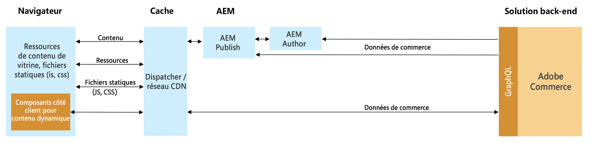

# Intégration de l&#39;AEM et de l&#39;Adobe Commerce (Magento) à l&#39;aide de Commerce Integration Framework {#aem-magento-framework}

Le Experience Manager et le Commerce des Adobes (Magento) sont intégrés de façon transparente à l&#39;aide du Commerce Integration Framework (CIF). CIF permet aux AEM d&#39;accéder directement à l&#39;instance de commerce et de communiquer avec elle à l&#39;aide des [API GraphQL](https://devdocs.magento.com/guides/v2.4/graphql/) d&#39;Adobe Commerce.

>[!NOTE]
>
>GraphQL est actuellement utilisé comme Cloud Service dans deux scénarios (distincts) à Adobe Experience Manager (AEM) :
>
>* Ce scénario, où CIF communique avec le commerce via GraphQL.
>* [AEM Fragments de contenu fonctionnent conjointement avec l’API AEM GraphQL (une implémentation personnalisée, basée sur GraphQL standard), pour fournir du contenu structuré à utiliser dans vos applications](/help/assets/content-fragments/graphql-api-content-fragments.md).

## Aperçu de l’architecture {#overview}

L’architecture globale est la suivante :

Le CIF prend en charge les schémas de communication côté serveur et côté client.
Les appels d&#39;API côté serveur sont implémentés à l&#39;aide du client générique [GraphQL](https://github.com/adobe/commerce-cif-graphql-client) intégré, associé à un [ensemble de modèles de données générés](https://github.com/adobe/commerce-cif-magento-graphql) pour le schéma GraphQL de commerce. De plus, toute requête ou mutation GraphQL au format GQL peut être utilisée.

Pour les composants côté client, qui sont créés à l’aide de [React](https://reactjs.org/), le [client Apollo](https://www.apollographql.com/docs/react/) est utilisé.

## Architecture des composants principaux AEM CIF {#cif-core-components}

[AEM ](https://github.com/adobe/aem-core-cif-components) Composants de base du FIC suivent des modèles de conception et des pratiques exemplaires très similaires à ceux des Composants [ de base de la gestion de la gestion de la main-d&#39;oeuvre ](https://github.com/adobe/aem-core-wcm-components)AEM.

La logique commerciale et la communication avec l&#39;Adobe Commerce pour les composants de base AEM CIF sont mises en oeuvre dans les modèles Sling. Au cas où il serait nécessaire de personnaliser cette logique pour répondre aux exigences spécifiques du projet, le modèle de délégation pour les modèles Sling peut être utilisé.

>[!TIP]
>
>La page [Personnalisation des composants principaux AEM CIF](../customizing/customize-cif-components.md) contient un exemple détaillé et des bonnes pratiques sur la personnalisation des composants principaux du CIF.

Dans les projets, AEM composants principaux CIF et les composants de projet personnalisés peuvent facilement récupérer le client configuré pour un magasin de commerce d&#39;Adobes associé à une page AEM via la configuration Sling Context-ware.
