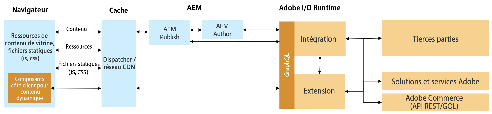

# Intégration d’AEM et de solutions commerciales tierces à l’aide de Commerce Integration Framework {#aem-third-party}

L’intégration de la solution Commerce non Adobe est un scénario courant pour CIF. Les solutions tierces avec différentes API et schémas sont connectées via une couche d’intégration.

## Architecture {#architecture}

L’architecture globale se présente comme suit :

Cette couche d’intégration a pour but de mapper des API et des schémas tiers aux API et schémas Adobe GraphQL et aux schémas pris en charge en dehors du Experience Manager. Grâce à cette encapsulation, la logique d’intégration et les systèmes peuvent être mis à jour sans modifier le code dans le Experience Manager.

## Exigences de solution pour une intégration

Lorsque le Experience Manager récupère des données à la demande, des API en temps réel pour le catalogue de produits sont requises.

>[!TIP]
>
>Si aucune API en temps réel n’est disponible, un cache de produit externe avec les API doit être utilisé pour l’intégration. Exemple [Magento open-source](https://magento.com/products/magento-open-source).

Il n’est pas nécessaire de mettre en oeuvre le schéma GraphQL complet, juste les objets du schéma pour activer les cas d’utilisation souhaités.

## Cas d’utilisation du serveur principal

CIF étend le Experience Manager avec des outils de gestion de l’expérience des produits et un accès au catalogue de produits en temps réel. Cette intégration transparente permet aux auteurs d’accéder aux données commerciales à l’aide d’interfaces utilisateur intégrées si nécessaire, sans quitter le contexte de contenu.

L’intégration des API de catalogue de produits est nécessaire pour déverrouiller ces cas d’utilisation.

## Cas d’utilisation front-end

[AEM ](https://github.com/adobe/aem-core-cif-components) les composants principaux CIF récupèrent et échangent des données via les API Commerce d’Adobe prises en charge par CIF. Pour réutiliser les composants, les API respectives doivent être implémentées.

Il est recommandé de communiquer directement avec la solution tierce afin d’éviter toute latence, ce qui est essentiel pour les performances des composants côté client.

## Développement d’une intégration {#develop-integration}

Nous vous recommandons d’utiliser [Adobe I/O Runtime](https://www.adobe.io/apis/experienceplatform/runtime.html) pour la couche d’intégration. Il est inclus dans le module complémentaire CIF pour les tiers. Comme il fonctionne avec une approche de microservice, il est bien adapté pour intégrer facilement plusieurs solutions.

La [mise en oeuvre de référence](https://github.com/adobe/commerce-cif-graphql-integration-reference) est un excellent point de départ pour créer l’intégration à votre solution commerciale. Bien qu’il prenne en charge GraphQL, il peut également être intégré à tout autre type d’API tel que REST.

Cette couche d’intégration n’est pas requise si une couche tierce est disponible (par exemple, Mulesoft) ou si l’intégration est créée sur la solution tierce.
