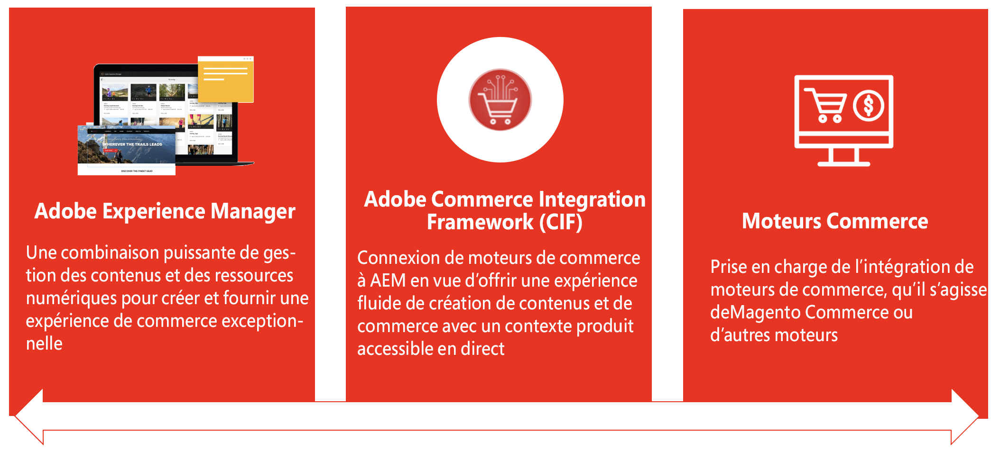

# Content and Commerce {#content-commerce}

Grâce à Adobe Experience Manager Content and Commerce, les marques peuvent évoluer et innover plus rapidement pour différencier leurs expériences commerciales et de générer plus de dépenses en ligne. AEM Content and Commerce combine les expériences immersives, omnicanales et personnalisées d’Experience Manager avec celles d’un certain nombre de solutions de commerce afin d’apporter des expériences différenciées à toutes les étapes du parcours commercial, ce qui vous fait gagner du temps et entraîne un taux de conversion plus élevé.

## Comment Content and Commerce contribue au succès de ses clients {#successful}

Avec les attentes de plus en plus élevées des clients concernant les expériences commerciales en ligne, les marques subissent de fortes pressions pour offrir des expériences différenciées et plus de contenu plus rapidement. Cependant, la mise en œuvre d’une plateforme de gestion de contenu nécessite souvent des investissements importants en temps et en budget pour développer des éléments fondamentaux, tels que les composants personnalisés et les outils de création, et entraîne des coûts importants de maintenance et de mise à niveau. Experience Manager Sites propose Content and Commerce sous la forme d’un module complémentaire pour Experience Manager as a Cloud Service qui fournit des composants de base commerciaux prêts à l’emploi, des outils de création et un storefront de référence pour accélérer la mise en service, permettre une collaboration transparente entre les équipes et stimuler le taux de conversion.

Les marques peuvent intégrer Experience Manager à Adobe Commerce, un composant d’Adobe Experience Cloud, ainsi qu’à tout moteur de commerce de leur choix. Grâce à Experience Manager Content and Commerce, les marques peuvent :

* évoluer et innover plus rapidement ;
* personnaliser leurs expériences pour générer des conversions ;
* créer une fois, et publier partout ;
* enrichir et différencier leurs expériences pour chacun de leurs clients ;
* simplifier la création pour les auteurs de contenu en leur offrant un accès aux données commerciales.

## Présentation de Commerce Integration Framework (CIF) d’AEM {#cif-intro}

Ces projets doivent gérer toute la complexité de l’intégration d’une solution de commerce. Une solution de commerce peut être n’importe quelle solution commerciale telle que Adobe Commerce Cloud ou un ensemble de services commerciaux personnalisés. L’intégration dépend fortement des cas d’utilisation et de l’écosystème du projet. Il touche généralement différents endroits et se présente sous des formes différentes :

* Intégration d’un écosystème complexe et dynamique (exemples de catalogues de produits)
* L’entreprise doit gérer le contenu d’un produit avec son propre cycle de vie de manière efficiente et omnicanal
* Conception de parcours d’achats complexes et personnalisés pour divers intervenants
* Possibilité d’adapter et d’innover rapidement en front-end comme en back-end
* Exécution d’une infrastructure de bout en bout évolutive et stable, conçue pour des performances de pointe (ventes flashs, Black Friday, etc.) : inclut la recherche unifiée et la gestion du cache

Cette complexité ouvre la porte à de potentielles défaillances, à une augmentation du coût total de possession, à des retards et à une diminution de la valeur relative créée. Ces raisons ont conduit au développement de Commerce Integration Framework (CIF), un module complémentaire d’Experience Manager. Le CIF complémente Experience Manager en lui adjoignant des fonctionnalités commerciales et en normalisant son intégration à un moteur de commerce. Résultat : une solution évolutive, stable et à l’épreuve du temps, avec un coût total de possession plus faible. Il libère de nouvelles possibilités d’innovations techniques et commerciales à l’aide d’outils agiles et de fonctionnalités parfaitement intégrées afin de créer des expériences commerciales attrayantes.

## Prise en charge efficace des clients par le module CIF depuis 2013 {#support}

Avec plus de 200 clients, CIF a prouvé son efficacité pour réaliser des projets Content and Commerce réussis. Il offre une valeur ajoutée aux technologies de l’information et aux entreprises, dès aujourd’hui et pour leur futur. Comme le décrivent de récents projets de clientes et clients, CIF est un « incroyable accélérateur de développement et offre un gain de temps considérable pour générer une valeur importante ».

## Avantages de CIF {#cif-benefits}

CIF fournit des composants principaux commerciaux prêts à l’emploi qui réduisent le besoin de code personnalisé et accélèrent le délai de mise sur le marché des marques. Tous les composants principaux sont prêts à l’emploi et intégrés à la couche de données côté client d’Adobe pour nourrir les profils clients, comme par exemple le profil unifié. Ce profil capture en détail le comportement d’un visiteur ou d’une visiteuse et peut être utilisé pour prédire le parcours client et le personnaliser en temps réel.

Le module complémentaire CIF apporte du contexte de produit à Experience Manager et fournit des outils de création tels qu’une console de produits et des sélecteurs de produits ou de catégories qui permettent au spécialiste marketing de créer et de diffuser des expériences Shoppable dans Experience Manager sans faire appel au développeur. Voici ses avantages :

### Expériences {#experiences}

Grâce aux puissants outils de CIF d’AEM, les créateurs de contenu peuvent rapidement créer des expériences commerciales riches et personnalisées, de manière évolutive et indépendamment de la diffusion, afin de tirer parti de toutes les opportunités commerciales.

### Délai de rentabilité (Time-To-Value) {#ttv}

Accélère le développement du projet avec les [Composants principaux AEM](https://www.aemcomponents.dev/), [le storefront de référence AEM Venia](https://github.com/adobe/aem-cif-guides-venia), [l’archétype de projet](https://experienceleague.adobe.com/docs/experience-manager-core-components/using/developing/archetype/overview.html?lang=fr) et les modèles d’intégration pour les applications web progressives (contenu et commerce découplés).

CIF est conçu vous permettre d’innover en continu grâce à un module complémentaire toujours à jour qui permet à ses clients d’accéder sans cesse à de nouvelles fonctionnalités améliorées.

### Intégrations {#integrations}

Connectez votre réseau (une solution de commerce, par exemple) à Experience Cloud à l’aide d’[Adobe I/O Runtime](https://www.adobe.io/apis/experienceplatform/runtime.html), un PaaS sans serveur basé sur micro-service, et de l’[implémentation de référence de CIF](https://github.com/adobe/commerce-cif-graphql-integration-reference).

## Modèles et bonnes pratiques éprouvés {#proven}

CIF prend en charge les clients dotés de modèles d’intégration normalisés et basés sur les bonnes pratiques. Il permet ainsi à ses clients de profiter dès aujourd’hui de ses avantages tout en s’adaptant à leurs futurs besoins :

* Il élimine les obstacles classiques relatifs aux intégrations de catalogues de produits. Exemples :
   * Problèmes de performances liés à l’augmentation du volume ou de la complexité du catalogue
   * Pas d’accès aux données intermédiaires
   * Besoin de données et d’expériences produit en temps réel
* Une maturité numérique croissante entraîne un besoin accru de gestion de l’expérience. CIF s’accompagne de fonctionnalités de gestion de l’expérience produit qui peuvent être intégrées de manière incrémentielle sans effort informatique supplémentaire.
* Prêt pour l’omnicanal : CIF prend en charge diverses technologies de point de contact (côté serveur, hybride, côté client) avec des modèles, des accélérateurs et des composants principaux.

## Parcours {#journey}

Si vous suivez un Parcours Commerce, passez à l’étape suivante :

* Le [parcours de création de contenu AEM](/help/commerce-cloud/commerce-journeys/aem-commerce-content-author/getting-started.md)
