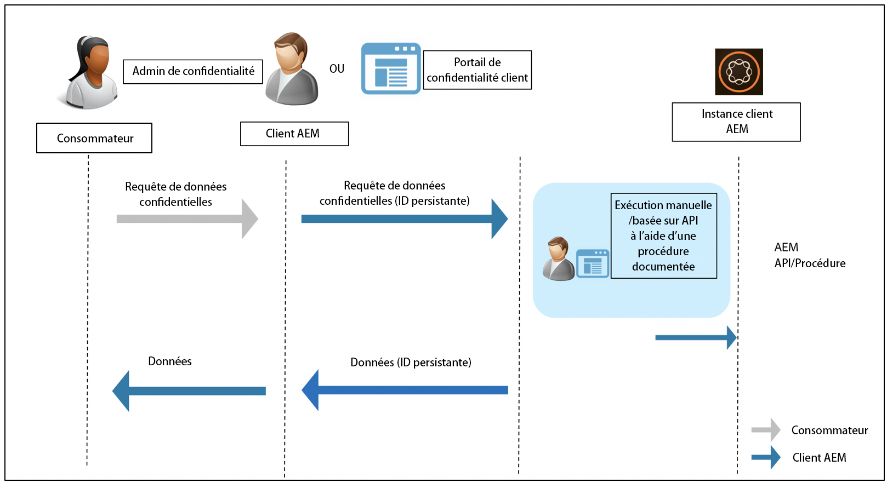

# Niveau de préparation d’Adobe Experience Manager as a Cloud Service aux réglementations sur la protection et la confidentialité des données {#aem-readiness-for-data-protection-and-data-privacy-regulations}

>[!WARNING]
>
>Le contenu de ce document ne constitue pas un avis juridique et ne vise pas à le remplacer.
>
>Consultez le service juridique de votre entreprise pour obtenir des conseils concernant les réglementations sur la protection et la confidentialité des données.

>[!NOTE]
>
>Pour plus d’informations sur la réponse d’Adobe aux problèmes de confidentialité et sur ce que cela signifie pour vous en tant que client ou cliente d’Adobe, voir [Centre de traitement des données personnelles d’Adobe](https://www.adobe.com/fr/privacy.html).

Pour aider les clientes et clients d’Adobe à se conformer à ces réglementations, Adobe fournit de la documentation et des procédures (avec des API si elles sont disponibles) aux administrateurs et administratrices de la confidentialité des clientes et des clients et aux administrateurs et administratrices AEM :

* La documentation aide les administrateurs et les administratrices à gérer les demandes de protection et de confidentialité des données.
* Les procédures décrites permettent aux clientes et aux clients d’exécuter les demandes légales manuellement ou en appelant l’API, si disponible, à partir d’un portail ou d’un service externe.

>[!CAUTION]
>
>Les détails documentés ici sont limités à Adobe Experience Manager as a Cloud Service.
>
>Les données d’un autre service à la demande d’Adobe, ainsi que toute demande associée d’accès à des informations personnelles, nécessitent des actions relatives à ce service.
>
>Pour plus d’informations, voir la section [Centre de traitement des données personnelles d’Adobe](https://www.adobe.com/fr/privacy.html).

## Présentation {#introduction}

Les instances d’Adobe Experience Manager as a Cloud Service, ainsi que les applications qui s’y exécutent, sont détenues et exploitées par les clientes et les clients d’Adobe.

Ainsi, les règlements relatifs à la protection des données, telles que le RGPD, le CCPA et d’autres, relèvent, en grande partie, de la responsabilité des clientes et des clients.

En guise de petite introduction, les règlements relatifs à la confidentialité et à la protection des données incluent de nouvelles règles qui devront être appliquées par les entités exerçant les rôles suivants :

* Entités commerciales (CCPA) et/ou Contrôleurs de données (RGPD)

* Prestataires (CCPA) et/ou Responsables du traitement des données (RGPD)

Les principales dispositions de ces règlements sont les suivantes :

1. Définition étendue des données personnelles pour inclure tous les identifiants uniques ; comme dans des données identifiables directement et indirectement.

2. Amélioration des exigences en matière de consentement.

3. Accent accru sur les droits de suppression (effacement des données).

4. Droit d’opposition (opt-out) à la vente des données.

Pour Adobe Experience Manager as a Cloud Service :

* Les instances et les applications qui s’exécutent sur ces instances sont détenues et exploitées par le client.

   * La propriété signifie effectivement que le client ou la cliente gère les rôles légaux, notamment les entités commerciales et le fournisseur de services, le contrôleur de données et le responsable du traitement des données.

   * Adobe Experience Platform Privacy Service ne fait pas partie du workflow d’AEM, comme illustré dans le diagramme ci-dessous.

* AEM comprend la documentation et les procédures permettant à l’administrateur de confidentialité du client et/ou à l’administrateur AEM d’exécuter les demandes d’accès à des informations personnelles, le cas échéant, manuellement, ou par le biais d’API.

* Aucun nouveau service ou interface utilisateur n’a été ajouté.

   * Au lieu de cela, les procédures et les API sont documentées pour une utilisation par les interfaces utilisateur/portails du client qui gèrent les demandes relatives à la réglementation de la confidentialité.

* AEM n’inclut aucun outil prêt à l’emploi pour prendre en charge le workflow des demandes d’accès à des informations personnelles.

   * Adobe fournit une documentation et des procédures à l’administrateur ou l’administratrice de confidentialité du client ou de la cliente ou à l’administrateur ou l’administratrice AEM, leur permettant d’exécuter manuellement les demandes liées aux règlements de confidentialité.

Adobe fournit des procédures pour le traitement des demandes d’accès à des informations personnelles liées à l’accès, à la suppression et au droit d’opposition pour Adobe Experience Manager as a Cloud Service. Dans certains cas, des API peuvent être appelées à partir d’un portail développé par le client ou la cliente ou de scripts pour faciliter l’automatisation.

Le diagramme suivant illustre à quoi pourrait ressembler un workflow de demande d’accès à des informations personnelles (illustré à l’aide d’Adobe Experience Manager 6.5) :

## Adobe Experience Manager as a Cloud Service et préparation par rapport à la réglementation {#aem-as-a-cloud-service-and-regulatory-readiness}

Consultez les sections ci-dessous pour en savoir plus sur la réglementation des domaines de produit d’AEM as a Cloud Service.

## Adobe Experience Manager as a Cloud Service Foundation {#aem-foundation}

Voir la section [Préparation d’AEM Foundation aux réglementations sur la protection et la confidentialité des données](/help/compliance/data-privacy-and-protection-readiness/foundation-readiness.md).

## Adobe Experience Manager Sites as a Cloud Service {#aem-sites}

Voir la section [Préparation d’AEM Sites aux réglementations sur la protection et la confidentialité des données](/help/compliance/data-privacy-and-protection-readiness/sites-readiness.md)

## Intégration d’Adobe Experience Manager as a Cloud Service avec Adobe Target et Adobe Analytics {#aem-integration-with-adobe-target-adobe-analytics}

Les intégrations d’Adobe Experience Manager as a Cloud Service avec Adobe Target et Adobe Analytics sont mises en œuvre avec les services relatifs à la protection et la confidentialité des données (par exemple, le RGPD). Aucune donnée personnelle provenant d’Adobe Target ou d’Adobe Analytics n’est stockée dans AEM en lien avec les intégrations.
Pour en savoir plus, voir :

* [Adobe Target – Présentation de la confidentialité](https://experienceleague.adobe.com/docs/target-dev/developer/implementation/privacy/cmp-privacy-and-general-data-protection-regulation.html?lang=fr)

* [Processus relatif à la confidentialité des données Adobe Analytics](https://experienceleague.adobe.com/docs/analytics/admin/admin-tools/data-governance/an-gdpr-workflow.html?lang=fr)
