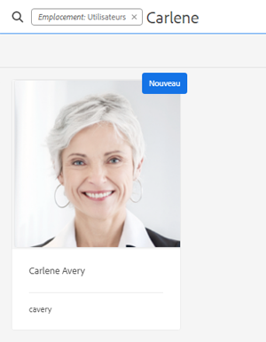
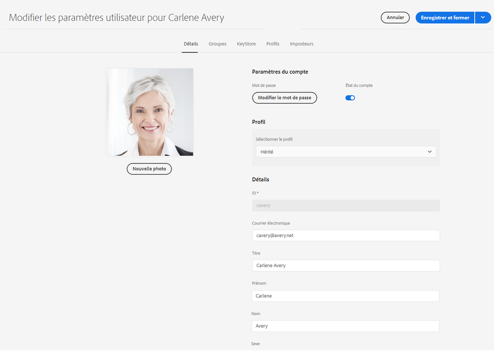
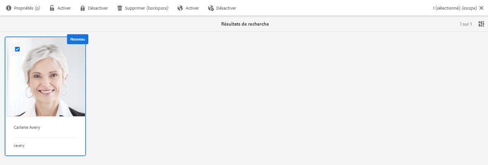
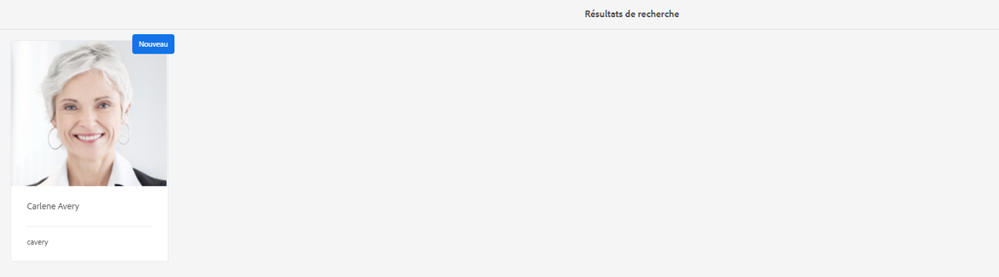

# Préparation d’Adobe Experience Manager as a Cloud Service Foundation pour les règlements sur la protection et la confidentialité des données {#aem-foundation-readiness-for-data-protection-and-data-privacy-regulations}

>[!WARNING]
>
>Le contenu de ce document ne constitue pas un avis juridique et ne vise pas à le remplacer.
>
>Consultez le service juridique de votre entreprise pour obtenir des conseils concernant les réglementations sur la protection des données et la confidentialité des données.

>[!NOTE]
>
>Pour plus d’informations sur la réponse d’Adobe aux problèmes de confidentialité et sur ce que cela signifie pour vous en tant que client Adobe, voir la section [Centre de traitement des données personnelles d’Adobe](https://www.adobe.com/fr/privacy.html).

## Prise en charge de la confidentialité et de la protection des données d’AEM Foundation {#aem-foundation-data-privacy-and-protection-support}

En ce qui concerne AEM Foundation, les données personnelles stockées sont conservées dans le profil utilisateur. Ainsi, les informations fournies dans cet article expliquent principalement comment accéder à ces profils utilisateur et les supprimer pour répondre respectivement aux demandes d’accès et de suppression.

## Accès à un profil utilisateur {#accessing-a-user-profile}

### Étapes manuelles {#manual-steps}

1. Ouvrez la console d’administration des utilisateurs en accédant à **[!UICONTROL Outils – Sécurité – Utilisateurs]** ou en accédant directement à `https://<serveraddress>:<serverport>/security/users.html`.

<!--
   
-->

1. Recherchez ensuite l’utilisateur en question en saisissant le nom dans la barre de recherche située en haut de la page :

   

1. Enfin, ouvrez le profil utilisateur en cliquant dessus, puis consultez les informations sous l’onglet **[!UICONTROL Détails]**.

   

### API HTTP  {#http-api}

Comme mentionné, Adobe fournit des API pour accéder aux données utilisateur, afin de faciliter l’automatisation. Il existe plusieurs types d’API que vous pouvez utiliser :

**API UserProperties**

```shell
curl -u user:password http://localhost:4502/libs/granite/security/search/profile.userproperties.json\?authId\=cavery
```

**API Sling**

**Découverte du répertoire de base (home) des utilisateurs :**

```xml
curl -g -u user:password 'http://localhost:4502/libs/granite/security/search/authorizables.json?query={"condition":[{"named":"cavery"}]}'
     {"authorizables":[{"type":"user","authorizableId_xss":"cavery","authorizableId":"cavery","name_xss":"Carlene Avery","name":"Carlene Avery","home":"/home/users/we-retail/DSCP-athB1NYLBXvdTuN"}],"total":1}
```

**Récupération des données utilisateur :**

Utilisation du chemin de nœud de la propriété home de la charge utile JSON renvoyée par la commande ci-dessus :

```shell
curl -u user:password  'http://localhost:4502/home/users/we-retail/DSCP-athB1NYLBXvdTuN/profile.-1.json'
```

```shell
curl -u user:password  'http://localhost:4502/home/users/we-retail/DSCP-athB1NYLBXvdTuN/profiles.-1.json'
```

## Désactivation d’un utilisateur et suppression des profils associés {#disabling-a-user-and-deleting-the-associated-profiles}

### Désactivation d’un utilisateur {#disable-user}

1. Ouvrez la console Administration utilisateur et recherchez l’utilisateur en question, comme décrit ci-dessus.
2. Pointez sur l’utilisateur et cliquez sur l’icône de sélection. Le profil devient gris pour indiquer qu’il est sélectionné.

3. Appuyez sur le bouton **Désactiver** dans le menu supérieur pour désactiver l’utilisateur :

   

4. Enfin, confirmez l’action.

   L’interface utilisateur indique alors que le compte utilisateur a été désactivé en grisant la carte de profil et en y ajoutant un cadenas :

   

### Suppression des informations d’un profil utilisateur {#delete-user-profile-information}

>[!NOTE]
>
>Pour AEM as a Cloud Service, aucune procédure manuelle n’est disponible dans l’interface utilisateur pour la suppression d’un profil utilisateur, car CRXDE n’est pas accessible.

### API HTTP  {#http-api-1}

Les procédures suivantes utilisent l’outil de ligne de commande `curl` pour illustrer comment désactiver l’`userId` **[!UICONTROL cavery]** et supprimer ses profils disponibles à l’emplacement par défaut.

**Découverte du répertoire de base (home) des utilisateurs :**

```shell
curl -g -u user:password 'http://localhost:4502/libs/granite/security/search/authorizables.json?query={"condition":[{"named":"cavery"}]}'
     {"authorizables":[{"type":"user","authorizableId_xss":"cavery","authorizableId":"cavery","name_xss":"Carlene Avery","name":"Carlene Avery","home":"/home/users/we-retail/DSCP-athB1NYLBXvdTuN"}],"total":1}
```

**Désactivation de l’utilisateur :**

Utilisation du chemin de nœud de la propriété home de la charge utile JSON renvoyé par la commande ci-dessus :

```shell
curl -X POST -u user:password -FdisableUser="describe the reasons for disabling this user (Data Privacy in this case)" 'http://localhost:4502/home/users/we-retail/DSCP-athB1NYLBXvdTuN.rw.userprops.html'
```

**Suppression du ou des profils utilisateur**

Utilisation du chemin de nœud de la propriété home de la charge utile JSON renvoyé par la commande de découverte de compte et les emplacements de nœuds de profil prêts à l’emploi connus :

```shell
curl -X POST -u user:password -H "Accept: application/json,**/**;q=0.9" -d ':operation=delete' 'http://localhost:4502/home/users/we-retail/DSCP-athB1NYLBXvdTuN/profile'
```

```shell
curl -X POST -u user:password -H "Accept: application/json,**/**;q=0.9" -d ':operation=delete' 'http://localhost:4502/home/users/we-retail/DSCP-athB1NYLBXvdTuN/profile'
```
