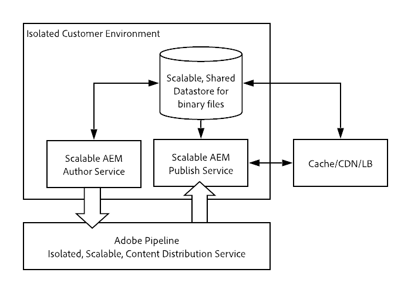

# Présentation de l’architecture d’Adobe Experience Manager en tant que service Cloud {#an-introduction-to-the-architecture-adobe-experience-manager-as-a-cloud-service}

Adobe Experience Manager (AEM) en tant que service Cloud a entraîné des modifications de l’architecture.

## Mise à l’échelle {#scaling}

Le service AEM en tant que service cloud dispose désormais des fonctionnalités suivantes :

* Architecture dynamique avec un nombre variable d’images AEM.

Cette architecture :

* Est mis à l’échelle en fonction du trafic *réel* et de l’activité *réelle* .

* Comporte des instances individuelles qui ne s’exécutent que lorsque cela est nécessaire.

* Utilise des applications modulaires.

* Comporte une grappe d’auteurs par défaut ; cela évite les temps d’arrêt pour les tâches de maintenance.

Cela permet la mise à l’échelle automatique pour divers modèles d’utilisation :

Pour ce faire, toutes les instances d’AEM en tant que service cloud sont créées de manière égale, chacune avec les mêmes caractéristiques de taille par défaut en termes de nombre de noeuds, de mémoire allouée et de capacité de calcul allouée.

AEM en tant que service Cloud repose sur l’utilisation d’un moteur d’orchestration qui :

* Contrôle constamment l’état du service.

* met à l’échelle dynamiquement chacune des instances de service en fonction des besoins réels ; à l’échelle supérieure ou inférieure, le cas échéant.

This:

* S’applique au nombre de noeuds, à la quantité de mémoire et à la capacité CPU allouée sur chaque noeud.

* Permet à AEM en tant que service Cloud de prendre en charge vos schémas de trafic au fur et à mesure de leur modification.

La mise à l’échelle des instances par client du service peut être automatique ou manuelle, sur les deux axes :

* Vertical : la mémoire allouée et la capacité du processeur peuvent être augmentées ou diminuées pour un nombre fixe de noeuds.

* Horizontal : le nombre de noeuds pour un service donné peut être augmenté ou réduit.

## Environnements {#environments}

>[!NOTE]
>
> Pour plus d’informations, voir [Déploiement - Modes d’exécution.](/help/implementing/deploying/overview.md#runmodes)

AEM en tant que service Cloud est rendu disponible en tant qu’instances individuelles avec chaque instance représentant un environnement AEM complet. Il existe quatre types d’environnements disponibles avec AEM en tant que service Cloud :

* **Environnement** de production : héberge les applications destinées aux professionnels.

* **Environnement** de scène : est toujours couplée à un environnement de production unique dans une relation 1:1. L’environnement d’évaluation est utilisé pour divers tests de performances et de qualité avant que les modifications apportées à l’application ne soient transférées vers l’environnement de production.

* **Environnement** de développement : permet aux développeurs de mettre en oeuvre des applications AEM dans les mêmes conditions d’exécution que les environnements d’étape et de production.

* **Environnement** de démonstration : peut être utilisé à des fins d’évaluation, de démonstration, de prototypage et de formation.

Les environnements de développement et de démonstration sont souvent appelés environnements *non productifs* .

## Programmes {#programs}

Tout nouveau projet AEM est toujours lié à une base de code spécifique, où vous pouvez stocker le code personnalisé et la configuration de votre projet. Ces informations sont stockées dans un référentiel de code, accessible via les clients Git habituels, et mises à votre disposition au moment de la création de nouveaux programmes.

Un programme AEM est le conteneur qui comprend :

|  Élément de programme |  Nombre |
|--- |--- |
| Référentiel de code (Git) |  1 |
| Image de ligne de base (Sites ou Ressources) |  1 |
| Jeu d’environnements de phase et de production (1:1) | 0 ou 1 |
| Environnements non productifs (développement ou démonstration) | 0 à N |
| Pipeline pour chaque environnement | 0 ou 1 |

Deux types de programmes sont initialement disponibles pour AEM en tant que service Cloud :

* Service de sites AEM Cloud

* Service AEM Cloud Assets

Ces deux options permettent d’accéder à un certain nombre de fonctionnalités et de fonctionnalités. Le niveau Auteur contiendra toutes les fonctionnalités Sites et Ressources pour tous les programmes, mais les programmes Ressources n’auront pas de niveau Publication par défaut.

## Architecture d’exécution {#runtime-architecture}

Cette nouvelle architecture comporte plusieurs éléments principaux :

<!--- needs reworking -->

* Pour les sites AEM en tant que service Cloud :

   * Il existe toujours un niveau de création et un niveau de publication pour chaque environnement (à un niveau élevé).

   * Le niveau Auteur est constitué de deux noeuds ou plus au sein d’une grappe d’auteurs unique. Il se met à l’échelle automatiquement, selon l’activité de création.

      * Les auteurs/créateurs de contenu se connectent au niveau Auteur AEM pour créer, modifier et gérer le contenu.

      * La connexion au niveau Auteur est gérée par Adobe Identity Management Services (IMS).

      * L’intégration et le traitement des ressources utilisent un service de calcul des ressources dédié.
   * La couche Publication comprend deux noeuds ou plus dans une seule batterie de publication : ils peuvent fonctionner indépendamment les uns des autres. Chaque noeud est constitué d’un éditeur AEM et d’un serveur Web équipé du module Répartiteur AEM. Il se met automatiquement à l’échelle en fonction des besoins du trafic du site.

      * Les utilisateurs finaux, ou les visiteurs du site, visitent le site Web via le service de publication AEM.

* Pour AEM Assets as a Cloud Service :

   * L’architecture comprend uniquement un environnement de création.

* Les niveaux Auteur et Publier lisent et conservent le contenu depuis/vers un service Content Repository.

   * Le niveau de publication lit uniquement le contenu du calque de persistance.

   * Le niveau Auteur lit et écrit le contenu depuis et vers le calque de persistance.

   * Le stockage Blobs est partagé sur l’ensemble des niveaux de publication et d’auteur ; ne sont pas *déplacés*.

   * Lorsque le contenu est approuvé à partir du niveau Auteur, cela indique qu’il peut être activé et qu’il peut donc être déplacé vers le niveau de persistance de la couche Publication. Cela se produit via le service de réplication, un pipeline de middleware. Ce pipeline reçoit le nouveau contenu, les noeuds de service de publication individuels s’abonnant au contenu étant poussés vers le pipeline.

      >[!NOTE]
      >
      >For more details see [Replication](/help/operations/replication.md).

   * Les développeurs et les administrateurs gèrent AEM en tant qu’application de service Cloud en utilisant un service d’intégration/de diffusion continue (CI/CD), disponible via [Cloud Manager](/help/overview/what-is-new-and-different.md#cloud-manager). Cela inclut les déploiements de code et de configuration à l’aide du pipeline CI/CD de Cloud Manager. Tout ce qui concerne la surveillance, la maintenance et le dépannage (fichiers journaux, par exemple) est présenté aux clients dans Cloud Manager.

   * L’accès aux niveaux d’auteur et de publication se fait toujours via un équilibreur de charge. Il est toujours à jour avec les noeuds actifs dans chacun des niveaux.

   * Pour le niveau de publication, un service CDN (Continuous Delivery Network) est également disponible comme premier point d’entrée.

* Pour les instances de démonstration d’AEM en tant que service Cloud, l’architecture est simplifiée en noeud d’auteur unique. Il ne présente donc pas toutes les caractéristiques de l&#39;environnement de développement, d&#39;étape ou de production standard. Cela signifie également qu’il peut y avoir des temps d’arrêt et qu’il n’y a pas de prise en charge des opérations de sauvegarde/restauration.

## Architecture de déploiement {#deployment-architecture}

Cloud Manager gère toutes les mises à jour apportées aux instances d’AEM en tant que service Cloud. Il s’agit du seul moyen de créer, de tester et de déployer l’application cliente, tant sur les niveaux d’auteur que de publication. Ces mises à jour peuvent être déclenchées par Adobe, lorsqu’une nouvelle version du service AEM Cloud est prête ou par le client lorsqu’une nouvelle version de son application est prête.

D&#39;un point de vue technique, cela est mis en oeuvre grâce au concept d&#39;un pipeline de déploiement, couplé à chaque environnement d&#39;un programme. Lorsqu’un pipeline Cloud Manager est en cours d’exécution, il crée une nouvelle version de l’application cliente, à la fois pour l’auteur et pour les niveaux de publication. Pour ce faire, vous pouvez combiner les derniers packs de clients avec la dernière image Adobe de base. Lorsque les nouvelles images sont créées et testées avec succès, Cloud Manager automatise entièrement le curseur vers la dernière version de l’image en mettant à jour tous les noeuds de service à l’aide d’un modèle de mise à jour variable. Cela n’entraîne aucun temps d’arrêt pour le service d’auteur ou de publication.

<!--- needs reworking -->

## Distribution de contenu {#content-distribution}

Adobe Experience Manager en tant que service Cloud a modifié le fonctionnement du contenu de publication. Avec AEM en tant que service Cloud, la structure de réplication des versions précédentes d’AEM n’est plus utilisée pour publier des pages (déplacez les modifications de l’instance d’auteur vers les instances de publication).

AEM en tant que service cloud utilise désormais la fonctionnalité de distribution [de contenu](https://sling.apache.org/documentation/bundles/content-distribution.html) Sling pour déplacer le contenu approprié. Il utilise un service de pipeline s’exécutant sur les E/S Adobe, qui se trouve en dehors du runtime AEM.

La configuration est automatisée, y compris l’auto-configuration automatique lorsque des noeuds de publication sont ajoutés, supprimés ou recyclés au moment de l’exécution.

Une requête de publication ou d’annulation de publication unique peut inclure plusieurs ressources, mais renvoie un état unique appliqué à tous ; il réussira pour toutes les ressources du service de publication AEM, ou échouera pour tous. Cela garantit que les ressources du service de publication AEM ne seront jamais dans un état incohérent.

**Diagramme de l’architecture de distribution de contenu de haut niveau**

## Évolutions clés {#key-evolutions}

La nouvelle architecture d’AEM as a Cloud Service introduit quelques modifications et innovations fondamentales par rapport aux générations précédentes :

* Tous les fichiers (blobs) sont directement téléchargés et diffusés à partir d’un magasin de données cloud. Le flux de bits associé ne passe jamais par la JVM des services d’auteur et de publication AEM. En conséquence, les noeuds des services d’auteur et de publication AEM peuvent être de taille plus petite et plus compatibles avec l’attente d’une mise à l’échelle automatique rapide. Pour les professionnels, cela permet d’accélérer le téléchargement des images, des vidéos, etc.

* Toutes les opérations consistant à publier du contenu impliquent désormais un pipeline suivant un modèle d’abonnement. Le contenu publié est envoyé à diverses files d’attente dans le pipeline, auxquelles tous les noeuds du service de publication sont abonnés. Par conséquent, la couche Auteur n’a pas besoin de connaître le nombre de noeuds dans le service de publication ; cela permet une mise à l’échelle automatique rapide du niveau de publication.

* Le concept d’un maître doré a été introduit pour automatiser le cycle de vie des noeuds de publication. Le maître d’or est un noeud de publication spécialisé, auquel aucun utilisateur final n’a accès et à partir duquel tous les noeuds du service de publication sont créés. Les opérations de maintenance, telles que la compaction, sont exécutées sur le référentiel de contenu joint au gabarit doré. Les noeuds de publication sont recyclés tous les jours et ne nécessitent aucune maintenance courante ; par le passé, cette maintenance nécessitait des temps d’arrêt, en particulier pour l’instance d’auteur.

* L’architecture sépare complètement le contenu de l’application du code et de la configuration de l’application. Tout le code et la configuration sont pratiquement immuables et intégrés à l’image de base utilisée pour créer les différents noeuds des services de création et de publication. Par conséquent, il existe une garantie absolue que chaque noeud est identique et que les modifications apportées au code et à la configuration ne peuvent être effectuées globalement qu’en exécutant un pipeline Cloud Manager.
