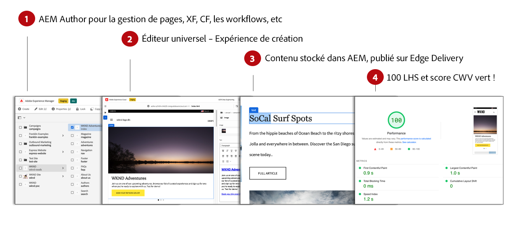
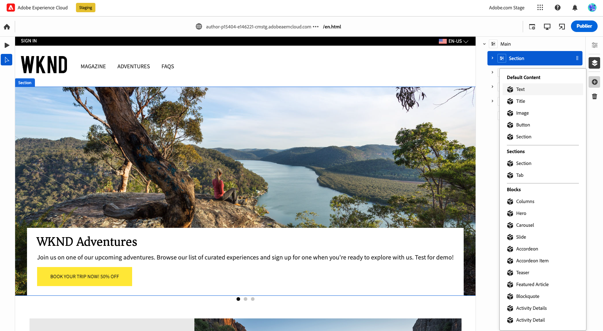
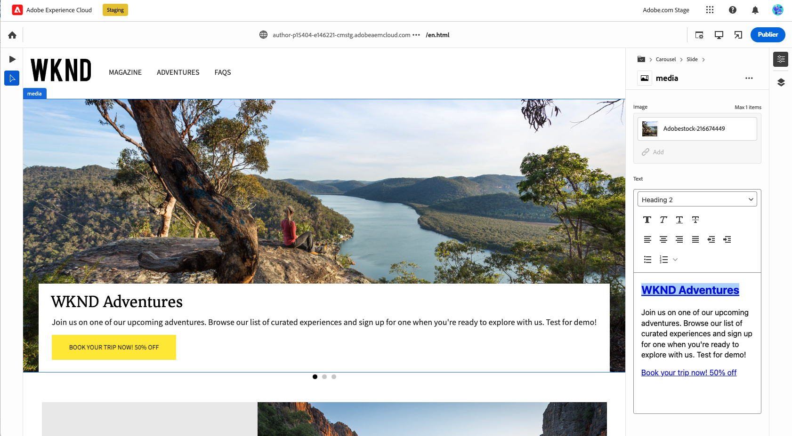

# Créer du contenu pour Edge Delivery Services {#authoring-edge}

Avec Edge Delivery Services, la création est facile, rapide et flexible. Vous disposez de deux options pour créer du contenu pour Edge Delivery Services :

* [Éditeur universel](#universal-editor) - Interface utilisateur moderne pour la création de contenu dans AEM
* [Création basée sur des documents](#document-based) - Documents Microsoft Word ou Google, par exemple

## Création avec l’éditeur universel {#universal-editor}

Lorsque vous utilisez Edge Delivery Services avec AEM as a Cloud Service, l’aspect le plus important à comprendre est que le contenu que vous créez est conservé dans AEM as a Cloud Service.

1. [L’environnement de création AEM](/help/sites-cloud/authoring/quick-start.md) est utilisé pour la gestion de contenu, par exemple pour créer des pages, des fragments d’expérience, des fragments de contenu, etc.
   * Toutes les fonctionnalités d’AEM sont disponibles : workflows, MSM, traduction, lancements, etc.
1. [L’éditeur universel](/help/sites-cloud/authoring/universal-editor/authoring.md) est utilisé pour créer le contenu géré dans AEM.
   * Il propose une nouvelle interface utilisateur moderne pour la création de contenu.
   * Pour la création, AEM effectue le rendu du HTML, mais inclut les scripts, les styles, les icônes et d’autres ressources provenant d’Edge Delivery Services.
   * Bien que l’on utilise l’éditeur universel, toutes les modifications sont conservées dans AEM.
   * L’éditeur universel n’est pas encore à parité avec l’éditeur de page d’AEM et certaines fonctions d’AEM risquent de ne pas être disponibles dans l’éditeur universel.
1. Le contenu que vous créez avec l’éditeur universel et conservez dans AEM est publié dans Edge Delivery Services.
   * Le contenu reste stocké dans AEM.
   * AEM effectue le rendu du HTML sémantique nécessaire à l’ingestion.
   * Le contenu est publié dans Edge Delivery Services.
1. [Edge Delivery Services](/help/edge/developer/keeping-it-100.md) garantit un score Lighthouse de 100 %.

Les blocs sont des composants fondamentaux d’une page diffusée par Edge Delivery Services. Les auteurs et autrices peuvent choisir parmi les blocs par défaut fournis en standard par Adobe ou parmi les blocs personnalisés pour votre projet par votre équipe de développement.

L’éditeur universel fournit une interface utilisateur graphique moderne et intuitive pour créer votre contenu en faisant glisser des blocs.

Les détails des blocs peuvent ensuite être configurés dans le rail Propriétés.

Pour plus d’informations sur la création à l’aide de l’éditeur universel, consultez le document [Créer du contenu avec l’éditeur universel](/help/sites-cloud/authoring/universal-editor/authoring.md).

Veuillez consulter le [Guide de prise en main du développement pour la création AEM avec Edge Delivery Services](/help/edge/aem-authoring/edge-dev-getting-started.md) afin d’apprendre à démarrer votre propre projet pour créer avec AEM et Edge Delivery Services.

## Création basée sur des documents  {#document-based}

Lors de l’utilisation de la création basée sur des documents, vous pouvez utiliser diverses sources telles que des documents Microsoft Word et Google Docs. Les documents provenant de ces sources deviennent des pages de votre site web. Les en-têtes, listes, images, éléments de police et vidéos peuvent tous être transférés de la source initiale vers votre site web. Vous pouvez ajouter des métadonnées à des fins d’optimisation pour les moteurs de recherche ou utiliser des blocs pour travailler avec du contenu structuré et ajouter des fonctionnalités.

Pour plus d’informations sur la création basée sur des documents, reportez-vous à [ce document dans la documentation Edge Delivery Services.](/help/edge/docs/authoring.md)

