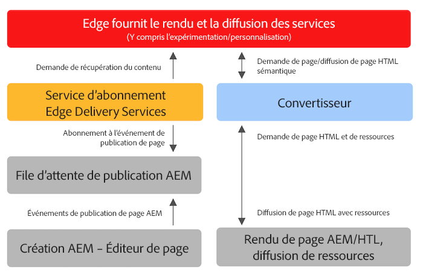

# Utiliser Edge Delivery Services avec des projets AEM existants {#existing-projects}

Vous n’avez pas besoin d’attendre un nouveau projet AEM pour bénéficier d’Edge Delivery Services. Edge Delivery Services peut être intégré à votre projet AEM existant afin que vous puissiez tirer immédiatement parti de ses gains de performances.

## Limitations de l’éditeur de page AEM {#page-editor}

Avant l’avènement d’Edge Delivery Services, le contenu géré dans AEM était modifié à l’aide de l’éditeur de page AEM. Si votre projet a commencé avant l’arrivée d’Edge Delivery Services, il est presque certain que vous utilisez l’éditeur de page.

L’éditeur de page AEM fonctionne uniquement avec des [composants AEM](/help/implementing/developing/components/overview.md), comme les [Composants principaux.](https://experienceleague.adobe.com/docs/experience-manager-core-components/using/introduction.html?lang=fr) Ceux-ci sont incompatibles avec Edge Delivery Services. Pour cette raison, deux phases sont nécessaires pour présenter Edge Delivery Services à un projet AEM existant :

* [Phase 1 – Remplacer le front-end](#replace-front-end)
* [Phase 2 – Basculer vers l’éditeur universel](#switch-ue)

## Phase 1 – Remplacer le front-end {#replace-front-end}

Lors de la première phase, vous pouvez continuer à utiliser la structure, les composants et les outils de création de votre site AEM existant. Le rendu du site web sera reconstruit à l’aide de blocs utilisant JavaScript et CSS et il sera diffusé par l’intermédiaire d’Edge Delivery Services.

Consultez la [section Créer](/help/edge/developer/block-collection.md) de la documentation d’Edge Delivery Services pour en savoir plus sur les blocs et sur la manière de développer pour Edge Delivery Services.

Un convertisseur dans le créateur d’applications est nécessaire pour convertir la sortie HTML rendue par AEM et l’envoyer à Edge Delivery Services.

La deuxième phase termine le processus en éliminant le chevauchement technologique : les composants principaux AEM avec HTL et Java sur l’instance de création AEM, les blocs basés sur JS sur Edge Delivery Services et un convertisseur basé sur nodeJS.

## Phase 2 – Basculer vers l’éditeur universel {#switch-ue}

Au cours de cette phase, l’éditeur de page d’AEM est remplacé par l’éditeur universel. Étant donné que l’éditeur universel peut fonctionner directement avec des blocs, les composants principaux d’AEM et le convertisseur ne seront plus nécessaires.

