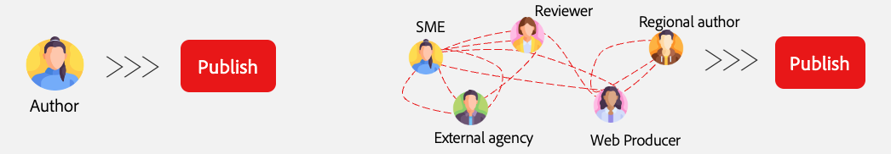
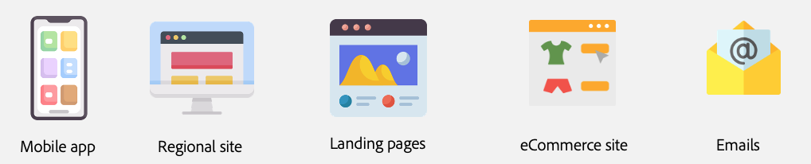

# Choix d’une méthode de création {#authoring-methods}

Découvrez les éléments à prendre en compte lorsque vous choisissez la méthode de création de contenu dans AEM afin de prendre la meilleure décision pour vos créateurs et créatrices de contenu.

## Vue d’ensemble des éléments à prendre en compte {#overview}

La flexibilité d’AEM permet de garantir la prise en compte de vos besoins, que vous choisissiez la création basée sur des documents ou la création WYSIWYG. Prenez en compte les éléments suivants lorsque vous effectuerez votre choix.

* **Impliquez toujours vos créateurs et créatrices de contenu dans la décision.** - Vos créateurs et créatrices de contenu sont vos experts et leurs opinions sont essentielles.
* **Vous pouvez opter pour plusieurs méthodes de création.** - Bien qu’Adobe recommande de commencer simplement et en ajoutant de la complexité selon les besoins, plusieurs méthodes de création peuvent fonctionner ensemble dans un même projet.
* **Vous pouvez toujours modifier votre méthode de création après coup.** - Quoi que vous décidiez, ce n’est pas définitif. Le passage d’une méthode à une autre s’effectue directement avec l’aide des outils de migration automatisée d’Adobe.
* **Vous ne devez pas décider avant la mise en œuvre, mais plutôt au cours de celle-ci.** - AEM est un produit unifié, cette importante décision n’a donc pas à faire partie des négociations de contrat. Lorsque vous achetez AEM, vous disposez de toutes ces options. Il s’agit plutôt d’une décision lors de la mise en œuvre.

Adobe peut vous aider à déterminer la ou les méthodes qui répondent le mieux à vos besoins.

## La taille unique ne va pas à tout le monde {#one-size}

Chaque mise en œuvre d’AEM a ses propres workflows et objectifs. Un projet peut impliquer un modèle de création simple avec des créateurs et créatrices de contenu responsables de leurs propres publications. Un autre projet pourrait toutefois avoir un réseau complexe de contributeurs et contributrices et d’approbations.

Différents projets peuvent présenter des cas d’utilisation différents (et multiples).

Adobe est conscient de ces disparités et ne propose donc pas d’approche universelle. AEM est une solution unique qui propose différentes approches pour la diffusion ainsi que la création de contenu afin de répondre à vos besoins.

Pour déterminer la meilleure approche, vous devez vous posez quatre questions.

1. [Avez-vous une préférence en matière de diffusion de contenu ?](#content-delivery)
1. [Avez-vous une préférence en matière de création de contenu ?](#content-authoring)
1. [Quel est l’objectif de votre projet ?](#project-goals)
1. [Quels défis rencontrez-vous actuellement en matière de création ?](#authoring-challenges)

## Préférences en matière de diffusion de contenu {#content-delivery}

La première chose à prendre en compte est la manière dont vous souhaitez diffuser votre contenu. Edge Delivery Services propose des sites ultra rapides, mais votre objectif est peut-être plutôt la diffusion découplée. L’arborescence de décision suivante peut vous aider à visualiser les différentes options.

Vous pouvez ainsi décider si vous avez besoin des éléments suivants :

* [AEM en tant que CMS découplé](/help/headless/introduction.md) à l’aide de l’éditeur de fragments de contenu et/ou de l’éditeur universel.
* AEM Edge Delivery Services avec la [modification basée sur des documents](/help/edge/docs/authoring.md) ou la [création WYSIWYG avec l’éditeur universel.](/help/edge/wysiwyg-authoring/authoring.md)

## Préférences en matière de création de contenu {#content-authoring}

Vous devez maintenant réfléchir à la manière dont vous souhaitez créer du contenu. L’arborescence de décision suivante peut vous aider à visualiser les différentes options.

Vous pouvez ainsi décider si vous avez besoin des éléments suivants :

* AEM Edge Delivery Services AEM avec la [modification basée sur des documents.](/help/edge/docs/authoring.md)
* [Création WYSIWYG avec l’éditeur universel.](/help/edge/wysiwyg-authoring/authoring.md)

## Objectifs du projet {#project-goals}

À quoi ressemble une création réussie selon vous ? Comment définissez-vous la réussite de votre projet ?

* Vous devez peut-être permettre à plus de personnes de créer du contenu, mais vous souhaitez éviter de suivre une formation sur un nouvel ensemble d’outils. (optez pour la création basée sur des documents.)
* Vous devez peut-être augmenter la quantité de contenu que vous générez. (optez pour la création basée sur des documents.)
* Vous devez peut-être vous concentrer sur la mise en page du contenu visuel, mais minimiser le besoin de connaissances en codage. (optez pour la création WYSIWYG.)

Si vous définissez clairement les objectifs du projet dès le début de votre mise en œuvre, il vous sera plus facile de choisir la bonne méthode de création.

## Défis liés à la création {#authoring-challenges}

Réfléchissez enfin aux difficultés que vous rencontrez actuellement pour créer votre contenu.

* Vous faites peut-être face à une duplication du travail avec du contenu créé en dehors de votre CMS et qui doit ensuite être importé ou copié-collé. (optez pour la création basée sur des documents.)
* Peut-être devez-vous réduire le temps nécessaire à la formation des créateurs et créatrices sur l’utilisation d’un CMS. (optez pour la création basée sur des documents.)
* Vos créateurs et créatrices doivent peut-être souvent modifier la mise en page visuelle de votre contenu, ce qui nécessite une assistance constante de l’équipe de développement. (optez pour la création WYSIWYG.)
