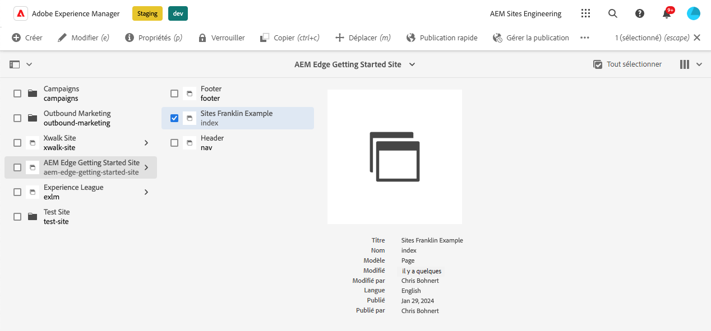
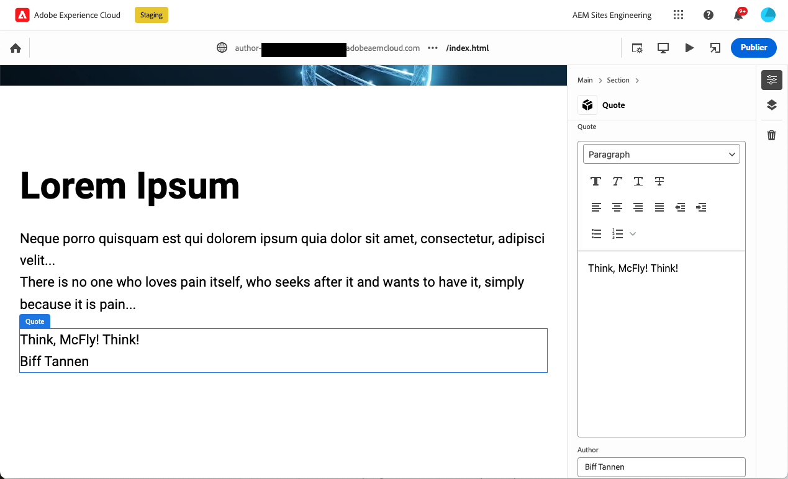
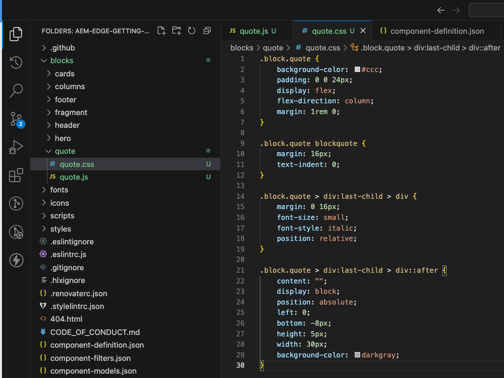
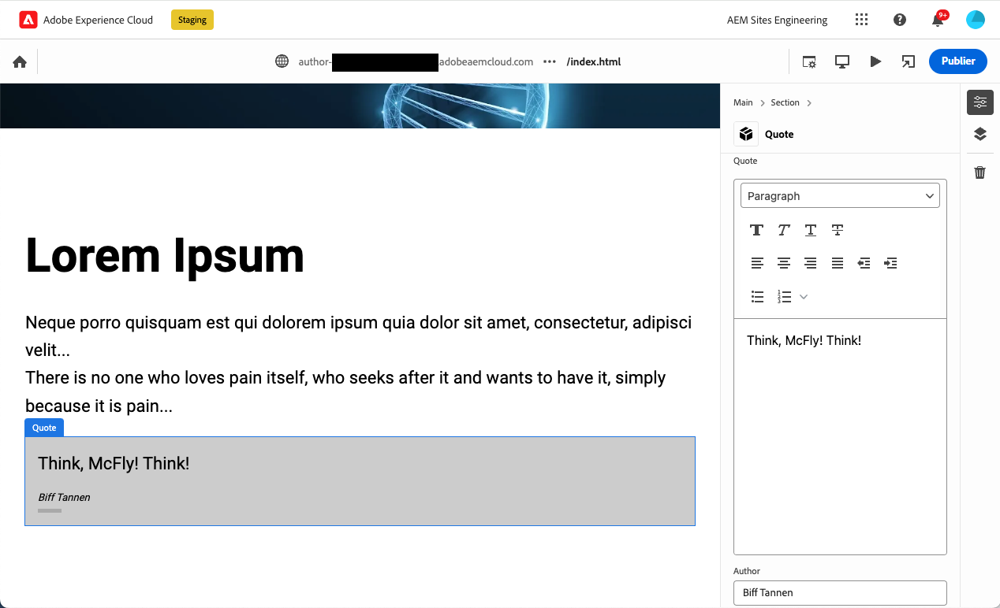

# Création de blocs instrumentés pour une utilisation avec l’éditeur universel {#create-block}

Découvrez comment créer des blocs instrumentés pour une utilisation avec l’éditeur universel dans AEM création avec des projets Edge Delivery Services.

{{aem-authoring-edge-early-access}}

## Conditions préalables {#prerequisites}

Ce guide fournit des instructions détaillées sur la création de blocs instrumentés pour l’éditeur universel dans AEM création avec des projets Edge Delivery Services. Il couvre l’ajout de composants, le chargement de définitions de composants dans l’éditeur universel, la publication de pages, la mise en oeuvre de la décoration et des styles de bloc, l’introduction des modifications dans la production et la vérification. Une fois ce guide terminé, vous pouvez créer et déployer un nouveau bloc pour votre propre projet.

Ce guide nécessite nécessairement des connaissances existantes sur la création AEM avec des projets Edge Delivery Services ainsi que sur l’éditeur universel. Avant de commencer ce guide, vous devez déjà avoir accès aux Edge Delivery Services et vous familiariser avec ses principes de base, notamment :

* Vous avez terminé la [Tutoriel sur le service de diffusion Edge.](/help/edge/developer/tutorial.md)
* Vous avez accès à une [Environnement de test AEM Cloud Service.](/help/implementing/cloud-manager/getting-access-to-aem-in-cloud/introduction-sandbox-programs.md)
* Vous avez [Activation d’Universal Editor dans le même environnement de test.](/help/implementing/universal-editor/getting-started.md)
* Vous avez terminé la [Guide de prise en main du développeur pour la création AEM avec des Edge Delivery Services](/help/edge/edge-dev-getting-started.md) guide.

Ce guide s’appuie sur le travail effectué dans la variable [Guide de prise en main du développeur pour la création AEM avec des Edge Delivery Services](/help/edge/edge-dev-getting-started.md) guide.

## Ajout d’un nouveau bloc au projet {#add-block}

Dans ce guide, vous allez créer un bloc pour rendre un guillemet mémorable sur votre page.

Pour simplifier cet exemple, toutes les modifications sont apportées au `main` branche du référentiel du projet. Bien sûr, pour votre projet réel, [vous devez suivre les bonnes pratiques de développement.](https://www.aem.live/docs/dev-collab-and-good-practices) en développant sur une autre branche et en examinant toutes les modifications via une requête de tirage avant de fusionner en `main`.

Adobe vous recommande de développer des blocs selon une approche en trois étapes :

1. Créez la définition et le modèle pour le bloc, passez en revue et procédez à sa production.
1. Créez du contenu avec le nouveau bloc.
1. Implémentez la décoration et les styles pour le nouveau bloc.

L’exemple de bloc de citations suivant suit cette approche.

### Création d’une définition de bloc et d’un modèle {#create-block-model}

1. Cloner le projet GitHub local que vous avez créé dans le [Guide de prise en main du développeur pour la création AEM avec des Edge Delivery Services](/help/edge/edge-dev-getting-started.md) et ouvrez-le dans un éditeur de votre choix.

   * Le code Microsoft est utilisé ici à des fins d’illustration.

   

1. Modifiez la variable `component-definition.json` à la racine du projet, ajoutez la définition suivante pour votre nouveau bloc de guillemet et enregistrez le fichier.

   ```json
   {
     "title": "Quote",
     "id": "quote",
     "plugins": {
       "xwalk": {
         "page": {
           "resourceType": "core/franklin/components/block/v1/block",
           "template": {
             "name": "Quote",
             "model": "quote",
             "quote": "<p>Think, McFly! Think!</p>",
             "author": "Biff Tannen"
           }
         }
       }
     }
   }
   ```

   

1. Modifiez la variable `component-models.json` à la racine du projet et ajoutez le code suivant : [définition de modèle](/help/implementing/universal-editor/field-types.md#model-structure) pour votre nouveau bloc de guillemet et enregistrez le fichier.

   * Consultez le document [Modélisation de contenu pour la création AEM avec des projets Edge Delivery Services](/help/edge/content-modeling.md) pour plus d’informations sur ce qui est important à prendre en compte lors de la création de modèles de contenu.

   ```json
   {
     "id": "quote",
     "fields": [
        {
          "component": "text-area",
          "name": "quote",
          "value": "",
          "label": "Quote",
          "valueType": "string"
        },
        {
          "component": "text-input",
          "valueType": "string",
          "name": "author",
          "label": "Author",
          "value": ""
        }
      ]
   }
   ```

   

1. Modifiez la variable `component-filters.json` à la racine du projet et ajoutez le bloc de guillemet au [définition de filtre](/help/implementing/universal-editor/customizing.md#filtering-components) pour permettre l&#39;ajout du bloc à n&#39;importe quelle section et l&#39;enregistrement du fichier.

   ```json
   {
     "id": "section",
     "components": [
       "text",
       "image",
       "button",
       "title",
       "hero",
       "cards",
       "columns",
       "quote"
      ]
   }
   ```

   

1. À l’aide de git, validez ces modifications dans votre `main` branche.

   * Commencer à `main` est fourni à titre d’illustration uniquement. [Suivre les bonnes pratiques](https://www.aem.live/docs/dev-collab-and-good-practices) et utiliser une requête de tirage pour le travail réel du projet.

### Création de contenu avec le bloc {#create-content}

Maintenant que votre bloc de guillemet de base est défini et validé dans l’exemple de projet, vous pouvez ajouter un bloc de guillemet à une page existante.

1. Dans un navigateur, connectez-vous à AEM as a Cloud Service. [À l’aide de la console Sites,](/help/sites-cloud/authoring/getting-started/basic-handling.md) accédez au site que vous avez créé dans la [Guide de prise en main du développeur pour la création AEM avec des Edge Delivery Services](/help/edge/edge-dev-getting-started.md) et sélectionnez une page.

   * Dans ce cas, `index` est utilisé à des fins d’illustration.

   

1. Appuyez ou cliquez sur **Modifier** dans la barre d’outils de la console et l’éditeur universel s’ouvre.

   * Pour charger la page, vous devrez peut-être appuyer ou cliquer sur **Connexion avec Adobe** pour vous authentifier dans AEM dans Universal Editor.

1. Sélectionnez une section dans l’éditeur universel. Dans le rail des propriétés, appuyez ou cliquez sur l’icône **Ajouter** puis sélectionnez votre nouvelle **Citation** du menu.

   * La variable **Ajouter** est un symbole plus.
   * Vous savez que vous avez sélectionné une section si le contour bleu de l’objet sélectionné comporte un onglet intitulé **Section**.
   * Dans cet exemple, appuyez ou cliquez un peu au-dessus de la fonction **Lorem Ipsum** titre sélectionne une section contenant le titre et le texte lorem ipsum.

   

1. La page est rechargée et le bloc de guillemet est ajouté au bas de la section sélectionnée avec le contenu par défaut spécifié dans la variable `component-definitions.json` fichier .

   * Le bloc de guillemet peut être sélectionné et modifié comme tout autre bloc statique ou dans le rail de propriétés.
   * Le style peut être appliqué à une autre étape.

   

1. Une fois que vous êtes satisfait du contenu de votre devis, vous pouvez publier la page en appuyant ou en cliquant sur le bouton **Publier** dans la barre d’outils d’Universal Editor.

1. Vérifiez que le contenu a été publié en accédant à la page publiée. Le lien sera similaire à `https://<branch>--<repo>--<owner>.hlx.page`

   

### Style du bloc {#style-block}

Maintenant que vous avez un bloc de guillemet de travail, vous pouvez lui appliquer un style.

1. Revenez à l’éditeur de votre projet.

1. Créez un `quote` sous `blocks` dossier.

   

1. Dans la nouvelle `quote` dossier, ajoutez une `quote.js` pour implémenter block decoration en ajoutant le code JavaScript suivant et en enregistrant le fichier.

   ```javascript
   export default function decorate(block) {
     const [quoteWrapper] = block.children;
   
     const blockquote = document.createElement('blockquote');
     blockquote.textContent = quoteWrapper.textContent.trim();
     quoteWrapper.replaceChildren(blockquote);
   }
   ```

   


1. Dans le `quote` dossier, ajoutez une `quote.css` pour définir le style du bloc en ajoutant le code CSS suivant et en enregistrant le fichier.

   ```css
   .block.quote {
       background-color: #ccc;
       padding: 0 0 24px;
       display: flex;
       flex-direction: column;
       margin: 1rem 0;
   }
   
   .block.quote blockquote {
       margin: 16px;
       text-indent: 0;
   }
   
   .block.quote > div:last-child > div {
       margin: 0 16px;
       font-size: small;
       font-style: italic;
       position: relative;
   }
   
   .block.quote > div:last-child > div::after {
       content: "";
       display: block;
       position: absolute;
       left: 0;
       bottom: -8px;
       height: 5px;
       width: 30px;
       background-color: darkgray;
   }
   ```

   

1. À l’aide de git, validez ces modifications dans votre `main` branche.

   * Commencer à `main` est fourni à titre d’illustration uniquement. [Suivre les bonnes pratiques](https://www.aem.live/docs/dev-collab-and-good-practices) et utiliser une requête de tirage pour le travail réel du projet.

1. Revenez à l’onglet de votre navigateur de l’éditeur universel dans lequel vous modifiez la page de votre projet et rechargez la page pour afficher le bloc stylisé.

1. Voir le bloc de guillemet maintenant stylisé sur la page.

   

1. Vérifiez que les modifications ont été transférées en production en accédant à la page publiée. Le lien sera similaire à `https://<branch>--<repo>--<owner>.hlx.page`

   

Félicitations. Vous avez maintenant un bloc de guillemets entièrement fonctionnel et stylisé. Vous pouvez utiliser cet exemple comme base pour concevoir vos propres blocs spécifiques à un projet.

## Utilisation d’autres branches de travail {#other-branches}

Ce guide vous a permis de vous engager directement auprès de la `main` branche pour la simplicité. Pour l’expérimentation dans un référentiel d’exemple, ce n’est généralement pas un problème. Pour le travail réel du projet, [vous devez suivre les bonnes pratiques de développement.](https://www.aem.live/docs/dev-collab-and-good-practices) en développant sur une autre branche et en examinant toutes les modifications via une requête de tirage avant de fusionner en `main`.

Lorsque vous ne développez pas sur l’événement `main` branche, vous pouvez ajouter `?ref=<branch>` dans la barre d’emplacement de l’éditeur universel pour charger la page à partir de votre branche. `<branch>` est le nom de la branche tel qu’il serait utilisé pour l’aperçu de votre projet ou les URL actives, par exemple `https://<branch>--<repo>--<owner>.hlx.page`.

La publication de contenu avec un nouveau modèle n’est prise en charge que lorsque le modèle est fusionné avec le `main` branche.
