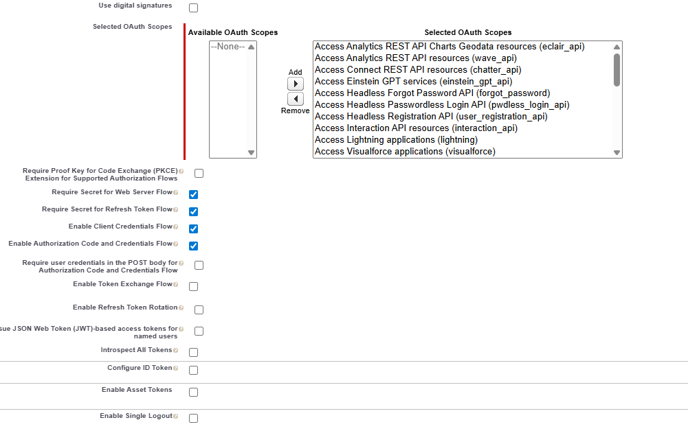

# Créer un objet de lead Salesforce à l’aide de l’intégration d’API

Ce cas d’utilisation explique comment créer un prospect dans Salesforce à l’aide de l’intégration de l’API. À la fin du processus, vous êtes en mesure de :

Configurez une [application connectée dans Salesforce](https://help.salesforce.com/s/articleView?id=platform.ev_relay_create_connected_app.htm&type=5) pour activer l’accès sécurisé à l’API.

Configurez CORS (partage de ressources entre origines multiples) pour permettre au code (tel que JavaScript) s’exécutant dans un navigateur web de communiquer avec Salesforce à partir d’une origine spécifique. Ajoutez l’origine à la liste autorisée comme illustré ci-dessous


## Paramètres de l’application connectée

Les paramètres suivants sont utilisés dans l’application connectée. Vous pouvez attribuer les portées OAuth en fonction de vos besoins.


## Créer une intégration d’API

| Nom | Valeur |
|--------------------------------|------------------|
| URL de l’API | https://`<your-domain>`d.my.salesforce.com/services/data/v32.0/sobjects/Lead |
| ID client | Spécifique à votre application connectée |
| Secret client | Spécifique à votre application connectée |
| URL OAuth | https://login.salesforce.com/services/oauth2/authorize |
| URL de jeton d’accès | https://`<your-domain>`/services/oauth2/token |
| URL du jeton d’actualisation | https://`<your-domain>`/services/oauth2/token |
| Champ d’application de l’autorisation | api chatter_api full id openid refresh_token visualforce web |
| En-tête d’autorisation | Support d’autorisation |


## Paramètres d’entrée et de sortie

Définissez les paramètres d’entrée de l’appel API et mappez les paramètres de sortie à l’aide du code json suivant

```json
{
    "id": "00QKY000001LyJR2A0",
    "success": true
}
```


## Créer un formulaire

Créez un formulaire adaptatif simple à l’aide de l’éditeur universel pour capturer les détails de l’objet Lead comme illustré ci-dessous


Gérez l’événement de clic sur la case à cocher Créer un prospect à l’aide de l’éditeur de règles. Mappez les paramètres d’entrée aux valeurs des objets de formulaire appropriés, comme illustré ci-dessous. Afficher l’identifiant de l’objet Lead nouvellement créé dans l’objet TextField `leadid`


## Test de l’intégration

- Prévisualiser le formulaire
- Saisir des valeurs significatives
- Cochez la case `Create Lead` pour déclencher l’appel API
- L’ID de lead de l’objet de lead nouvellement créé s’affiche dans le champ de texte `Lead ID`.
