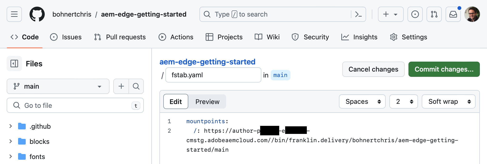
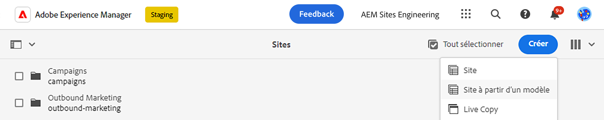
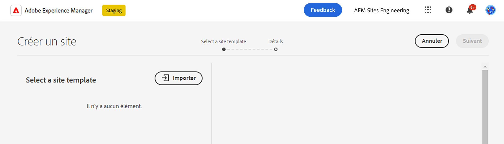
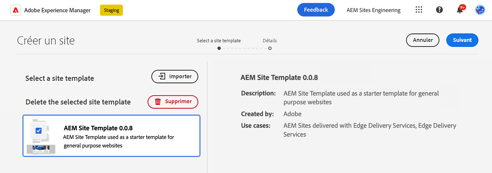
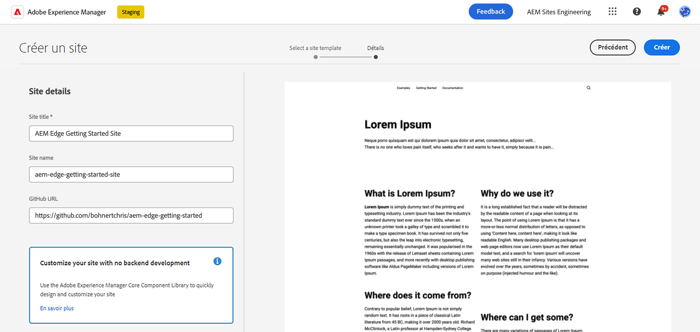
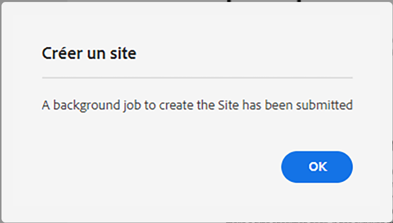
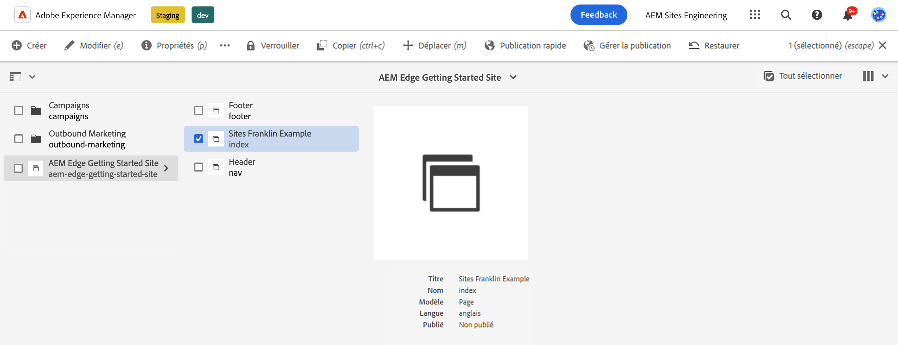
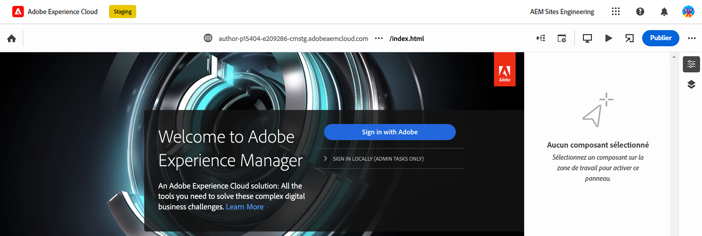
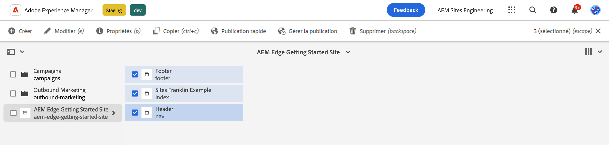
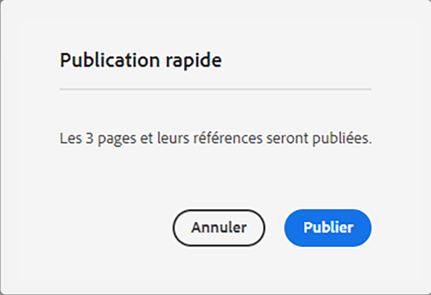

# Création d’AEM avec des Edge Delivery Services {#edge-dev-getting-started}

Ce guide vous permet de maîtriser l’exécution d’un nouveau site Adobe Experience Manager à l’aide d’Edge Delivery Services et d’Universal Editor pour la création de contenu.

{{aem-authoring-edge-early-access}}

## Conditions préalables {#prerequisites}

Avant de commencer ce guide, vous devez déjà connaître les principes de base et avoir accès aux Edge Delivery Services, notamment :

* Vous avez terminé la [Tutoriel sur le service de diffusion Edge.](/help/edge/developer/tutorial.md)
* Vous avez accès à une [Environnement de test AEM Cloud Service.](/help/implementing/cloud-manager/getting-access-to-aem-in-cloud/introduction-sandbox-programs.md)
* Vous avez [Activation d’Universal Editor dans le même environnement de test.](/help/implementing/universal-editor/getting-started.md)

## Choisissez le bon éditeur {#editor-choice}

AEM propose deux éditeurs de contenu différents dont le choix dépend de votre situation.

* **Éditeur universel** - Il doit s’agir du choix par défaut pour les nouveaux sites.
* **Éditeur de page AEM** - Cette option doit être sélectionnée pour une migration AEM Sites vers des Edge Delivery Services existante.

Ce guide porte sur AEM projets sur les Edge Delivery Services utilisant l’éditeur universel. Voir le document [Développement pour les Edge Delivery Services](/help/edge/developing.md) pour plus d’informations sur le choix de l’éditeur approprié et la migration de sites AEM existants vers des Edge Delivery Services.

## Prise en main de la création AEM et des Edge Delivery Services {#getting-started}

Une fois que vous avez accompli [les conditions préalables](#prerequisites) et ont fait [le choix d’utiliser l’éditeur universel,](#editor-choice) vous pouvez commencer votre propre projet.

### Création de votre projet GitHub {#create-github-project}

Vous devez d’abord créer un projet sur GitHub, basé sur le modèle d’Adobe.

1. Accédez à [`https://github.com/adobe-rnd/aem-boilerplate-xwalk`](https://github.com/adobe-rnd/aem-boilerplate-xwalk) et cliquer sur **Utiliser ce modèle** et sélectionnez **Création d’un référentiel**.

   * Vous devez être connecté à GitHub pour voir cette option.

   

1. Par défaut, le référentiel vous sera affecté. Modifiez ce paramètre selon les besoins. Saisissez un nom et une description pour le référentiel, puis cliquez sur **Créer un référentiel**.

   

1. Dans un nouvel onglet du même navigateur, accédez à [`https://github.com/apps/aem-code-sync`](https://github.com/apps/aem-code-sync) et cliquez sur **Configurer**.

   

1. Cliquez sur **Configurer** pour l’organisation dans laquelle vous avez créé votre nouveau référentiel à l’étape précédente.

   

1. Sur la page GitHub de synchronisation du code d’AEM sous **Accès au référentiel**, sélectionnez **Sélectionner uniquement les référentiels**, sélectionnez le référentiel créé à l’étape précédente, puis cliquez sur **Enregistrer**.

   

1. Une fois AEM synchronisation du code installé, vous recevez un écran de confirmation. Revenez à l’onglet du navigateur de votre nouveau référentiel.

   

1. Cliquez sur le bouton `fstab.yaml` pour l’ouvrir, puis le **Modifier ce fichier** pour la modifier.

   

1. Modifiez la variable `fstab.yaml` pour mettre à jour le point de montage de votre projet. Remplacez l’URL Google Docs par défaut par l’URL de votre instance de création as a Cloud Service AEM, puis cliquez sur **Valider les modifications...**.

   * `https://<aem-author>/bin/franklin.delivery/<owner>/<repository>/main`
   * La modification du point de montage indique aux Edge Delivery Services où trouver le contenu du site.

   

1. Ajoutez un message de validation selon vos besoins, puis cliquez sur **Valider les modifications**, en les validant directement dans la variable `main` branche.

   

1. Revenez à la racine de votre référentiel et cliquez sur `paths.yaml` puis la fonction **Modifier ce fichier** Icône

   

1. Remplacez les mappages par défaut par `/content/<site-name>/:/` et cliquez sur **Valider les modifications...**.

   * Fournissez vos propres `<site-name>`. Vous en aurez besoin ultérieurement.
   * Les mappages indiquent aux Edge Delivery Services comment mapper le contenu de votre référentiel AEM à l’URL du site.

   

1. Ajoutez un message de validation selon vos besoins, puis cliquez sur **Valider les modifications**, en les validant directement dans la variable `main` branche.

   

### Création et modification d’un nouveau site AEM {#create-aem-site}

Maintenant que vous disposez d’un projet GitHub, vous devez créer un site AEM que le projet peut utiliser.

>[!NOTE]
>
>Pour modifier votre site à l’aide d’Universal Editor, vous devez utiliser un navigateur basé sur Chromium.

1. Demandez la dernière AEM de création avec le modèle de site des Edge Delivery Services auprès de l’ingénierie d’Adobe via votre [canal du Slack de projet.](/help/edge/docs/slack.md)

1. Connectez-vous à votre instance de création as a Cloud Service AEM et accédez à la console Sites , puis appuyez ou cliquez sur **Créer** -> **Site à partir du modèle**.

   

1. Sur le **Sélectionner un modèle de site** dans l&#39;assistant de création de site, cliquez sur le bouton **Importer** pour importer un nouveau modèle.

   

1. Chargez le modèle de site Création AEM avec les Edge Delivery Services fourni par l’ingénierie d’Adobe.

1. Une fois le modèle importé, il apparaît dans l&#39;assistant. Appuyez ou cliquez dessus pour le sélectionner, puis appuyez ou cliquez sur **Suivant**.

   

1. Indiquez les champs suivants et appuyez ou cliquez sur **Créer**.

   * **Titre du site** - Ajoutez un titre descriptif pour le site.
   * **Titre du site** - Utilisez la variable `<site-name>` que vous avez défini dans la variable [étape précédente.](#create-github-project)
   * **URL GitHub** - Utilisez l’URL du projet GitHub que vous avez créé à l’étape précédente.

   

1. AEM confirme la création du site avec une boîte de dialogue. Appuyez ou cliquez sur **OK** à congédier.

   

1. Dans la console Sites, accédez au `index.html` du site nouvellement créé, puis appuyez ou cliquez sur **Modifier** dans la barre d’outils.

   

1. L’éditeur universel s’ouvre dans un nouvel onglet. Vous devrez peut-être appuyer ou cliquer sur **Connexion avec Adobe** pour vous authentifier afin de modifier votre page.

   

Vous pouvez désormais modifier votre site à l’aide d’Universal Editor. Voir [Documentation d’Universal Editor](/help/implementing/universal-editor/authoring.md) pour plus d’informations.

### Publication du nouveau site {#publishing}

Une fois que vous avez terminé de modifier votre nouveau site à l’aide d’Universal Editor, vous pouvez publier votre contenu.

1. Dans la console Sites, sélectionnez toutes les pages que vous avez créées pour votre nouveau site, puis appuyez ou cliquez sur **Publication rapide** dans la barre d’outils.

   

1. Appuyez ou cliquez sur **Publier** dans la boîte de dialogue de confirmation pour lancer le processus.

   

1. Ouvrez un nouvel onglet dans le même navigateur et accédez à l’URL de votre nouveau site.

   * `https://main--<site-name>--<owner>.hlx.page`

1. Affichez le contenu publié.

   
