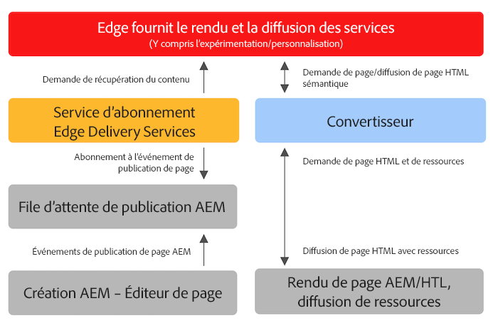

# Utilisation d’Edge Delivery Services avec des projets AEM existants {#existing-projects}

Vous n&#39;avez pas besoin d&#39;attendre qu&#39;un nouveau projet AEM bénéficie aux Edge Delivery Services. Les Edge Delivery Services peuvent être intégrés à votre projet AEM existant afin que vous puissiez tirer immédiatement parti de ses gains de performances.

## AEM Limites de l’éditeur de page {#page-editor}

Avant l’avènement des Edge Delivery Services, le contenu géré dans AEM était modifié à l’aide de l’AEM éditeur de page. Si votre projet a commencé avant l’introduction des Edge Delivery Services, il est presque certain que vous utilisez l’éditeur de page.

L’éditeur de page AEM fonctionne uniquement avec [Composants AEM](/help/implementing/developing/components/overview.md) par exemple : [Composants principaux.](https://experienceleague.adobe.com/docs/experience-manager-core-components/using/introduction.html?lang=fr) Ces composants sont incompatibles avec les Edge Delivery Services. Pour cette raison, deux phases sont nécessaires pour introduire des Edge Delivery Services à un projet AEM existant :

* [Phase 1 - Remplacer le front-end](#replace-front-end)
* [Phase 2 - Basculer vers l’éditeur universel](#switch-ue)

## Phase 1 - Remplacer le front-end {#replace-front-end}

Lors de la première phase, vous pouvez continuer à utiliser la structure, les composants et les outils de création de votre site AEM existant. Le rendu du site web sera reconstruit à l’aide de blocs utilisant JavaScript et CSS et il sera diffusé par l’intermédiaire d’Edge Delivery Services.

Veuillez consulter la [Section Créer](https://www.aem.live/docs/#build) de la documentation Edge Delivery Services pour plus d’informations sur les blocs et sur la manière de développer pour les services Edge Delivery.

Un convertisseur dans App Builder est nécessaire pour convertir la sortie de HTML rendue AEM et l’envoyer aux Edge Delivery Services.

La deuxième phase termine le processus en éliminant le chevauchement technologique : AEM composants principaux avec HTL et Java sur AEM Auteur, blocs basés sur JS sur Edge Delivery et un convertisseur basé sur nodeJS.

## Phase 2 - Basculer vers l’éditeur universel {#switch-ue}

Au cours de cette phase, l’éditeur de page d’AEM est remplacé par l’éditeur universel. Etant donné que l’éditeur universel peut fonctionner directement avec des blocs, les composants principaux AEM et le convertisseur ne seront plus nécessaires.

## Prise en main {#how-to-get-started}

Veuillez contacter votre représentant d’Adobe pour accéder à cette fonctionnalité.
