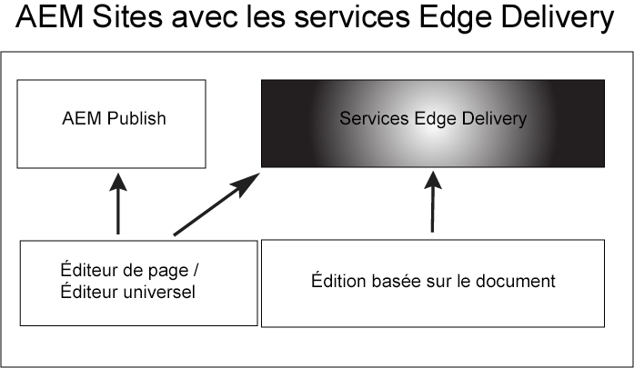

# Prise en main d’Edge Delivery Services {#getstart-edge}

Avec les Edge Delivery Services, AEM offre des expériences exceptionnelles qui favorisent l’engagement et les conversions. AEM le fait en proposant des expériences à fort impact qui sont rapides à créer et à développer. Il s’agit d’un ensemble de services composables qui permet un environnement de développement rapide dans lequel les auteurs peuvent rapidement mettre à jour et publier, et où de nouveaux sites sont lancés rapidement. Ainsi, avec les Edge Delivery Services, vous pouvez améliorer la conversion, réduire les coûts et offrir une vitesse de contenu extrême.

En exploitant la diffusion Edge, vous pouvez :

* Créez des sites rapides avec un score Lighthouse parfait et surveillez en permanence les performances de votre site grâce à la surveillance des utilisateurs réels (RUM).
* Augmentez l’efficacité de la création en découplant les sources de contenu. Vous pouvez utiliser AEM création et la création basée sur des documents. Ainsi, vous pouvez utiliser plusieurs sources de contenu sur le même site web.
* Utilisez un framework d’expérimentation intégré qui permet la création rapide de tests, l’exécution sans impact sur les performances et la mise en production rapide d’un gagnant de test.

## Fonctionnement d’Edge Delivery {#edge-works}

Le diagramme suivant illustre comment modifier du contenu dans Microsoft Word (modification basée sur des documents) et le publier sur Edge Delivery. Il présente également la méthode de publication traditionnelle AEM à l’aide de différents éditeurs.

Edge Delivery est un ensemble de services composables qui offre une grande flexibilité quant à la manière dont vous créez du contenu sur votre site web. Comme mentionné précédemment, vous pouvez utiliser les deux [Création AEM](https://experienceleague.adobe.com/docs/experience-manager-cloud-service/content/sites/authoring/getting-started/concepts.html) et [création basée sur des documents](https://www.hlx.live/docs/authoring).

Par exemple, vous pouvez utiliser du contenu directement à partir de documents Microsoft Word ou Google. Cela signifie que les documents provenant de ces sources peuvent devenir des pages de votre site web. De plus, les en-têtes, listes, images et éléments de police peuvent tous être transférés de la source initiale vers le site web. Le nouveau contenu sera ajouté instantanément sans processus de reconstruction.

Edge Delivery utilise GitHub afin que les clients puissent gérer et déployer du code directement à partir de leur référentiel GitHub. Par exemple, vous pouvez écrire du contenu dans Google Docs ou Microsoft Word et les fonctionnalités de votre site peuvent être développées à l’aide de CSS et de JavaScript dans GitHub . Lorsque vous êtes prêt, vous pouvez utiliser l’extension de navigateur du Sidekick pour prévisualiser et publier les mises à jour de contenu.

En savoir plus :

* Pour plus d’informations sur la prise en main d’Edge Delivery, voir le [Build](https://www.hlx.live/docs/#build) de la documentation sur les diffusions Edge.
* Pour comprendre comment créer et publier du contenu à l’aide d’Edge Delivery, voir [Publication de section](https://www.hlx.live/docs/authoring).
* Pour comprendre comment lancer correctement votre projet de site web, voir [Section Launch](https://www.hlx.live/docs/#launch).

## Edge Delivery Services et autres produits Adobe Experience Cloud {#edge-other-products}

Les Edge Delivery Services font partie de Adobe Experience Manager et, de ce fait, les sites de diffusion Edge et d’AEM peuvent coexister sur le même domaine. Il s’agit d’un cas d’utilisation courant pour les sites web plus volumineux. De plus, le contenu de la diffusion Edge peut être facilement utilisé dans vos pages AEM Sites et vice versa.

Vous pouvez également utiliser des Edge Delivery Services avec Adobe Target, Analytics et Launch.

## Accès aux Edge Delivery Services {#getting-access}

Il est facile de commencer à utiliser des Edge Delivery Services. Commencez en suivant les [Prise en main - Tutoriel du développeur](https://www.hlx.live/developer/tutorial).

## Obtention de l’aide à partir d’Adobe {#adobe-gethelp}

Vous pouvez interagir avec les équipes produit d’Adobe via votre canal de collaboration de produit configuré (voir ci-dessous pour plus d’informations sur l’accès) afin de répondre à des questions sur l’utilisation du produit ou les bonnes pratiques. Veuillez noter qu’aucun SLT (Service Level Terms) n’est associé aux conversations via le canal de collaboration des produits. Si un problème de produit nécessite une enquête et un dépannage supplémentaires et doit répondre aux tests SLT, vous pouvez envoyer un ticket d’assistance à la suite de la [processus de prise en charge](https://experienceleague.adobe.com/?lang=fr&amp;support-tab=home#support).

Adobe fournit trois canaux pour vous aider avec les Edge Delivery Services :

* Interagir avec les ressources de la communauté pour des questions générales
* Accès à votre canal de collaboration de produits pour des questions spécifiques
* Enregistrer un ticket d’assistance pour résoudre les problèmes majeurs et critiques

### Accès aux ressources de la communauté {#community-resource}

Adobe s’engage à vous donner les moyens d’engager et de soutenir la communauté au mieux pour les Edge Delivery Services et la création basée sur les documents. Participez à [Communauté Experience League](https://adobe.ly/3Q6kTKl) pour poser des questions, partager vos commentaires, lancer des discussions, demander l’aide d’experts en Adobe et d’AEM conseillers/Champs, et communiquer en temps réel avec des personnes partageant les mêmes opinions. Et rejoignez notre [Canal de discorde](https://discord.gg/aem-live), une plateforme plus décontractée pour les interactions en temps réel et les échanges d’idées rapides.

### Comment accéder à votre canal de collaboration de produit {#collab-channel}

Compte tenu de la valeur du canal de communication directe avec les clients, tous les clients AEM au lancement établiront un canal de Slack dans le but de accélérer les mises à jour critiques et de développer des rapports sur la qualité de l’expérience. Vous recevrez une invitation d’Adobe à rejoindre un canal de Slack spécifique à votre organisation.

Pour plus d’informations, voir [Utilisation du robot de Slack](https://www.hlx.live/docs/slack) pour plus d’informations.

### Journalisation d’un ticket d’assistance {#support-ticket}

Étapes pour consigner un ticket d’assistance via le Admin Console :

1. Ajouter **Diffusion Edge** dans le titre du ticket.
2. Dans la description, veuillez fournir les détails suivants :

   * URL du site web actif. Par exemple : [www.mydomain.com].
   * URL du site web d&#39;origine (URL .hlx).

## Prochaines étapes {#whats-next}

Commencez en consultant l’article suivant : [Utilisation d’Edge Delivery Services](/help/edge/using.md).

## Ressources utiles {#useful-resources}

Pour plus d’informations sur les Edge Delivery Services, voir [Documentation Edge Delivery Services](https://www.hlx.live/docs/).
