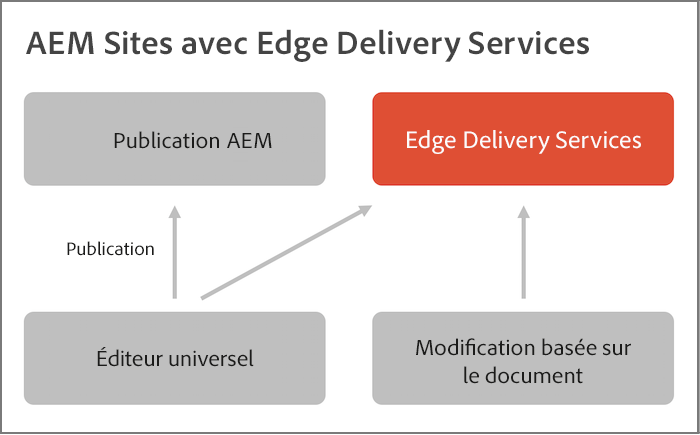
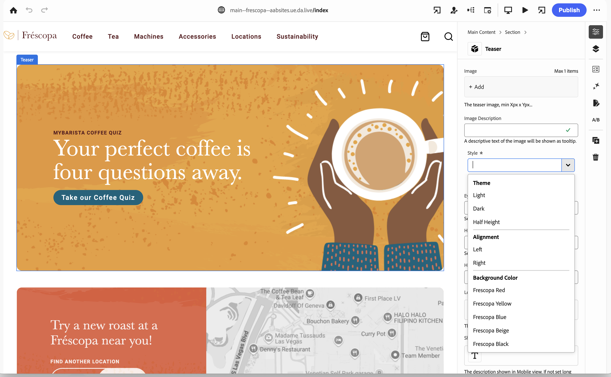

# Vue d’ensemble d’Edge Delivery Services {#edge-delivery-services}

Avec Edge Delivery Services, AEM offre des expériences exceptionnelles qui favorisent l’engagement et les conversions. AEM le fait en proposant des expériences à fort impact qui sont rapides à créer et à développer. C’est un ensemble de services composable qui permet un environnement de développement rapide où les personnes créant le contenu peuvent rapidement effectuer des mises à jour et des publications, et où de nouveaux sites sont lancés rapidement. Ainsi, avec Edge Delivery Services, vous pouvez améliorer la conversion, réduire les coûts et offrir une vitesse de contenu extrême.

En utilisant Edge Delivery Services, vous pouvez accomplir ce qui suit :

* Créer des sites rapides avec un score Lighthouse parfait et surveiller en permanence les performances de votre site grâce à la surveillance de l’utilisation en temps réel (RUM).
* Augmenter l’efficacité de la création en découplant les sources de contenu. Vous pouvez utiliser directement la création WYSIWYG et basée sur des documents. Ainsi, vous pouvez utiliser plusieurs sources de contenu sur le même site web.
* Utiliser un framework d’expérimentation intégré qui permet la création rapide de tests, l’exécution sans impact sur les performances et la mise en production rapide de la meilleure version.

## Réaction agile aux besoins de l’entreprise {#agile-reaction}

En tant que leader reconnu de longue date du secteur, Adobe sait combien il est important de pouvoir créer et publier rapidement du contenu nouveau et significatif pour vos clientes et clients. Les défis courants liés à la mise à l’échelle de la création de contenu ont été mis en évidence par le marché, notamment :

1. **La demande de contenu continue de croître.**
   * Il est nécessaire de libérer les créateurs et créatrices de contenu pour répondre à cette demande.
   * Le processus de création de contenu doit être mis à l’échelle de manière efficace dans l’ensemble de l’entreprise.
   * Les créateurs et créatrices doivent pouvoir réagir rapidement aux tendances qui changent.
1. **Le contenu omnicanal est nécessaire.**
   * Un contrôle de mise en page est nécessaire, quelle que soit la diffusion de contenu.
   * Les créateurs et créatrices doivent pouvoir modifier directement la mise en page du contenu.
1. **La pression augmente pour générer davantage de retour sur investissement sur le contenu.**
   * Les personnes qui créent du contenu elles-mêmes ont besoin de la capacité d’optimiser le contenu qu’elles créent.

Ces tendances se sont avérées constantes dans l’ensemble du secteur. Toutefois, les exigences individuelles varient inévitablement d’un projet à l’autre. L’objectif de tout projet Edge Delivery Services est de trouver la solution qui convient à vos utilisateurs et utilisatrices.

1. **Concentrez-vous sur la valeur plutôt que sur les fonctionnalités.** Déterminez le workflow le plus optimisé pour servir vos créateurs et créatrices plutôt que de vous perdre dans le large éventail de fonctionnalités AEM.
1. **Profitez de la flexibilité d’AEM.** Il n’est pas nécessaire d’utiliser les fonctionnalités AEM de manière isolée. Utilisez les fonctionnalités dont vous avez besoin par cas d’utilisation.
1. **Tirez parti de l’expertise de vos créateurs et créatrices.** Impliquez les véritables créateurs et créatrices de contenu dans le projet dès le début pour vous assurer que vous fournissez la valeur dont ils ont besoin en mettant en œuvre les fonctionnalités qui ont du sens.

En mettant l’accent sur la valeur pour vos créateurs et créatrices, votre projet Edge Delivery Services peut répondre aux besoins du secteur moderne auxquels sont confrontés vos créateurs et créatrices de contenu et fournir rapidement du contenu pour satisfaire vos clientes et clients.

## Outils de création flexibles pour les créateurs et créatrices de contenu {#overview}

Edge Delivery Services est un ensemble de services composable qui offre une grande flexibilité quant à la manière dont vous créez du contenu sur votre site web. Vous pouvez utiliser la [gestion de contenu AEM](https://experienceleague.adobe.com/docs/experience-manager-cloud-service/content/sites/authoring/getting-started/concepts.html?lang=fr) et la création WYSIWYG à l’aide de l’[éditeur universel](/help/sites-cloud/authoring/universal-editor/authoring.md), ainsi que la [création basée sur des documents](https://www.aem.live/docs/authoring).

Le diagramme suivant illustre comment modifier du contenu dans Microsoft Word (création basée sur des documents) et le publier sur Edge Delivery Services. Il présente également la modification WYSIWYG à l’aide de l’éditeur universel.

Edge Delivery Services utilise GitHub pour vous permettre de gérer et de déployer du code directement à partir de votre référentiel GitHub. Le nouveau contenu est ajouté instantanément sans nouveau processus de création.

### Création basée sur des documents {#document-based}

Grâce à la création basée sur des documents, vous pouvez utiliser du contenu directement à partir de Microsoft Word ou de Google Docs de sorte que ces sources deviennent des pages de votre site web. Les en-têtes, listes, images et éléments de police peuvent tous être transférés de la source initiale vers le site web.

* Avec la création basée sur des documents, chaque personne spécialisée dans le marketing peut créer rapidement du contenu à l’aide d’outils de création connus (Microsoft Word, Google Docs, etc.).
* La création de contenu est rationalisée en permettant la création, la révision et la publication directement dans les documents source.
* Les outils connus étant utilisés, aucune intégration n’est requise pour les créateurs et créatrices de contenu, ce qui augmente la vitesse du contenu.
* Les fonctionnalités de votre site peuvent être développées à l’aide de CSS et JavaScript dans GitHub.

Pour plus d’informations, voir la documentation sur la création basée sur des documents :

* Pour plus d’informations sur la prise en main d’Edge Delivery, consultez la [section Créer](https://www.aem.live/docs/#build).
* Pour comprendre comment créer et publier du contenu à l’aide d’Edge Delivery, consultez la [section Publier](https://www.aem.live/docs/authoring).
* Pour comprendre comment lancer correctement votre projet de site web, consultez la [section Démarrer](https://www.aem.live/docs/#launch).

### Création WYSIWYG {#wysiwyg-authoring}

La création de contenu WYSIWYG (ce que vous voyez est ce que vous obtenez) utilise l’éditeur universel, un emplacement unique personnalisable pour modifier le contenu en direct et dans son contexte à l’aide d’une prévisualisation visuelle.

* Avec la création WYSIWYG, vous augmentez l’efficacité de création, qu’elle soit couplée ou découplée.
* Vous pouvez tirer parti des fonctionnalités complètes de gestion de contenu AEM, notamment de workflow et de gouvernance.
* Tirez parti de nombreux points d’extension pour prendre en charge vos propres processus et intégrations.
* Les fonctionnalités de votre site peuvent être développées à l’aide de CSS et JavaScript dans GitHub.

Pour plus d’informations, voir la documentation sur la création WYSIWYG :

* Pour une vue d’ensemble de l’éditeur universel et de la création WYSIWYG, consultez le document [Création de contenu WYSIWYG pour Edge Delivery Services](/help/edge/wysiwyg-authoring/authoring.md).
* Pour une vue d’ensemble destinée aux développeurs et développeuses, reportez-vous au document [Guide de prise en main pour le développement pour la création WYSIWYG avec Edge Delivery Services](/help/edge/wysiwyg-authoring/edge-dev-getting-started.md).

### Choix de votre méthode de création {#authoring-method}

La flexibilité d’AEM vous permet de vous assurer que vos besoins en matière de création sont satisfaits. Adobe peut vous aider à déterminer la ou les méthodes qui répondent le mieux à vos besoins.

* Incluez toujours vos créateurs et créatrices de contenu dans la décision.
* Plusieurs méthodes de création peuvent être mises en œuvre.
* Vous pouvez toujours modifier votre méthode de création après coup.
* Vous ne devez pas décider avant la mise en œuvre, mais plutôt dans le cadre de la mise en œuvre.

Pour plus d’informations, consultez le document [Choix d’une méthode de création](authoring-methods.md).

## Edge Delivery Services et autres produits Adobe Experience Cloud {#edge-other-products}

Edge Delivery Services fait partie d’Adobe Experience Manager. De ce fait, Edge Delivery Services et AEM Sites peuvent coexister sur le même domaine, ce qui est un cas d’utilisation courant pour les sites web plus volumineux. De plus, le contenu d’Edge Delivery Services peut être facilement utilisé par vos pages AEM Sites et vice versa.

Consultez le [Guide de prise en main du développement pour WYSIWYG avec Edge Delivery Services](/help/edge/wysiwyg-authoring/edge-dev-getting-started.md) afin d’apprendre à démarrer votre propre projet pour créer avec AEM et Edge Delivery Services.

Vous pouvez également utiliser Edge Delivery Services avec [Adobe Target](https://www.aem.live/developer/target-integration) et la [surveillance de l’utilisation en temps réel (RUM)](https://www.aem.live/developer/rum) pour diagnostiquer l’utilisation et les performances de vos sites, ainsi que [Launch.](https://experienceleague.adobe.com/fr/docs/experience-platform/tags/home)

## Commencer avec Edge Delivery Services {#getting-started}

Il est facile de commencer à utiliser Edge Delivery Services en suivant le tutoriel [Commencer - Tutoriel de développement.](https://www.aem.live/developer/tutorial)

## Obtenir de l’aide à partir d’Adobe {#getting-help}

Adobe fournit trois canaux pour vous aider avec Edge Delivery Services :

* Interagissez avec les [ressources de la communauté](#community-resources) pour des questions générales.
* Accédez à votre [canal de collaboration de produits](#collaboration-channel) pour des questions spécifiques.
* [Consignez un ticket d’assistance](#support-ticket) pour résoudre les problèmes majeurs et critiques.

### Accéder aux ressources de la communauté {#community-resources}

Adobe s’engage à vous donner les moyens d’engager et de soutenir la communauté au mieux pour Edge Delivery Services, WYSIWYG et la création basée sur des documents.

* Participez à la [Communauté Experience League](https://adobe.ly/3Q6kTKl) pour poser des questions, partager vos commentaires, lancer des discussions, demander l’aide de personnes spécialisées d’Adobe et de personnes conseillères/championnes AEM, et communiquer en temps réel avec des personnes partageant les mêmes opinions.
* Rejoignez également notre [canal Discord](https://discord.gg/aem-live), une plateforme plus décontractée pour des interactions en temps réel et des échanges d’idées rapides.

### Comment accéder à votre canal de collaboration de produit {#collaboration-channel}

Compte tenu de la valeur du canal de communication directe avec les utilisateurs et utilisatrices, tous les projets AEM établiront au lancement un canal Slack dans le but d’accélérer les mises à jour critiques et de développer des rapports sur la qualité de l’expérience. Vous recevrez une invitation d’Adobe à rejoindre un canal Slack spécifique à votre organisation.

Pour plus d’informations, consultez le document [Utilisation du robot Slack](https://www.aem.live/docs/slack) pour obtenir plus de détails.

Vous pouvez interagir avec les équipes produit Adobe via votre canal de collaboration de produit configuré afin de répondre à des questions sur l’utilisation du produit ou les bonnes pratiques. Veuillez noter qu’aucun objectif de niveau de service (Service Level Target, SLT) n’est associé aux conversations via le canal de collaboration du produit.

### Consigner un ticket d’assistance {#support-ticket}

Si un problème de produit nécessite une enquête et un dépannage supplémentaires et doit répondre aux TSL, vous pouvez envoyer un ticket d’assistance.

Pour enregistrer un ticket d’assistance, vous devez d’abord enregistrer votre site Edge Delivery dans Cloud Manager. L&#39;enregistrement de votre site web avec Cloud Manager est recommandé à tous les utilisateurs d&#39;AEM as a Cloud Service et [ apporte de nombreux avantages.](/help/implementing/cloud-manager/edge-delivery/introduction-to-edge-delivery-services.md) Pour plus d’informations, reportez-vous à la [documentation de Cloud Manager](/help/implementing/cloud-manager/edge-delivery/add-edge-delivery-site.md) si vous n’avez pas encore enregistré votre site.

Une fois votre site web enregistré auprès de Cloud Manager, procédez comme suit en utilisant l’Admin Console pour envoyer un ticket d’assistance :

1. [Suivez le processus de prise en charge standard](https://experienceleague.adobe.com/?support-tab=home#support) et créez un ticket.
1. Ajoutez **Edge Delivery** dans le titre du ticket.
1. Dans la description, fournissez les détails suivants en plus de la description du problème :

   * URL du site web actif. Par exemple : `www.mydomain.com`.
   * URL du site web d’origine (URL `.hlx`).

## Prochaines étapes {#whats-next}

Commencez en consultant [Utilisation d’Edge Delivery Services](/help/edge/using.md).
