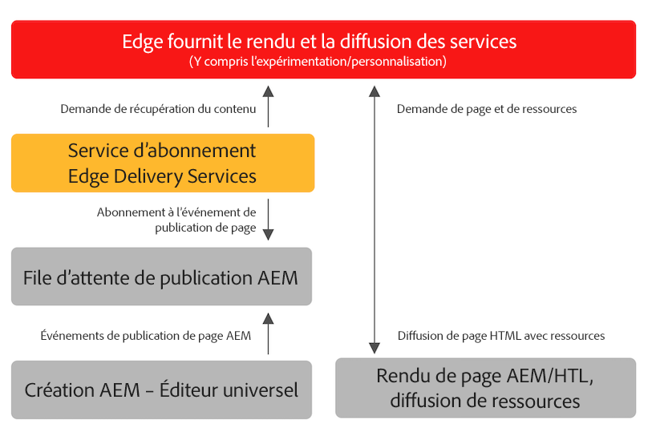

# Publication de contenu pour les Edge Delivery Services {#publishing-edge}

Avec les Edge Delivery Services, la publication de contenu est transparente, quelle que soit votre source de contenu :

* Contenu basé sur un document - Voir [Publication de section](/help/edge/docs/authoring.md) de la documentation Edge Delivery Services.
* Contenu AEM - Veuillez consulter les détails ci-dessous.

## Flux de publication depuis AEM {#publishing-flow}

Lorsque vous utilisez l’éditeur universel pour créer AEM contenu, la publication est aussi simple que de cliquer sur le **Publier** dans Universal Editor. Consultez le document [Publication de contenu avec l’éditeur universel.](/help/sites-cloud/authoring/universal-editor/publishing.md)

Le flux d’informations lors de la publication est le suivant. Une fois la publication commencée, ce flux est automatique et est illustré ici à titre d’information.

>[!NOTE]
>
>Jusqu’à 5 000 chemins d’accès publiés à partir de l’interface utilisateur de création ou par des workflows sont autorisés par jour. Les intégrations qui créent des charges de travail de publication en bloc ne sont pas prises en charge.

1. L’auteur du contenu publie AEM contenu dans l’éditeur universel.
1. Un événement de publication est envoyé vers la file d’attente du pipeline d’Adobe.
1. Le service de publication de diffusion Edge transfère les événements pertinents à l’API d’administration de diffusion Edge.
1. Edge Delivery extrait et ingère du HTML sémantique à partir d’AEM Auteur.
1. AEM est mis à jour avec l’état de publication.

## Prise en main {#how-to-get-started}

Veuillez contacter votre représentant d’Adobe pour accéder à cette fonctionnalité.
