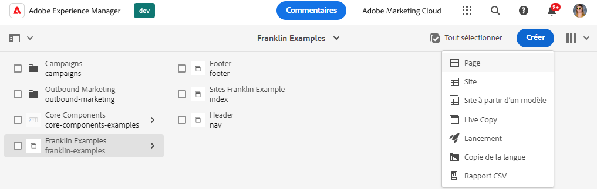
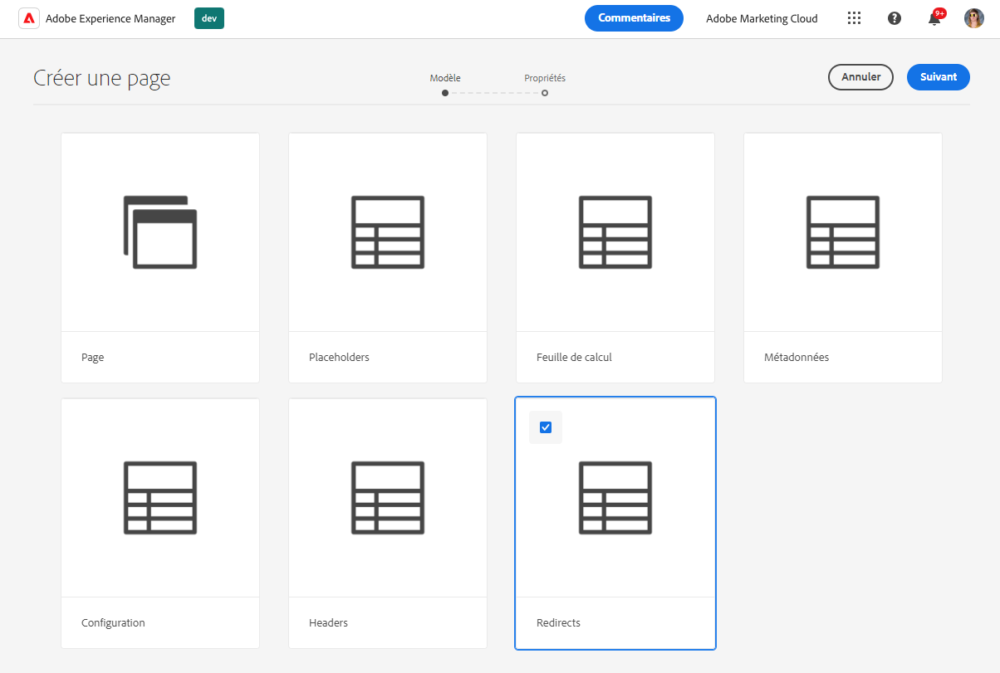
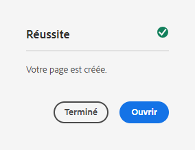
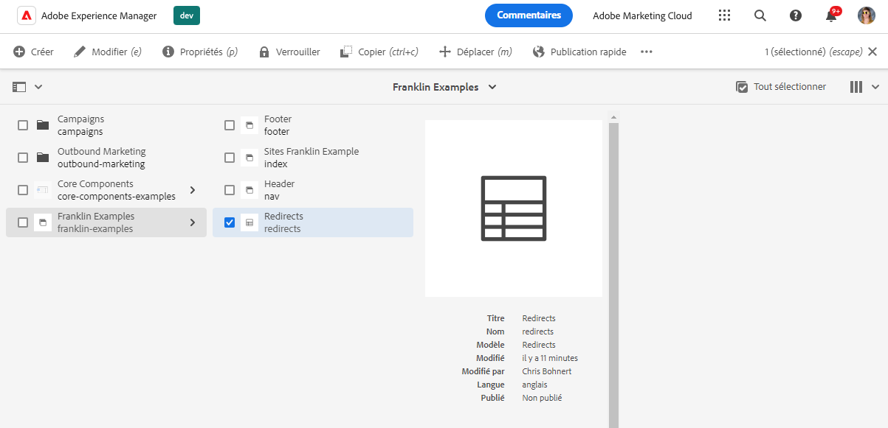
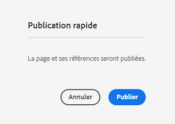
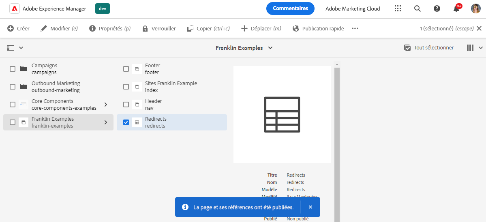
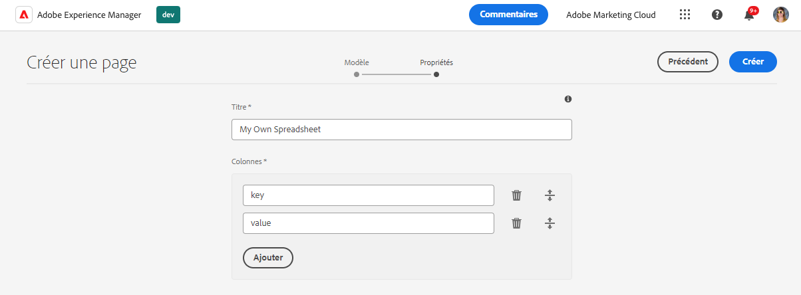

# Utilisation de feuilles de calcul pour gérer les données tabulaires {#tabular-data}

Découvrez comment utiliser des feuilles de calcul pour gérer les données tabulaires pour diverses valeurs, telles que les métadonnées et les redirections pour votre AEM avec le site des Edge Delivery Services.

{{aem-authoring-edge-early-access}}

## Cas d’utilisation {#use-cases}

Pour toute AEM avec un site Edge Delivery Services, il est nécessaire de conserver des listes de données tabulaires telles que pour les mappages clé-valeur. Il peut s’agir de listes de nombreuses valeurs différentes, telles que des métadonnées et des redirections. Edge Deliver Services vous permet de gérer de telles listes tabulaires à l’aide d’un outil intuitif : la feuille de calcul. AEM convertit ces feuilles de calcul en fichiers JSON qui peuvent être facilement consommés par votre site web ou votre application web.

Cas d’utilisation courants :

* [Espaces réservés](/help/edge/docs/placeholders.md)
* [Métadonnées](/help/edge/docs/bulk-metadata.md)
* [En-têtes](/help/edge/docs/custom-headers.md)
* [Redirections](/help/edge/docs/redirects.md)
* [Configurations](/help/edge/docs/setup-byo-cdn-push-invalidation.md) comme pour les configurations CND

En outre, vous pouvez [créer vos feuilles de calcul ;](#own-spreadsheet) de toute structure pour stocker les mappages à vos propres fins.

Ce document utilise l’exemple des redirections pour illustrer comment créer de telles feuilles de calcul. Pour plus d’informations sur chaque cas d’utilisation, reportez-vous aux rubriques précédemment liées dans la documentation Edge Delivery Services.

>[!TIP]
>
>Pour plus d’informations sur le fonctionnement général des feuilles de calcul avec les Edge Delivery Services, consultez le document . [Feuilles de calcul et JSON.](/help/edge/developer/spreadsheets.md)

>[!TIP]
>
>Les feuilles de calcul ne doivent être utilisées que pour conserver les données tabulaires. Pour stocker des données structurées, [découvrez AEM fonctionnalités sans interface.](/help/headless/introduction.md)

## Conditions préalables {#prerequisites}

Pour créer des mappages à l’aide de feuilles de calcul dans votre AEM avec le projet Edge Delivery Services, vous devez avoir créé votre site à l’aide du modèle de site le plus récent.

Consultez le document [Guide de prise en main du développeur pour la création AEM avec des Edge Delivery Services](/help/edge/edge-dev-getting-started.md) pour plus d’informations.

## Création d’une feuille de calcul {#spreadsheet}

Dans cet exemple, vous allez créer une feuille de calcul pour gérer les redirections pour votre AEM avec le site des Edge Delivery Services. Les mêmes étapes s’appliquent à [autres types de feuille de calcul](#other) que vous souhaitez créer.

1. Connectez-vous à votre instance de création as a Cloud Service AEM, accédez au **Sites** et accédez à la racine du site qui nécessite une feuille de calcul. Appuyez ou cliquez sur **Créer** -> **Page**.

   

1. Sur le **Modèle** dans l’assistant de création de page, appuyez ou cliquez sur l’icône **Redirections** modèle pour le sélectionner, puis appuyez ou cliquez sur **Suivant**.

   

1. La variable **Propriétés** de l’assistant présente les valeurs par défaut de la feuille de calcul des redirections. Appuyez ou cliquez sur **Créer**.

   * **Titre** - Laissez cette valeur telle quelle.
   * **Colonnes** - Les colonnes minimales requises pour les redirections sont préremplies.
      * **source** - La page à rediriger
      * **destination** - Page à rediriger vers

   

1. Dans le **Succès** boîte de dialogue, appuyez ou cliquez **Ouvrir**.

   

1. Un nouvel onglet s’ouvre ; la feuille de calcul est alors chargée dans un éditeur avec la prédéfinie **source** et **destination** colonnes. Pour définir vos redirections, appuyez ou cliquez sur la ligne vide du **source** colonne . Les modifications sont enregistrées automatiquement lorsque vous modifiez la feuille de calcul.

   

   * La variable **source** est relatif au domaine de votre site web, il ne contient donc que le chemin relatif.
   * La variable **destination** peut être une URL complète si vous redirigez vers un autre site web ou un chemin relatif si vous redirigez vers votre propre site web.
   * Utilisez la touche de tabulation pour déplacer la sélection vers la cellule suivante.
   * L’éditeur ajoute de nouvelles lignes à la feuille de calcul selon les besoins.
   * Pour supprimer ou déplacer une ligne, utilisez la méthode **Supprimer** à la fin de chaque ligne et le déplacement se fait au début de chaque ligne, respectivement.

## Publication d’une feuille de calcul paths.json {#paths-json}

Pour que AEM puisse publier les données dans votre feuille de calcul, vous devez également mettre à jour la variable `paths.json` du projet.

1. Ouvrez la racine de votre projet dans GitHub.

1. Appuyez ou cliquez sur le bouton `paths.json` pour ouvrir ses détails, puis le fichier **Modifier** Icône

   

1. Ajoutez une ligne pour associer votre nouvelle feuille de calcul à une `redirects.json` ressource.

   ```json
   {
     "mappings": [
      "/content/<site-name>/:/",
      "/content/<site-name>/redirects:/redirects.json"
     ]
   }
   ```

1. Cliquez sur **Valider les modifications...** pour enregistrer les modifications apportées à `main`.

   * soit s’engager à `main` ou créez une requête d’extraction conformément à votre processus.

1. Lorsque vous avez terminé de définir vos redirections et que vous avez mis à jour le mappage du chemin, revenez à la **Sites** console.

1. Appuyez ou cliquez pour sélectionner la feuille de calcul de redirections que vous avez créée dans la console, puis appuyez ou cliquez sur **Publication rapide** dans la barre d’actions pour publier la feuille de calcul.

   

1. Dans le **Publication rapide** boîte de dialogue, appuyez ou cliquez **Publier**.

   

1. Une bannière confirme la publication.

   

La feuille de calcul des redirections est maintenant publiée et accessible au public.

## Autres types de feuilles de calcul {#other}

Maintenant que vous savez comment créer une feuille de calcul de redirection, vous pouvez créer n’importe quel autre type de feuille de calcul standard :

* Espaces réservés
* Métadonnées
* En-têtes
* Configuration

Suivez simplement les mêmes étapes dans les sections . [Créer une feuille de calcul](#spreadsheet) et [Mise à jour de paths.json](#paths-json) et choisissez le modèle approprié, puis mettez à jour le `paths.json` de manière appropriée.

Pour [Configuration](https://www.aem.live/docs/configuration), [En-têtes](https://www.aem.live/docs/custom-headers) et [Métadonnées](https://www.aem.live/docs/bulk-metadata) veillez à ajouter un mappage pour les publier à leurs emplacements par défaut :

* Configuration : `/.helix/config.json`
* En-têtes : `/.helix/headers.json`
* Métadonnées `/metadata.json`

En outre, vous pouvez [créer votre propre feuille de calcul ;](#own-spreadsheet) avec des colonnes arbitraires pour votre propre utilisation.

>[!NOTE]
>
>Il n’est pas nécessaire de créer une feuille de calcul pour gérer l’indexation pour AEM as a Cloud Service avec les projets Edge Delivery Services.
>
>Si vous souhaitez créer vos propres index, [veuillez suivre cette documentation](https://www.aem.live/developer/indexing#setting-up-more-index-configurations) pour créer les vôtres `helix-query.yaml` fichier .

## Création de votre propre feuille de calcul {#own-spreadsheet}

1. Suivez les mêmes étapes que dans la section [Créer une feuille de calcul.](#spreadsheet)

1. Lors de la sélection du modèle, choisissez **Feuille de calcul**.

1. Dans le **Propriétés** de l&#39;assistant, vous pouvez ajouter vos propres colonnes.

   

   * Dans le **Colonnes** , appuyez ou cliquez sur **Ajouter** pour ajouter une nouvelle colonne.
   * Attribuez un nom à la colonne.
   * Supprimez ou réorganisez les colonnes à l’aide du **Supprimer** et faites glisser les icônes de poignée, respectivement.

1. Créez la feuille de calcul et publiez-la conformément aux instructions de la feuille de calcul de redirection.

1. Ajoutez un mappage à la variable `paths.json` conformément aux instructions de la feuille de calcul des redirections.
