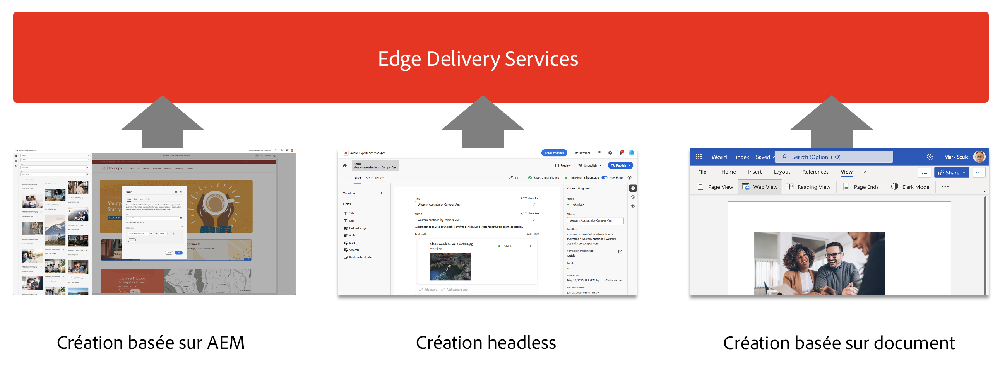
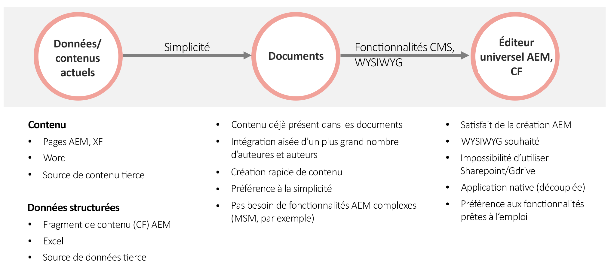

# Utiliser Edge Delivery Services {#usingedge}

Grâce à Edge Delivery Services, vous pouvez créer rapidement des environnements de développement dans lesquels les personnes créant du contenu peuvent rapidement mettre à jour et publier du contenu, ou encore lancer de nouveaux sites de manière rapide. Pour ce faire, vous pouvez utiliser plusieurs sources de contenu sur le même site web. La publication sera transparente et rationalisée, quelle que soit la source choisie. Ainsi, il ne faut que quelques secondes pour passer de l’édition à la vue du contenu en direct sur Internet.

Edge Delivery Services est découplé de la source de contenu et peut ingérer du contenu provenant de différentes sources.

L’ingestion de plusieurs sources de contenu offre une flexibilité maximale. Adobe fournit des conseils pour vous aider à choisir les sources de contenu qui conviennent le mieux à votre projet.

Dans certains cas, la source de contenu est prédéfinie ou n’est pas flexible (par exemple, le projet ne peut pas utiliser SharePoint ou Google Drive). Mais dans de nombreux cas, l’outil n’est pas prédéterminé et son choix n’est pas si simple.

Le principe directeur d’Adobe est la simplicité. Commencez par la création basée sur les documents et ajoutez de la complexité si nécessaire. Si un changement d’outil est nécessaire, l’intégration d’Edge Delivery Services d’AEM couvre la migration de contenu.

## Création {#authoring-edge}

Avec Edge Delivery Services, la création est facile, rapide et flexible. Vous pouvez choisir de créer à l’aide de la création basée sur un document ou de la création dans AEM avec l’éditeur universel.

Consultez le document [Création de contenu pour Edge Delivery Services](authoring.md) pour plus d’informations.

## Publication {#publishing-edge}

Avec Edge Delivery Services, la publication de contenu est transparente, quelle que soit votre source de contenu.

Consultez le document [Publication de contenu pour Edge Delivery Services](publishing.md) pour plus d’informations.

## Développement {#developing-edge}

Edge Delivery Services est basé sur le concept de blocs. AEM est fourni avec une bibliothèque complète de blocs prédéfinis, qui peut être étendue pour répondre aux besoins de votre projet. Le code pour les projets Edge Delivery Services est géré dans GitHub.

Consultez le document [Développement pour Edge Delivery Services](developing.md) pour plus d’informations.

## Projets AEM existants : {#existing-projects}

Vous n’avez pas besoin d’attendre un nouveau projet AEM pour bénéficier d’Edge Delivery Services. Edge Delivery Services peut être intégré à votre projet AEM existant afin que vous puissiez tirer immédiatement parti de ses gains de performances.

Consultez le document [Utilisation d’Edge Delivery Services avec des projets AEM existants](existing-projects.md) pour plus d’informations.
