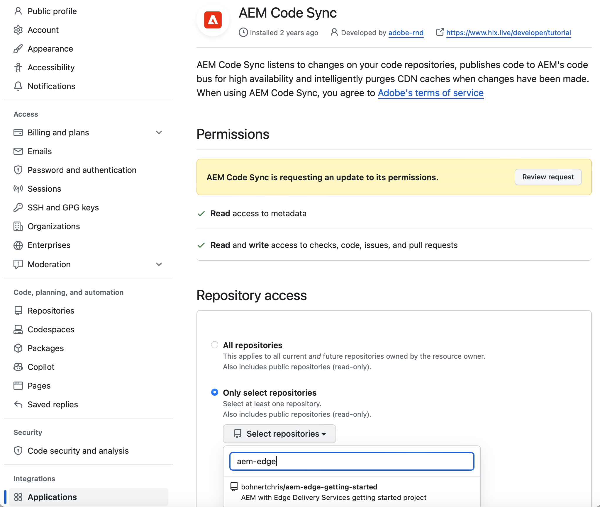
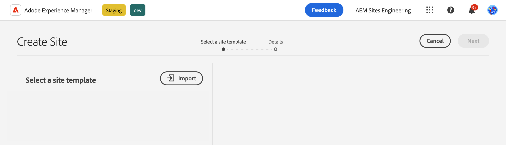
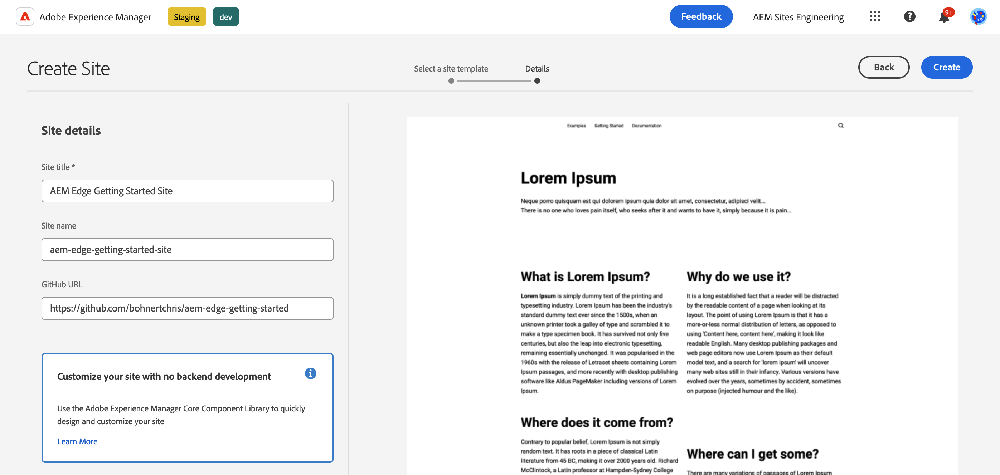
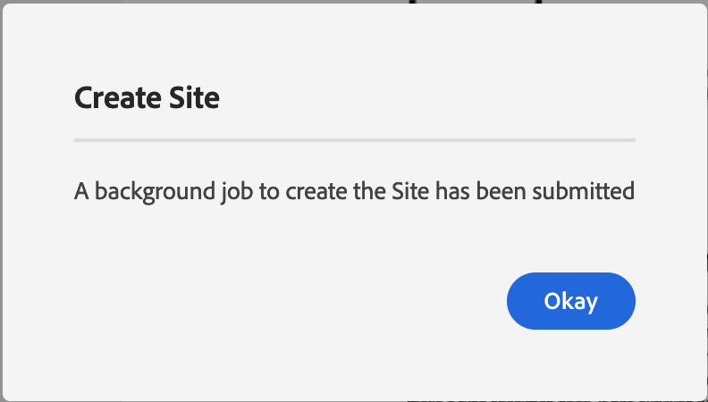

# Guide de prise en main du développement pour la création WYSIWYG avec Edge Delivery Services {#edge-dev-getting-started}

Ce guide vous permet de maîtriser l’exécution d’un nouveau site Adobe Experience Manager avec Edge Delivery Services et l’éditeur universel pour la création de contenu WYSIWYG.

## Conditions préalables {#prerequisites}

Avant de commencer ce guide, il est recommandé de connaître les principes de base et d’avoir accès à Edge Delivery Services, notamment :

* Vous avez terminé le [tutoriel sur Edge Delivery Services.](/help/edge/developer/tutorial.md)
* Vous avez accès à un [sandbox AEM Cloud Service.](/help/implementing/cloud-manager/getting-access-to-aem-in-cloud/introduction-sandbox-programs.md)
* Vous avez [activé l’éditeur universel dans le même environnement de sandbox.](/help/implementing/universal-editor/getting-started.md)

## Concepts de base du développement pour Edge Delivery Services {#core-concepts}

Edge Delivery Services est basé sur le concept de blocs. AEM est fourni avec une bibliothèque complète de blocs prédéfinis, qui peut être étendue pour répondre aux besoins de votre projet. Le code pour les projets Edge Delivery Services est géré dans GitHub.

### Blocs {#blocks}

Les blocs sont la partie la plus fondamentale d’une page diffusée par Edge Delivery Services. Un bloc encapsule la mise en forme et le code qui génère un composant logique d’une page de contenu.

AEM fournit des blocs standard dans le cadre du produit, à l’intérieur du modèle standard du projet. Ces blocs incluent des en-têtes, du texte, des images, des liens, des listes, etc.

>[!TIP]
>
>Consultez la [section Créer](/help/edge/developer/block-collection.md) de la documentation Edge Delivery Services pour plus d’informations sur les blocs et sur la manière de développer pour Edge Delivery Services.

### Edge Delivery Services et GitHub {#github-edge}

Edge Delivery Services utilise GitHub pour vous permettre de gérer et de déployer du code directement à partir de votre référentiel GitHub.

Vos auteurs et autrices peuvent créer du contenu à l’aide de la création basée sur des documents ou du contenu dans AEM avec l’éditeur universel. Les équipes de développement peuvent personnaliser les fonctionnalités de votre site à l’aide de CSS et de JavaScript dans GitHub, quelle que soit la manière dont les personnes créent leur contenu.

Les sites web sont automatiquement créés pour chacune de vos branches, de l’aperçu du contenu à la production. Chaque ressource que vous placez dans votre référentiel GitHub est disponible sur votre site web sans processus de création.

>[!TIP]
>
>Consultez la [section Créer](/help/edge/developer/block-collection.md) de la documentation Edge Delivery Services pour plus d’informations sur les blocs et sur la manière de développer pour Edge Delivery Services.

## Prise en main de la création WYSIWYG et de Edge Delivery Services {#getting-started}

Lorsque vous remplissez [les conditions préalables](#prerequisites) et [avez choisi d’utiliser l’éditeur universel,](#editor-choice) vous pouvez commencer votre propre projet.

### Créer votre projet GitHub {#create-github-project}

Vous devez d’abord créer un projet sur GitHub, basé sur le modèle Adobe.

1. Accédez à [`https://github.com/adobe-rnd/aem-boilerplate-xwalk`](https://github.com/adobe-rnd/aem-boilerplate-xwalk) et cliquez sur **Utiliser ce modèle**, puis sélectionnez **Créer un référentiel**.

   * Vous devez disposer d’une connexion à GitHub pour voir cette option.

   

1. Par défaut, le référentiel vous est affecté. Modifiez ce paramètre selon les besoins. Saisissez un nom et une description pour le référentiel, puis cliquez sur **Créer un référentiel**.

   

1. Dans un nouvel onglet du même navigateur, accédez à [`https://github.com/apps/aem-code-sync`](https://github.com/apps/aem-code-sync) et cliquez sur **Configurer**.

   

1. Cliquez sur **Configurer** pour l’organisation dans laquelle vous avez créé votre référentiel à l’étape précédente.

   

1. Sur la page GitHub d’AEM Code Sync, sous **Accès au référentiel**, choisissez **Sélectionner uniquement les référentiels**, choisissez le référentiel créé à l’étape précédente, puis cliquez sur **Enregistrer**.

   

1. Une fois AEM Code Sync installé, un écran de confirmation s’affiche. Revenez à l’onglet du navigateur de votre nouveau référentiel.

   

1. Cliquez sur le fichier `fstab.yaml` pour l’ouvrir, puis sur l’icône **Modifier ce fichier** pour le modifier.

   

1. Modifiez le fichier `fstab.yaml` pour mettre à jour le point de montage de votre projet. Remplacez l’URL Google Docs par défaut par l’URL de votre instance de création AEM as a Cloud Service, puis cliquez sur **Valider les modifications...**.

   * `https://<aem-author>/bin/franklin.delivery/<owner>/<repository>/main`
   * La modification du point de montage indique à Edge Delivery Services où trouver le contenu du site.

   

1. Ajoutez un message de validation selon vos besoins, puis cliquez sur **Valider les modifications**, en les validant directement dans la branche `main`.

   

1. Revenez à la racine de votre référentiel et cliquez sur `paths.json`, puis sur l’icône **Modifier ce fichier**.

   

1. Le mappage par défaut portera le nom du référentiel. Mettez à jour le mappage par défaut selon les besoins de votre projet avec `/content/<site-name>/:/` et cliquez sur **Valider les modifications...**.

   * Fournissez votre propre `<site-name>`. Vous en aurez besoin ultérieurement.
   * Les mappages indiquent à Edge Delivery Services comment mapper le contenu de votre référentiel AEM à l’URL du site.

   

1. Ajoutez un message de validation selon vos besoins, puis cliquez sur **Valider les modifications**, en les validant directement dans la branche `main`.

   

>[!TIP]
>
>Pour plus d’informations sur les mappages de chemins, consultez le document [Mappage de chemins pour Edge Delivery Services.](/help/edge/wysiwyg-authoring/path-mapping.md)

### Créer et modifier un nouveau site AEM {#create-aem-site}

Maintenant que vous disposez d’un projet GitHub, vous devez créer un site AEM que le projet peut utiliser.

>[!NOTE]
>
>Pour modifier votre site à l’aide de l’éditeur universel, vous devez utiliser un navigateur basé sur Chromium.

1. Téléchargez le dernier modèle du créateur de contenu WYSIWYG avec Edge Delivery Services sur GitHub à l’adresse [`https://github.com/adobe-rnd/aem-boilerplate-xwalk/releases`](https://github.com/adobe-rnd/aem-boilerplate-xwalk/releases).

1. Connectez-vous à votre instance de création AEM as a Cloud Service et accédez à la console Sites, puis appuyez ou cliquez sur **Créer** -> **Site à partir du modèle**.

   

1. Dans l’onglet **Sélectionner un modèle de site** de l’assistant de création de site, cliquez sur le bouton **Importer** pour importer un nouveau modèle.

   

1. Chargez le créateur de contenu WYSIWYG avec Edge Delivery Services que vous venez de télécharger à partir de GitHub.

   * Le modèle ne doit être chargé qu’une seule fois. Une fois chargé, il peut être réutilisé pour créer d’autres sites.

1. Une fois le modèle importé, il apparaît dans l’assistant. Appuyez ou cliquez dessus pour le sélectionner, puis appuyez ou cliquez sur **Suivant**.

   

1. Renseignez les champs suivants et appuyez ou cliquez sur **Créer**.

   * **Titre du site** : ajoutez un titre descriptif pour le site.
   * **Titre du site** : utilisez le `<site-name>` que vous avez défini à [l’étape précédente.](#create-github-project)
   * **URL GitHub** : utilisez l’URL du projet GitHub que vous avez créé à l’étape précédente.

   

1. AEM confirme la création du site avec une boîte de dialogue. Appuyez ou cliquez sur **OK** pour ignorer.

   

1. Dans la console Sites, accédez à l’`index.html` du site nouvellement créé, puis appuyez ou cliquez sur **Modifier** dans la barre d’outils.

   

1. L’éditeur universel s’ouvre dans un nouvel onglet. Vous devrez peut-être appuyer ou cliquer sur **Se connecter avec Adobe** pour vous authentifier afin de modifier votre page.

   

Vous pouvez désormais modifier votre site à l’aide de l’éditeur universel. Pour plus d’informations, voir la [documentation de l’éditeur universel](/help/sites-cloud/authoring/universal-editor/authoring.md).

### Publier le nouveau site {#publishing}

Lorsque vous avez terminé de modifier votre nouveau site à l’aide de l’éditeur universel, vous pouvez publier votre contenu.

1. Dans la console Sites, sélectionnez toutes les pages que vous avez créées pour votre nouveau site, puis appuyez ou cliquez sur **Publication rapide** dans la barre d’outils.

   

1. Appuyez ou cliquez sur **Publier** dans la boîte de dialogue de confirmation pour lancer le processus.

   

1. Ouvrez un nouvel onglet dans le même navigateur et accédez à l’URL de votre nouveau site.

   * `https://main--<repository-name>--<owner>.aem.page`

1. Affichez le contenu publié.

   

## Étapes suivantes {#next-steps}

Maintenant que vous disposez d’un créateur de contenu WYSIWYG qui fonctionne avec un projet Edge Delivery Services, vous pouvez commencer à créer vos propres blocs et à leur appliquer des styles.

Consultez le guide [Création de blocs instrumentés pour une utilisation avec l’éditeur universel](/help/edge/wysiwyg-authoring/create-block.md) pour plus d’informations.

>[!TIP]
>
>Pour une présentation exhaustive de la création d’un projet Edge Delivery Services adapté au créateur de contenu WYSIWYG avec AEM as a Cloud Service comme source de contenu, consultez [ce webinaire AEM Gems.](https://experienceleague.adobe.com/fr/docs/events/experience-manager-gems-recordings/gems2024/aem-authoring-and-edge-delivery)
