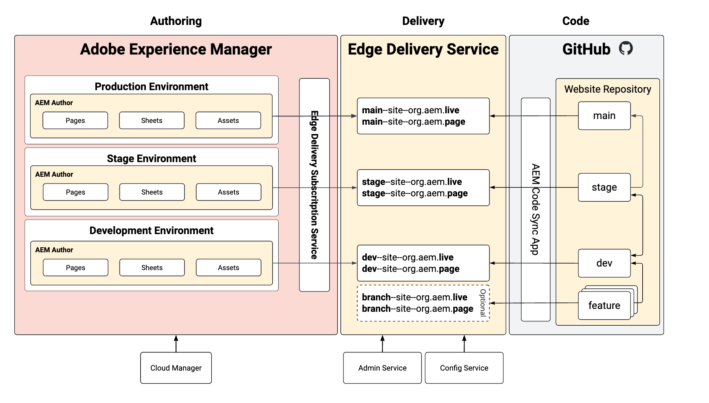

# Environnements d’évaluation et de production sans référentiel {#repoless-stage-prod}

Découvrez comment configurer des sites distincts pour vos environnements d’évaluation et de production en exploitant une seule base de code de manière réactive.

## Vue d’ensemble {#overview}

Vous pouvez configurer un site pour votre environnement de production distinct de votre environnement d’évaluation. La configuration d’un second site pour une configuration d’évaluation et de production distincte est similaire à la [configuration requise pour la gestion multisite](/help/edge/wysiwyg-authoring/repoless-msm.md). En fait, il peut être combiné avec les structures de site MSM si nécessaire.

Ce document utilise l’exemple type d’environnements d’évaluation et de production distincts. Vous pouvez créer des environnements distincts pour les environnements de votre choix.

## Conditions requises {#requirements}

Pour configurer les environnements d’évaluation et de production de réponses, vous devez d’abord effectuer les tâches suivantes :

* Ce document suppose que vous avez déjà créé un site pour votre projet à partir du guide de prise en main [Developer Getting Started Guide for WYSIWYG Authoring with Edge Delivery Services](/help/edge/wysiwyg-authoring/edge-dev-getting-started.md).
* Vous devez avoir déjà [activé la fonction de réponse pour votre projet.](/help/edge/wysiwyg-authoring/repoless.md)

## Configuration {#configuration}

Ce document décrit comment configurer un site de production distinct pour votre projet à l’aide de la même base de code. Les hypothèses suivantes sont faites.

* Le site d’évaluation est déjà configuré et vous souhaitez maintenant créer une configuration pour le site de production.
* La structure du contenu dans la création AEM est similaire.
* Les mêmes mappages de chemin d’accès seront utilisés pour l’évaluation et la production.

Dans cet exemple, nous supposons qu’un site de production a déjà été créé pour le projet appelé wknd, dont le référentiel GitHub est également appelé wknd.

La configuration d’un site de production distinct comporte deux étapes.

1. [Création de nouveaux sites Edge Delivery Services pour votre environnement de production](#create-edge-site).
1. [Mettez à jour la configuration cloud dans AEM pour votre site de production](#update-cloud-configuration).

### Création de nouveaux sites Edge Delivery Services pour votre environnement de production {#create-edge-site}

1. Récupérez votre jeton d’authentification et le compte technique de votre programme.
   * Veuillez consulter le document **Réutilisation de code sur plusieurs sites** pour plus d’informations sur la manière d’[obtenir votre jeton d’accès](/help/edge/wysiwyg-authoring/repoless.md#access-token) et le [compte technique](/help/edge/wysiwyg-authoring/repoless.md#access-control) pour votre programme.
1. Créez un site en effectuant l’appel suivant au service de configuration . Veuillez tenir compte des points suivants :
   * Le nom du projet dans l’URL POST doit correspondre au nouveau nom du site que vous êtes en train de créer. Dans cet exemple, il s’agit de `wknd-prod`.
   * La configuration `code` doit être identique à celle que vous avez utilisée lors de la création initiale du projet.
   * Le `content` > `source` > `url` doit être adapté au nom du nouveau site que vous êtes en train de créer. Dans cet exemple, il s’agit de `wknd-prod`.
   * En d’autres termes, le nom du site dans l’URL POST et le `content` > `source` > `url` doivent être identiques.
   * Adaptez le bloc `admin` pour définir les utilisateurs et utilisatrices qui doivent disposer d’un accès administratif complet au site.
      * Il s’agit d’un tableau d’adresses e-mail.
      * Le caractère générique `*` peut être utilisé.
      * Consultez le document [Configuration de l’authentification pour les auteurs](https://www.aem.live/docs/authentication-setup-authoring#default-roles) pour plus d’informations.

   ```text
   curl --request POST \
     --url https://admin.hlx.page/config/<your-github-org>/sites/wknd-prod.json \
     --header 'x-auth-token: <your-token>' \
     --header 'Content-Type: application/json' \
     --data '{
       "code": {
           "owner": "<your-github-org>",
           "repo": "wknd",
           "source": {
               "type": "github",
               "url": "https://github.com/<your-github-org>/wknd"
           }
       },
       "content": {
           "source": {
               "url": "https://author-p<programID>-e<environmentID>.adobeaemcloud.com/bin/franklin.delivery/<your-github-org>/wknd-prod/main",
               "type": "markup",
               "suffix": ".html"
           }
       },
       "access": {
           "admin": {
               "role": {
                   "admin": [
                       "<email>@<domain>.<tld>"
                   ],
                   "config_admin": [
                       "<tech-account-id>@techacct.adobe.com"
                   ]
               },
               "requireAuth": "auto"
           }
       }
   }'
   ```

1. Ajoutez le mappage de chemin d’accès à votre nouveau site en effectuant l’appel suivant au service de configuration .

   ```text
   curl --request POST \
     --url https://admin.hlx.page/config/<your-github-org>/sites/wknd-prod/public.json \
     --header 'x-auth-token: <your-token>' \
     --header 'Content-Type: application/json' \
     --data '{
       "paths": {
           "mappings": [
               "/content/wknd/:/"
           ],
           "includes": [
               "/content/wknd/"
           ]
       }
   }'
   ```

Vérifiez que la configuration publique de votre nouveau site fonctionne en appelant `https://main--wknd-prod--<your-github-org>.aem.page/config.json` et en vérifiant le contenu du fichier JSON renvoyé.

### Mise à jour des configurations cloud dans AEM pour votre site de production {#update-cloud-configuration}

Votre AEM de production doit être configurée pour utiliser les nouveaux sites Edge Delivery que vous avez créés dans la section précédente pour un site de production dédié. Dans cet exemple, le contenu sous `/content/wknd` dans votre environnement de production doit être connu pour utiliser le site `wknd-prod` que vous avez créé.

1. Connectez-vous à l’instance d’exploitation AEM et accédez à **Outils** -> **Services cloud** -> **Configuration Edge Delivery Services**.
1. Sélectionnez la configuration qui a été automatiquement créée pour votre projet.
1. Appuyez ou cliquez sur **Propriétés** dans la barre d’outils.
1. Dans la fenêtre **Configuration de Edge Delivery Services** :
   * Indiquez votre organisation GitHub dans le champ **Organisation**.
   * Remplacez le nom du site par le nom du site que vous avez créé dans la section précédente. Dans ce cas-ci, ce serait `wknd-prod`.
   * Remplacez le type de projet par **aem.live avec la configuration repoless**.
1. Appuyez et cliquez sur **Enregistrer et fermer**.

## Vérification de votre configuration {#verify}

Maintenant que vous avez effectué toutes les modifications de configuration nécessaires, vérifiez que tout fonctionne comme prévu.

1. Connectez-vous à votre instance de création d’exploitation AEM.
1. Accédez à la **console Sites** en accédant à **Navigation** -> **Sites**.
1. Sélectionnez une page de votre site.
1. Appuyez ou cliquez sur **Modifier** dans la barre d’outils.
1. Assurez-vous que la page s’affiche correctement dans l’éditeur universel et utilise le même code que la racine de votre site.
1. Apportez une modification à la page et republiez-la.
1. Visitez votre nouveau site Edge Delivery Services pour cette page à l’adresse `https://main--wknd-prod--<your-github-org>.aem.page`.

Si les modifications que vous avez apportées s’affichent, la configuration distincte de votre site de production fonctionne correctement.

## Utilisation {#usage}

Une fois que vous avez configuré votre projet avec des environnements d’évaluation et de production sans réponse, vous pouvez gérer le code pour ceux-ci indépendamment. Le diagramme suivant illustre les relations du contenu dans vos différents environnements, dans AEM, les sites Edge Delivery Services et vos référentiels GitHub.


