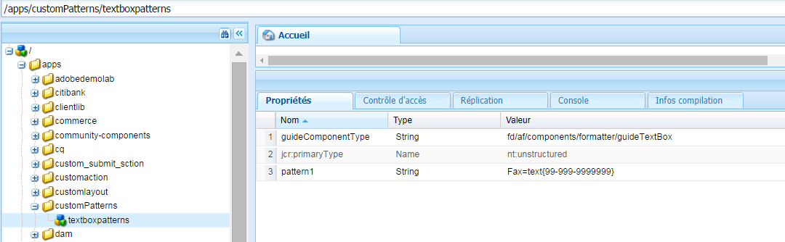

# Expressions de formulaire adaptatif {#adaptive-form-expressions}

Les formulaires adaptatifs facilitent et optimisent le remplissage des formulaires pour les utilisateurs finaux à l’aide de fonctions de script dynamique. Vous pouvez ainsi écrire des expressions afin d’ajouter différents comportements tels que les champs et panneaux dynamiques d’affichage et de masquage. Vous pouvez également ajouter des champs calculés, afficher les champs en lecture seule, ajouter une logique de validation, et bien d’autres fonctionnalités. Le comportement dynamique se base sur les entrées de l’utilisateur ou les données pré-renseignées.

JavaScript™ est le langage d’expression utilisé pour les formulaires adaptatifs. Toutes les expressions sont des expressions JavaScript™ valides qui utilisent des API de modèle de script pour les formulaires adaptatifs. Ces expressions renvoient des valeurs de certains types. Pour obtenir la liste complète des classes de formulaires adaptatifs, des événements, des objets et des API publiques, consultez [Référence à l’API de la bibliothèque JavaScript™ pour les formulaires adaptatifs](https://helpx.adobe.com/fr/experience-manager/6-5/forms/javascript-api/index.html).

## Bonnes pratiques relatives à l’écriture d’expressions {#best-practices-for-writing-expressions}

* Lors de l’écriture d’expressions, pour accéder aux champs et aux panneaux, vous pouvez utiliser le nom du champ ou du panneau. Pour accéder à la valeur d’un champ, utilisez la propriété de la valeur. Par exemple, `field1.value`
* Utilisez des noms uniques pour les champs et les panneaux du formulaire. Cela permet d’éviter tout conflit possible avec les noms de champ utilisés lors de l’écriture d’expressions.
* Lors de la création d’expressions multilignes, utilisez un point-virgule à la fin d’une instruction.

## Recommandations relatives aux expressions impliquant un panneau de répétition {#best-practices-for-expressions-involving-repeating-panel}

Les panneaux de répétition sont des instances d’un panneau qui sont ajoutées ou supprimées dynamiquement, à l’aide de l’API de script ou des données pré-renseignées. <!--  For detailed information about using repeating panel, see [creating forms with repeatable sections](creating-forms-repeatable-sections.md). -->

* Pour créer un panneau de répétition, dans la boîte de dialogue du panneau, ouvrez les paramètres, puis paramétrez la valeur du champ de nombre maximal sur un chiffre supérieur à 1.
* La valeur du nombre minimum des paramètres de répétition du panneau peut être un ou plusieurs, mais ne peut pas être supérieure à la valeur du nombre maximal.
* Lorsqu’une expression fait référence à un champ de panneau répétable, les noms de champ dans l’expression sont résolus par rapport à l’élément de répétition le plus proche.
* Les formulaires adaptatifs fournissent quelques fonctions spéciales pour simplifier le calcul des panneaux à répétition comme la somme, le compte, le minimum, le maximum, le filtre, etc. Pour obtenir la liste complète des fonctionnalités, consultez la [référence d’API de bibliothèque JavaScript™ pour les formulaires adaptatifs](https://helpx.adobe.com/fr/aem-forms/6/javascript-api/af.html)
* Les API pour manipuler les instances d’un panneau de répétition sont :

   * Pour ajouter une instance du panneau : `panel1.instanceManager.addInstance()`
   * Pour obtenir un index de répétition du panneau : `panel1.instanceIndex`
   * Pour obtenir le gestionnaire d’instance d’un panneau : `_panel1 or panel1.instanceManager`
   * Pour supprimer une instance du panneau : `_panel1.removeInstance(panel1.instanceIndex)`

## Types d’expression {#expression-types}

Dans les formulaires adaptatifs, vous pouvez écrire des expressions afin d’ajouter différents comportements tels que les champs et panneaux dynamiques d’affichage et de masquage. Vous pouvez également écrire des expressions pour ajouter des champs calculés, afficher les champs en lecture seule, ajouter une logique de validation, et bien d’autres fonctionnalités. Les formulaires adaptatifs prennent en charge les expressions suivantes :

* **[Expressions d’accès](#access-expression-enablement-expression)** : pour activer/désactiver un champ.
* **[Expressions de calcul](#calculate-expression)** : pour calculer automatiquement la valeur d’un champ.
* **[Expression de clic](#click-expression)** : pour gérer les actions en utilisant l’événement clic d’un bouton.
* **[Script d’initialisation](#initialization-script) :** effectuez une action lors de l’initialisation d’un champ.
* **[Expression d’options](#options-expression)** : pour remplir de manière dynamique une liste déroulante.
* **[Expression récapitulative](#summary)** : pour calculer dynamiquement le titre d’un accordéon.
* **[Expressions de validation](#validate-expression)** : pour valider un champ.
* **[Script de validation de valeur](#value-commit-script):** : pour modifier les composants d’un formulaire après modification de la valeur d’un champ.
* **[Expression de visibilité](#visibility-expression)** : pour contrôler la visibilité d’un champ et d’un panneau.
* **[Expression d’achèvement de l’étape](#step-completion-expression)** : pour empêcher l’utilisateur de passer à l’étape suivante d’un assistant.

### Expression d’accès (expression d’activation) {#access-expression-enablement-expression}

Vous pouvez utiliser l’expression d’accès pour activer ou désactiver un champ. Si l’expression utilise la valeur d’un champ, à chaque fois que la valeur du champ est modifiée, l’expression est redéclenchée.

**S’applique à** : champs

**Type de valeur renvoyée** : l’expression renvoie une valeur booléenne, qui indique si le champ est activé ou désactivé. **true** indique que le champ est activé et **false** que le champ est désactivé.

**Exemple** : pour activer un champ uniquement lorsque la valeur **field1** est définie sur **X**, l’expression d’accès est : `field1.value == "X"`

### Expression de calcul {#calculate-expression}

L’expression de calcul est utilisée pour calculer automatiquement la valeur d’un champ à l’aide d’une expression. En règle générale, une telle expression utilise une propriété de valeur d’autres champs. Par exemple, `field2.value + field3.value`. Dès lors que la valeur de `field2`ou `field3`est modifiée, l’expression est redéclenchée et la valeur est recalculée.

**S’applique à** : champs

**Type de valeur renvoyée** : l’expression renvoie une valeur compatible avec le champ dans lequel le résultat de l’expression est affiché (par exemple, décimal).

**Exemple** : l’expression de calcul pour afficher la somme de deux champs dans **field1** est
`field2.value + field3.value`

### Expression de clic {#click-expression}

L’expression de clic gère les actions effectuées sur l’événement clic d’un bouton. GuideBridge fournit des API prêtes à l’emploi pour effectuer différentes fonctions comme l’envoi et la validation, qui sont utilisées avec l’expression de clic. Pour obtenir la liste complète des API, consultez les [API GuideBridge](https://helpx.adobe.com/fr/aem-forms/6/javascript-api/GuideBridge.html).

**Application pour** : champs de bouton

**Type de valeur renvoyée** : l’expression de clic ne renvoie aucune valeur. Si une expression renvoie une valeur, la valeur est ignorée.

**Exemple** : pour remplir une zone de texte **textbox1** lors de l’action de clic d’un bouton avec la valeur **AEM Forms**, l’expression de clic du bouton est `textbox1.value="AEM Forms"`.

### Script d’initialisation {#initialization-script}

Le script d’initialisation est déclenché lorsqu’un formulaire adaptatif est initialisé. En fonction du scénario, le script d’initialisation fonctionne d’une des manières suivantes :

* Lorsqu’un formulaire adaptatif est rendu sans préremplissage de données, le script d’initialisation s’exécute après l’initialisation du formulaire.
* Lorsqu’un formulaire adaptatif est rendu sans préremplissage de données, le script est exécuté après l’opération de préremplissage.
* Lorsqu’une revalidation d’un formulaire adaptatif est déclenchée du côté du serveur, le script d’initialisation est exécuté.

**S’applique à** : champs et panneau

**Type de valeur renvoyée** : l’expression du script d’initialisation ne renvoie aucune valeur. Si une expression renvoie une valeur, la valeur est ignorée.

**Exemple :** dans un scénario où les données sont pré-renseignées, pour remplir les champs avec la valeur par défaut `'Adaptive Forms'` lorsque leur valeur enregistrée est nulle, l’expression du script d’initialisation est :
`if(this.value==null) this.value='Adaptive Forms';`

### Expression d’options {#options-expression}

L’expression d’options est utilisée pour remplir dynamiquement les options d’un champ de liste déroulante.

**Application pour** : champs de liste déroulante

**Type de valeur renvoyée** : l’expression d’options renvoie un tableau de valeurs de chaîne. Chaque valeur peut correspondre à une chaîne simple, telle que **Male**, ou à un format de paires clé=valeur tel que **1=Male**.

**Exemple** : pour remplir la valeur d’un champ en fonction de la valeur d’un autre champ, indiquez une expression d’options simple. Par exemple, pour remplir un champ, **Nombre d’enfants**, selon la valeur d’**Etat civil** exprimé dans un autre champ, l’expression est :

**`marital_status.value == "married" ? ["1=One", "2=two"] : ["0=Zero"]`.**

Dès lors que la valeur du champ **marital_status** est modifiée, l’expression est redéclenchée. Vous pouvez également remplir la liste déroulante à partir d’un service REST. <!-- For detailed information, see [Dynamically populating dropdowns](dynamically-populate-dropdowns.md). -->

### Expression récapitulative {#summary}

L’expression récapitulative calcule dynamiquement le titre d’un panneau enfant d’un panneau de disposition en accordéon. Vous pouvez spécifier l’expression récapitulative dans une règle qui utilise un champ de formulaire ou une logique personnalisée pour évaluer le titre. L’expression s’exécute lorsque le formulaire s’initialise. Si vous préremplissez un formulaire, l’expression s’exécute après que les données ont été remplies ou lorsque la valeur des champs dépendants utilisés dans l’expression change.

L’expression récapitulative est généralement utilisée pour répéter les enfants d’un panneau de disposition en accordéon afin de fournir un titre significatif à chaque panneau enfant.

**Application :** panneaux qui sont les enfants directs d’un panneau dont la disposition est configurée en accordéon.

**Type de valeur renvoyée :** l’expression renvoie une chaîne qui devient le titre de l’accordéon.

**Exemple :** « Numéro de compte : » + textbox1.value

### Expression de validation {#validate-expression}

L’expression de validation est utilisée pour valider les champs à l’aide de l’expression donnée. En règle générale, de telles expressions utilisent des expressions régulières ainsi que la valeur de champ pour valider un champ. L’expression est redéclenchée et l’état de validation du champ est recalculé à tout changement de la valeur d’un champ.

**S’applique à** : champs

**Type de valeur renvoyée** : l’expression renvoie une valeur booléenne, représentant l’état de validation du champ. La valeur **false** indique que le champ n’est pas valide et **true** indique que le champ est valide.
**Exemple** : pour un champ représentant un code postal du Royaume-Uni, l’expression de validation est :

(**this.value** &amp;&amp; `this.value.match(/^(GIR 0AA|[A-Z]{1,2}\d[A-Z0-9]? ?[0-9][A-Z]{2}\s*)$/i) == null) ? false : true`

Dans l’exemple ci-dessus, si la valeur non vide n’est pas conforme au modèle, l’expression renvoie **false** pour indiquer que le champ n’est pas valide.

>[!NOTE]
>
>Si vous écrivez une expression de validation pour un champ non obligatoire ou obligatoire, l’expression est évaluée quel que soit l’état de visibilité du champ. Pour arrêter la validation des champs masqués, définissez sur true la propriété validationsDisabled du script de validation de valeur ou d’initialisation. Par exemple, `this.validationsDisabled=true`

### Script de validation de valeur {#value-commit-script}

Le script de validation de valeur est déclenché dans les cas suivants :

* Un utilisateur ou une utilisatrice modifie la valeur d’un champ à partir de l’interface utilisateur.
* La valeur d’un champ change par programmation en raison d’une modification dans un autre champ.

**S’applique à** : champs

**Type de renvoi** : l’expression du script de validation de valeur ne renvoie aucune valeur. Si une expression renvoie une valeur, la valeur est ignorée.

**Exemple :** pour convertir la casse des caractères alphabétiques saisis dans le champ en majuscules pour la validation, l’expression de validation de valeur est :
`this.value=this.value.toUpperCase()`

>[!NOTE]
>
>Vous pouvez désactiver l’exécution du script de validation de valeur lorsque la valeur d’un champ est changée par programmation. Pour ce faire, allez à https://&#39;[server]:[port]&#39;/system/console/configMgr r et remplacez **Version de formulaires adaptatifs pour compatibilité** par **AEM Forms 6.1**. Ensuite, le script de validation de valeur est exécuté uniquement lorsque l’utilisateur ou l’utilisatrice modifie la valeur du champ à partir de l’interface utilisateur.

### Expression de visibilité {#visibility-expression}

L’expression de visibilité est utilisée pour contrôler la visibilité du champ/panneau. En règle générale, l’expression de visibilité utilise la propriété de valeur d’un champ et est redéclenchée lorsque cette valeur change.

**Application pour** : champs et panneau

**Type de valeur renvoyée** : l’expression renvoie une valeur booléenne, qui indique si le champ/panneau est visible ou non. La valeur **false** indique que le champ ou le panneau n’est pas visible et la valeur true indique que le champ ou le panneau est visible.

**Exemple** : pour un panneau qui devient visible uniquement si la valeur de **field1** est définie sur **Male**, l’expression de visibilité est : `field1.value == "Male"`

### Expression d’achèvement de l’étape {#step-completion-expression}

L’expression d’achèvement de l’étape est utilisée pour empêcher un utilisateur ou une utilisatrice d’accéder à l’étape suivante d’une disposition d’assistant. Ces expressions sont utilisées lorsque les panneaux ont une disposition d’assistant (un formulaire à plusieurs étapes affichant une étape à la fois). L’utilisateur peut passer à l’étape, à la sous-section ou au panneau suivant uniquement une fois que toutes les valeurs requises de la section actuelle sont renseignées et valides.

**S’applique à** : panneaux avec disposition de l’élément défini sur l’assistant.

**Type de renvoi** : l’expression renvoie une valeur booléenne, qui indique si le panneau est valide ou non. **True** indique que le panneau actuel est valide et l’utilisateur peut accéder au prochain panneau.

**Exemple** : dans un formulaire organisé en différents panneaux, avant d’accéder au panneau suivant, le panneau actif est validé. Dans ce cas, les expressions d’achèvement de l’étape sont utilisées. En règle générale, ces expressions utilisent l’API de validation GuideBridge. Un exemple d’expression d’achèvement de l’étape est :
`window.guideBridge.validate([],this.panel.navigationContext.currentItem.somExpression)`

## Validations dans un formulaire adaptatif {#validations-in-adaptive-form}

Il existe plusieurs méthodes pour ajouter la validation de champ à un formulaire adaptatif. Si une vérification de validation est ajoutée à un champ, **True** indique que la valeur saisie dans le champ est valide. **False** indique que la valeur n’est pas valide. Si vous appuyez sur la touche de tabulation dans un champ ou en dehors, le message d’erreur n’est pas généré.

Les méthodes pour ajouter des validations sur un champ sont les suivantes :

### Requis {#required}

Pour rendre un composant obligatoire, dans la boîte de dialogue **Modifier** du composant, vous pouvez sélectionner l’option **Titre et texte > Obligatoire**. Vous pouvez également ajouter le message requis approprié (facultatif).

### Modèles de validation {#validation-patterns}

Il existe plusieurs modèles de validation prêts à l’emploi disponibles pour un champ. Pour sélectionner un modèle de validation, dans la boîte de dialogue **Modifier** du composant, accédez à la section **Modèles**, puis sélectionnez **modèles**. Vous pouvez créer votre propre modèle personnalisé de validation dans une zone de texte **Modèle**. L’état de validation est renvoyé en tant que **True** uniquement si les données renseignées sont conformes au modèle de validation, sinon la valeur **False** est renvoyée. <!-- To write your own custom validation pattern, see [Picture clause support for HTML5 forms](picture-clause-support.md). -->

### Expressions de validation {#validation-expressions}

La validation d’un champ peut également être calculée à l’aide d’expressions sur différents champs. Ces expressions sont écrites dans le champ **Script de validation** de l’onglet **Script** de la boîte de dialogue **Modifier** du composant. L’état de validation d’un champ dépend de la valeur que l’expression renvoie. Pour obtenir plus d’informations sur la manière d’écrire de telles expressions, voir [Expression de validation](adaptive-form-expressions.md#p-validate-expression-p).

## Informations supplémentaires {#additional-information}

### Utilisation du format d’affichage des champs {#using-field-display-format}

Le format d’affichage peut être utilisé pour afficher les données dans différents formats. Vous pouvez, par exemple, utiliser le format d’affichage pour afficher un numéro de téléphone avec des tirets, un code postal ou un sélecteur de date. Ces modèles d’affichage peuvent être sélectionnés à partir de la section **Modèles** de la boîte de dialogue Modifier d’un composant. Vous pouvez écrire des modèles d’affichage personnalisés similaires aux modèles de validation mentionnés ci-dessus.

### GuideBridge - API et événements {#guidebridge-apis-and-events}

GuideBridge se compose d’un ensemble d’API qui peuvent être utilisées en interaction avec le Forms adaptatif dans le modèle de mémoire d’un navigateur. Pour en savoir plus sur les API GuideBridge, les méthodes de classe, les événements exposés, consultez la [référence d’API de bibliothèque JavaScript™ pour les formulaires adaptatifs](https://helpx.adobe.com/fr/aem-forms/6/javascript-api/).

>[!NOTE]
>
>Il est recommandé de ne pas utiliser les écouteurs d’événement GuideBridge dans les expressions.

#### Utilisation de GuideBridge dans différentes expressions {#guidebridge-usage-in-various-expressions}

* Pour réinitialiser les champs de formulaire, vous pouvez déclencher l’API `guideBridge.reset()` dans l’expression de clic d’un bouton. De même, il existe une API d’envoi qui peut être appelée `guideBridge.submit()` d’expression de clic.

* Vous pouvez utiliser l’API `setFocus()` pour définir la cible d’action sur différents champs et panneaux (car la cible d’action du panneau est définie sur le premier champ automatiquement). `setFocus()` propose un large éventail d’options pour naviguer sur différents panneaux, passer à la traversée précédente/suivante, régler la cible d’action sur un champ en particulier, etc. Par exemple, pour passer au panneau suivant, vous pouvez utiliser : `guideBridge.setFocus(this.panel.somExpression, 'nextItem')`.

* Pour valider un formulaire adaptatif ou ses panneaux spécifiques, utilisez `guideBridge.validate(errorList, somExpression).`

#### Utiliser GuideBridge en dehors des expressions {#using-guidebridge-outside-expressions-nbsp}

Vous pouvez également utiliser les API GuideBridge en dehors des expressions. Par exemple, vous pouvez utiliser les API GuideBridge pour définir la communication entre la page HTML qui héberge le formulaire adaptatif et le modèle de formulaire. En outre, vous pouvez définir la valeur qui provient du parent d’Iframe qui héberge le formulaire.

Pour utiliser l’API GuideBridge pour l’exemple mentionné ci-dessus, capturez une instance de GuideBridge. Pour capturer l’instance, écoutez l’événement `bridgeInitializeStart` d’un objet de l’objet `window` :

```javascript
window.addEventListener("bridgeInitializeStart", function(evnt) {

     // get hold of the guideBridge object

     var gb = evnt.detail.guideBridge;

     //wait for the completion of AF

     gb.connect(function (){

        //this function is called after Adaptive Form is initialized

     })

})
```

>[!NOTE]
>
>Dans AEM, il est recommandé d’écrire le code dans une bibliothèque cliente et de l’inclure dans votre page (header.jsp et footer.jsp de la page)

Pour utiliser GuideBridge après l’initialisation du formulaire (l’événement `bridgeInitializeComplete` est distribué), obtenez l’instance GuideBridge à l’aide de `window.guideBridge`. Vous pouvez vérifier l’état d’initialisation de GuideBridge à l’aide de l’API `guideBride.isConnected`.

#### Evénements de GuideBridge {#guidebridge-events}

GuideBridge fournit également certains événements pour les scripts externes sur la page d’hébergement. Les scripts externes peuvent écouter ces événements et effectuer diverses opérations. Par exemple, lorsque le nom d’utilisateur d’un formulaire est modifié, le nom affiché dans l’en-tête de la page est également modifié. Pour plus d’informations sur ces événements, consultez [référence d’API de bibliothèque JavaScript™ pour les formulaires adaptatifs](https://helpx.adobe.com/fr/aem-forms/6/javascript-api/GuideBridge.html).

Utilisez le code suivant pour enregistrer des gestionnaires :

```javascript
guideBridge.on("elementValueChanged", function (event, data)  {

      // execute some logic when value of a field is changed

});
```

### Création de motifs personnalisés pour un champ {#creating-custom-patterns-for-a-field}

Comme mentionné ci-dessus, les formulaires adaptatifs permettent à l’auteur de fournir des modèles destinés aux formats d’affichage ou de validation. En plus d’utiliser des modèles prêts à l’emploi, vous pouvez définir un modèle personnalisé réutilisable pour un composant de format adaptatif. Par exemple, vous pouvez définir un champ de texte ou un champ numérique. Une fois ces modèles définis, vous pouvez les utiliser dans tous les formulaires pour un type de composant spécifique. Par exemple, vous pouvez créer un modèle personnalisé pour un champ de texte et l’utiliser pour les champs de texte des formulaires adaptatifs. Vous pouvez sélectionner le modèle personnalisé en accédant à la section des modèles dans la boîte de dialogue Modifier d’un composant. <!-- For details about Pattern definition or format, see [Picture clause support for HTML5 forms](picture-clause-support.md).-->

Exécutez les étapes suivantes pour créer un modèle personnalisé destiné à un type de champ spécifique et pour le réutiliser avec d’autres champs du même type :

1. Accédez à CRXDE Lite sur votre instance de création.
1. Créez un dossier pour conserver vos modèles personnalisés. Dans le répertoire /apps, créez un nœud de type sling:folder. Par exemple, créez un nœud appelé `customPatterns`. Sous ce nœud, créez un autre nœud du type `nt:unstructed` et appelez-le `textboxpatterns`. Ce nœud contient les différents modèles personnalisés que vous souhaitez ajouter.
1. Ouvrez l’onglet Propriétés du nœud créé. Par exemple, ouvrez l’onglet Propriétés de `textboxpatterns`. Ajoutez la propriété `guideComponentType` à ce nœud et définissez sa valeur sur *fd/af/components/formatter/guideTextBox*.

1. La valeur de cette propriété dépend du champ pour lequel vous souhaitez définir les modèles. Pour un champ numérique, la valeur de la propriété `guideComponentType` est *fd/af/components/formatter/guideNumericBox*. La valeur du champ de sélecteur de date est *fd/af/components/formatter/guideDatepicker*.
&grave;&grave;
1. Vous pouvez ajouter un modèle personnalisé en affectant une propriété au nœud `textboxpatterns`. Ajoutez une propriété qui dispose d’un nom (par exemple, `pattern1`) et définissez sa valeur sur le modèle que vous voulez ajouter. Par exemple, ajoutez une propriété `pattern1` avec une valeur Fax=text{99-999-9999999}. Le modèle est disponible pour toutes les zones de texte que vous utilisez dans les formulaires adaptatifs.

   

   Création de modèles personnalisés
