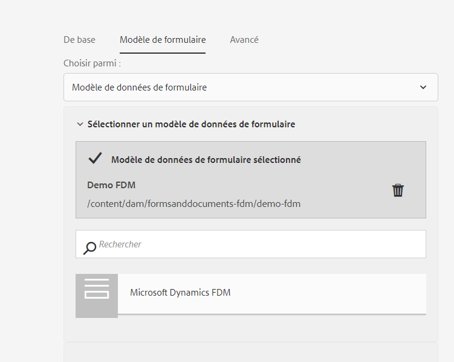

# Créer et utiliser des fragments de formulaires adaptatifs dans un formulaire adaptatif en fonction des composants principaux {#adaptive-form-fragments}

| Version | Lien de l’article |
| -------- | ---------------------------- |
| AEM as a Cloud Service | Cet article |
| AEM 6.5 | [Cliquez ici](https://experienceleague.adobe.com/docs/experience-manager-65/forms/adaptive-forms-basic-authoring/adaptive-form-fragments.html) |

Bien que chaque formulaire soit conçu pour un rôle spécifique, certains segments sont communs à la plupart des formulaires, comme les informations personnelles telles que le nom et l’adresse, les informations relatives à la famille et aux revenus. Les développeurs et développeuses de formulaires doivent créer ces segments communs chaque fois qu’un nouveau formulaire est créé.

Les formulaires adaptatifs fournissent un mécanisme pratique pour créer un segment de formulaire, comme un panneau ou un groupe de champs, une seule fois et pour les réutiliser dans des formulaires adaptatifs. Ces segments réutilisables et autonomes s’appellent des fragments de formulaire adaptatif.

Les fragments de formulaire s’intègrent facilement à plusieurs formulaires, ce qui rationalise la création de formulaires cohérents et d’apparence professionnelle. Les fragments de formulaire assurent la réutilisation, la normalisation et la cohérence de la marque grâce à la fonctionnalité &quot;changer une fois et refléter partout&quot;. Expérimentez une plus grande maintenabilité et une plus grande efficacité, car les mises à jour effectuées à un emplacement donné sont automatiquement propagées à tous les formulaires qui utilisent ces fragments.

Vous pouvez ajouter un fragment plusieurs fois à un document et utiliser les propriétés de liaison de données de ses composants pour les lier à différentes sources de données ou différents schémas. Par exemple, vous pouvez utiliser le même fragment d’adresse pour les adresses permanentes, de communication et de facturation et le connecter à différents champs d’une source de données ou d’un schéma.

>[!NOTE]
>
> Vous pouvez facilement personnaliser votre expérience de fragment pour les personnes qui utilisent la [boîte de dialogue de configuration et la boîte de dialogue de conception d’un composant Fragment de formulaire](https://experienceleague.adobe.com/docs/experience-manager-core-components/using/adaptive-forms/adaptive-forms-components/form-fragment.html?lang=fr).

## Créer un fragment de formulaire {#create-a-fragment}

Vous pouvez créer un fragment de formulaire adaptatif à partir de zéro ou enregistrer un panneau dans un formulaire adaptatif existant en tant que fragment. Pour créer un fragment de formulaire :

1. Connectez-vous à votre instance de création d’AEM Forms à l’adresse https://[*nom_hôte*]:[*port*]/aem/forms.html.
1. Cliquez sur **Créer > Fragment de formulaire adaptatif**.
1. Indiquez le titre, le nom, la description et les balises du fragment. Assurez-vous de spécifier un nom unique pour le fragment. S’il existe déjà un autre fragment portant le même nom, la création du fragment échoue.
1. Sélectionnez un modèle de formulaire. Vous pouvez créer un fragment de formulaire pour les formulaires adaptatifs basés sur des composants principaux ou les formulaires adaptatifs basés sur des composants de base.
   * Pour créer un fragment de formulaire pour les formulaires basés sur des composants principaux, sélectionnez un modèle basé sur des composants principaux.
   * Pour créer un fragment de formulaire pour les formulaires basés sur des composants de base, sélectionnez un modèle de composants de base. Par exemple, /libs/fd/af/templateForFragment/defaultFragmentTemplate.

   Lorsque vous créez un fragment de formulaire pour les formulaires basés sur des composants principaux, utilisez l’option Sélectionner un thème de formulaire pour sélectionner un thème basé sur des composants principaux.

1. Cliquez pour ouvrir l’onglet **Modèle de formulaire**, puis dans le menu déroulant **Choisir parmi**, sélectionnez l’un des modèles de fragment suivants :

   

   * **Aucun** : indique que le fragment doit être créé de zéro sans utiliser de modèle de formulaire.

     >[!NOTE]
     >
     > Dans les formulaires adaptatifs, vous pouvez utiliser plusieurs fois un fragment de formulaire unique (basé sur des composants principaux). Il prend en charge les fragments de formulaire basés sur des schémas et sans modèle.

   * **Schéma** : indique de créer un fragment à partir d’un schéma XML ou JSON chargé dans AEM Forms. Vous pouvez charger ou sélectionner l’un des schémas XML ou JSON comme modèle de formulaire pour le fragment. Lorsque vous sélectionnez un schéma XML, vous pouvez également créer un fragment de formulaire adaptatif en sélectionnant un type complexe présent dans le schéma sélectionné à partir de la liste déroulante **[!UICONTROL Type complexe de schéma XML]**. Lorsque vous sélectionnez un schéma JSON, vous pouvez également créer un fragment de formulaire adaptatif en sélectionnant une définition de schéma présente dans le schéma sélectionné à partir de la liste déroulante **[!UICONTROL Définitions de schéma JSON]**.
   * **Modèle de données de formulaire**: indique de créer le fragment à l’aide d’un modèle de données de formulaire (FDM). Vous pouvez créer un fragment de formulaire adaptatif basé sur un seul objet de modèle de données dans un modèle de données de formulaire (FDM). Développez la liste déroulante Définitions de modèle de données de formulaire (FDM) . Il répertorie tous les objets de modèle de données dans le modèle de données de formulaire spécifié (FDM). Sélectionnez un objet de modèle de données dans la liste.

   

1. Cliquez sur **Créer** puis sur **Ouvrir** pour ouvrir le fragment, avec un modèle par défaut, en mode d’édition. En mode d’édition, vous pouvez ajouter n’importe quel composant de formulaire adaptatif au fragment.

<!-- For information about Adaptive Form components, see [Introduction to authoring Adaptive Forms](../../forms/using/introduction-forms-authoring.md). --> En outre, si vous avez sélectionné un modèle de schéma XML ou de formulaire XDP comme modèle de formulaire pour votre fragment, un nouvel onglet affichant la hiérarchie des modèles de formulaire apparaît dans l’outil de recherche de contenu. Il vous permet de faire glisser des éléments du modèle de formulaire sur le fragment. Les éléments de modèle de formulaire ajoutés sont convertis en composants de formulaire tout en conservant les propriétés d’origine du modèle XDP ou XSD associé.

Une fois le fragment de formulaire adaptatif basé sur un schéma ou un modèle de données de formulaire (FDM) créé, les éléments de modèle de données de formulaire (FDM) ou de schéma apparaissent dans l’onglet Sources de données du navigateur de contenu de l’éditeur de formulaire adaptatif. Vous pouvez glisser-déposer des éléments du modèle de formulaire sur le fragment. Les éléments de modèle de formulaire ajoutés sont convertis en composants de formulaire tout en conservant les propriétés d’origine du schéma associé.

## Ajouter un fragment à un formulaire adaptatif {#insert-a-fragment-in-an-adaptive-form}

Pour ajouter un fragment de formulaire adaptatif à un formulaire adaptatif, procédez comme suit :

1. Ouvrez le formulaire adaptatif en mode d’édition.
1. Ajoutez le composant **Fragment de formulaire adaptatif** au formulaire.
1. Cliquez sur l’explorateur de contenu **Ressources** dans la barre latérale. Dans l’explorateur de ressources, sous les chemins d’accès, sélectionnez l’option **Fragments de formulaire adaptatif**. Tous les fragments de formulaires adaptatifs disponibles pour votre formulaire, selon le modèle du formulaire, s’affichent.

   

1. Faites glisser un fragment de formulaire adaptatif sur le composant **Fragment de formulaire adaptatif** sur votre formulaire adaptatif.

   >[!NOTE]
   >
   >Le fragment de formulaire adaptatif ne peut pas être créé au sein même du formulaire adaptatif. De plus, vous ne pouvez pas utiliser un fragment basé sur XSD dans un formulaire adaptatif basé sur JSON et inversement.

Le fragment de formulaire adaptatif est ajouté par référence au formulaire adaptatif et est synchronisé avec le fragment autonome du formulaire adaptatif. Cela signifie que toutes les modifications apportées au fragment de formulaire adaptatif sont répercutées dans toutes les instances où le fragment est incorporé dans les formulaires adaptatifs.

### Incorporer un fragment dans un formulaire adaptatif {#embed-a-fragment-in-adaptive-form}

Vous pouvez choisir d’incorporer un fragment de formulaire adaptatif en cliquant sur l’icône  dans la barre d’outils du panneau du fragment ajouté.

Le fragment inclus n’est plus lié au fragment autonome. Vous pouvez modifier les composants dans le fragment inclus à partir du formulaire adaptatif.

<!-- 
## Configure fragment appearance {#configure-fragment-appearance}

Any fragment you insert in Adaptive Forms appears as a placeholder image. The placeholder displays titles of up to a maximum of ten child panels in the fragment. You can configure AEM Forms to show the complete fragment instead of the placeholder image.

Perform the following steps to show complete fragments in forms:

1. Go to AEM web console configuration page at https:[*host*]:[*port*]/system/console/configMgr.

1. Search and click **[!UICONTROL Adaptive Form and Interactive Communication Web Channel Configuration]** to open it in edit mode.
1. Disable **[!UICONTROL Enable Placeholder in place of Fragment]** checkbox to show complete fragments rather than the placeholder image.

-->

### Utilisation de fragments dans les fragments {#using-fragments-within-fragments}

Vous pouvez créer des fragments de formulaire adaptatif imbriqués, ce qui signifie que vous pouvez faire glisser un fragment dans un autre fragment, et avoir une structure de fragment imbriqué.

### Utiliser un fragment de formulaire plusieurs fois dans un formulaire adaptatif {#using-form-fragment-mutiple-times-in-af}

Vous pouvez utiliser plusieurs fois un fragment de formulaire basé sur un schéma et sans modèle dans un formulaire adaptatif pour enregistrer les données de manière unique pour chaque champ de fragment de formulaire. Par exemple, vous pouvez utiliser un fragment de formulaire d’adresse pour collecter les détails des adresses pour les adresses permanentes, les communications et les adresses actives présentes dans un formulaire de demande de prêt.

## Correspondance automatique des fragments pour la liaison de données {#auto-mapping-of-fragments-for-data-binding}

Lorsque vous créez un fragment de formulaire adaptatif à partir d’un modèle de formulaire XFA ou d’un type XSD complexe et que vous le faites glisser dans un formulaire adaptatif, le fragment XFA ou le type XSD complexe est automatiquement remplacé par le fragment de formulaire adaptatif correspondant dont la racine de modèle de fragment est mappée au fragment XFA ou un type XSD complexe.

Vous pouvez modifier la ressource de fragment et ses liaisons dans la boîte de dialogue Modifier le composant.

Vous pouvez également faire glisser un fragment de formulaire adaptatif lié depuis la bibliothèque des fragments de formulaire adaptatif dans l’outil de recherche de contenu AEM et fournir la référence correcte de liaison depuis la boîte de dialogue Modifier le composant du panneau du fragment de formulaire adaptatif.

## Gérer les fragments {#manage-fragments}

Vous pouvez effectuer plusieurs opérations sur des fragments de formulaire adaptatif depuis l’interface utilisateur d’AEM Forms.

1. Accédez à `https://[hostname]/aem/forms.html`.

1. Cliquez sur **Sélectionner** dans la barre d’outils de l’interface utilisateur d’AEM Forms et sélectionnez un fragment de formulaire adaptatif. La barre d’outils affiche les opérations suivantes que vous pouvez effectuer sur le fragment de formulaire adaptatif sélectionné.

<table>
 <tbody>
  <tr>
   <td>
<strong>Opération</strong>
 </td>
   <td>
<strong>Description</strong>
 </td>
  </tr>
  <tr>
   <td>
Modifier
 </td>
   <td>
Ouvre le fragment de formulaire adaptatif sélectionné en mode d’édition.    
 </td>
  </tr>
  <tr>
   <td>
Propriétés
 </td>
   <td>
Ouvre le panneau Propriétés. Dans le panneau Propriétés, vous pouvez afficher et modifier les propriétés, générer un aperçu et charger une miniature pour le fragment sélectionné. Pour plus d’informations, consultez la section <a>Gestion des métadonnées</a>.    
 </td>
  </tr>
  <tr>
   <td>
Copier
 </td>
   <td>
Copie le fragment sélectionné. Le bouton Coller s’affiche dans la barre d’outils.    
 </td>
  </tr>
  <tr>
   <td>
Télécharger
 </td>
   <td>
Télécharge le fragment sélectionné.    
 </td>
  </tr>
  <tr>
   <td>
Aperçu
 </td>
   <td>
Fournit des options de prévisualisation du fragment en HTML ou un aperçu personnalisé en fusionnant les données d’un fichier XML avec le fragment. Pour plus d’informations, voir <a>Aperçu d’un formulaire</a>.    
 </td>
  </tr>
  <tr>
   <td>
Démarrage de la révision/Gestion de la révision
 </td>
   <td>
Permet de lancer et de gérer la révision du fragment sélectionné. Pour plus d’informations, voir <a>Créer et gérer des révisions</a>.    
 </td>
  </tr>
  <tr>
   <td>
Ajouter un dictionnaire
 </td>
   <td>
Génère un dictionnaire pour localiser le fragment sélectionné. Pour plus d’informations, voir <a>Localisation des formulaires adaptatifs</a>.    
 </td>
  </tr>
  <tr>
   <td>
Publier/Dépublier
 </td>
   <td>
Publie/annule la publication du fragment sélectionné.    
 </td>
  </tr>
  <tr>
   <td>
Supprimer
 </td>
   <td>
Supprime le fragment sélectionné.    
 </td>
  </tr>
 </tbody>
</table>

## Points essentiels à respecter lorsque vous utilisez des fragments {#key-points-to-remember-when-working-with-fragments}

* Assurez-vous que le nom du fragment est unique. La création du fragment échoue si un fragment portant le même nom existe déjà.
* Dans un formulaire adaptatif basé sur XDP, si vous enregistrez un panneau en tant que fragment contenant une autre partie du fragment XDP, le fragment obtenu sera automatiquement lié au fragment XDP enfant. Dans le cas d’un formulaire adaptatif basé sur un schéma XSD, le fragment obtenu sera associé à la racine de schéma.
* Lorsque vous créez un fragment de formulaire adaptatif, un nœud de fragment est créé, similaire au nœud guideContainer pour un formulaire adaptatif, dans CRXDE Lite.
* Un fragment d’un formulaire adaptatif qui utilise un modèle de données de formulaire différent (FDM) n’est pas pris en charge. Par exemple, un fragment basé sur XDP n’est pas pris en charge dans un formulaire adaptatif basé sur XSD et inversement.
* Les fragments de formulaire adaptatif sont disponibles par l’onglet Fragments de formulaire adaptatif dans l’outil de recherche de contenu AEM.
* Toute expression, tout script ou tout style d’un fragment de formulaire adaptatif autonome est conservé lorsqu’il est inséré par référence ou incorporé dans un formulaire adaptatif.
* Vous ne pouvez pas modifier un fragment de formulaire adaptatif, inséré par référence, au sein même d’un formulaire adaptatif. Pour modifier, vous pouvez soit modifier le fragment de formulaire adaptatif autonome, soit incorporer le fragment dans le formulaire adaptatif.
* Lorsque vous publiez un formulaire adaptatif, vous devez publier le fragment de formulaire adaptatif autonome inséré par référence dans le formulaire adaptatif.
* Lorsque vous publiez de nouveau un fragment de formulaire adaptatif mis à jour, les modifications sont répercutées dans les instances publiées du formulaire adaptatif dans lequel le fragment est utilisé.
* Le formulaire adaptatif contenant le composant Vérifier ne prend pas en charge les utilisateurs et utilisatrices anonymes. En outre, il n’est pas recommandé d’utiliser le composant Vérifier dans un fragment de formulaire adaptatif.
* (**Mac uniquement**) Pour vous assurer que la fonctionnalité des fragments de formulaire fonctionne parfaitement dans tous les scénarios, ajoutez l’entrée suivante au fichier /private/etc/hosts :
  `127.0.0.1 <Host machine>` **Ordinateur hôte** : ordinateur Apple Mac sur lequel AEM Forms est déployé.

## Fragments de référence {#reference-fragments}

Les fragments de formulaire adaptatif de référence que vous pouvez utiliser pour créer votre formulaire sont disponibles.
<!-- For more information, see [Reference Fragments](../../forms/using/reference-adaptive-form-fragments.md). -->

## Voir également {#see-also}

{{see-also}}