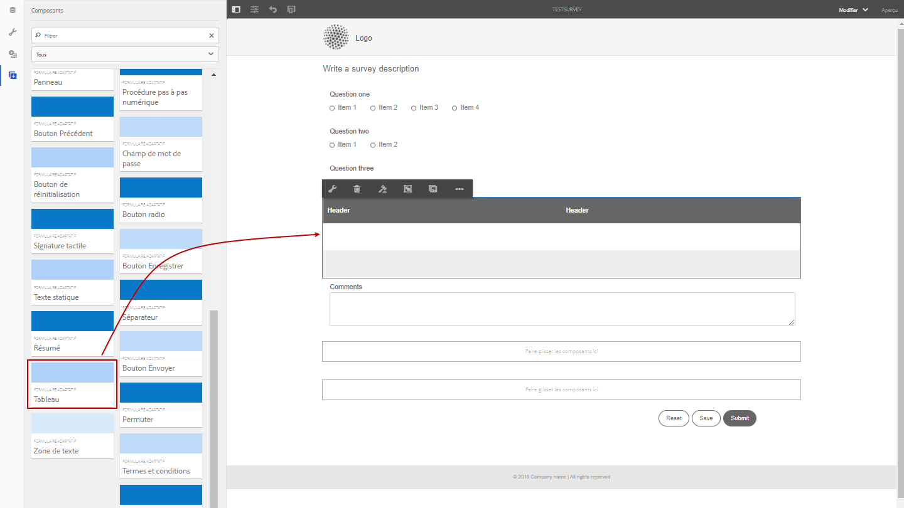
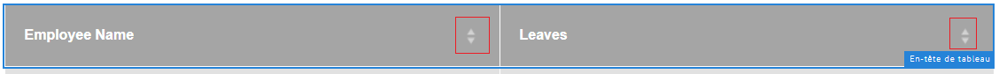
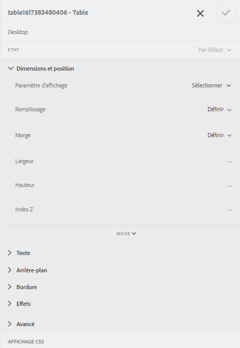

# Tableaux dans le formulaire adaptatif {#tables-in-adaptive-forms}

>[!NOTE]
>
> Adobe recommande d’utiliser la capture de données moderne et extensible [composants principaux](https://experienceleague.adobe.com/docs/experience-manager-core-components/using/adaptive-forms/introduction.html?lang=fr) pour [créer un nouveau Forms adaptatif](/help/forms/creating-adaptive-form-core-components.md) ou [ajouter un Forms adaptatif aux pages AEM Sites](/help/forms/create-or-add-an-adaptive-form-to-aem-sites-page.md). Ces composants représentent une avancée significative dans la création de formulaires adaptatifs, ce qui garantit des expériences utilisateur impressionnantes. Cet article décrit une ancienne approche de création de Forms adaptatif à l’aide de composants de base.


| Version | Lien de l’article |
| -------- | ---------------------------- |
| AEM 6.5 | [Cliquez ici](https://experienceleague.adobe.com/docs/experience-manager-65/forms/adaptive-forms-basic-authoring/adaptive-forms-tables.html) |
| AEM as a Cloud Service | Cet article |


L’utilisation de tableaux est un moyen efficace, simplifié et organisé de présenter des données complexes. Cela permet aux utilisateurs d’identifier facilement les informations et leur fournit des données organisées sous forme de lignes et de colonnes. La plupart des formulaires des services financiers et des administrations requièrent des tableaux de données volumineux pour saisir des données numériques et effectuer des calculs.

AEM Forms fournit un composant Tableau dans l’explorateur de composants de la barre latérale permettant de créer des tableaux dans les formulaires adaptatifs. Voici quelques-unes des capacités clés fournies :

* Disposition réactive sur appareils mobiles
* Lignes et colonnes configurables
* Ajout et suppression dynamiques de lignes à l’exécution
* Combinaison ou fusion et fractionnement de cellules
* Accessibilité par les lecteurs d’écran
* Disposition personnalisée à l’aide de CSS
* Compatibilité et mappage avec un composant de tableau XDP
* Prise en charge de l’ajout de lignes ou de cellules à l’aide d’éléments complexes de type XSD
* Fusion des données à partir d’un fichier XML

## Création d’un tableau {#create-a-table}

Pour créer un tableau, faites glisser un composant Tableau à partir de l’explorateur de composants du panneau latéral d’un formulaire adaptatif. Par défaut, le tableau contient deux colonnes et trois lignes, dont la ligne d’en-tête.



### A propos de l’en-tête et des cellules du corps {#about-header-and-body-cells}

Les cellules d’en-tête sont des champs de texte. Pour modifier le libellé d’un en-tête, cliquez avec le bouton droit sur la cellule d’en-tête, puis cliquez sur **Modifier**. Dans la boîte de dialogue Modifier, mettez à jour le libellé dans le champ **Valeur** et appuyez sur **OK**.

Les cellules du corps sont par défaut des zones de texte. Vous pouvez remplacer une cellule de corps par un autre composant de formulaire adaptatif disponible dans le sidekick, tel qu’une zone numérique, un sélecteur de date, ou une liste déroulante.

Par exemple, la première rangée du corps du tableau ci-dessous inclut les composants Zone de texte, Sélecteur de dates et Liste déroulante comme cellules.


Vous pouvez fusionner deux cellules du corps ou plus en sélectionnant les cellules que vous souhaitez fusionner, puis en cliquant avec le bouton droit et en choisissant la commande **Fusionner**. Vous pouvez également fractionner une cellule fusionnée en cliquant dessus avec le bouton droit et en sélectionnant **Fractionner les cellules**.

### Ajout, suppression et déplacement de lignes et de colonnes {#add-delete-move-rows-and-columns}

Vous pouvez ajouter et supprimer une ligne ou une colonne, et déplacer une ligne vers le haut ou vers le bas dans un tableau.

#### Ajouter, supprimer ou déplacer une ligne

Pour ajouter, supprimer ou déplacer une ligne, cliquez sur une cellule de la ligne. ouvrez l’explorateur de contenu  et sélectionnez la ligne correspondante, elle surligne la ligne sélectionnée avec l’option de barre d’outils à partir de laquelle vous pouvez ajouter, supprimer ou déplacer la ligne vers le haut ou vers le bas.

* Les opérations **[!UICONTROL Déplacer vers le haut]** et **[!UICONTROL Déplacer vers le bas]** permettent de déplacer la ligne sélectionnée vers le haut et vers le bas.

* L’opération **[!UICONTROL Ajouter une colonne]** ajoute une ligne au-dessous de la ligne sélectionnée.

* L’opération **[!UICONTROL Supprimer une colonne]** supprime la ligne sélectionnée.


Double-cliquez sur la ligne pour configurer les propriétés d’une ligne, telles que Nom, Référence de liaison, Paramètres de répétition, Classe CSS.


#### Ajouter ou supprimer une colonne

Pour ajouter ou supprimer une colonne, cliquez sur la cellule de texte dans la section d’en-tête. Une barre d’outils s’ouvre avec les options d’ajout ou de suppression d’une colonne :


>[!NOTE]
>
>Bien que vous puissiez ajouter un nombre illimité de lignes dans un tableau, le nombre maximal de colonnes que vous pouvez ajouter est de six. En outre, vous ne pouvez pas supprimer la ligne d’en-tête du tableau.

### Ajout d’une description de tableau {#add-table-description}

Vous pouvez ajouter une description du tableau pour expliquer l’organisation des informations que les lecteurs d’écran peuvent interpréter et lire. Pour ajouter la description :

1. Sélectionnez le tableau, puis  pour afficher ses propriétés dans la barre latérale.
1. Spécifiez le résumé dans l’onglet Accessibilité.
1. Cliquez sur **Terminé**.

### Tri des colonnes d’un tableau {#sortcolumnstable}

Vous pouvez trier les données en fonction de n’importe quelle colonne d’un tableau dans le formulaire adaptatif. Les valeurs de la colonne peuvent être triées par ordre croissant ou décroissant.

Le tri peut être appliqué aux colonnes du tableau contenant :

* Du texte statique
* Des propriétés d’objet de modèle de données
* Une combinaison de texte statique et de propriétés d’objet de modèle de données

Pour appliquer le tri sur les colonnes du tableau, les cellules des colonnes du tableau doivent contenir l’un des composants suivants : Zone numérique, Procédure pas à pas numérique, champ de saisie de date, sélecteur de date, texte ou zone de texte.

Pour activer le tri :

1. Sélectionnez le tableau, puis  (Configurer). Vous pouvez également sélectionner le tableau à l’aide de l’explorateur de **Contenu** dans le sidekick de la communication interactive.
1. Sélectionnez **Activer le tri**.
1. Sélectionnez  pour enregistrer les propriétés du tableau. Les icônes de tri, les flèches vers le haut et vers le bas, dans les en-têtes de colonnes, indiquent que le tri a été activé.

   

1. Passez au mode **Prévisualisation** pour voir le rendu. Le tableau est automatiquement trié en fonction de la première colonne du tableau.
1. Appuyez sur l’en-tête de colonne pour trier les valeurs en fonction de la colonne.

   Un en-tête de colonne avec une flèche vers le haut indique que le tableau est trié en fonction de cette colonne. En outre, les valeurs de la colonne s’affichent dans l’ordre croissant.

   

   De même, un en-tête de colonne avec une flèche vers le bas indique que les valeurs de la colonne sont affichées dans l’ordre décroissant.

   Vous pouvez également apporter des modifications au tableau en mode **Prévisualisation** et cliquer de nouveau sur l’en-tête de colonne pour trier les valeurs de colonne.

## Définir la largeur d’une colonne pour un tableau {#set-column-width}

Pour définir la largeur des colonnes d’un tableau, procédez comme suit :

1. Dans l’onglet **[!UICONTROL Contenu]**, sélectionnez le composant **[!UICONTROL Tableau]** et ciquez sur l’icône Configurer ().

1. Saisissez la liste des valeurs séparées par des virgules dans le champ **[!UICONTROL Largeur de colonne]** pour spécifier la largeur proportionnelle de chaque colonne du tableau. Par exemple, pour un tableau qui comprend 3 colonnes, en spécifiant 2, 4, 6 comme valeurs dans le champ **[!UICONTROL Largeur de colonne]**, la largeur des colonnes est définie sur 2/12 pour la première colonne, 4/12 pour la deuxième colonne et 6/12 pour la troisième. 2/12 comme largeur de la première colonne fait référence à un sixième de la largeur du tableau. De même, 4/12 définit la largeur de la deuxième colonne sur un tiers de celle du tableau et 6/12 définit la largeur de la troisième colonne sur la moitié de celle du tableau.

## Configuration du style de tableau {#configure}

Vous pouvez définir le style d’un tableau à l’aide du mode Style de la barre d’outils de la page. Effectuez les étapes suivantes pour passer en mode Style et modifier le style du tableau.

1. Dans la barre d’outils de la page, avant Aperçu, sélectionnez  > **Style**.

1. Dans la barre latérale, sélectionnez le tableau, puis cliquez sur le bouton Modifier ().
Vous pouvez afficher les propriétés de style dans la barre latérale.



>[!NOTE]
>
>Vous pouvez modifier le thème de couleur de l’en-tête et des rangées du corps en modifiant les valeurs des [variables LESS](https://lesscss.org//). Pour plus d’informations, voir [Thèmes dans AEM Forms](/help/forms/themes.md).

## Ajout ou suppression dynamique d’une ligne {#add-or-delete-a-row-dynamically}

Les tableaux fournissent une assistance prête à l’emploi pour l’ajout ou la suppression dynamique de lignes au moment de l’exécution.

1. Sélectionnez une ligne de tableau et cliquez sur .
1. Dans l’onglet Paramètres de répétition, spécifiez les valeurs minimale et maximale pour limiter le nombre de lignes dans le tableau.
1. Cliquez sur **Terminé**.

Lors de l’exécution ou de la prévisualisation, vous voyez les boutons **+** et  pour ajouter ou supprimer une ligne.


>[!NOTE]
>
>L’ajout ou la suppression dynamique d’une ligne n’est pas pris en charge dans les en-têtes à gauche de la disposition des tableaux mobiles.

## Expressions dans un tableau {#expressions-in-a-table}

Les tableaux des formulaires adaptatifs permettent d’écrire des expressions en JavaScript pour induire des comportements, tels qu’afficher ou masquer un tableau ou une ligne, ajouter tous les nombres et afficher le total dans une cellule, activer ou désactiver une cellule, valider une entrée utilisateur, etc. Ces expressions utilisent le modèle de script API des formulaires adaptatifs.

Alors que les tableaux et les lignes ne prennent en charge que les expressions de visibilité pour contrôler leur visibilité en fonction de la valeur renvoyée par une expression, les cellules prennent en charge les expressions suivantes :

* **Script d’initialisation** : pour effectuer une action à l’initialisation d’un champ.
* **Script de validation de valeur** : pour modifier les composants d’un formulaire après modification de la valeur d’un champ.

>[!NOTE]
>
>Si le script de modification/édition XFA est également appliqué au même champ, il s’exécute avant le script de validation de valeur.

* **Expressions de calcul** : pour calculer automatiquement la valeur d’un champ.
* **Expressions de validation** : pour valider un champ.
* **Expressions d’accès** : pour activer/désactiver un champ.
* **Expression de visibilité** : pour contrôler la visibilité d’un champ et d’un panneau.

L’expression de visibilité d’un tableau ou d’une ligne peut être définie dans l’onglet Propriétés du panneau de la boîte de dialogue Modifier le composant correspondant. Les expressions pour une cellule peuvent être définies dans l’onglet Script de la boîte de dialogue Modifier le composant correspondant.

Pour obtenir la liste complète des classes de formulaires adaptatifs, des événements, des objets et des API publiques, consultez [Référence d’API de bibliothèque JavaScript pour les formulaires adaptatifs](https://helpx.adobe.com/fr/experience-manager/6-5/forms/javascript-api/index.html).

## Dispositions pour appareils mobiles {#mobile-layouts}

Les tableaux des formulaires adaptatifs fournissent une expérience sans précédent pour les appareils mobiles en raison de leurs dispositions fluides et réactives. AEM Forms offre deux types de dispositions de tableaux pour les appareils mobiles - En-têtes à gauche et Colonnes réductibles.

Vous pouvez configurer une disposition de tableau pour appareils mobiles depuis l’onglet Style de la boîte de dialogue Modifier le composant.

### Disposition En-têtes à gauche {#headers-on-left}

Dans la disposition En-têtes à gauche, les en-têtes du tableau sont transposés à gauche ; une seule cellule apparaît pour un en-tête. Chaque ligne dans cette disposition s’affiche en tant que partie distincte. Les images suivantes comparent un tableau sur un bureau et le même tableau sur un appareil mobile.


Vue Bureau d’un tableau avec disposition En-têtes à gauche


Vue Mobile d’un tableau avec disposition En-têtes à gauche

### Disposition Colonnes réductibles {#collapsible-columns-layout}

Dans la disposition Colonnes réductibles, les colonnes du tableau sont réduites afin d’afficher une ou deux colonnes, selon la taille de l’appareil, tandis que les autres colonnes sont réduites. Vous pouvez cliquer sur l’icône Réduire/Développer pour afficher les autres colonnes du tableau.

>[!NOTE]
>
>Remarque : Alors que la disposition Colonne réductible est optimisée pour les appareils mobiles, elle fonctionne également sur le bureau, si la largeur disponible est insuffisante pour afficher toutes les colonnes d’un tableau.

Les images suivantes comparent l’aspect d’un tableau affiché sur un appareil, l’un comportant des colonnes réduites, l’autre les affichant développées.


Colonnes réduites d’un tableau comportant uniquement deux colonnes, apparaissant sur un appareil mobile


Colonne développée d’un tableau sur un appareil mobile

## Fusion de données dans un tableau {#merge-data-in-a-table}

Les tableaux des formulaires adaptatifs permettent de renseigner le tableau lors de l’exécution avec des données provenant d’un fichier XML. Le fichier XML de données peut résider dans le système de fichiers local de l’ordinateur sur lequel le serveur AEM Forms s’exécute ou dans le référentiel CRX.

Prenons l’exemple du tableau récapitulatif de transactions bancaires suivant, que nous voulons renseigner avec des données provenant d’un fichier XML.


Dans cet exemple, la propriété Nom de l’élément pour :

* la ligne est **Row1**
* la cellule de corps sous Date de transaction est **tableItem1**
* la cellule de corps sous Description est **tableItem2**
* la cellule de corps sous Type de transaction est **type**
* la cellule de corps sous Montant en euros est **tableItem3**

Le fichier XML contenant les données au format suivant :

```xml
<?xml version="1.0" encoding="UTF-8"?><afData>
  <afUnboundData>
    <data>
 <typeSelect>0</typeSelect>
 <Row1>
      <tableItem1>2015-01-08</tableItem1>
      <tableItem2>Purchase laptop</tableItem2>
      <type>0</type>
      <tableItem3>12000</tableItem3>
 </Row1>
 <Row1>
      <tableItem1>2015-01-05</tableItem1>
      <tableItem2>Transport expense</tableItem2>
      <type>0</type>
      <tableItem3>120</tableItem3>
 </Row1>
 <Row1>
      <tableItem1>2014-01-08</tableItem1>
      <tableItem2>Laser printer</tableItem2>
      <type>0</type>
      <tableItem3>500</tableItem3>
 </Row1>
 <Row1>
      <tableItem1>2014-12-08</tableItem1>
      <tableItem2>Credit card payment</tableItem2>
      <type>0</type>
      <tableItem3>300</tableItem3>
 </Row1>
 <Row1>
      <tableItem1>2015-01-06</tableItem1>
      <tableItem2>Interest earnings</tableItem2>
      <type>1</type>
      <tableItem3>12000</tableItem3>
 </Row1>
 <Row1>
      <tableItem1>2015-01-05</tableItem1>
      <tableItem2>Payment from a client</tableItem2>
      <type>1</type>
      <tableItem3>500</tableItem3>
 </Row1>
 <Row1>
      <tableItem1>2015-01-08</tableItem1>
      <tableItem2>Food expense</tableItem2>
      <type>0</type>
      <tableItem3>120</tableItem3>
 </Row1>
 </data>
  </afUnboundData>
  <afBoundData>
    <data/>
  </afBoundData>
  <afBoundData/>
</afData>
```

Dans l’exemple XML, les données d’une ligne sont définies par les balises `<Row1>`, qui sont le nom d’élément de la ligne du tableau. Dans la balise `<Row1>`, les données de chaque cellule sont définies dans la balise pour son nom d’élément, notamment `<tableItem1>`, `<tableItem2>`, `<tableItem3>` et `<type>`.

Pour les fusionner dans le tableau au moment de l’exécution, vous devez indiquer le formulaire adaptatif contenant le tableau à l’emplacement XML absolu avec le mode WCM désactivé. Par exemple, si le formulaire adaptatif se trouve sous *https://localhost:4502/myForms/bankTransaction.html* et que le fichier de données XML est enregistré sous *C:/myTransactions/bankSummary.xml*, vous pouvez afficher le tableau avec des données à l’adresse URL suivante :

*https://localhost:4502/myForms/bankTransaction.html?dataRef=file:/// C:/myTransactions/bankSummary.xml&amp;wcmmode=disabled*


## Utilisation des composants XDP et des types complexes de schéma XSD {#use-xdp-components-and-xsd-complex-types}

Si vous avez créé un formulaire adaptatif en fonction d’un modèle de formulaire XFA, les éléments XFA sont disponibles dans l’onglet Modèle de données de l’outil de recherche de contenu AEM. Vous pouvez faire glisser et déposer ces éléments XFA, notamment des tableaux, dans le formulaire adaptatif.

L’élément de tableau XFA est mappé sur le composant Tableau et fonctionne dans les formulaires adaptatifs prêts à l’emploi. Toutes les propriétés et fonctionnalités de tableau XDP sont conservées lors du déplacement dans le formulaire adaptatif, et vous pouvez effectuer n’importe quelle opération sur celui-ci comme vous le feriez avec le tableau natif du formulaire adaptatif. Par exemple, si une ligne dans un tableau XDP est marquée comme pouvant être répétée, elle sera répétée dans les formulaires adaptatifs également.

En outre, vous pouvez faire glisser et déposer le sous-formulaire XDP pour ajouter une nouvelle ligne au tableau. Notez toutefois que déposer un sous-formulaire imbriqué ne fonctionne pas.

>[!NOTE]
>
>Un tableau XDP sans ligne d’en-tête ne sera pas mappé au composant Tableau de formulaire adaptatif. Au lieu de cela, il est mappé sur le composant Panneau de formulaire adaptatif avec une disposition fluide. En outre, lorsque vous ajoutez un tableau imbriqué XDP à un formulaire adaptatif, le tableau externe est converti en panneau tout en conservant le tableau interne.

Vous pouvez aussi faire glisser et déposer un groupe d’éléments de type complexe XSD pour créer une ligne de tableau. Une nouvelle ligne est créée juste en dessous de la ligne sur laquelle vous avez déposé les éléments. Les cellules créées avec des éléments de type complexe XSD conservent une référence de liaison au schéma XSD. Vous pouvez également remplacer une cellule de corps par un élément de type complexe XSD en déposant l’élément sur la cellule.

>[!NOTE]
>
>Le nombre d’éléments dans un composant de tableau XDP, un sous-formulaire, ou un type XSD complexe ne peut pas dépasser le nombre de cellules dans une ligne. Par exemple, vous ne pouvez pas déposer quatre éléments sur une ligne qui n’a que trois cellules. Cela provoquera une erreur.
>
>Si le nombre d’éléments est inférieur au nombre de cellules dans une ligne, la nouvelle ligne ajoute d’abord les cellules en fonction des éléments, puis les cellules par défaut sont ajoutées pour remplir les autres cellules de la ligne. Par exemple, si vous déposez un groupe de trois éléments dans une ligne qui comporte quatre cellules, les trois premières cellules sont basées sur les éléments déposés et la cellule restante sera la cellule de tableau par défaut.

## Considérations principales {#key-considerations}

* Si vous déplacez des lignes vers le haut et vers le bas lors de la création d’un tableau basé sur XSD, une perte de données des lignes du tableau est visible dans les données XML générées lors de l’envoi du formulaire.
* Dans un tableau par défaut, chaque cellule de contenu est associée à un nom d’élément prédéfini. Si vous ajoutez un autre tableau dans le formulaire adaptatif, les cellules de contenu par défaut du nouveau tableau auront le même nom d’élément que dans le premier. Dans ce cas, les données générées lors de l’envoi du formulaire incluront les données des cellules de contenu par défaut de l’un des tableaux. Par conséquent, assurez-vous que vous renommez les noms d’élément pour les cellules de contenu par défaut pour qu’elles restent uniques dans les tableaux et éviter ainsi toute perte de données.

  Applicable uniquement aux cellules de contenu par défaut. Si vous ajoutez d’autres lignes ou colonnes à un tableau, des noms d’éléments uniques seront générés automatiquement pour les cellules de contenu non définies par défaut.

## Voir également {#see-also}

{{see-also}}

