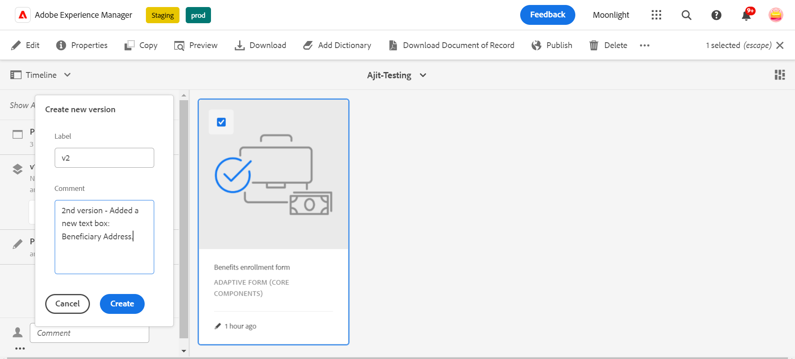

# Contrôle de version, révision et commentaires sur un formulaire adaptatif

<!--Before you can use versionings, comments, and annotations in an Adaptive Form, you must ensure you have [enabled Adaptive Form Core Components](
https://experienceleague.adobe.com/en/docs/experience-manager-cloud-service/content/forms/setup-configure-migrate/enable-adaptive-forms-core-components).-->

<!--Adaptive Form Core Components facilitates to add versionings, comments, and annotations to a form. These features helps form authors and users to enhance the form development process where they can create multiple versions of a form, collaborate and add their comments to a form, and add annotations to form components.-->

Les composants principaux des formulaires adaptatifs fournissent des fonctionnalités qui permettent aux auteurs de formulaires d’incorporer des versions, des commentaires et des annotations dans les formulaires. Ces fonctionnalités permettent de rationaliser le processus de développement de formulaires en permettant aux utilisateurs et aux utilisatrices de créer et de gérer plusieurs versions d’un formulaire, d’engager des discussions collaboratives par le biais de commentaires et de joindre des annotations à des composants de formulaire spécifiques, améliorant ainsi l’expérience globale de création de formulaires.

## Contrôle de version de formulaire adaptatif {#adaptive-form-versioning}

Le contrôle de version des formulaires adaptatifs permet d’ajouter des versions à un formulaire. Les auteurs de formulaires peuvent facilement créer plusieurs versions d’un formulaire et utiliser celle qui convient aux objectifs commerciaux. En outre, les utilisateurs et utilisatrices du formulaire peuvent également rétablir les versions précédentes du formulaire. Il permet également aux créateurs et aux créatrices de comparer deux versions d’un formulaire en les prévisualisant, ce qui leur permet de mieux analyser les formulaires du point de vue de l’interface utilisateur. Examinons en détail chaque fonctionnalité de contrôle de version de formulaire adaptatif :

### Création d’une version de formulaire {#create-a-form-version}

Pour créer une version d’un formulaire, procédez comme suit :

1. Créez un formulaire ou utilisez un formulaire existant.
1. Dans l’interface utilisateur d’AEM, accédez à **[!UICONTROL Formulaire]**>>**[!UICONTROL Forms et documents]** puis sélectionnez votre **Formulaire**.
1. Dans la liste déroulante de sélection du panneau de gauche, sélectionnez **[!UICONTROL Versions]**.
   
1. Cliquez sur les **trois points** situés sur le panneau inférieur gauche, puis sur **[!UICONTROL Enregistrer comme version]**.
1. Maintenant, fournissez un libellé à la version de formulaire. Vous pouvez fournir des informations sur le formulaire par le biais du commentaire.
   

### Mise à jour d’une version de formulaire {#update-a-form-version}

Lorsque vous modifiez et mettez à jour votre formulaire adaptatif, vous ajoutez une nouvelle version au formulaire. Suivez les étapes indiquées dans la dernière section pour attribuer un nom à une nouvelle version du formulaire, comme illustré dans l’image :

### Rétablissement d’une version de formulaire {#revert-a-form-version}

Pour rétablir une version de formulaire à la version précédente, sélectionnez une version de formulaire, puis cliquez sur **[!UICONTROL Rétablir cette version]**.

### Comparer les versions de formulaire {#compare-form-versions}

Les auteurs de formulaires peuvent comparer deux versions différentes d’un formulaire à des fins de prévisualisation. Pour comparer des versions, sélectionnez une version de formulaire et cliquez sur **[!UICONTROL Comparer avec la version actuelle]**. Il affiche deux versions de formulaire différentes en mode Aperçu.

## Ajouter des commentaires {#add-comments}

Une révision est un mécanisme qui permet à un ou plusieurs réviseurs d’ajouter des commentaires sur les formulaires. Tout utilisateur de formulaire peut ajouter des commentaires sur un formulaire ou réviser un formulaire au moyen de commentaires. Pour ajouter un commentaire sur un formulaire, sélectionnez un **[!UICONTROL Formulaire]** et ajoutez un **[!UICONTROL Commentaire]** au formulaire.

>[!NOTE]
> Lorsque vous utilisez des commentaires dans les composants principaux des formulaires adaptatifs comme décrit ci-dessus, la fonctionnalité de formulaire [Création et gestion des révisions des formulaires](/help/forms/create-reviews-forms.md) est désactivée.

## Ajouter des annotations {#adaptive-form-annotations}

Dans de nombreux cas, les utilisateurs et utilisatrices du groupe de formulaires doivent ajouter des annotations à un formulaire à des fins de révision, par exemple, sur un onglet spécifique d’un formulaire ou sur les composants d’un formulaire. Dans ce cas, les auteurs peuvent utiliser des annotations. Pour ajouter des annotations à un formulaire, procédez comme suit :

1. Ouvrez un formulaire en mode **[!UICONTROL Modifier]**.

1. Cliquez sur l’icône **ajouter** située sur le rail supérieur droit, comme indiqué dans l’image.
   

1. Cliquez sur l’icône **ajouter** située dans le rail supérieur gauche, comme illustré dans l’image, pour ajouter l’annotation.
   

1. Vous pouvez maintenant ajouter des commentaires, dessiner des esquisses avec plusieurs couleurs pour former des composants.

1. Pour afficher toutes les annotations ajoutées à un formulaire, sélectionnez le formulaire, et les annotations ajoutées s’affichent dans le panneau de gauche, comme illustré dans l’image.

   

## Voir également {#see-also}

{{see-also}}
