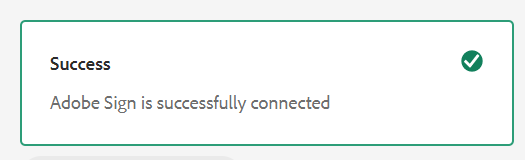

# Connecter [!DNL AEM Forms] as a Cloud Service avec [!DNL Adobe Acrobat Sign] {#integrate-adobe-sign-with-aem-forms}

| Version | Lien de l’article |
| -------- | ---------------------------- |
| AEM 6.5 | [Cliquez ici](https://experienceleague.adobe.com/docs/experience-manager-65/forms/adaptive-forms-advanced-authoring/adobe-sign-integration-adaptive-forms.html#adobe-acrobat-sign-for-government) |
| AEM as a Cloud Service | Cet article |

[!DNL Adobe Acrobat Sign] active des workflows de signature électronique pour les formulaires adaptatifs et les workflows AEM. Les signatures électroniques améliorent les processus de traitement des documents pour les services juridiques, commercial, des ressources humaines, et bien d’autres domaines.

Dans un scénario [!DNL Adobe Acrobat Sign] et de formulaires adaptatifs standard, un utilisateur remplit un formulaire adaptatif pour effectuer une demande de service. Par exemple, un formulaire de demande de carte bancaire et d’allocation. Lorsqu’un utilisateur ou une utilisatrice remplit, envoie et signe le formulaire de demande, le formulaire est envoyé au fournisseur de services pour qu’il effectue d’autres actions. Le prestataire de services passe en revue la demande et utilise [!DNL Adobe Acrobat Sign] pour marquer la demande comme approuvée. AEM Forms prend en charge Adobe Acrobat Sign et Adobe Acrobat Sign Solutions pour le gouvernement. En fonction de votre licence et de vos besoins, vous pouvez intégrer ou connecter AEM Forms à l’une des solutions suivantes :

* [Connecter AEM Forms à Adobe Acrobat Sign](#adobe-sign)
* [Connecter AEM Forms à Adobe Acrobat Sign Solutions pour le gouvernement](#adobe-acrobat-sign-for-government)

## Connecter AEM Forms à Adobe Acrobat Sign {#adobe-sign}

Pour connecter **[!DNL AEM Forms]** à **[!DNL Adobe Acrobat Sign]**, configurez le logiciel et les comptes répertoriés dans la section des conditions préalables et configurez Adobe Sign Cloud Service dans vos instances de création et de publication Forms as a Cloud Service

### Conditions préalables à la connexion d’AEM Forms à Adobe Acrobat Sign {#prerequisites-for-adobe-sign}

Vous avez besoin de la configuration suivante pour intégrer [!DNL Adobe Acrobat Sign] à [!DNL AEM Forms] :

1. Un compte de développeur [Adobe Acrobat Sign actif.](https://www.adobe.com/acrobat/business/developer-form.html)
1. Une [application API Adobe Acrobat Sign](https://www.adobe.io/apis/documentcloud/sign/docs.html#!adobedocs/adobe-sign/master/gstarted/create_app.md).
1. Les informations d’identification (ID client et clé secrète client) de l’application API [!DNL Adobe Acrobat Sign].
1. (Uniquement pour l’authentification basée sur l’ID du gouvernement) [Activez la méthode d’authentification](https://helpx.adobe.com/fr/sign/using/adobesign-authentication-government-id.html#AuditReport) pour l’authentification de l’ID du gouvernement.

### Connecter les instances de création et de publication AEM Forms à Adobe Acrobat Sign {#configure-adobe-sign-with-aem-forms}

Une fois les prérequis réunis, procédez comme suit pour configurer [!DNL Adobe Acrobat Sign] avec [!DNL AEM Forms] sur les instances d’auteur.

1. Dans l’instance de création AEM Forms, accédez à **[!UICONTROL Outils]**  > **[!UICONTROL Général]** > **[!UICONTROL Navigateur de configuration]**.
1. Sur la page du **[!UICONTROL navigateur de configuration]**, sélectionnez **[!UICONTROL Créer]**.
1. Dans la boîte de dialogue **[!UICONTROL Créer une configuration]**, indiquez un **[!UICONTROL titre]** pour la configuration, activez **[!UICONTROL Configurations cloud]** et sélectionnez **[!UICONTROL Créer]**. Un conteneur de configurations pour Cloud Services est ainsi créé. Vérifiez que le nom du dossier ne contient aucun espace.
1. Accédez à **[!UICONTROL Outils]**  > **[!UICONTROL Services cloud]** > **[!UICONTROL Adobe Sign]** et ouvrez le conteneur de configurations que vous avez créé à l’étape précédente.

   >[!NOTE]
   >
   >Lorsque vous créez un formulaire adaptatif, indiquez le nom du conteneur dans le champ **[!UICONTROL Conteneur de configurations]**.

1. Sur la page de configuration, sélectionnez **[!UICONTROL Créer]** pour créer une configuration [!DNL Adobe Acrobat Sign] dans AEM Forms.
1. Dans l’onglet **[!UICONTROL Général]** de la page **[!UICONTROL Créer une configuration Adobe Acrobat Sign]**, spécifiez un **[!UICONTROL Nom]** pour la configuration, puis sélectionnez **[!UICONTROL Suivant]**. Vous avez la possibilité d’indiquer un **[!UICONTROL titre]** et de rechercher et sélectionner une **[!UICONTROL vignette]** pour la configuration.

1. Maintenant, vous pouvez **[!UICONTROL sélectionner une solution]** pour sélectionner [!DNL Adobe Acrobat Sign].

   <!---->
   

<!--

[create URL](#create-a-redirect-url-for-your-aem-instance)
 -->

1. Copiez l’URL présente dans la fenêtre de votre navigateur actuel dans un bloc-notes et supprimez la partie `/ui#/aem` de l’URL. L’URL modifiée est nécessaire pour configurer l’application [!DNL Adobe Acrobat Sign] avec [!DNL AEM Forms] à une étape ultérieure. Sélectionnez **[!UICONTROL Suivant]**.

1. Dans l’onglet **[!UICONTROL Paramètres]**,
   * le champ **[!UICONTROL URL OAuth]** contient l’URL par défaut qui inclut le partitionnement de base de données Adobe Sign. Le format de l’URL est:

     `https://<shard>/public/oauth/v2`

     Par exemple :
     `https://secure.na1.echosign.com/public/oauth/v2`

   * le champ **[!UICONTROL URL du jeton d’accès]** contient l’URL par défaut qui inclut le partitionnement de base de données Adobe Sign. Le format de l’URL est:

     `https://<shard>/oauth/v2/token`

     Par exemple :
     `https://api.na1.echosign.com/oauth/v2/token`

   où :

   **na1** fait référence au partitionnement de base de données par défaut. Vous pouvez modifier la valeur du partitionnement de base de données. Assurez-vous que les configurations cloud de [!DNL &#x200B; Adobe Acrobat Sign] pointent vers le [fragment correct](https://helpx.adobe.com/fr/sign/using/identify-account-shard.html).

   >[!NOTE]
   >
   >* Gardez la page **Créer une configuration Adobe Sign** ouverte. Ne la fermez pas. Vous pouvez récupérer l’**ID client** et le **secret client** après la configuration des paramètres OAuth pour l’application [!DNL Adobe Acrobat Sign] comme décrit dans les étapes à venir.
   > * Après votre connexion à votre compte Adobe Sign, accédez à **[!UICONTROL API Acrobat Sign]** > **[!UICONTROL Informations sur l’API]** > **[!UICONTROL Documentation sur les méthodes d’API REST]** > **[!UICONTROL Jeton d’accès OAuth]** pour accéder aux informations relatives à l’URL OAuth d’Adobe Sign et à l’URL du jeton d’accès.

1. Configurez les paramètres OAuth pour l’application [!DNL Adobe Acrobat Sign] :

   1. Ouvrez une fenêtre de navigateur et connectez-vous au compte de développeur [!DNL Adobe Acrobat Sign].
   1. Sélectionnez l’application configurée pour [!DNL AEM Forms], puis sélectionnez **[!UICONTROL Configurer OAuth pour l’application]**.
   1. Dans la zone **[!UICONTROL URL de redirection]**, ajoutez l’URL copiée à l’étape précédente (étape 8) et cliquez sur **[!UICONTROL Enregistrer]**.
   1. Activez la Portée suivante pour l’application [!DNL Adobe Acrobat Sign] et cliquez sur **[!UICONTROL Enregistrer]**.

   * [!DNL aggrement_read]
   * [!DNL aggrement_write]
   * [!DNL aggrement_send]
   * [!DNL widget_read]
   * [!DNL widget_write]
   * [!DNL workflow_read]

   >[!NOTE]
   > Vous pouvez modifier les portées de `self` à `account` directement à partir de l’interface utilisateur d’AEM, comme indiqué à l’étape 12.

   Pour obtenir des informations détaillées sur la configuration des paramètres OAuth pour une application [!DNL Adobe Acrobat Sign] et l’obtention des clés, voir [Configurer les paramètres oAuth pour l’application](https://www.adobe.io/apis/documentcloud/sign/docs.html#!adobedocs/adobe-sign/master/gstarted/configure_oauth.md) dans la documentation du développeur.

   

1. Revenez à la page **[!UICONTROL Créer une configuration Adobe Acrobat Sign]**. Dans l’onglet **[!UICONTROL Paramètres]**, spécifiez l’[**[!UICONTROL ID client]** (également appelé ID de l’application) et le **[!UICONTROL Secret client]**]. Utilisez l’[ID client et le secret client de l’application Adobe Acrobat Sign](https://opensource.adobe.com/acrobat-sign/developer_guide/helloworld.html#get-the-app-id-and-secret) que vous avez créés à l’étape précédente.

1. Dans la section [!UICONTROL &#x200B; Portée de l’autorisation &#x200B;], vous pouvez modifier les portées en « compte » ou « self » en ajoutant le préfixe « self » ou « account » aux portées, si nécessaire.
   

1. Sélectionnez l’option **[!UICONTROL Activer Adobe Acrobat Sign pour les pièces jointes]** pour ajouter les fichiers joints à un formulaire adaptatif au document [!DNL Adobe Acrobat Sign] correspondant envoyé à des fins de signature.

1. Sélectionnez **[!UICONTROL Connexion à Adobe Acrobat Sign]**. Lorsque vous devez fournir vos informations d’identification, indiquez le **nom d’utilisateur** et le **mot de passe** du compte utilisé lors de la création de l’application [!DNL Adobe Acrobat Sign]. Lorsque vous devez confirmer l’accès à `your developer account`, cliquez sur **[!UICONTROL Autoriser l’accès]**. Si les informations d’identification sont correctes et que vous autorisez [!DNL AEM Forms] à accéder à votre compte de développement [!DNL Adobe Acrobat Sign], un message, semblable à celui ci-dessous, s’affiche pour vous notifier le succès de l’opération.

   

1. Sélectionnez **[!UICONTROL Créer]** pour créer la configuration [!DNL Adobe Acrobat Sign].

1. Sélectionnez la configuration, cliquez sur **[!UICONTROL Publier]**, sélectionnez la configuration, puis cliquez sur **[!UICONTROL Publier]**. La configuration sera ainsi répliquée sur les environnements de publication correspondants.

1. Répétez toutes les étapes ci-dessus sur vos instances de développement, d’évaluation ou de production (toutes celles non encore configurées) pour terminer la configuration d’[!DNL Adobe Acrobat Sign] avec [!DNL AEM Forms] pour votre environnement.

Vous pouvez maintenant [utiliser l’ajout de champs Adobe Acrobat Sign à un formulaire adaptatif](working-with-adobe-sign.md). Veillez à ajouter le conteneur de configurations utilisé pour Cloud Service à tous les formulaires adaptatifs activés pour [!DNL Adobe Acrobat Sign]. Vous pouvez spécifier un conteneur de configurations à partir des propriétés d’un formulaire adaptatif.

>[!NOTE]
>
> Pour configurer le sandbox Adobe Sign, vous pouvez suivre les mêmes étapes de configuration que celles décrites dans [Adobe Sign](#adobe-sign).

#### Résolution des problèmes {#resolve-config-error}

Lorsque vous vous connectez [!DNL Adobe Acrobat Sign] à [!DNL AEM Forms] et trouvez un `Unable to authorize access because the client configuration is invalid: invalid_request` d’erreur, comme illustré dans l’image ci-dessous. Pour résoudre ce problème, procédez comme suit :


1. Copiez l’URL présente dans la fenêtre active du navigateur dans un bloc-notes et supprimez la partie `/ui#/aem` de l’URL.
1. Ouvrez une fenêtre de navigateur et connectez-vous au compte de développeur [!DNL Adobe Acrobat Sign].
1. Sélectionnez l’application configurée pour [!DNL AEM Forms], puis sélectionnez **[!UICONTROL Configurer OAuth pour l’application]**.
1. Dans la zone **[!UICONTROL URL de redirection]**, ajoutez l’URL copiée à l’étape précédente et cliquez sur **[!UICONTROL Enregistrer]**.

## Connecter AEM Forms à Adobe Acrobat Sign Solutions pour le gouvernement {#adobe-acrobat-sign-for-government}

La connexion d’AEM Forms à Adobe Acrobat Sign Solutions pour le gouvernement est un processus en plusieurs étapes. Ce processus implique :

* la création de l’URL de redirection pour vos instances AEM ;
* le partage de l’URL de redirection et des champs d’application avec l’équipe Adobe Sign Solutions pour le gouvernement ;
* la réception des informations d’identification de l’équipe Adobe Sign ;
* l’utilisation des informations d’identification reçues pour connecter AEM Forms à Adobe Acrobat Sign Solutions pour le gouvernement


AEM Forms as a Cloud Service fournit des environnements de développement, d’évaluation et de production. Vous pouvez commencer par connecter votre environnement de développement avec Adobe Acrobat Sign Solutions pour le gouvernement et connecter ultérieurement les environnements d’évaluation et de production.

### Avant de commencer {#prerequisites-for-adobe-sign-for-acrobat-sign-for-government}

Avant de commencer à connecter AEM Forms à la solution Adobe Acrobat Sign, assurez-vous que le compte [Adobe Acrobat Sign Solutions pour le gouvernement](https://opensource.adobe.com/acrobat-sign/signgov/gstarted.html#account-provisioning) est configuré.


### Connecter AEM Forms as a Cloud Service à Adobe Acrobat Sign Solutions pour le gouvernement {#connect-adobe-acrobat-sign-for-government}

#### Créer une URL de redirection pour votre instance AEM

1. Sur l’instance de création Forms as a Cloud Service, accédez à **[!UICONTROL Outils]**  > **[!UICONTROL Général]** > **[!UICONTROL Explorateur de configurations]**.
1. Dans la page **[!UICONTROL Navigateur de configuration]**, sélectionnez **[!UICONTROL Créer]**.
1. Dans la boîte de dialogue **[!UICONTROL Créer une configuration]**, indiquez un **[!UICONTROL titre]** pour la configuration, activez **[!UICONTROL Configurations du cloud]** et choisissez **[!UICONTROL Créer]**. Un conteneur de configurations pour stocker Cloud Services est ainsi créé. Vérifiez que le nom du dossier ne contient aucun espace.
1. Accédez à **[!UICONTROL Outils]**  > **[!UICONTROL Services cloud]** > **[!UICONTROL Adobe Acrobat Sign]** et ouvrez le conteneur de configurations que vous avez créé à l’étape précédente. Lorsque vous créez un formulaire adaptatif, indiquez le nom du conteneur dans le champ **[!UICONTROL Conteneur de configurations]**.
1. Sur la page de configuration, sélectionnez **[!UICONTROL Créer]** pour créer une configuration [!DNL Adobe Acrobat Sign] dans AEM Forms.
1. Copiez l’URL de votre fenêtre de navigateur actuelle dans un bloc-notes et supprimez `/ui#/aem` de l’URL. Cette URL est appelée `re-direct URL`.
Dans la section suivante, partagez l’`re-direct URL` et les `Scopes` avec l’équipe Adobe Sign et demandez des informations d’identification (identifiant client et secret client).

#### Partager l’URL de redirection et les champs d’application avec l’équipe Adobe Sign et recevoir des informations d’identification

L’équipe Adobe Acrobat Sign Solutions pour le gouvernement exige que l’`re-direct URL` et certains champs d’application soient activés pour votre application Adobe Acrobat Sign (répertoriés ci-dessous) afin de générer les informations d’identification (identifiant client et secret client) qui vous permettent de connecter AEM Forms à Adobe Acrobat Sign Solutions pour le gouvernement.

Partagez les `scopes` (répertoriés ci-dessous) et la `re-direct URL`, créés et notés à la dernière étape de la section précédente, avec votre personne représentante d’Adobe Acrobat Sign Solution pour le gouvernement ([membre de l’équipe Adobe Professional Services](https://opensource.adobe.com/acrobat-sign/signgov/gstarted.html#password)).

**_Portées_**

* [!DNL aggrement_read]
* [!DNL aggrement_write]
* [!DNL aggrement_send]
* [!DNL widget_read]
* [!DNL widget_write]
* [!DNL workflow_read]
* [!DNL offline_access]

La personne représentante génère et partage alors les informations d’identification avec vous. Dans la section suivante, utilisez les informations d’identification (identifiant client et secret client) pour connecter AEM Forms à Adobe Acrobat Sign Solutions pour le gouvernement.

#### Utiliser des informations d’identification reçues pour connecter AEM Forms à Adobe Acrobat Sign Solutions pour le gouvernement

1. Ouvrez l’`re-direct URL` dans votre navigateur. Vous avez créé et noté l’`re-direct URL` dans la dernière étape de la section de [création d’une URL de redirection sur votre instance AEM](#create-a-redirect-url-for-your-aem-instance).

1. Dans l’onglet **[!UICONTROL Général]** de la page **[!UICONTROL Créer une configuration Adobe Sign]**, spécifiez un **[!UICONTROL nom]** de configuration et sélectionnez **[!UICONTROL Suivant]**. Vous avez la possibilité d’indiquer un **[!UICONTROL titre]** et de rechercher et sélectionner une **[!UICONTROL vignette]** pour la configuration. Cliquez sur **[!UICONTROL Suivant]**.

1. Dans l’onglet **[!UICONTROL Paramètres]** de la page **[!UICONTROL Créer une configuration Adobe Sign]**, pour l’option **[!UICONTROL Sélectionner une solution]**, sélectionnez [!DNL Adobe Acrobat Sign Solutions for Government].


   

1. Dans le champ **[!UICONTROL E-mail]**, indiquez l’adresse e-mail associée à votre compte Adobe Acrobat Sign Solutions pour le gouvernement.

1. Dans l’onglet **[!UICONTROL Paramètres]**,
   * le champ **[!UICONTROL URL OAuth]** contient l’URL par défaut qui inclut le partitionnement de base de données Adobe Sign. Le format de l’URL est:

     `https://<shard>/api/gateway/adobesignauthservice/api/v1/authorize`

     Par exemple :
     `https://secure.na1.adobesign.us/api/gateway/adobesignauthservice/api/v1/authorize`

   * le champ **[!UICONTROL URL du jeton d’accès]** contient l’URL par défaut qui inclut le partitionnement de base de données Adobe Sign. Le format de l’URL est:

     `https://<shard>/api/gateway/adobesignauthservice/api/v1/token`

     Par exemple :
     `https://secure.na1.adobesign.us/api/gateway/adobesignauthservice/api/v1/token`

   où :

   **na1** fait référence au partitionnement de base de données par défaut. Vous pouvez modifier la valeur du partitionnement de base de données. Assurez-vous que les configurations cloud de [!DNL &#x200B; Adobe Acrobat Sign] pointent vers le [fragment correct](https://helpx.adobe.com/fr/sign/using/identify-account-shard.html).

   >[!NOTE]
   >
   > * Après vous être connecté à votre compte Adobe Sign, accédez à **[!UICONTROL API Acrobat Sign]** > **[!UICONTROL Informations sur l’API]** > **[!UICONTROL Documentation sur les méthodes de l’API REST]** > **[!UICONTROL Jeton d’accès OAuth]** pour accéder aux informations relatives à l’URL oAuth d’Adobe Sign et à l’URL du jeton d’accès.

1. Utilisez les informations d’identification partagées par le représentant ou la représentante Adobe Acrobat Sign Solutions pour le gouvernement ([membre de l’équipe Adobe Professional Services]) dans la section précédente en tant que [**[!UICONTROL ID client]** et **[!UICONTROL Secret client]**].

1. Sélectionnez l’option **[!UICONTROL Activer Adobe Acrobat Sign pour les pièces jointes]** pour ajouter les fichiers joints à un formulaire adaptatif au document [!DNL Adobe Acrobat Sign] correspondant envoyé à des fins de signature.

1. Sélectionnez **[!UICONTROL Se connecter à Adobe Sign]**. Lorsqu’il vous est demandé de fournir vos informations d’identification, indiquez le nom d’utilisateur et le mot de passe du compte utilisé lors de la création de l’application [!DNL Adobe Acrobat Sign]. Lorsque vous êtes invité à confirmer l’accès à `your developer account`, cliquez sur **[!UICONTROL Autoriser l’accès]**. Si les informations d’identification sont correctes et que vous autorisez [!DNL AEM Forms] à accéder à votre compte de développement [!DNL Adobe Acrobat Sign], un message, semblable à celui ci-dessous, s’affiche pour vous notifier le succès de l’opération.

   

   <!-- 
      > When prompted for credentials, provide username and password of the account used while creating [!DNL Adobe Acrobat Sign] application. When asked to confirm access for `your developer account`, Click **[!UICONTROL Allow Access]**. 
      -->

1. Sélectionnez **[!UICONTROL Créer]** pour créer la configuration.

1. Sélectionnez la configuration, cliquez sur **[!UICONTROL Publier]**, sélectionnez la configuration, puis cliquez sur **[!UICONTROL Publier]**. La configuration est ainsi répliquée sur les environnements de publication correspondants.

1. Répétez toutes les étapes ci-dessus sur vos instances de développement, d’évaluation ou de production (toutes celles non encore configurées) pour terminer la configuration d’[!DNL Adobe Acrobat Sign Solutions for Government] avec [!DNL AEM Forms] pour votre environnement.

Vous pouvez maintenant [utiliser l’ajout de champs Adobe Acrobat Sign dans un formulaire adaptatif](working-with-adobe-sign.md) ou dans un [workflow AEM](/help/forms/aem-forms-workflow-step-reference.md#sign-document-step-sign-document-step). Veillez à ajouter le conteneur de configurations utilisé pour la configuration du service cloud à tous les formulaires adaptatifs activés pour [!DNL Adobe Acrobat Sign]. Vous pouvez spécifier un conteneur de configurations à partir des propriétés d’un formulaire adaptatif.

## Configurer le planificateur [!DNL Adobe Acrobat Sign] pour synchroniser l’état de signature {#configure-adobe-sign-scheduler-to-sync-the-signing-status}

AEM Forms as a Cloud Service fournit un service de planificateur qui vérifie le statut des signataires à des intervalles définis. Scénarios dans lesquels vous configurez le service Planificateur :

* Si vous utilisez [Envoyer le formulaire (une fois que chaque destinataire a terminé la cérémonie de signature)](/help/forms/working-with-adobe-sign.md#select-adobe-sign-cloud-service-and-signing-order) pour signer un document, le formulaire n’est envoyé qu’une fois que tous les signataires ont signé le formulaire.
* Si vous utilisez l’étape [Signature dans un workflow AEM](/help/forms/aem-forms-workflow-step-reference.md#sign-document-step) pour signer un document, l’étape de signature attend que tous les signataires signent le document, avant de passer à l’étape suivante du workflow.

Par défaut, les services de Planificateur [!DNL Adobe Acrobat Sign] vérifient la réponse du signataire (sondages) toutes les 24 heures. Vous pouvez modifier l’intervalle par défaut pour votre environnement.

Pour modifier l’intervalle par défaut, spécifiez une [expression cron](https://en.wikipedia.org/wiki/Cron#CRON_expression) pour la propriété **sign.status.exp** de la configuration **Service de configuration Adobe Sign**.

Par exemple, pour exécuter le service de configuration tous les jours à :00 heures, définissez la propriété **sign.status.exp** de la configuration **Service de configuration Adobe Acrobat Sign** pour spécifier `0 0 0 1/1 * ? *`. Le fichier JSON suivant affiche l’exemple d’exécution du service de configuration tous les jours à :00 heures :

```json
{
  "sign.status.exp":"0 0 0 1/1 * ? *"
}
```

Pour définir les valeurs d’une configuration, [générez des configurations OSGi à l’aide du SDK AEM](https://experienceleague.adobe.com/docs/experience-manager-cloud-service/implementing/deploying/configuring-osgi.html?lang=fr#generating-osgi-configurations-using-the-aem-sdk-quickstart) et [déployez la configuration](https://experienceleague.adobe.com/docs/experience-manager-cloud-service/implementing/using-cloud-manager/deploy-code.html?lang=fr#deployment-process) sur votre instance de Cloud Service.

## Questions fréquentes

* **Q : Puis-je effectuer le rendu de la page de signature Adobe Sign GovCloud dans un iframe ?**
* **A :** Oui, vous pouvez effectuer le rendu de la page de signature Adobe Sign GovCloud dans un iframe.

>[!MORELIKETHIS]
>
>* [Signer électroniquement un formulaire à l’aide de signatures tactiles](/help/forms/signing-forms-using-scribble.md)
>* [Recommandations relatives à l’utilisation d’Adobe Acrobat Sign avec des formulaires adaptatifs](https://medium.com/adobetech/using-adobe-sign-to-e-sign-an-adaptive-form-heres-the-best-way-to-do-it-dc3e15f9b684)
