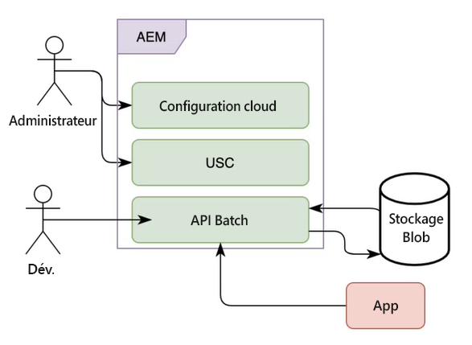

# Traitement par lots des communications AEM Forms as a Cloud Service

Communications vous permet de créer, d’assembler et de diffuser des communications personnalisées et axées sur la marque. Il peut notamment s’agir de correspondances commerciales, de documents, de relevés, de lettres de traitement des demandes, d’avis de prestations, de factures mensuelles et de kits de bienvenue. Vous pouvez utiliser les API Communications pour combiner un modèle (XFA ou PDF) avec des données client afin de générer des documents aux formats PDF, PS, PCL, DPL, IPL et ZPL.

La fonctionnalité Communications fournit des API pour la génération de documents planifiés et à la demande. Vous pouvez utiliser des API synchrones pour les API à la demande et Batch (API asynchrones) concernant la génération de documents planifiés :

* Les API synchrones sont adaptées aux cas d’utilisation de génération de documents à la demande, à faible latence et pour un enregistrement unique. Ces API sont plus adaptées aux cas d’utilisation basés sur une action de l’utilisateur. Il peut s’agir, par exemple, de la génération d’un document après qu’un utilisateur a rempli un formulaire.

* Les API Batch (API asynchrones) conviennent pour la génération planifiée à débit élevé de documents multiples. Ces API génèrent des documents par lots. Il peut s’agir, par exemple, de factures de téléphone, de relevés de carte de crédit et de relevés de prestations générés tous les mois.

<!-- The following skills are required to create templates and use HTTP APIs: 

* Understanding of Adobe Forms Designer or Acrobat Forms to create templates

* Understanding of HTTP APIs and experience of using HTTP APIs

* Basic understanding of Adobe Experience Manager -->

## Opérations par lots {#batch-operations}

Une opération par lots est un processus de génération à intervalles planifiés de plusieurs documents de type similaire pour un ensemble d’enregistrements. Une opération par lots comporte deux parties : configuration (définition) et exécution.

* **Configuration (définition)** : une configuration de lot stocke des informations sur les différentes ressources et propriétés à définir pour les documents générés. Par exemple, elle fournit des détails sur le modèle XDP ou et l’emplacement des données client à utiliser, ainsi que la spécification de différentes propriétés pour les documents PDF en sortie.

* **Exécution** : pour démarrer une opération par lots, transmettez le nom de la configuration de lot à l’API d’exécution par lots.

### Composants d’une opération par lots {#components-of-a-batch-operations}

**Configuration du cloud** : la configuration d’Experience Manager Cloud vous permet de connecter une instance Experience Manager au stockage Microsoft Azure détenu par le client. Il vous permet de spécifier les informations d’identification du compte Microsoft Azure détenu par le client pour vous y connecter.

**Configuration de l’entrepôt de données par lots (USC)** : la configuration des données par lots permet de configurer une instance spécifique de stockage Blob pour les API Batch. Il vous permet de spécifier les emplacements d’entrée et de sortie dans le stockage Azure Blob de Microsoft détenu par le client.

**API par lot** : vous permet de créer des configurations de lot et d’exécuter les exécutions de lot en fonction de ces configurations afin de fusionner un PDF ou un modèle XDP avec des données et générer une sortie aux formats PDF, PS, PCL, DPL, IPL et ZPL. Les communications fournissent des API par lots pour la gestion de la configuration et l’exécution des lots.

**Stockage** : les API Communications utilisent le stockage Microsoft Azure Cloud détenu par le client pour récupérer les enregistrements client et stocker les documents générés. Vous configurez le stockage Azure Microsoft dans la configuration Experience Manager Cloud Service.

**Application** : votre application personnalisée pour utiliser les API Batch en vue de générer des documents et de les utiliser.

## Génération de plusieurs documents à l’aide d’opérations par lots {#generate-multiple-documents-using-batch-operations}

Vous pouvez utiliser des opérations par lots pour générer plusieurs documents selon des intervalles planifiés.

>[!VIDEO](https://video.tv.adobe.com/v/338349)

Pour savoir comment générer des documents à l’aide d’opérations par lots, vous pouvez regarder la vidéo ou suivre les instructions ci-dessous. La documentation de référence sur les API, en vidéo, est disponible au format .yaml. Vous pouvez télécharger le fichier des [API Batch](assets/batch-api.yaml) et le charger dans Postman pour vérifier les fonctionnalités des API et suivre la vidéo.

### Conditions préalables {#pre-requisites}

Pour utiliser l’API Batch, les éléments suivants sont requis :

* [Compte de stockage Microsoft Azure](https://docs.microsoft.com/fr-fr/azure/storage/common/storage-account-create)
* Modèles PDF ou XDP
* [Données à fusionner avec des modèles](#form-data)
* Utilisateurs disposant des privilèges d’administrateur Experience Manager

### Configuration de votre environnement {#setup-your-environment}

Avant d’utiliser une opération par lots :

* Chargez les données client (fichiers XML) dans le stockage Blob Microsoft Azure.
* Créer une configuration de cloud
* Créer une configuration d’entrepôt de données par lots
* Chargez les modèles et d’autres ressources vers votre instance Experience Manager Forms Cloud Service.

### Chargement des données client (fichiers XML) dans le stockage Azure

Sur votre stockage Microsoft Azure, créez des [conteneurs](https://docs.microsoft.com/fr-fr/azure/vs-azure-tools-storage-explorer-blobs) et [chargez des données client (XML)](https://docs.microsoft.com/fr-fr/azure/vs-azure-tools-storage-explorer-blobs#managing-blobs-in-a-blob-container) dans les [dossiers](https://docs.microsoft.com/fr-fr/azure/storage/blobs/storage-quickstart-blobs-portal) situés à l’intérieur des conteneurs.

>[!NOTE]
>
>Vous pouvez configurer le stockage Microsoft Azure pour nettoyer automatiquement le dossier d’entrée ou déplacer le contenu du dossier de sortie vers un autre emplacement à des intervalles planifiés. Veillez toutefois à ce que les dossiers ne soient pas nettoyés lorsqu’une opération de lot référençant les dossiers est toujours en cours d’exécution.

### Créer une configuration de cloud {#create-a-cloud-configuration}

La configuration de cloud connecte votre instance d’Experience Manager au stockage Microsoft Azure. Pour créer une configuration de cloud :

1. Accédez à Outils > Cloud Services > Stockage Azure
1. Ouvrez un dossier pour héberger la configuration, puis cliquez sur Créer. Utilisez le dossier Global ou créez un dossier.
1. Indiquez le nom de la configuration et les informations d’identification pour vous connecter au service. Vous pouvez [récupérer ces informations d’identification à partir de votre portail de stockage Microsoft Azure](https://docs.microsoft.com/fr-fr/azure/storage/common/storage-account-keys-manage?tabs=azure-portal#view-account-access-keys).
1. Cliquez sur Créer.

Votre instance d’Experience Manager est maintenant prête à se connecter au stockage Microsoft Azure et à l’utiliser pour stocker et lire le contenu, le cas échéant.

### Créer une configuration d’entrepôt de données par lots {#create-batch-data-store-configuration}

La configuration des données par lots permet de configurer des conteneurs et des dossiers pour l’entrée et la sortie. Vous conservez les enregistrements de vos clients dans le dossier source et les documents générés sont placés dans le dossier de destination.

Pour créer la configuration :

1. Accédez à Outils > Formulaires > Connecteur de stockage unifié.
1. Ouvrez un dossier pour héberger la configuration, puis cliquez sur Créer. Utilisez le dossier Global ou créez un dossier.
1. Remplissez les champs Titre et Nom de la configuration. Pour le stockage, sélectionnez Stockage Microsoft Azure.
1. Dans le Chemin de la configuration de stockage, parcourez et sélectionnez la configuration du cloud qui contient les informations d’identification du compte de stockage Azure détenu par le client.
1. Dans le dossier source, indiquez le nom du conteneur de stockage Azure et du dossier contenant les enregistrements.
1. Pour le dossier de destination, spécifiez le chemin d’accès du conteneur de stockage Azure et du dossier servant à stocker les documents générés.
1. Cliquez sur Créer.

Votre instance Experience Manager est maintenant connectée au stockage Microsoft Azure et configurée pour récupérer et envoyer des données à des emplacements spécifiques du stockage Microsoft Azure.

### Chargement de modèles et d’autres ressources vers votre instance Experience Manager {#upload-templates-and-other-assets-to-your-AEM-instance}

Une entreprise possède généralement différents modèles. Par exemple, un modèle pour les relevés de carte de crédit, les relevés de prestations et les réclamations. Chargez tous ces modèles XDP et PDF vers votre instance Experience Manager. Pour charger un modèle :

1. Ouvrez votre instance Experience Manager.
1. Accédez à Formulaires > Formulaires et documents
1. Cliquez sur Créer > Dossier et créez un dossier. Ouvrez le dossier.
1. Cliquez sur Créer > Téléchargement de fichier et chargez les modèles.

## Utilisation de l’API Batch pour générer des documents {#use-batch-API-to-generate-documents}

Pour utiliser une API de lot, créez une configuration de lot et exécutez une exécution basée sur cette configuration. La documentation de l’API fournit des informations sur les API servant à créer et exécuter un lot, les paramètres correspondants et les erreurs possibles. Vous pouvez télécharger le [fichier de définition d’API](assets/batch-api.yaml) et le chargez dans [Postman](https://go.postman.co/home) ou un logiciel similaire permettant de tester les API pour créer et exécuter une opération par lots.

### Création d’un lot {#create-a-batch}

Pour créer un lot, utilisez l’API `POST /config`. Insérez les propriétés obligatoires suivantes dans le corps de la requête HTTP :

* **configName** : spécifiez le nom unique du lot. Par exemple, `wknd-job`
* **dataSourceConfigUri** : spécifiez l’emplacement de la configuration de l’entrepôt de données par lots. Il peut s’agir du chemin relatif ou absolu de la configuration. Par exemple : `/conf/global/settings/forms/usc/batch/wknd-batch`
* **outputTypes** : spécifiez les formats de sortie : PDF et PRINT. Si vous utilisez le type de sortie IMPRESSION, dans la propriété `printedOutputOptionsList`, spécifiez au moins une option d’impression. Les options d’impression sont identifiées par leur type de rendu. Par conséquent, à l’heure actuelle, plusieurs options d’impression avec le même type de rendu ne sont pas autorisées. Les formats pris en charge sont PS, PCL, DPL, IPL et ZPL.

* **modèle** : spécifiez le chemin d’accès absolu ou relatif du modèle. Par exemple, `crx:///content/dam/formsanddocuments/wknd/statements.xdp`

Si vous spécifiez un chemin relatif, fournissez également une racine de contenu. Pour plus d’informations sur la racine du contenu, voir la documentation de l’API.

<!-- For example, you include the following JSON in the body of HTTP APIs to create a batch named wknd-job: -->

Vous pouvez utiliser `GET /config /[configName]` pour afficher les détails de la configuration du lot.

### Exécution d’un lot {#run-a-batch}

Pour exécuter un lot, utilisez `POST /config /[configName]/execution`. Par exemple, pour exécuter un lot nommé wknd-demo, utilisez /config/wknd-demo/execution. Le serveur renvoie le code de réponse HTTP 202 lors de l’acceptation de la requête. L’API ne renvoie aucune payload, à l’exception d’un code unique (execution-identifier) dans l’en-tête de la réponse HTTP pour le traitement par lots exécutée sur le serveur. Vous pouvez utiliser execution-identifier afin de récupérer l’état du lot.

>[!NOTE]
>
>Pendant l’exécution du lot, n’apportez aucune modification aux dossiers source et de destination correspondants, à la configuration de la source de données ni à la configuration Microsoft Azure Cloud.

### Vérification de l’état d’un lot {#status-of-a-batch}

Pour récupérer l’état d’un lot, utilisez `GET /config /[configName]/execution/[execution-identifier]`. execution-identifier est inclus dans l’en-tête de la réponse HTTP pour la demande d’exécution par lots.

La réponse de la demande d’état contient la section d’état. Elle fournit des détails sur l’état de la tâche par lots, le nombre d’enregistrements déjà dans le pipeline (déjà lus et en cours de traitement) et le statut de chaque outputType/renderType (nombre d’éléments en cours, réussis et en échec). Le statut inclut également les heures de début et de fin de la tâche par lots, ainsi que des informations sur les erreurs, le cas échéant. L’heure de fin est -1 jusqu’à ce que l’exécution du lot soit réellement terminée.

>[!NOTE]
>
>* Lorsque vous demandez plusieurs formats d’impression, l’état contient plusieurs entrées. Par exemple, PRINT/ZPL, PRINT/IPL.
>* Un traitement par lots ne lit pas tous les enregistrements simultanément, mais continue à lire et à incrémenter le nombre d’enregistrements. Par conséquent, le statut est -1 jusqu’à ce que tous les enregistrements aient été lus.

### Affichage des documents générés {#view-generated-documents}

Une fois la tâche terminée, les documents générés sont stockés dans le dossier `success`, à l’emplacement de destination spécifié dans la configuration de l’entrepôt de données par lots. En cas d’erreur, le service crée un dossier `failure`. Il fournit des informations sur le type et la raison des erreurs.

Comprenons à l’aide d’un exemple : supposons qu’il existe un fichier de données d’entrée `record1.xml` et deux types de sortie : `PDF` et `PCL`. L’emplacement de destination contient alors deux sous-dossiers `pdf` et `pcl`, un pour chacun des types de sortie. Supposons que la génération du PDF ait réussi, alors le sous-dossier `pdf` contient le sous-dossier `success` qui contient à son tour le document PDF `record1.pdf`. Supposons que la génération PCL ait échoué, alors le sous-dossier `pcl` contient un sous-dossier `failure` qui contient à son tour un fichier d’erreur `record1.error.txt` qui contient les détails de l’erreur. En outre, l’emplacement de destination contient un dossier temporaire appelé `__tmp__` qui contient certains fichiers requis lors de l’exécution du lot. Ce dossier peut être supprimé lorsqu’il n’existe aucune exécution par lots active faisant référence au dossier de destination.

>[!NOTE]
>
>Le traitement d’un lot peut prendre un certain temps en fonction du nombre d’enregistrements en entrée et de la complexité du modèle. Patientez quelques minutes avant de vérifier si les dossiers de destination contiennent les fichiers de sortie.

## Documentation de référence sur les API

La documentation de référence sur les API fournit des informations détaillées sur tous les paramètres, les méthodes d’authentification et les différents services fournis par les API. La documentation de référence sur les API est également disponible au format .yaml. Vous pouvez télécharger le fichier des [API Batch](assets/batch-api.yaml) et le charger dans Postman pour vérifier les fonctionnalités des API.

>[!MORELIKETHIS]
>
>* [Présentation des communications AEM Forms as a Cloud Service](/help/forms/aem-forms-cloud-service-communications-introduction.md)
>* [Architecture AEM Forms as a Cloud Service pour les API Adaptive Forms et Communication](/help/forms/aem-forms-cloud-service-architecture.md)
>* [Traitement des communications - API synchrones](/help/forms/aem-forms-cloud-service-communications.md)
>* [Traitement des communications - API par lots](/help/forms/aem-forms-cloud-service-communications-batch-processing.md)